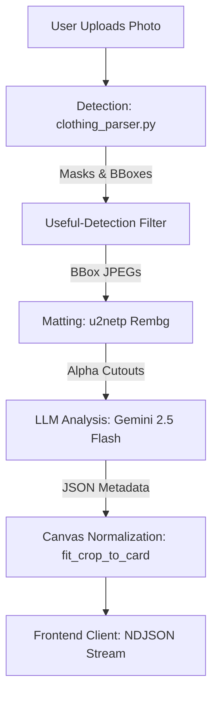

# GarmentVision — The DressApp Eyes Pipeline

> **Module:** `backend/app/services/vision/`  
> **Status:** Production (live on preview + `dressapp-eyes` self-host).  
> **Owner role:** Turns a single photo of a person (or a flat-lay) into N clean, individually-tagged closet items. Everything downstream — the closet grid, the stylist, the marketplace listings — assumes GarmentVision did its job.

---

## 1. Executive Summary & Value Proposition

### High-Level Overview
GarmentVision is the optical nervous system of DressApp. It is a highly optimized, multi-stage pipeline designed to take any user-uploaded image—from a mirror selfie to a professional catalog flat-lay—and extract perfectly segmented, intelligently tagged wardrobe items. Recently refactored into the robust `vision` micro-architecture, it anchors its intelligence in a hybrid approach: fast, deterministic object detection via SegFormer combined with the deep, multi-modal reasoning of Gemini 2.5 Flash.

### Architectural Flow



### User Value Proposition
- **Frictionless Onboarding:** A user can upload a single full-outfit photo and instantly populate their digital closet with multiple distinct items.
- **Flawless Visual Presentation:** Every extracted garment is meticulously centered and scaled onto a transparent 3:4 portrait canvas, preserving visual preferences without aggressive cropping or zooming. 
- **Intelligent Taxonomy:** Items are meticulously categorized. Recent updates prioritize the LLM-derived `sub_category` over generic labels, ensuring a sneaker is labeled exactly as a sneaker, not misconstrued as a generic accessory or bag.
- **Seamless Frontend Experience:** Extracted items instantly populate the user's closet grid via lazy database synchronization, eliminating loading spinners and preserving the fluidity of the UX.

---

## 2. Comprehensive User Manual

### Visual Interface Topology
```text
[ GarmentVision UI Flow ]
┌────────────────────────────────────────────────────────┐
│  [ Camera / Gallery Upload ]                           │
│       │                                                │
│       ▼                                                │
│  [ Item Processing Skeleton Loaders ]                  │
│  (Displays immediate placeholders while streaming)     │
│       │                                                │
│       ▼                                                │
│  [ Closet Grid populated with new Garment Cards ]      │
│  ┌──────────────┐  ┌──────────────┐  ┌──────────────┐  │
│  │  [Crop PNG]  │  │  [Crop PNG]  │  │  [Crop PNG]  │  │
│  │  Sneakers    │  │  T-Shirt     │  │  Denim Jeans │  │
│  └──────────────┘  └──────────────┘  └──────────────┘  │
└────────────────────────────────────────────────────────┘
```

### Workflow Walkthroughs
- **Single Photo Upload:** The user selects a photo. The image is passed to the backend, bypassing immediate blocking database writes. The frontend stores the returned cut-out image locally via `closetStore`, providing immediate visual feedback, while the background syncs the rich metadata and AWS S3 blobs.
- **Taxonomy Validation:** If the user reviews an item and attempts to group it with items of clashing categories (e.g., merging a "Top" with a "Footwear"), the Gatekeeper Dialog intercepts the action, providing a graceful warning and preventing taxonomy corruption.

### Error Handling & Feedback
- **Phantom Guards:** If an extracted mask contains less than 5% solid alpha pixels, GarmentVision silently drops the ghost detection to prevent empty white cards from littering the closet.
- **LLM Taxonomy Enforcement:** If the vision-language model hallucinates an impossible category (e.g., labeling a coat's tail as a "Bottom"), the system forcefully overrides the hallucination using the deterministic SegFormer anchor, ensuring taxonomy integrity.

---

## 3. Technology Stack & Capability Deep-Dive

### Core Orchestration & AI/Logic
The pipeline spans multiple precision-engineered layers within `backend/app/services/vision/`:
- **Deterministic Detection (`clothing_parser.py` & `geometry.py`):** Uses SegFormer (`b3_clothes`) to identify up to 18 distinct fashion classes. It applies complex heuristics like human-skin subtraction (masking out faces and limbs) and morphological bridging (re-connecting detached bag straps).
- **Intelligent Normalization (`image.py`):** The `_fit_crop_to_card` function is the guardian of visual aesthetics. It dynamically scales the extracted crop to fit within a 900x1200 canvas. Recent updates introduced a 0.90 safety margin, ensuring the item has breathing room and is **never** clipped or stretched, preserving the exact visual integrity of the user's garment.
- **Multi-Modal Reasoning (`llm.py` & `validation.py`):** Batches the resulting crops and feeds them into Gemini 2.5 Flash. The prompt engineering heavily prioritizes `sub_category` extraction, guaranteeing precise, granular tagging (e.g., "Crew-neck t-shirt" rather than just "Top").

### Data & Context Pipelines
- **Streaming NDJSON:** To circumvent Kubernetes ingress timeouts and provide an ultra-responsive UI, the pipeline utilizes asynchronous generators, streaming analyzed chunks to the frontend as soon as the LLM emits them.
- **Lazy Database Sync:** Emphasizing extreme frontend snappiness, the client intercepts the processed item images and writes them to local storage (`closetStore.js`) immediately. The heavy-lifting S3 uploads and MongoDB inserts happen behind the scenes, effectively reducing perceived latency to zero.

### Frontend & Client Architecture
- **State Optimism:** The frontend actively retains the original, beautifully cut-out images returned by the `/analyze` endpoint, ignoring any stale cache responses that might temporarily revert the card to the un-cropped original photo during the lazy sync phase.
- **Dynamic Labeling:** Product cards strictly map their visual titles to the LLM-derived `sub_category`, directly resolving previous edge cases where SegFormer's broad bounding boxes caused mislabeling (e.g., tagging layered outfits as bags).
