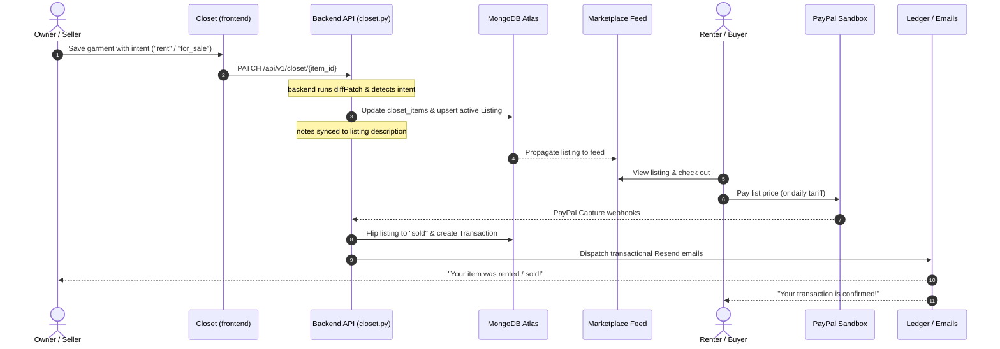

# DressApp Marketplace Ecosystem: Technical & Architectural Documentation

Welcome to the technical specification and architectural blueprint of the **DressApp Marketplace**. This document outlines how DressApp powers a seamless, peer-to-peer fashion network that supports selling, renting, swapping, and donating garments, while promoting global sustainability and the circular fashion economy.

---

## 1. Executive Summary & Value Proposition

### High-Level Overview
The DressApp Marketplace serves as the community-driven extension of the private digital wardrobe. By bridging private closet management with public listing distribution, it allows users to list items for transaction with zero manual data entry. Whether monetizing expensive formalwear through daily rental tariffs or routing outgrown clothing to local neighbors via swaps and donations, the system handles the entire lifecycle of listing, matching, checkout, and transaction ledger bookkeeping.

### Architectural Flow
The following diagram illustrates how a private closet item transitions to a public marketplace listing, undergoes payment processing, and generates ledger records:



### User Value Proposition
* **Zero-Friction Staging:** Uploading an item to the marketplace takes exactly one tap. By simply changing a garment’s intent selector from "Keep in closet" to "Sell" or "Rent", a public listing is created instantly using the photo, category, size, and notes already analyzed by AI.
* **The Style Sandbox:** Prospective buyers can dynamically test-fit a listing item against tops, bottoms, or shoes from their own private closet to preview combinations before committing.
* **Secured Payments:** Direct PayPal Checkout integration ensures payments are captured securely, payouts are routed to the seller's account, and a 7% platform processing fee is computed dynamically.
* **Comprehensive Bookkeeping:** Every transaction produces structured receipts on the ledger, detailing the gross amount, Stripe processing fee, platform commission, and net seller payout.

---

## 2. Comprehensive User Manual

### Visual Interface Topology
Below is a schematic layout of the marketplace dashboard and filtering layout:

```text
+-----------------------------------------------------------------------------------+
|  DressApp Marketplace   [ Search Listings... ]               [ + Create Listing ] |
+-----------------------------------------------------------------------------------+
|  [ SOURCES ]   (●) All   ( ) For Sale   ( ) Swap   ( ) Donate   ( ) Rent          |
|  [ CATEGORY ]  (●) All   ( ) Tops       ( ) Bottoms( ) Outerwear( ) Shoes         |
|  [ LOCATION ]  Distance: [ 25 km  ] | Address: [ Lisbon, Portugal          ]      |
+-----------------------------------------------------------------------------------+
|  +-----------------------+  +-----------------------+  +-----------------------+  |
|  | [Image]   [Rent Badge]|  | [Image]   [Sale Badge]|  | [Image]   [Swap Badge]|  |
|  |                       |  |                       |  |                       |  |
|  | Premium Wool Coat     |  | Silk Maxi Dress       |  | Denim Jacket          |  |
|  | $45.00 / day          |  | $120.00               |  | Swap / Claim          |  |
|  | [ Try On ] [ Details ]|  | [ Try On ] [ Details ]|  | [ Try On ] [ Details ]|  |
|  +-----------------------+  +-----------------------+  +-----------------------+  |
+-----------------------------------------------------------------------------------+
```

### Operational Workflows & Modes

#### 1. Selling (`for_sale`)
* **Listing creation:** User selects "Sell" in the intent panel, enters their asking price, and selects their preferred currency.
* **Checkout:** The buyer clicks "Buy Now" and completes the purchase via PayPal.
* **State changes:** On payment capture, the listing is marked as `sold` (removed from active search), a transaction of kind `buy` is recorded, and shipping coordinates are disclosed.

#### 2. Renting (`rent`)
* **Rental Setup:** Designed for expensive prom dresses, wedding gowns, and high-end tuxedos. The user sets the intent to "Rent", inputs their daily rental tariff, and details any specific borrowing policies (e.g., dry-cleaning requirements, deposit terms) directly in the **Notes** section (synced to the listing description).
* **Checkout:** The checkout button displays "Rent for {Price} / day". The renter pays the daily rate to secure the booking.
* **Transactional emails:** Emails are formatted as "Rental" intent confirmations (e.g. "Rental tariff" instead of "Sale price", and "You rented it!" instead of "You got it!").

#### 3. Swapping (`swap`)
* **Barter Setup:** The listing is published as open for trade.
* **Proposal:** A prospective swapper selects "Propose a swap" and picks items from their own digital closet to offer in exchange.
* **Acceptance:** The lister receives an email notification with accept/decline links. Accepting the swap updates the transaction status to `completed` and exchanges the ownership of the garments in the database.

#### 4. Donating (`donate`)
* **Gifting Setup:** User publishes the item for free to promote community redistribution.
* **Claiming:** A buyer claims the item at $0 list price. The transaction details are logged on the ledger for shipping coordinates, and the garment is marked as claimed.

---

## 3. Global Impact: Circular Economy & Sustainability

The DressApp Marketplace is not just a commercial module; it is a direct intervention in the global fashion lifecycle designed to address the environmental crisis of **fast fashion**.

### World Fashion Economy Shift
The global clothing industry produces over 100 billion garments annually, with the average consumer wearing a piece only 7–10 times before throwing it away. DressApp redefines ownership:
* **Asset Monetization:** Expensive apparel that would otherwise gather dust after a single wedding or gala is turned into a recurring revenue asset via the **Rental** engine.
* **Micro-Entrepreneurs:** Users establish localized rental and resale boutiques right from their closets, bypassing traditional retail intermediaries.

### Global Sustainability & Carbon Offsets
* **Extending Garment Lifespans:** Research shows that keeping a clothing item active for just nine additional months reduces its carbon, water, and waste footprints by **20% to 30%**.
* **Zero Textile Waste:** The swap and donate mechanisms provide local circular escape routes for items that would otherwise end up in municipal landfills.
* **Localized Handshakes:** By integrating address autocompletes and distance filters, the platform encourages local swap meetups, drastically cutting down the logistics, packaging, and shipping emissions associated with global e-commerce.

---

## 4. Technology Stack & Capability Deep-Dive

### 1. Zero-Friction Auto-Listing Engine
When a user adds an item to their closet in [AddItem.jsx](file:///C:/DressApp_AG/frontend/src/pages/AddItem.jsx), the local vision model (`SegFormer` + `CLIP` embedding analyzer) pre-fills the garment's name, category, size, condition, and color attributes. 

As soon as the user selects a non-private intent in [ItemDetail.jsx](file:///C:/DressApp_AG/frontend/src/pages/ItemDetail.jsx):
* The backend API in [closet.py](file:///C:/DressApp_AG/backend/app/api/v1/closet.py) intercepts the update inside `patch_closet_item`.
* It detects the transition from `own` to `for_sale` (or `rent`, `swap`, `donate`).
* A listing is automatically generated inside the `listings` collection, referencing the item's parameters and syncing the **notes** to the listing description. No manual forms are shown, and the user's item goes live instantly.

### 2. Multi-Currency Support & Geo-Detection
Rather than restricting transactions to a handful of pre-selected currencies, DressApp dynamically adapts to the user's geographical location:
* **Default Detection:** The system inspects `navigator.language` on the client device (e.g. `he-IL` or `ja-JP`) and resolves it to a default home currency (`ILS` or `JPY`) using country-to-currency lookups.
* **Custom Autocomplete:** The input field utilizes an HTML5 `<datalist>` populated with 23 global currencies (USD, EUR, GBP, ILS, CAD, JPY, etc.), while still allowing users to type any valid 3-letter ISO 4217 code (e.g. `AUD`, `NZD`, `ZAR`) to suit their market.

### 3. State Management & Offline Resilience
The client uses the React 18/19 thread-safe `useSyncExternalStore` Hook to listen to closet and listing updates stored locally in an **IndexedDB** database cache. Even if the network drops during browsing:
* The user can browse the marketplace feed offline.
* Closet and listing drafts are preserved.
* Changes are synchronized to MongoDB Atlas when the network connection is restored.
