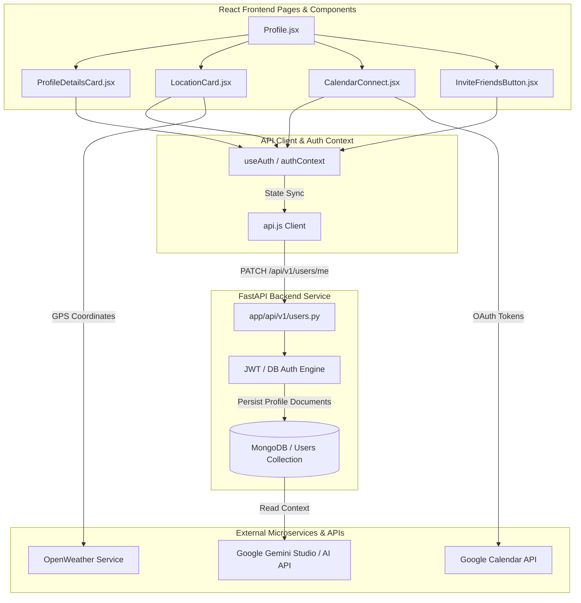

# DressApp Profile & System Preferences Ecosystem

## 1. Executive Summary & Value Proposition

### High-Level Overview
The DressApp Profile page serves as the control tower for a user's digital wardrobe experience. It connects raw personal identity metrics (such as body dimensions, occupations, styles, and age context) with critical system configurations (including active AI LLM models, location coordinates, scheduled notification queues, Google Calendar access tokens, and localization preferences). 

Rather than presenting configurations as disjointed options, the Profile utilizes a nested, card-based accordion topology. Every card is designed to serve a dual purpose: gathering user context for downstream styling engines, and managing active integrations safely.

### Architectural Flow
The following diagram illustrates how state, inputs, and credentials flow from the Profile client components down to the backend API layer and out to external services (such as OpenWeather, Google Calendar, and LLM Providers):



### User Value Proposition
- **Weather- & Context-Aware Styling**: Syncs GPS coordinates to obtain local weather details, translating them directly to temperature-appropriate outfit shuffler results.
- **Auto-Export Calendar Events**: Connects to Google Calendar to automatically inject scheduled outfits into the user's personal agenda.
- **Democratic AI Model Preference**: Supports multiple SaaS API keys (Gemini, Claude, OpenAI, DeepSeek, Qwen) or local edge deployment (Gemma) directly within the UI, preventing vendor lock-in.
- **Privacy-Preserving Downscaling**: Compresses avatar and body-shape images locally in-browser before uploading to the server, protecting device bandwidth and memory.

---

## 2. Comprehensive User Manual

### Visual Interface Topology
The Profile page is structured into three primary layout blocks, styled using modern editorial shadows and HSL-tinted aesthetic indicators:

```text
+-----------------------------------------------------------+
| PROFILE & PREFERENCES                                     |
+-----------------------------------------------------------+
|                                                           |
|  [Explore DressApp Grid]                                  |
|  (Trend Scout) (Outfits) (Experts) (Unpacked Stats)       |
|                                                           |
+-----------------------------------------------------------+
|  [Language Quick Selector]                                |
|  Language: [ English | Hebrew | French ... ]              |
|                                                           |
+-----------------------------------------------------------+
|  [IDENTITY & PHYSICAL PROFILE CARD]                       |
|  v Photos & Avatar                                        |
|  v Style Profile (Modest rules, Dress code)               |
|  v Details (Name, Phone, Occupation)                      |
|  v Body & Measurements (Height, Weight, Shapes)           |
|  v Lifestyle (Status, Sex)                                |
|                                                           |
+-----------------------------------------------------------+
|  [SETTINGS & INTEGRATIONS CARD]                           |
|  v AI Configuration (SaaS keys, edge mode, credits)       |
|  v Scheduler & Push (Frequency, daily alarm, style focus) |
|  v Google Calendar (OAuth sync, export rules)            |
|  v Location Services (GPS tracking, weather accuracy)     |
|  v Invite Friends (Share payload API)                    |
|  v Voice & Language (Virtual stylist voice selection)     |
|                                                           |
|  [Sign Out Button]                                        |
|                                                           |
+-----------------------------------------------------------+
|  [Developer Administration Panel] (Admin-only)           |
+-----------------------------------------------------------+
```

### Mode & Workflow Walkthroughs

#### 1. Identity & Physical Profile Settings
Located in `ProfileDetailsCard.jsx`, this accordion aggregates the user's biological and style defaults.
- **Photos & Avatar**: Users can upload up to 3 context photos (avatar, full-body shape, current outfit reference). Mobile users can directly click "Take Photo" to trigger native device camera capture.
- **Style Profile**: Houses style constraints. This includes **Dress Conservativeness (Modesty Gating)**, which restricts outfit recommendations to high-conservativeness clothes, and preferred base dress codes.
- **Body & Measurements**: Stores metrics (height, weight, body shape) which are fed to down-stream generative image modules.

#### 2. AI Configuration
Located in `Profile.jsx`, this handles LLM settings.
- **Standard Plan**: Uses DressApp's credit quota ($0.005 per run with a 7% platform processing fee).
- **Custom Keys**: Allows users to paste their own developer API keys. Includes instructions and deep-links to developer consoles for Google Studio, OpenAI, Anthropic, DeepSeek, and Aliyun DashScope.
- **Edge Local AI**: Executes Gemma model pipelines offline on-device.

#### 3. Scheduler & Push
Manages how and when outfit reminders are received.
- Users toggle daily scheduling, choose a notification frequency (every day, twice a week, specific weekdays), select a preferred notification time, and set a custom theme for their daily recommendations (e.g., "Gym", "Church", "Hiking").

#### 4. Google Calendar Integration
- Prompts the user to authenticate through Google OAuth. Once linked, it shows the active email account (`signedInAs`) and adds a checkbox option to push shuffler events automatically.

#### 5. Location Services
- Triggers browser `navigator.geolocation` permissions on request. Coordinates are mapped to reverse-geocoded cities, showing coordinates accuracy in meters (e.g., `±5m accuracy`).

#### 6. Voice & Language
- Allows changing the virtual stylist's voice model (e.g., `en_US-ryan-medium`, `en_US-amy-low`) and changes the interface localization dictionary.

---

## 3. Technology Stack & Capability Deep-Dive

### In-Browser Image Optimization
To keep database storage light and prevent MongoDB payload failures (where documents must fit under a 16MB boundary), `ProfileDetailsCard.jsx` utilizes an asynchronous canvas compression pipeline before transmission:

```javascript
async function fileToDataUrl(file, maxEdge = 1280) {
  return new Promise((resolve, reject) => {
    const reader = new FileReader();
    reader.onload = () => {
      const img = new Image();
      img.onload = () => {
        const scale = Math.min(1, maxEdge / Math.max(img.width, img.height));
        const w = Math.round(img.width * scale);
        const h = Math.round(img.height * scale);
        const canvas = document.createElement('canvas');
        canvas.width = w;
        canvas.height = h;
        const ctx = canvas.getContext('2d');
        ctx.drawImage(img, 0, 0, w, h);
        resolve(canvas.toDataURL('image/jpeg', 0.82)); // Compress at 82% quality
      };
      img.onerror = reject;
      img.src = reader.result;
    };
    reader.onerror = reject;
    reader.readAsDataURL(file);
  });
}
```

### State Synced Forms & Saving
In `Profile.jsx`, the standard input fields utilize a clean `useMemo` dirtiness gate. A circular floating button is rendered at `fixed bottom-20 end-6` only when the local form fields differ from the authenticated user model:

```javascript
const isDirty = useMemo(() => {
  if (!user) return false;
  const initial = {
    preferred_language: (user.preferred_language || i18n.language || 'en').toLowerCase(),
    preferred_voice_id: user.preferred_voice_id || 'en_US-ryan-medium',
  };
  return Object.keys(initial).some(
    (key) => String(form[key]) !== String(initial[key])
  );
}, [user, form, i18n.language]);
```

### Target Hash Scrolling & Auto-Expansion
The profile uses a synchronized `expandedItems` state list paired with routing lifecycle hooks to handle external URL deep-linking (e.g. `/profile?open=scheduler` or redirecting directly to `#ai-configuration-section`):

```javascript
useEffect(() => {
  const items = [];
  if (searchParams.get('open') === 'scheduler' || location.hash === '#scheduler-settings-section' || location.state?.scrollTo === 'scheduler-settings-section') {
    items.push('scheduler');
    setTimeout(() => {
      document.getElementById('scheduler-settings-section')?.scrollIntoView({ behavior: 'smooth' });
    }, 150);
  }
  if (location.hash === '#ai-configuration-section' || location.state?.scrollTo === 'ai-configuration-section') {
    items.push('ai-config');
    setTimeout(() => {
      document.getElementById('ai-configuration-section')?.scrollIntoView({ behavior: 'smooth' });
    }, 150);
  }
  if (items.length > 0) {
    setExpandedItems(items);
  }
}, [searchParams, location]);
```
