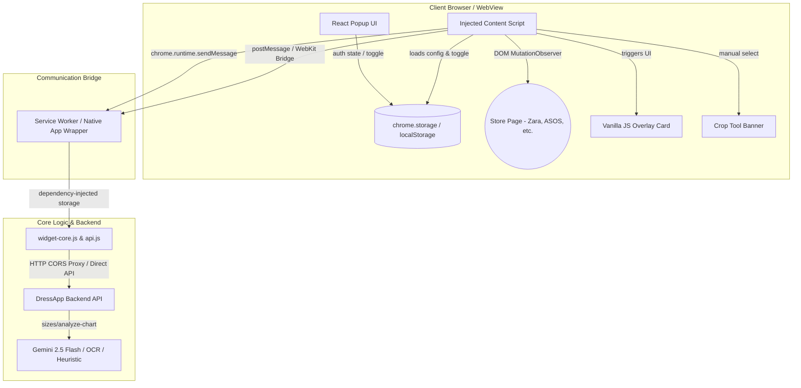

# DressApp Shopping Assistant — Technical Architecture & Integration Guide

## 1. Executive Summary & Value Proposition

### High-Level Overview
The **DressApp Shopping Assistant** is a cross-platform client ecosystem that embeds size recommendations directly into e-commerce web applications. Originally built as a Chrome Extension, the codebase has been re-architected into a hybrid, multi-target framework. It can run as:
1. A standard **Chrome/Chromium Extension** (Popup UI + injected content scripts).
2. A standalone **Mobile WebView Floater** injected programmatically into in-app browsers for iOS and Android.

By decoupled orchestration, the widget automatically detects garment listings and matches them against user measurements fetched from the DressApp backend, displaying a glanceable size recommendation without breaking the host page's visual flow.

### Architectural Flow



### User Value Proposition
* **Frictionless Shopping**: Displays personalized size recommendations (e.g., "DressApp Recommends Size M") directly on product pages.
* **Auto-Discovery & Fallback Capture**: Instantly detects HTML tables or size guide images. If automatic parser heuristics fail, it switches to a manual crop mode, allowing the user to select the chart bounds.
* **Dual-Mode Control**: Users can toggle the assistant on/off globally from the popup, immediately unmounting the DOM injections from all active tabs.
* **RTL & Localization-Ready**: Built-in support for 12 languages (including layout auto-mirroring/flipping for Hebrew and Arabic).

---

## 2. Comprehensive User Manual

### Visual Interface Topology

#### A. React Popup Layout (LTR Mode)
```
+------------------------------------------------------+
|  [Sparkles] DressApp           dressapp.co [Arrow]   |
|  SHOPPING ASSISTANT                                  |
+------------------------------------------------------+
|  Shopping Assistant              [o=======] (Toggle) |
+------------------------------------------------------+
|  +------------------------------------------------+  |
|  | [UserAvatar] Connected UserName                |  |
|  | UserEmail@domain.com                           |  |
|  | via api-host.com               [ Logged In ]   |  |
|  +------------------------------------------------+  |
|                                                      |
|  +------------------------------------------------+  |
|  | [Ruler] Measurements (3)                       |  |
|  | Chest: 98cm       Waist: 82cm                  |  |
|  | Hips: 101cm                                    |  |
|  +------------------------------------------------+  |
|                                                      |
|  [ Switch Account ]              [ Sign Out ]        |
+------------------------------------------------------+
| Recommendations are estimates. Check store's chart. |
+------------------------------------------------------+
```

#### B. Recommendation Overlay Card (LTR Mode)
```
+--------------------------------------------------+
| DressApp recommends size L                 [X]   |
| [92% Confidence]                                 |
| ------------------------------------------------ |
| Loose fit on bust, matched on chest and waist.   |
|                                                  |
| Matched on: chest · waist · via AI · 120 ms      |
| Alternatives: XL (loose), M (tight)              |
+--------------------------------------------------+
```

### Mode & Workflow Walkthroughs

#### 1. Automatic Parser Flow
* The injected script mounts a small inline **DressApp size** pill next to the store's size guide element.
* When clicked, it queries the backend API.
* The backend searches for structured tabular size parameters. If found, it computes the recommended size and outputs it to the overlay card.

#### 2. Manual Crop Flow
* If no chart table or image is auto-detected, the script dims the screen and slides in the Crop Banner.
* The user drags a dashed bounding box around the e-commerce store's size chart.
* The script screenshots the viewport, crops the selected coordinates using HTML Canvas, and sends the base64 crop to the backend for Gemini OCR processing.

#### 3. Toggle Control Action
* When the user clicks the toggle switch:
  * **On**: Triggers real-time injection. The MutationObserver starts watching the DOM, mounting pills and the FAB.
  * **Off**: The MutationObserver disconnects, and any injected DOM elements (`#dressapp-fab`, `.dressapp-anchor-btn`, overlays) are unmounted.

### Error Handling & Feedback
* **Missing Measurements**: Directs the user to open their profile settings on the web-app to populate chest/waist/hip parameters.
* **Authentication Expiry**: Shows a clear warning card and provides a "Connect" CTA.
* **CORS Blockers / Stale Extensions**: Tailors feedback for orphaned scripts (e.g., following an extension update) requesting a page refresh.

---

## 3. Installation & Getting Started

### Chrome Extension Installation (Desktop)
Follow these steps to build and run the unpacked extension in developer mode:

1. **Install Dependencies**: Open your terminal, navigate to the extension directory, and install packages:
   ```bash
   cd chrome-extension
   yarn install
   ```
2. **Build the Extension**: Run the compilation script to generate browser-compliant assets inside `/dist`:
   ```bash
   yarn build
   ```
3. **Load Unpacked in Chrome**:
   * Open Google Chrome and navigate to `chrome://extensions/`.
   * Enable **Developer mode** in the top-right corner.
   * Click the **Load unpacked** button in the top-left.
   * Select the compiled [chrome-extension/dist](file:///c:/DressApp_AG/chrome-extension/dist) folder.
4. **Authenticate**: Click the puzzle icon in your browser toolbar, pin the **DressApp Shopping Assistant**, click the icon, and select **Connect to DressApp** to sign in.

### Mobile WebView Floater Integration (Mobile)
To use the widget as a floating assistant on in-app shopping screens:

1. **Build the Mobile Bundle**: Run the dedicated single-file build script:
   ```bash
   yarn build:mobile
   ```
2. **Retrieve the Script**: Locate the self-contained JS bundle:
   * [dressapp-mobile-floater.js](file:///c:/DressApp_AG/chrome-extension/dist-mobile/dressapp-mobile-floater.js)
3. **Programmatic Injection**: Inject the script contents directly into your mobile app’s WebView (e.g., passing it to the `injectedJavaScript` property of React Native WebView).
4. **Implement Native Message Handler**: Hook up the native handlers to answer outgoing message queries (`AUTH_STATUS`, `CAPTURE_VISIBLE_TAB`, and `ANALYZE_CHART`) from the WebView.

---

## 4. Technology Stack & Capability Deep-Dive

### Decoupled Core Logic (`widget-core.js`)
To allow the script to execute inside constrained mobile widgets, the background workers are fully decoupled from extension runtime properties. Storage queries rely on dependency-injected storage providers:

```javascript
// Decoupled handler interface
export async function handleFetchMe(storage) {
  try {
    const user = await fetchMe(storage); // storage provides get/set
    await storage.set({ user });
    return { ok: true, user };
  } catch (e) {
    return { ok: false, error: e.message };
  }
}
```

### Multi-Target Build Bundling
The build pipeline compiles separate outputs configured in Vite:
1. **Desktop Extension Bundle**: Compiles ES module chunks to `/dist` and rewrites the Web-Store compliant `manifest.json`.
2. **Mobile Floater Bundle**: Bundles all files, inlines PostCSS styles as strings, and writes a self-executing immediately invoked function expression (IIFE) to `/dist-mobile/dressapp-mobile-floater.js`.

### Localization & RTL Support
Locales are configured using `i18next`. For Right-to-Left (RTL) languages like Hebrew (`he`):
* The HTML document direction `dir="rtl"` is dynamically set.
* CSS rules automatically mirror position configurations (e.g., floaters slide from bottom-right, text aligns right-to-left, and close icons flip).
