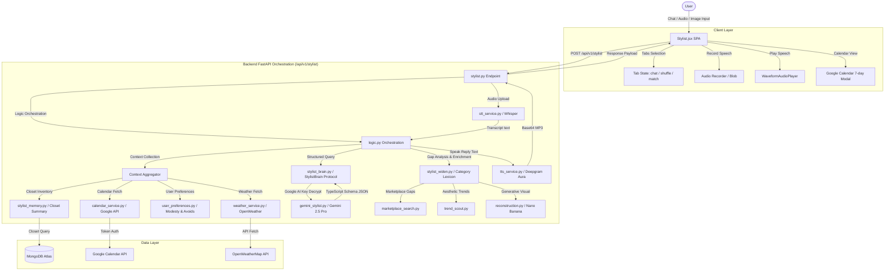

# DressApp AI Stylist: Architecture, User Manual & Technology Guide

This document provides a comprehensive, production-grade architectural analysis, operational user manual, and technology guide for the **DressApp AI Stylist** ecosystem, anchored by `frontend/src/pages/Stylist.jsx` and its supporting frontend/backend services.

---

## 1. Executive Summary & Value Proposition

### High-Level Overview

The **DressApp AI Stylist** is an advanced, multimodal artificial intelligence styling consultant and automated wardrobe scheduler. Designed to function as both a highly personalized style advisor and a wardrobe optimizer, it operates seamlessly across text, voice, images, and environmental context. It coordinates speech-to-text transcription, text-to-speech audio rendering, real-time external data integration (weather and Google Calendar events), and wardrobe rotation algorithms to maximize the utility and wearability of a user's closet.

### Architectural Flow



### User Value Proposition

- **Maximum Closet ROI (Zero Dead-Stock)**: Through specialized sorting algorithms (`get_rotation_prioritized_closet`), the AI prioritizes surfacing rarely-worn or forgotten items, making sure users maximize the utility of their physical garments.
- **Repeat-Wear & Social Protection**: Proactively scans historical outfit logs. If a proposed outfit has a $\ge 80\%$ visual similarity (garment overlap) with an outfit previously worn to a matching location or event title, a prominent warning alert is displayed to avoid social duplication.
- **Hands-Free Interactive Styling**: Integrated Whisper Speech-to-Text (STT) and high-fidelity Text-to-Speech (TTS) allow users to converse naturally with their stylist while dressing or getting ready.
- **Smart Gap-Filling**: Identifies styling recommendations that require garments the user does not own, matching the missing categories to live secondhand marketplace listings or trend suggestion cards.
- **Encrypted Key Portability**: Users can use their personal standard Google AI API keys, decrypted on-the-fly (`decrypt_api_key`) and stored securely in MongoDB, preventing vendor lock-in.

---

## 2. Comprehensive User Manual

### 2.1 Visual Interface Topology

The Stylist module organizes its workspace into three distinct tabs, flanked by a collapsible history sidebar and a persistent, flex-wrapping action footer.

```text
+------------------------------------------------------------------------------------+
|  [Menu]                  [ Chat ]  [ Outfit Planner ]  [ Daily Suggestion ]        |
+------------------------------------------------------------------------------------+
|  | * Active Session      |                                                         |
|  |   Work Day Casual     |  Active Tab Workspace:                                  |
|  |   Weekend Brunch      |                                                         |
|  |                       |  [Chat Message Thread / Scrolling Feed]                 |
|  |   [New Chat]          |  - Assistant: "Here's a smart casual layout..."         |
|  |                       |  - Outfit Cards (Visual Carousel / Grid)                |
|  |                       |  - TTS Player Waveform Controls                         |
|  +-----------------------+                                                         |
|                                                                                    |
|  Action & Control Footer:                                                          |
|  +-------------------------------------------------------------------------------+ |
|  | [Daily Suggestion] [Plan Event Outfit] [Trends] [Ask Professional]            | |
|  +-------------------------------------------------------------------------------+ |
|  | [Img] [Mic] Ask your stylist anything...                              [Send]  | |
|  +-------------------------------------------------------------------------------+ |
+------------------------------------------------------------------------------------+
```

---

### 2.2 Operational Tab Workflows

#### Mode 1: Conversational Chat (`chat`)
The Chat tab handles natural-language interactions across text, audio, and visual inputs.

- **Speech-to-Text (STT)**: Clicking the `Mic` icon triggers active audio recording. Tap again to finalize and send. The backend processes the audio blob using Whisper to derive the user prompt transcript.
- **Text-to-Speech (TTS)**: When an assistant message returns with `tts_audio_base64`, a floating waveform player mounts. The user can play, pause, or mute the spoken response. If the browser lacks native codec support, it falls back to the Web Speech API.
- **Multimodal Image Context**: Clicking the `Image` button allows users to attach photos of clothes they are considering buying. The AI processes the image metadata, tags it, and evaluates how it pairs with the user's current wardrobe.
- **Sidebar Session CRUD**: Tapping the left panel button opens the history list. Selecting a past session restores its thread. Clicking "New Chat" clears the session ID, triggering a fresh title generation on the first user message.

#### Mode 2: Outfit Planner & Composer (`shuffle`)
The Outfit Planner tab provides a visual slot-machine interface for manual or automated outfit creation.

- **Tag & Style Filters**: Users filter the garment carousels by text tags (e.g., `"Casual"`, `"Sporty"`) or standard dress codes (e.g., `"Formal"`, `"Business"`). Focus and scroll positions are automatically adjusted.
- **Unified Spin (Refresh)**: Clicking the **Refresh** (`Sparkles`) button triggers a coordinated spin across the Tops, Bottoms, and Footwear carousels, landing on a coordinated outfit sourced strictly from the filtered sub-pool.
- **Diary Integration**: Clicking **Save** registers the compiled layout as a scheduled diary entry. The system auto-generates descriptive titles and logs the items to the user's outfit history.

#### Mode 3: Daily Suggestion & Scheduler (`match`)
The Daily Suggestion tab serves as the automated routing center, scheduling panel, and notification landing workspace.

- **Monthly Calendar Grid**: Renders a comprehensive, interactive monthly layout. Days with scheduled outfits show active garment thumbnails rendered on the user's personal avatar shape.
- **Google Calendar 7-Day Modal**: Click "Open Calendar" to trigger a sliding 7-day row modal:
  - Displays the active outfit scheduled for each day.
  - Hovering/clicking allows scheduling a saved outfit or removing/unscheduling.
  - Clicking the **Today** button instantly updates the view and triggers `scrollIntoView` on the `todayRef` to center today's date chip in the viewport.
- **Repeat-Wear Warnings**: Displays a caution flag if the user schedules an outfit that overlaps $\ge 80\%$ with one worn previously to a similar event or location.

---

### 2.3 Error Handling & Feedback Mechanisms

- **Quota Fallbacks**: If the primary Gemini model encounters API limits, the system triggers a fallback flow. A banner surfaces at the top of the tab: `t('stylist.fallbackQuota', { defaultValue: 'Fallback. Quota exhausted.' })` and shows cached recommendations.
- **Weather & Location Flags**: If lat/lng values fail to resolve, weather defaults to the user's home location. If home coordinates are missing, the weather box hides gracefully without breaking the layout.
- **STT/TTS Failure**: If Whisper transcription fails, the UI falls back to the raw text input box and informs the user. If the Deepgram TTS endpoint times out, the text response is displayed silently, and the audio waveform player is disabled.

---

## 3. Technology Stack & Capability Deep-Dive

### 3.1 Backend Orchestration & AI Logic

#### API Endpoint: `POST /api/v1/stylist`
Handles form inputs representing text, files (image, voice), coordinates, language preferences, and session indicators. It decrypts standard API keys on-the-fly:

```python
encrypted_key = (ai_config.get("custom_keys") or {}).get("google_ai")
if encrypted_key:
    from app.services.auth import decrypt_api_key
    api_key_resolved = decrypt_api_key(encrypted_key)
```

#### Pipeline Flow: `get_styling_advice` (`app/services/logic.py`)
1. **Transcribe**: Converts compressed WebM audio (`audio/webm`) to text using `stt_service.py` (Whisper).
2. **Weather context**: Queries OpenWeather using coordinates. Descriptions are formatted with `·` as a language-neutral separator (e.g., `22°C · Clear Sky · Paris`) to avoid mixing languages in translation files.
3. **Calendar context**: Synchronizes active Google Calendar events, appending event formality hints (e.g., `[formal]`, `[casual]`).
4. **Gemini Pro Turn**: Hands the prompt, image context, weather, calendar, style profile, and wardrobe inventory to the `StylistBrain` service, returning a structured JSON document conforming to a strict schema.
5. **Speech Synthesis**: Converts the concise `spoken_reply` into an MP3 byte stream using Deepgram's Aura voice model, returning a Base64 string to the client.

---

### 3.2 Context & Wardrobe Rotation Engines

#### Prioritized Rotation: `get_rotation_prioritized_closet`
To prevent the same clothes from appearing repeatedly, the wardrobe rotation engine (`stylist_scheduler_brain.py`) uses a specialized MongoDB aggregation pipeline. It filters out duplicate items (`is_duplicate: False`) and sorts closet inventory:

$$\text{Sort Order} = \text{last\_suggested\_at (Asc)} \to \text{last\_worn\_at (Asc)} \to \text{wear\_count (Asc)}$$

#### Event Overlap Check: `check_event_similarities`
Checks proposed outfits against the user's historical diary records:

$$\text{Intersection Ratio} = \frac{|G_{\text{proposed}} \cap G_{\text{historical}}|}{|G_{\text{proposed}}|}$$

If $\text{Intersection Ratio} \ge 0.8$, the algorithm appends a history flag warning to the styling advice payload.

---

### 3.3 Client-Side Architecture

#### RTL Mirroring & Tab Layout
- **RTL Directionality**: The Radix UI `<Tabs>` component dynamically handles writing directions:
  ```jsx
  <Tabs value={activeTab} onValueChange={setActiveTab} dir={i18n.dir()}>
  ```
  This ensures nested flex columns and slot carousels mirror correctly in RTL languages (Hebrew, Arabic).
- **Flexible Layout Wrapping**: Containers utilize non-shrinking flex properties (`shrink-0`) and explicit wrapping points (tab headers set to `max-w-md` or `448px`) to ensure verbose localized labels (e.g., German `"Tägliche Empfehlung"`) do not break layout structures.
- **Dynamic Scroll Real Estate**: The action panel footer organizes buttons on a wrapping flex row to maximize scroll real estate, and the `TRENDS` carousel is stripped from message responses to avoid redundant visual nesting.

#### Google Calendar Today Ref Autoscroll
When a user opens the Google Calendar modal and presses "Today", the calendar state updates, and a ref hook centers the today cell in the scroll container:

```javascript
const handleJumpToToday = () => {
  const today = new Date();
  setCalendarStartDate(today);
  setTimeout(() => {
    todayRef.current?.scrollIntoView({
      behavior: 'smooth',
      block: 'nearest',
      inline: 'center'
    });
  }, 100);
};
```

---

## 4. Localisation & i18n Reference

Every string in the Stylist interface conforms to the options-based syntax with explicit fallback values to guarantee parser stability:

```javascript
t('calendar.todayBtn', { defaultValue: 'Today' })
```

### Critical Keys Map

| Key | Default (en) | Description |
|---|---|---|
| `stylist.title` | AI Stylist | Top page title |
| `stylist.tab.chat` | Chat | Conversational workspace tab |
| `stylist.tab.shuffle` | Outfit Planner | Shuffle carousel workspace tab |
| `stylist.tab.match` | Daily Suggestion | Match recommendation tab |
| `stylist.fallbackQuota` | Fallback. Quota exhausted. | Limit warning banner |
| `calendar.title` | Google Calendar | Modal Dialog header |
| `calendar.todayBtn` | Today | Jump to today button |
| `calendar.todayLabel` | TODAY | Chip weekday indicator |
| `calendar.scheduled` | Scheduled | Indicator badge |
| `calendar.unschedule` | Remove | Action button |
| `calendar.unscheduled` | Not scheduled | Detail fallback string |

---

## 5. Feature Capability Matrix

| Feature | Conversational Chat | Outfit Planner | Daily Suggestion |
|---|---|---|---|
| **Input Modality** | Text, Voice, Image uploads | Autocomplete Tags, Styles | Scheduled Notifications |
| **Logic Processing** | Gemini 2.5 Pro | Local Carousel Filter | Rotational Priority DB Query |
| **Context Integration** | Weather, Calendar, Profile | Style constraints | Location-based repeat warnings |
| **Client UI Controls** | TTS Waveform Player, Mic | Carousel Spin / Refresh | Monthly Grid, 7-Day Dialog |
| **RTL Mirroring** | Right-to-left layout direction | Carousel scroll direction | Grid numbering layout |
| **Speech Support** | Whisper STT, Deepgram TTS | None | None |
