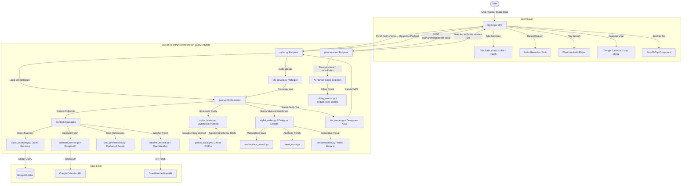

# DressApp AI Stylist: Architecture, User Manual & Technology Guide

This document provides a comprehensive, production-grade architectural analysis, operational user manual, and technology guide for the **DressApp AI Stylist** ecosystem, anchored by `frontend/src/pages/Stylist.jsx` and its supporting frontend/backend services.

---

## 1. Executive Summary & Value Proposition

### High-Level Overview

The **DressApp AI Stylist** is an advanced, multimodal artificial intelligence styling consultant and automated wardrobe scheduler. Operating seamlessly across text, voice, images, and environmental context, it coordinates speech-to-text transcription, text-to-speech audio rendering, real-time external data integration (weather and Google Calendar events), and wardrobe rotation algorithms to maximize the utility and wearability of a user's closet.

### Architectural Flow



### User Value Proposition

- **Maximum Closet ROI (Zero Dead-Stock)**: Surfacing rarely-worn items prioritized by wardrobe rotation algorithms (`get_rotation_prioritized_closet`) to maximize garment utility.
- **Repeat-Wear & Social Protection**: Proactively warns users with an alert when a proposed outfit has a $\ge 80\%$ visual overlap with historical outfits worn to the same location or event.
- **Interactive AI Shuffler Scout**: Leverages real-time geolocation coordinates and calendar logs to auto-assemble balanced looks, accompanied by styling rationales.
- **Hands-Free Engagement**: Real-time Whisper Speech-to-Text (STT) transcription and high-fidelity Text-to-Speech (TTS) audio playback.
- **API Key Portability & Transparent Billing**: Decrypts user-provided custom API keys (`decrypt_api_key`) across both Standard and Custom provider plans, allowing users to bypass system limits using their own keys while maintaining accurate credit deduction logs.

---

## 2. Comprehensive User Manual

### 2.1 Visual Interface Topology

The Stylist module organizes its workspace into three distinct tabs, flanked by a collapsible history sidebar and a persistent, flex-wrapping action footer.

```text
+------------------------------------------------------------------------------------+
|  [Menu]                  [ Chat ]  [ Outfit Planner ]  [ Daily Suggestion ]        |
+------------------------------------------------------------------------------------+
|  | * Active Session      |                                                         |
|  |   Work Day Casual     |  Active Tab Workspace:                                  |
|  |   Weekend Brunch      |                                                         |
|  |                       |  [Chat Message Thread / Scrolling Feed]                 |
|  |   [New Chat]          |  - Assistant: "Here's a smart casual layout..."         |
|  |                       |  - Outfit Cards (Visual Carousel / Grid)                |
|  |                       |  - TTS Player Waveform Controls                         |
|  +-----------------------+                                                         |
|                                                                                    |
|  Action & Control Footer:                                                          |
|  +-------------------------------------------------------------------------------+ |
|  | [Daily Suggestion] [Plan Event Outfit] [Trends] [Ask Professional]            | |
|  +-------------------------------------------------------------------------------+ |
|  | [Img] [Mic] Ask your stylist anything...                              [Send]  | |
|  +-------------------------------------------------------------------------------+ |
+------------------------------------------------------------------------------------+
```

---

### 2.2 Operational Tab Workflows

#### Mode 1: Conversational Chat (`chat`)
The Chat tab handles natural-language interactions across text, audio, and visual inputs.

- **Speech-to-Text (STT)**: Clicking the `Mic` icon triggers active audio recording. Tap again to finalize and send. The backend processes the audio blob using Whisper to derive the user prompt transcript.
- **Text-to-Speech (TTS)**: When an assistant message returns with `tts_audio_base64`, a floating waveform player mounts. The user can play, pause, or mute the spoken response. If the browser lacks native codec support, it falls back to the Web Speech API.
- **Multimodal Image Context**: Clicking the `Image` button allows users to attach photos of clothes they are considering buying. The AI processes the image metadata, tags it, and evaluates how it pairs with the user's current wardrobe.
- **Sidebar Session CRUD**: Tapping the left panel button opens the history list. Selecting a past session restores its thread. Clicking "New Chat" clears the session ID, triggering a fresh title generation on the first user message.

#### Mode 2: Outfit Planner & Composer (`shuffle` / AI Planner Scout)
The Outfit Planner tab provides a visual slot-machine interface for manual or automated outfit creation, integrated with **AI Planner Scout**.

- **Tag & Style Filters**: Users filter the garment carousels by text tags (e.g., `"Casual"`, `"Sporty"`) or standard dress codes (e.g., `"Formal"`, `"Business"`). Focus and scroll positions are automatically adjusted.
- **Dynamic AI Shuffler Scout**:
  - Clicking the **Refresh** (`Sparkles`) button triggers a coordinated slot-machine style spin across the Tops, Bottoms, and Footwear carousels.
  - In the background, `api.plannerScout` is dispatched with location coordinates (`lat`, `lng`), target style/dress code, selected tag, and `include_calendar` indicators.
  - The backend calls Gemini 2.5 Pro to coordinates a perfectly matched outfit and returns selected top, bottom, and shoes IDs along with a styling rationale.
  - The carousel dynamically scrolls to focus on the selected items and renders the stylist's advice (`why`) in the rationale panel.
  - **Filter Auto-Reset**: If the recommended items are outside active user filters, filters are automatically reset to `"all"` and empty inputs to ensure the chosen look is visible.
- **Diary Integration**: Clicking **Save** registers the compiled layout as a scheduled diary entry. The system auto-generates descriptive titles and logs the items to the user's outfit history.

#### Mode 3: Daily Suggestion & Scheduler (`match`)
The Daily Suggestion tab serves as the automated routing center, scheduling panel, and notification landing workspace.

- **Monthly Calendar Grid**: Renders a comprehensive, interactive monthly layout. Days with scheduled outfits show active garment thumbnails rendered on the user's personal avatar shape.
- **Google Calendar 7-Day Modal**: Click "Open Calendar" to trigger a sliding 7-day row modal:
  - Displays the active outfit scheduled for each day.
  - Hovering/clicking allows scheduling a saved outfit or removing/unscheduling.
  - Clicking the **Today** button instantly updates the view and triggers `scrollIntoView` on the `todayRef` to center today's date chip in the viewport.
- **Repeat-Wear Warnings**: Displays a caution flag if the user schedules an outfit that overlaps $\ge 80\%$ with one worn previously to a similar event or location.

#### Global UX: Scroll-To-Top component
A floating action button is integrated into long scrollable panes (such as the Stylist `shuffle` tab outfits gallery, Closet, and Item Detail pages). 
- Instantiated via `<ScrollToTop scrollContainerRef={shuffleScrollRef} />`.
- Monitors container scroll positions; when scrolled past `300px` vertically, it animates in at `fixed bottom-20 end-6` (or `md:bottom-8 md:end-8` above nav floaters).
- Clicking triggers a smooth-scrolling animation back to `top: 0`.

---

### 2.3 Error Handling & Feedback Mechanisms

- **Quota Fallbacks**: If the primary Gemini model encounters API limits, the system triggers a fallback flow. A banner surfaces at the top of the tab: `t('stylist.fallbackQuota', { defaultValue: 'Fallback. Quota exhausted.' })` and shows cached recommendations.
- **Billing Exhaustion**: If user credits are exhausted (returning HTTP 402), a toast notifies the user: `t('stylist.quotaExhausted', { defaultValue: 'Quota Exhausted. Please check your credit balance or input your own API Key.' })`.
- **Weather & Location Flags**: If lat/lng values fail to resolve, weather defaults to the user's home location. If home coordinates are missing, the weather box hides gracefully without breaking the layout.

---

## 3. Technology Stack & Capability Deep-Dive

### 3.1 Backend Orchestration & AI Logic

#### API Endpoint: `POST /api/v1/stylist`
Handles form inputs representing text, files (image, voice), coordinates, language preferences, and session indicators. It decrypts standard API keys on-the-fly:

```python
encrypted_key = (ai_config.get("custom_keys") or {}).get("google_ai")
if encrypted_key:
    from app.services.auth import decrypt_api_key
    api_key_resolved = decrypt_api_key(encrypted_key)
```

#### Pipeline Flow: `get_styling_advice` (`app/services/logic.py`)
1. **Transcribe**: Converts compressed WebM audio (`audio/webm`) to text using `stt_service.py` (Whisper).
2. **Weather context**: Queries OpenWeather using coordinates. Descriptions are formatted with `·` as a language-neutral separator (e.g., `22°C · Clear Sky · Paris`) to avoid mixing languages in translation files.
3. **Calendar context**: Synchronizes active Google Calendar events, appending event formality hints (e.g., `[formal]`, `[casual]`).
4. **Gemini Pro Turn**: Hands the prompt, image context, weather, calendar, style profile, and wardrobe inventory to the `StylistBrain` service, returning a structured JSON document conforming to a strict schema.
5. **Speech Synthesis**: Converts the concise `spoken_reply` into an MP3 byte stream using Deepgram's Aura voice model, returning a Base64 string to the client.

#### Shuffler Endpoint: `POST /api/v1/stylist/planner-scout`
Generates coordinated outfits on request. It checks and deducts **1 credit** from standard accounts, queries closet inventory (excluding duplicates/members), and calls Gemini with candidate lists, local weather summaries, and upcoming calendar logs.

---

### 3.2 Context, Wardrobe Rotation & Billing Engines

#### Prioritized Rotation: `get_rotation_prioritized_closet`
To prevent the same clothes from appearing repeatedly, the wardrobe rotation engine (`stylist_scheduler_brain.py`) uses a specialized MongoDB aggregation pipeline. It filters out duplicate items (`is_duplicate: False`) and sorts closet inventory:

$$\text{Sort Order} = \text{last\_suggested\_at (Asc)} \to \text{last\_worn\_at (Asc)} \to \text{wear\_count (Asc)}$$

#### Centralized Credit Deduction
AI billing rules are executed in `app/services/billing_service.py` under `deduct_user_credits(db, user, cost)`:
- Standard plan users are charged `cost` from `current_credits` (conversational turns, daily scheduler matching, and planner scouting cost **1 credit**; receipt OCR is charged based on the items count).
- Regardless of plan, `credits_used_this_month` is always incremented for audit logs.

---

### 3.3 Client-Side Architecture

#### RTL Mirroring & Tab Layout
- **RTL Directionality**: Radix UI `<Tabs dir={i18n.dir()}>` ensures nested flex structures mirror correctly in Hebrew/Arabic.
- **Layout & Spacing Wrapping**: Containers utilize non-shrinking flex properties (`shrink-0`) and explicit wrapping points (tab headers set to `max-w-md` or `448px`) to ensure verbose localized labels (e.g., German `"Tägliche Empfehlung"`) do not break layout structures.
- **Scroll Real Estate**: The action panel footer organizes buttons on a wrapping flex row to maximize scroll space, and the `TRENDS` carousel is stripped from message responses to avoid redundant visual nesting.

#### Google Calendar Today Ref Autoscroll
When a user opens the Google Calendar modal and presses "Today", the calendar state updates, and a ref hook centers the today cell in the scroll container:

```javascript
const handleJumpToToday = () => {
  const today = new Date();
  setCalendarStartDate(today);
  setTimeout(() => {
    todayRef.current?.scrollIntoView({
      behavior: 'smooth',
      block: 'nearest',
      inline: 'center'
    });
  }, 100);
};
```

---

## 4. Localisation & i18n Reference

Every string in the Stylist interface conforms to the options-based syntax with explicit fallback values to guarantee parser stability:

```javascript
t('calendar.todayBtn', { defaultValue: 'Today' })
```

### Dynamic Text Filtering
To prevent Hebrew layout breaks, the client applies regex parsing on incoming strings:
- **`getOutfitName(name)`**: Replaces strings like `(Fallback. Quota exhausted)` with `t('stylist.fallbackQuotaExhausted')`.
- **`getOutfitDescription(desc)`**: Extracts dress code terms from default templates (`A balanced daily outfit matching your preferred (.+) style and local weather.`) and renders them dynamically using `t('stylist.fallbackDescriptionPattern', { style: localizedStyle })`.

### Critical Keys Map

| Key | Default (en) | Description |
|---|---|---|
| `stylist.title` | AI Stylist | Top page title |
| `stylist.tab.chat` | Chat | Conversational workspace tab |
| `stylist.tab.shuffle` | Outfit Planner | Shuffle carousel workspace tab |
| `stylist.tab.match` | Daily Suggestion | Match recommendation tab |
| `stylist.fallbackQuota` | Fallback. Quota exhausted. | Limit warning banner |
| `calendar.title` | Google Calendar | Modal Dialog header |
| `calendar.todayBtn` | Today | Jump to today button |
| `calendar.todayLabel` | TODAY | Chip weekday indicator |
| `calendar.scheduled` | Scheduled | Indicator badge |
| `calendar.unschedule` | Remove | Action button |
| `calendar.unscheduled` | Not scheduled | Detail fallback string |

---

## 5. Feature Capability Matrix

| Feature | Conversational Chat | Outfit Planner | Daily Suggestion |
|---|---|---|---|
| **Input Modality** | Text, Voice, Image uploads | Autocomplete Tags, Styles | Scheduled Notifications |
| **Logic Processing** | Gemini 2.5 Pro | Local Carousel Filter | Rotational Priority DB Query |
| **Context Integration** | Weather, Calendar, Profile | Style constraints | Location-based repeat warnings |
| **Client UI Controls** | TTS Waveform Player, Mic | Carousel Spin / Refresh | Monthly Grid, 7-Day Dialog |
| **RTL Mirroring** | Right-to-left layout direction | Carousel scroll direction | Grid numbering layout |
| **Speech Support** | Whisper STT, Deepgram TTS | None | None |
