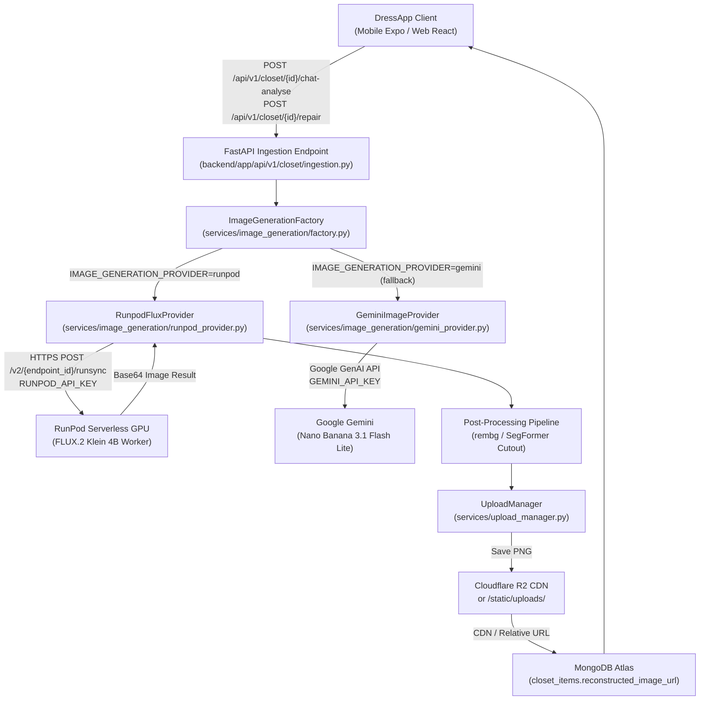

# Gate 1: Implementation Plan — FLUX.2 Klein 4B Migration

## Executive Summary

This document specifies the technical architecture, design patterns, API schemas, and execution roadmap for replacing Google Nano Banana (`gemini-3.1-flash-lite-image`) with **FLUX.2 Klein 4B** hosted on **RunPod Serverless GPU** for DressApp's garment reconstruction and AI editing workflows.

### Primary Objectives
1. **Zero-BYOK (Bring Your Own Key):** Eliminate the requirement for end users to provide a personal Google Gemini API key to use garment reconstruction and Re-Analyze features.
2. **Garment Identity Preservation:** Retain exact garment color, pattern, texture, silhouette, and hardware (zippers, buttons, stitching) without creative drift or generative hallucination.
3. **Seamless Storage Integration:** Maintain the contract with `UploadManager` and MongoDB Atlas: store clean URL/path strings in MongoDB, stream image payloads to Cloudflare R2 or local static disk, and never store base64/binary payloads in database documents.
4. **Resilient Provider Architecture:** Introduce an extensible `ImageGenerationProvider` interface with zero-downtime feature-flag fallback to Nano Banana during rollout.

---

## 1. Architectural Overview & Provider Abstraction

### 1.1 Architecture Diagram



---

## 2. Provider Interface Contract

### 2.1 Interface Definition (`backend/app/services/image_generation/base.py`)

```python
from abc import ABC, abstractmethod
from dataclasses import dataclass
from typing import Optional, Dict, Any

@dataclass
class ImageGenerationResult:
    image_bytes: bytes
    mime_type: str = "image/png"
    provider: str = "flux"
    model_name: str = "flux.2-klein-4b"
    latency_ms: int = 0
    metadata: Optional[Dict[str, Any]] = None

class ImageGenerationProvider(ABC):
    """Abstract base class for all generative garment image providers."""

    @abstractmethod
    async def edit_image(
        self,
        image_bytes: bytes,
        prompt: str,
        *,
        mask_bytes: Optional[bytes] = None,
        strength: float = 0.50,
        garment_metadata: Optional[Dict[str, Any]] = None,
    ) -> ImageGenerationResult:
        """
        Edits or repairs an existing garment image using prompt conditioning
        and optional pixel mask.
        """
        pass

    @abstractmethod
    async def generate_image(
        self,
        prompt: str,
        *,
        aspect_ratio: str = "1:1",
    ) -> ImageGenerationResult:
        """
        Generates a new commercial product photo from text prompt.
        """
        pass

    @abstractmethod
    async def health_check(self) -> bool:
        """Verifies upstream provider connectivity and authentication."""
        pass
```

### 2.2 Providers Implementation Strategy

| Provider | Class Name | Underlying Service | Auth Method |
|---|---|---|---|
| **FLUX.2 Klein 4B** (Primary) | `RunpodFluxProvider` | RunPod Serverless Endpoint (`https://api.runpod.ai/v2/{id}`) | System `RUNPOD_API_KEY` (no user key) |
| **Nano Banana** (Legacy/Fallback) | `GeminiImageProvider` | `GeminiImageService` (`gemini-3.1-flash-lite-image`) | System key or user BYOK |
| **Mock Provider** (Testing) | `MockImageProvider` | Local deterministic test fixtures | None (in-memory) |

### 2.3 Provider Resolution & Fallback Logic

```python
def get_image_provider(user_custom_key: Optional[str] = None) -> ImageGenerationProvider:
    provider_name = os.getenv("IMAGE_GENERATION_PROVIDER", "runpod").lower()
    
    if provider_name == "runpod":
        runpod_key = os.getenv("RUNPOD_API_KEY")
        endpoint_id = os.getenv("RUNPOD_FLUX_ENDPOINT_ID")
        if runpod_key and endpoint_id:
            return RunpodFluxProvider(api_key=runpod_key, endpoint_id=endpoint_id)
        # Fallback if RunPod credentials are not set
        logger.warning("RunPod credentials missing; falling back to Gemini provider")

    # Fallback to Gemini
    gemini_key = user_custom_key or os.getenv("GEMINI_API_KEY")
    return GeminiImageProvider(api_key=gemini_key)
```

---

## 3. RunPod Serverless FLUX.2 Klein 4B Worker Specification

### 3.1 Worker Payload Contract

The RunPod Serverless endpoint executes a containerized Diffusers / ComfyUI worker loaded with `FLUX.2-klein-4b`.

#### Request Schema (`POST /v2/{endpoint_id}/runsync` or `/run`):
```json
{
  "input": {
    "task": "image_to_image",
    "prompt": "Commercial studio product photography of a [garment category], [color], [fabric texture]. Centered on seamless neutral #F5F2EB studio background, crisp details, natural soft lighting, high-end e-commerce catalogue.",
    "negative_prompt": "blurry, low resolution, deformed, altered garment color, missing buttons, mutated silhouette, noise, watermark, human body parts, clutter",
    "image": "<base64_encoded_png>",
    "mask_image": "<optional_base64_encoded_mask>",
    "strength": 0.45,
    "guidance_scale": 3.5,
    "num_inference_steps": 25,
    "width": 1024,
    "height": 1024,
    "seed": 42
  }
}
```

#### Response Schema (HTTP 200):
```json
{
  "delayTime": 850,
  "executionTime": 2420,
  "id": "sync-6382104-e21a",
  "status": "COMPLETED",
  "output": {
    "image": "<base64_encoded_png>",
    "seed": 42,
    "inference_steps": 25
  }
}
```

### 3.2 Async Polling Fallback
For requests that exceed the 30-second `runsync` gateway timeout, the provider gracefully falls back to:
1. `POST /v2/{endpoint_id}/run` -> receives `job_id`.
2. Polls `GET /v2/{endpoint_id}/status/{job_id}` with exponential backoff (initial: 500ms, max: 2s, timeout: 60s).
3. Cancels job if client disconnects via `POST /v2/{endpoint_id}/cancel/{job_id}`.

---

## 4. Garment Identity Preservation & Prompt Engineering

To prevent FLUX.2 Klein 4B from "reimagining" or changing the user's clothing:

### 4.1 Strict Prompt Template
```
[Studio Directive]: High-end e-commerce commercial catalogue photograph of the exact garment shown.
[Garment Anchor]: {category}, primary color {primary_color}, accent color {accent_color}, pattern {pattern}, fabric {fabric}, neckline {neckline}.
[User Edit Instruction]: {user_instruction}
[Preservation Constraints]: Preserve exact silhouette, fabric texture, seams, and color shade of original garment. Seamless studio presentation, neutral #F5F2EB solid background, soft commercial diffuse studio lighting.
```

### 4.2 Denoising Strength Bounds
- **Subtle Repair / Wrinkle smoothing / Hole patching:** `strength = 0.35 - 0.45`
- **Object / Occlusion Removal (e.g. mannequin hands, hanger):** `strength = 0.45 - 0.55` with targeted inpainting mask from SegFormer.
- **Silhouette Reconstruction:** `strength = 0.50 - 0.60`.
- Values $> 0.65$ are strictly prohibited to avoid garment drift.

### 4.3 Background Matting & Alpha Preservation
1. FLUX generates the reconstructed garment on a controlled neutral `#F5F2EB` background.
2. The output bytes are immediately passed through `GarmentVisuals.ensure_transparent_cutout()` / `background_matting.remove_background()`.
3. The resulting image is stored as an RGBA PNG cutout, ensuring perfect drop-in placement on the DressApp canvas and outfit grid.

---

## 5. Storage & Database Consistency Contract

1. **Input:** Client sends `item_id` and natural language message or repair request.
2. **Processing:**
   - Existing original image is fetched from storage via `UploadManager`.
   - RunPod FLUX generates reconstructed image bytes.
   - Post-processing isolates transparent cutout.
3. **Storage:**
   - Output bytes are written via `UploadManager.upload_bytes(cutout_bytes, key=f"reconstructed/{item_id}_{timestamp}.png", content_type="image/png")`.
   - `UploadManager` returns URL string (e.g. `https://r2.dressapp.me/reconstructed/...` or `/static/uploads/reconstructed/...`).
4. **MongoDB Persistence:**
   - Saved to `closet_items` collection:
     ```json
     {
       "reconstructed_image_url": "...",
       "clean_image_url": "...",
       "reconstruction_metadata": {
         "provider": "runpod_flux2_klein_4b",
         "strength": 0.45,
         "prompt": "...",
         "reconstructed_at": "2026-09-25T17:30:00Z"
       }
     }
     ```
   - User's `original_image_url` is **never overwritten**.
   - No binary or base64 data is ever saved into MongoDB.

---

## 6. Zero-BYOK API & UI Adaptation

### 6.1 Backend API Gating Adjustment
In `backend/app/api/v1/closet/ingestion.py`:
- Currently:
  ```python
  custom_key = resolve_user_custom_gemini_api_key(user)
  if not custom_key:
      raise HTTPException(status_code=400, detail="Custom Gemini API Key required for image editing.")
  ```
- Change to:
  ```python
  provider_name = os.getenv("IMAGE_GENERATION_PROVIDER", "runpod")
  if provider_name == "gemini":
      # Only require custom key if running in legacy Gemini BYOK mode
      custom_key = resolve_user_custom_gemini_api_key(user)
      if not custom_key and not os.getenv("GEMINI_API_KEY"):
          raise HTTPException(status_code=400, detail="Gemini API Key required.")
  ```

### 6.2 Frontend ItemDetail UI Adaptation
In `apps/mobile` and `apps/web`:
- Remove warning banner requiring user Gemini API key when `IMAGE_GENERATION_PROVIDER` is active on backend.
- Ensure all status banners and messages use `i18next` localization keys (no hard-coded strings).

---

## 7. Isolated Test Endpoint Specification

Before modifying the live `POST /api/v1/closet/{item_id}/chat-analyse` workflow, an isolated test endpoint will be deployed in Gate 2:

### `POST /api/v1/image-generation/test`
- **Request Body (Multipart or JSON):**
  - `image`: File upload or URL
  - `prompt`: String
  - `provider`: Optional (`"runpod"` | `"gemini"` | `"auto"`)
  - `strength`: Float (default `0.45`)
- **Response:**
  - `image_url`: Uploaded resulting image URL
  - `provider`: Provider used
  - `latency_ms`: Execution time
  - `status`: `"success"` | `"error"`
- **Benefit:** Allows 100% verification of the RunPod FLUX.2 Klein 4B endpoint without mutating any user wardrobe items or production collections.

---

## 8. Colab Evaluation Harness Design

A dedicated Jupyter / Google Colab notebook will be created in `notebooks/flux2_evaluation_harness.ipynb` for Gate 3 quality validation:
1. **Garment Test Set:** 10 diverse wardrobe items across tops, bottoms, outerwear, footwear, and accessories with varied colors and textures.
2. **Evaluation Metrics:**
   - Color delta (CIE Lab $\Delta E^*$) between original and repaired garment.
   - Texture preservation (SSIM & feature similarity).
   - Artifact / hallucination detection checklist.
   - End-to-end latency measurement.
3. **Comparative Output:** Generates side-by-side comparison grids:
   - `[Original Image]` | `[Nano Banana (Gemini)]` | `[FLUX.2 Klein 4B]`

---

## 9. Gate Progression Roadmap

| Gate | Title | Deliverables | Gate Exit Criteria |
|---|---|---|---|
| **0** | Repository Discovery | Inspection of backend, endpoints, storage, schemas | User Approval **(APPROVED)** |
| **1** | Implementation Plan | Architecture specification, provider contract, test endpoint spec | User Approval **(Awaiting Approval)** |
| **2** | FLUX POC | `RunpodFluxProvider`, `POST /api/v1/image-generation/test` | Live test call returns valid reconstructed garment image |
| **3** | Image Quality Evaluation | Colab evaluation harness, 10-item benchmark report | Garment identity preserved, zero hallucinations |
| **4** | Backend Integration | Update `chat-analyse`, `repair`, Zero-BYOK bypass, `UploadManager` | End-to-end integration tests pass |
| **5** | Staging Validation | Verification across Mobile/Web UI, i18n localization | UI/UX inspection passes in multiple locales |
| **6** | Production Readiness | Concurrency, error handling, retry backoff, metrics | Zero memory leaks, graceful degraded mode |
| **7** | Production Activation | Switch `IMAGE_GENERATION_PROVIDER=runpod` on server | Real users enjoy zero-BYOK garment reconstruction |
| **8** | Legacy Provider Removal | Prune dead Nano Banana code or archive as fallback | Clean codebase, updated documentation |
