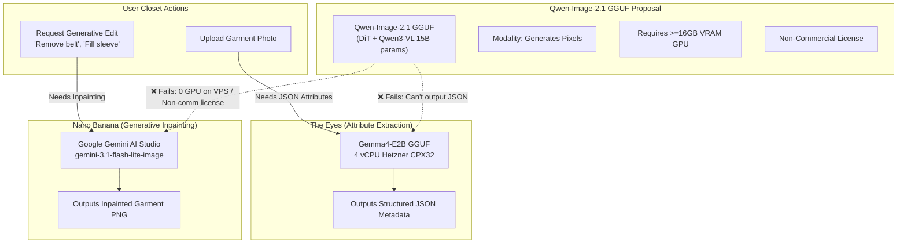

# Technical Research & Feasibility Evaluation: Qwen-Image-2.1 GGUF vs. The Eyes (Gemma4-E2B) & Nano Banana

**Date:** 2026-09-23  
**Status:** Completed  
**Author:** AI Engineering & Architecture Research  
**Target Inquiries:**
1. Can `Qwen-Image-2.1 GGUF` replace **The Eyes** (`Gemma4-E2B`)?
2. Can `Qwen-Image-2.1 GGUF` replace **Gemini Nano-banana** (`gemini-3.1-flash-lite-image`)?

---

## 1. Executive Summary & Direct Verdicts

| Target Component in DressApp | Current Model / Service | Can Qwen-Image-2.1 GGUF Replace It? | Primary Reason |
| :--- | :--- | :---: | :--- |
| **The Eyes** | Gemma-4 E2B (`Q4_K_M` + `BF16-mmproj`) on `llama-server` | ❌ **ABSOLUTELY NOT** | **Fundamental Task & Modality Mismatch.** Gemma4-E2B is an autoregressive Vision-Language Model (VLM: Image $\to$ Structured JSON / Text). Qwen-Image-2.1 is an Image Generation Diffusion Transformer (DiT: Text/Image $\to$ Pixels). |
| **Nano Banana** | Google `gemini-3.1-flash-lite-image` via `google-genai` SDK | ❌ **OPERATIONALLY & COMMERCIALLY INFEASIBLE** | **Hardware, Serving, & License Blockers.** While functionally aligned on generative editing/inpainting, Qwen-Image-2.1 requires dedicated GPU hardware ($\ge 12\text{--}16\text{ GB}$ VRAM) impossible on Hetzner CPX32 (CPU-only, 8 GB RAM), uses an unsuited desktop engine (`ComfyUI-GGUF`), carries a non-commercial research license, and re-introduces deprecated third-party HuggingFace dependencies. |

---

## 2. Primary Sources & Architectural Grounding

This investigation was conducted directly against upstream source repositories, model manifests, and production invariants:

1. **Upstream Model Specifications:**
   - [QwenLM/Qwen-Image-2.1](https://github.com/QwenLM/Qwen-Image-2.1): Official repository for Qwen-Image-2.1 released September 20, 2026.
   - [Abiray/Qwen-Image-2.1-GGUF](https://huggingface.co/Abiray/Qwen-Image-2.1-GGUF): Quantized GGUF tensor format weights of the 7B visual generation DiT component.
   - [city96/ComfyUI-GGUF](https://github.com/city96/ComfyUI-GGUF): Custom node extension for ComfyUI enabling quantized GGUF weights execution for diffusion models.
2. **DressApp Production Architecture & Deployment Rules:**
   - [`CONCRETE_FACTS.md`](file:///c:/DressApp_AG/CONCRETE_FACTS.md): Hetzner CPX32 VPS specification (4 vCPU AMD, 8 GB RAM, **zero GPU**), CPU-only inference constraints, and strict prohibition of third-party Hugging Face tokenized egress.
   - [`docs/ARCHITECTURE.md`](file:///c:/DressApp_AG/docs/ARCHITECTURE.md): Separation of concerns between garment segmentation (`SegFormer`), vision attribute extraction (The Eyes), and inpainting (Nano Banana).
   - [`inference-server/eyes/README.md`](file:///c:/DressApp_AG/inference-server/eyes/README.md): Llama-server deployment of fine-tuned Gemma-4 E2B (`gemma-4-e2b-it.Q4_K_M-002.gguf` + mmproj) within 4 GB RAM.
   - [`backend/app/services/gemini_image_service.py`](file:///c:/DressApp_AG/backend/app/services/gemini_image_service.py): Native Google GenAI integration for Nano Banana image generation and inpainting.

---

## 3. Side-by-Side Model & Architecture Matrix

| Dimension | The Eyes (Gemma4-E2B) | Nano Banana (Gemini Image) | Qwen-Image-2.1 GGUF (`Abiray` + `city96`) |
| :--- | :--- | :--- | :--- |
| **Model Type** | Multimodal Vision-Language Model (VLM) | Multimodal Image Generation / Edit Model | Diffusion Transformer (DiT) Image Generator |
| **Core Architecture** | Autoregressive Decoder + Vision Projector | Cloud Foundation Image Model (Imagen/Gemini) | 32-layer Single-Stream DiT (7B) + Qwen3-VL (8B) + VAE |
| **Total Parameters** | ~2.5B–4.5B parameters | Proprietary Google Cloud Foundation | **~15 Billion parameters** total pipeline |
| **Input Modality** | Image + Natural Language Prompt | Image + Inpainting Instruction Prompt | Image / Mask + Reference Images + Prompt |
| **Output Modality** | **Text & Structured JSON** (attributes, tags, style) | **Generated Image Pixels** (PNG/WebP) | **Generated Image Pixels** (RGBA / RGB) |
| **Serving Runtime** | `llama-server` (C++ CPU AVX2) in Docker | `google-genai` Python SDK (REST API) | ComfyUI Python runtime (`city96/ComfyUI-GGUF`) |
| **Host Environment** | Hetzner CPX32 VPS (local container) | Google Cloud Datacenter (TPU clusters) | Requires dedicated GPU server (CUDA / ROCm) |
| **RAM / VRAM Footprint**| **~4 GB RAM** resident (CPU memory) | **0 MB** on VPS (cloud API) | **~5–8 GB VRAM** (DiT Q4) + **~5–8 GB** (Text Enc) |
| **Inference Latency** | 2–5 seconds on 4 AMD dedicated vCPUs | 1–3 seconds | 15–40 seconds on mid-tier GPU; **10–30+ min on CPU** |
| **Monthly Hosting Cost**| €0 extra (runs on existing €15/mo VPS) | Pay-per-credit usage (cents per generation) | **+$100 to $250/mo** for dedicated GPU VPS |
| **License** | Google Gemma Open Model License (Commercial OK)| Google Cloud Commercial API Terms | **Qwen Research License** (**Non-Commercial Only**) |

---

## 4. Deep Dive Evaluation 1: Replacing "The Eyes" Gemma4-E2B

### 4.1 Fundamental Functional Incompatibility
- **The Eyes' Responsibility**: When a user uploads a garment photo, "The Eyes" runs multi-label visual analysis. It inspects the photo and generates structured JSON metadata:
  ```json
  {
    "category": "outerwear",
    "subcategory": "bomber_jacket",
    "color": "navy_blue",
    "material": "nylon",
    "pattern": "solid",
    "season": ["fall", "spring"],
    "formality": "smart_casual"
  }
  ```
- **Qwen-Image-2.1's Output**: Qwen-Image-2.1 is an **image generator**. Its forward pass iteratively denoises a latent noise tensor to synthesize pixel values. It **cannot** output tokenized text sequences, conversational answers, or structured JSON dictionaries.
- Asking Qwen-Image-2.1 to act as "The Eyes" is a categorical error: it is attempting to use a paint canvas where a cataloging taxonomist is required.

### 4.2 Hardware Collapse on VPS
- DressApp's production server is a Hetzner CPX32 VPS (4 AMD EPYC vCPUs, 8 GB RAM, **NO GPU**).
- Gemma4-E2B was specifically engineered into a quantized 4-bit GGUF (`gemma-4-e2b-it.Q4_K_M-002.gguf`, ~3.4 GB) with a lightweight vision projector (`gemma-4-e2b-it.BF16-mmproj.gguf`, ~986 MB). It fits inside 4 GB RAM, leaving 4 GB for FastAPI, Nginx, and Caddy.
- Qwen-Image-2.1's complete pipeline is ~15B parameters. Even running only its text encoder (Qwen3-VL 8B) on CPU would require 6–8 GB RAM, immediately triggering the Linux OOM Killer and crashing the backend.

### 4.3 Loss of Fine-Tuned Eyes LoRA
- "The Eyes" uses a custom-trained fashion taxonomy LoRA adapter (`eyes_v4_adapter/` mounted at `/adapter:ro`). This adapter represents domain knowledge fine-tuned specifically on fashion datasets for DressApp's taxonomy.
- Qwen-Image-2.1 cannot load or execute this Gemma LoRA adapter.

---

## 5. Deep Dive Evaluation 2: Replacing "Gemini Nano-banana"

### 5.1 The Tempting Match: Why They Seem Equivalent
In DressApp, **Nano Banana** (`gemini-3.1-flash-lite-image`) handles generative image editing and inpainting:
- Reconstructing sleeves occluded by hands (*"complete the hole where the hand was"*).
- Removing unwanted accessories (*"remove the belt"*).
- Synthesizing clean catalogue cutouts with transparency.

**Qwen-Image-2.1** natively features exceptional capabilities in exactly this domain:
- Unified text-to-image and local region image editing.
- Native RGBA transparency generation.
- Up to 10 reference images for identity and texture consistency.

However, substituting Nano Banana with self-hosted Qwen-Image-2.1 GGUF breaks down across five critical operational and business dimensions:

### 5.2 Constraint 1: The Zero-GPU Reality (`CONCRETE_FACTS.md`)
- As locked in `CONCRETE_FACTS.md`:
  > *"CPX32 ... GPU: None (CPU-only inference) ... Any quantization / memory / latency decisions assume this exact host."*
- Image diffusion sampling requires dozens of iterative denoising steps (typically 20–50 steps of forward passes through a 7B DiT and 8B text encoder).
- On Google's infrastructure, Nano Banana executes on Cloud TPUs/H100s in **~1.5 seconds**.
- On a 4-vCPU CPU-only server without AVX-512 tensor acceleration, generating a single image via diffusion takes **10 to 30 minutes**. Web clients would instantly experience HTTP 504 Gateway Timeouts via Caddy.

### 5.3 Constraint 2: Cloud Cost & Infrastructure Overhead
To make Qwen-Image-2.1 run within interactive latency (<5 seconds), DressApp would need to provision a dedicated GPU instance:
- **Dedicated GPU Server Required**: Minimum 16 GB–24 GB VRAM (e.g., NVIDIA RTX 4090, A10G, or L4).
- **Hosting Cost**:
  - Current Hetzner CPX32: **€15 / month**.
  - Hetzner GEX44 / RunPod / AWS GPU instance: **$120 – $280 / month**.
- **Gemini Nano-banana Cost**: Google AI Studio bills fractions of a cent per image generated ($0.02–$0.04), covered directly by the user's purchased credits (`services/credit_service.py`).
- Self-hosting would convert low, variable, revenue-tied API costs into a high, fixed monthly infrastructure loss.

### 5.4 Constraint 3: Architecture & Serving Stack Mismatch (`city96/ComfyUI-GGUF`)
- `city96/ComfyUI-GGUF` is a custom extension node specifically designed for **ComfyUI** (a desktop GUI intended for interactive prompt crafting).
- ComfyUI is not an industrial, high-concurrency REST microservice:
  - It uses internal node graphs, JSON workflow definitions, and WebSocket queues.
  - Wrapping ComfyUI inside a production Docker container requires deploying a 15+ GB Docker image with Python, PyTorch, CUDA, TorchVision, and ComfyUI dependencies.
  - In contrast, `gemini_image_service.py` is a clean, 30-line async client talking to Google's managed endpoints via `google-genai`.

### 5.5 Constraint 4: Legal & Commercial Licensing
- Upstream source check: [QwenLM/Qwen-Image-2.1](https://github.com/QwenLM/Qwen-Image-2.1) is distributed under the **Qwen Research License Agreement**.
- Unlike Apache 2.0 or MIT, this license explicitly **prohibits commercial deployment** without an individual, negotiated commercial license from Alibaba Cloud.
- DressApp is a commercial platform charging users credits for inpainting actions. Deploying Qwen-Image-2.1 in production violates the upstream license terms.

### 5.6 Constraint 5: Repository Invariants & HuggingFace Ban
- In May 2026, DressApp underwent an explicit architectural purge of HuggingFace runtime dependencies (see `CONCRETE_FACTS.md` lines 98–104 and `quarantine/2026-05-sabotage/READ_THIS_FIRST.md`):
  > *"🛑 Auth surface — HF_TOKEN / EYES_HF_TOKEN are NOT part of DressApp ... DressApp's vision stack loads its weights from local disk — no internet egress, no HuggingFace token ... Do not reintroduce these env vars."*
- Relying on community Hugging Face weights (`Abiray/Qwen-Image-2.1-GGUF`) directly violates this design invariant and introduces supply-chain vulnerabilities.

---

## 6. Synthesis & Strategic Recommendations



### Final Conclusion
1. **For "The Eyes"**: Retain **Gemma-4 E2B** on `llama-server`. It is purpose-built for CPU edge inference, fits the 8 GB VPS footprint, and performs structured text extraction rather than pixel diffusion.
2. **For "Nano Banana"**: Retain **`gemini-3.1-flash-lite-image`** via native `google-genai`. It delivers sub-2-second inpainting with zero VPS memory footprint, is fully covered by Google AI Studio commercial terms, and aligns with the credit monetization system.
3. **No Code Changes Warranted**: Do not attempt to integrate `Abiray/Qwen-Image-2.1-GGUF` or `city96/ComfyUI-GGUF` into the DressApp stack.
