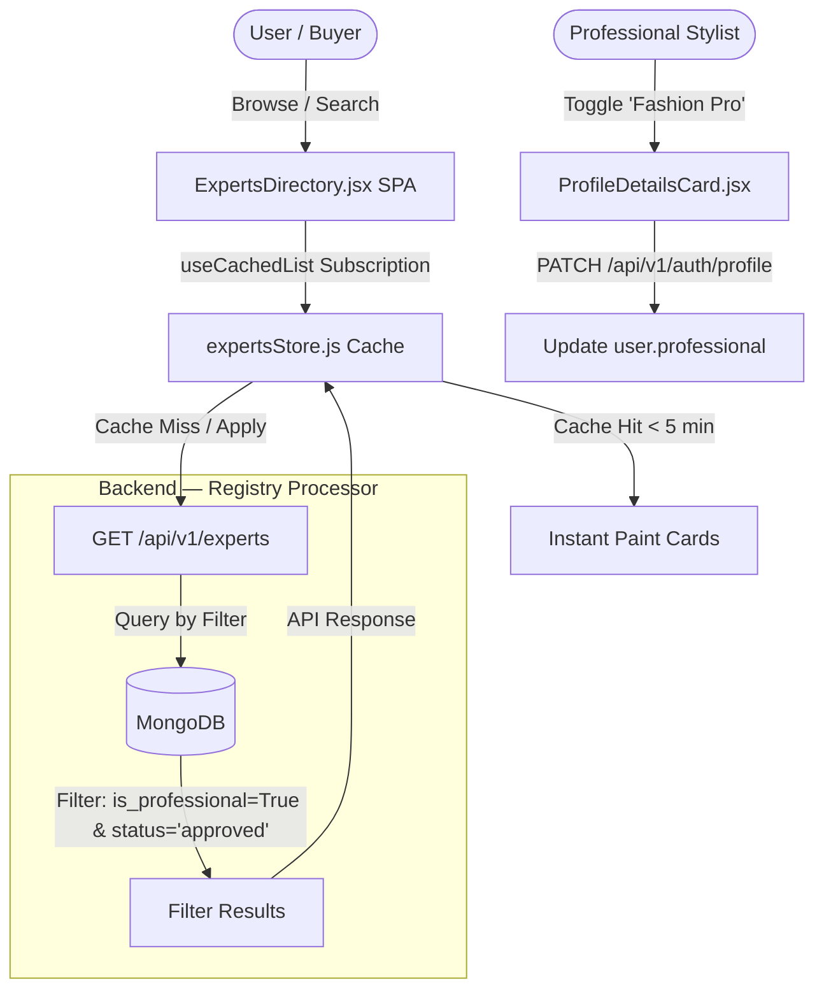

# Certified Stylist Directory (Experts Registry)

> **Module:** `frontend/src/pages/ExpertsDirectory.jsx`
> **Backend:** `backend/app/api/v1/auth.py` (Profile toggle) · `backend/app/api/v1/experts.py` (Directory lookup)
> **Store:** `lib/expertsStore.js`
> **Model Schema:** `professional` nested model inside User Document

---

## 1. Executive Summary & Value Proposition

### Overview
The **Experts Registry** (or Certified Stylist Directory) is DressApp’s public marketplace for fashion consulting. It connects standard app users with certified, professional stylists, personal shoppers, and wardrobe designers directly inside the app. 

Users can browse, search, and contact local or global fashion consultants. Verified professionals can toggle their professional status on their profile, populate their public business card, and receive direct inquiries from prospective clients.

### Architectural Flow



### User Value Proposition
- **Direct Collaboration**: Connects users to actual human fashion specialists who can audit their digital closet and compile custom outfit planners.
- **Double-State Filter Optimization**: Keeps draft filters separate from applied searches. A lookup request only fires upon manual submit, eliminating constant API querying as the user types.
- **Location-Aware Suggestions**: Uses browser geo-location (city and country codes) to pre-seed search parameters, automatically highlighting nearby local consultants first.
- **Instant Client Cache**: Uses `expertsStore` (caching entries for 5 minutes) to ensure that clicking between Home, Closet, and the Experts list renders instantly without loading screens.

---

## 2. Comprehensive User Manual

### 2.1 Visual Interface Topology

The directory dashboard splits into a filter sidebar (left) and the professional list (right):

```text
+------------------------------------------------------------------------------------+
|  <- Back                   [ REGISTER AS STYLIST ]                                 |
+------------------------------------------------------------------------------------+
|  Filters Sidebar:                     |  Experts List (N matched):                 |
|  - Search Name / Bio [           ]    |  +---------------------------------------+ |
|  - Specialty: [ All / Personal ]      |  | Professional Avatar                   | |
|  - Country:   [ All / Israel   ]      |  | Sarah Jenkins · Personal Stylist      | |
|  - City/Reg:  [ All / Tel Aviv ]      |  | "I help build sustainable wardrobes"  | |
|                                       |  | Location: Tel Aviv, IL                | |
|  [ APPLY FILTERS ]   [ CLEAR ]        |  | [Website]  [Email]  [Phone]           | |
|                                       |  +---------------------------------------+ |
+------------------------------------------------------------------------------------+
```

### 2.2 Operational Workflows

#### A. Becoming a Listed Expert (Professional Self-Registration)
1. Navigate to **Profile Details** (`ProfileDetailsCard.jsx`).
2. Toggle the **Register as Stylist** checkbox.
3. Fill out the professional profile parameters:
   - **Business Name**: Brand or LLC.
   - **Profession**: Specialty (e.g. *Personal Shopper*, *Color Consultant*).
   - **Bio**: Styling philosophy.
   - **Contact Links**: Phone number, support email, and website portfolio.
   - **Service Location**: City and country codes.
4. Click Save. The backend updates `professional.is_professional = True`.

#### B. Searching and Filtering
1. **Keystroke Buffering**: Entering a name or city updates the local React `draft` filter state.
2. **Apply Search**: Clicking "Apply Filters" or pressing Enter copies `draft` -> `applied`, initiating a reload from the backend or cache.
3. **Geo-Discovery**: If location coordinates are available via `LocationProvider`, the browser pre-seeds the city/country in the filters, suggesting local consultants.

---

## 3. Technology Stack & API Reference

### 3.1 Backend Schema Configuration
Nested schema inside the MongoDB `users` collection:
```json
{
  "professional": {
    "is_professional": true,
    "profession": "Wardrobe Consultant",
    "business_name": "EcoFashion Inc",
    "bio": "Specialized in minimalist wardrobe capsule design.",
    "contact_email": "stylist@example.com",
    "contact_phone": "+972-50-000-0000",
    "website": "https://ecofashion.example.com",
    "city": "Tel Aviv",
    "country": "IL",
    "approval_status": "approved"
  }
}
```

### 3.2 API Contracts

#### `GET /api/v1/experts`
Returns a list of self-certified professionals.
**Parameters:**
- `profession` (optional): Filter by professional role.
- `country` (optional): Filter by country code.
- `region` (optional): Filter by city.
- `q` (optional): Full-text search across name, business name, and bio.

**Response Schema:**
```json
{
  "items": [
    {
      "id": "user_id_string",
      "name": "Sarah Jenkins",
      "avatar_url": "https://...",
      "professional": {
        "profession": "Personal Stylist",
        "business_name": "Jenkins Styling",
        "bio": "Transforming closets since 2021...",
        "contact_email": "sarah@example.com",
        "contact_phone": "+1-555-0199",
        "website": "https://sarahjstyling.com",
        "city": "New York",
        "country": "US"
      }
    }
  ],
  "total": 1
}
```
