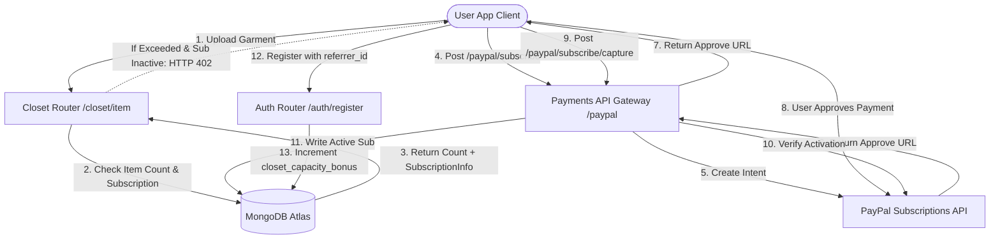

# DressApp Monetization & Billing Engine

This document provides a comprehensive architectural overview, user manual, and technology deep-dive of the monetization, subscription billing, and growth-loop mechanics in DressApp.

---

## 1. Executive Summary & Value Proposition

### High-Level Overview
DressApp implements a hybrid freemium and growth-loop monetization model. Free tier users are allocated a baseline closet capacity of **150 garments**. When limits are reached, the platform gates new garment uploads behind a **402 Payment Required** guard, offering two distinct paths to expansion:
1.  **Pro Subscription (Paid)**: A premium subscription (Monthly at $4.99 or Yearly at $29.99) powered by a native **PayPal Subscriptions REST API** integration.
2.  **Viral Growth Loop (Free)**: A referral program where inviting friends grants the referrer **+10 capacity slots** per registered signup, expanding their baseline closet indefinitely.

### Architectural Flow



### User Value Proposition
*   **Frictionless Upgrade Path**: Premium features (unlimited closet space and priority GPU background matting) can be unlocked instantly.
*   **Organic Limit Expansion**: Users who do not wish to pay can increase their limits simply by sharing a link, keeping the core utility accessible to viral advocates.
*   **PayPal Mock-Testing Mode**: Developers and staging testers can evaluate the end-to-end checkout flow without any real credit cards or active merchant billing plans.

---

## 2. Comprehensive User Manual

### Visual Interface Topology
The user profile page ([Profile.jsx](file:///C:/DressApp_AG/frontend/src/pages/Profile.jsx)) hosts the Subscription Management widget under the **Subscription & Limits** section:

```
+-------------------------------------------------------------------+
|  [Crown] SUBSCRIPTION & LIMITS                                    v|
+-------------------------------------------------------------------+
|  Free Plan: 85 / 150 items used                                   |
|                                                                   |
|  Closet Capacity                             85 / 150 items       |
|  [=======================>.....................................]  |
|                                                                   |
|  +----------------------------+   +----------------------------+  |
|  | Monthly Plan               |   | Annual Plan   [BEST VALUE] |  |
|  | Flexible billing cycle.    |   | Save 50% vs monthly rate.  |  |
|  |                            |   |                            |  |
|  | $4.99 / month              |   | $29.99 / year              |  |
|  |                            |   |                            |  |
|  | [ Upgrade Monthly ]        |   | [ Upgrade Annual ]         |  |
|  +----------------------------+   +----------------------------+  |
|                                                                   |
|  Refer Friends (Get +10 slots per signup):                        |
|  [ Copy Invite Link ]                                             |
+-------------------------------------------------------------------+
```

### Mode & Workflow Walkthroughs

#### A. Upgrading to DressApp Pro (Paid Flow)
1.  **Initiating Upgrade**: The user selects their plan (Monthly or Annual) and clicks **Upgrade**.
2.  **Order Registration**: The client issues a `POST /paypal/subscribe` request. The backend contacts PayPal, generates a subscription ID, and returns an `approve_url`.
3.  **Payment Processing**: The client browser redirects to the PayPal Sandbox checkout page (or is intercepted locally in mock mode). The user logs in and approves the billing agreement.
4.  **Redirection & Capture**: PayPal redirects the browser back to `/me?sub_status=success&token=SUBSCRIPTION_ID`.
5.  **Activation**: The client detects the search params, issues `POST /paypal/subscribe/capture/{subscription_id}`, and refreshes the user session. The limits indicator vanishes and displays **Active Premium**.

#### B. Referral Loop Activation (Free Flow)
1.  **Invite Share**: The user clicks **Copy Invite Link**, which appends their database ID to the URL: `https://dressapp.co/register?ref=USER_ID`.
2.  **Tracking & Referral Staging**: When the referred friend visits the register URL, the client-side router caches the `ref` token in `sessionStorage` under the key `referrer_id`.
3.  **Registration Bridge**: Upon submitting the registration form, the payload includes the staged `referrer_id`.
4.  **Reward Grant**: The backend registers the new account, finds the referrer, and atomically increments their `closet_capacity_bonus` by `10`.

---

## 3. Technology Stack & Capability Deep-Dive

### Data Schema Definitions
The MongoDB schema in [schemas.py](file:///C:/DressApp_AG/backend/app/models/schemas.py) holds the user's billing status:

```python
class SubscriptionInfo(BaseModel):
    is_active: bool = False
    plan_type: Literal["free", "monthly", "yearly"] = "free"
    stripe_subscription_id: str | None = None  # Legacy support
    paypal_subscription_id: str | None = None
    expires_at: str | None = None              # ISO timestamp
    cancelled_at: str | None = None            # ISO timestamp

class User(BaseDoc):
    # ... other profile documents ...
    subscription: SubscriptionInfo = Field(default_factory=SubscriptionInfo)
    closet_capacity_bonus: int = 0             # Earned via referrals
```

### API Routing & Gateway Contracts

#### Gated Endpoints ([closet.py](file:///C:/DressApp_AG/backend/app/api/v1/closet.py))
During item insertion, the system verifies limits using:
```python
capacity = 150 + user.get("closet_capacity_bonus", 0)
item_count = await db.closet_items.count_documents({"owner_id": user_id, "status": {"$ne": "deleted"}})

if item_count >= capacity and not user.get("subscription", {}).get("is_active", False):
    raise HTTPException(status_code=402, detail="Closet capacity limit exceeded. Upgrade required.")
```

#### Billing Actions ([payments.py](file:///C:/DressApp_AG/backend/app/api/v1/payments.py))
*   `POST /paypal/subscribe`: Reads plan configurations based on request payload and requests a billing agreement token from PayPal.
*   `POST /paypal/subscribe/capture/{subscription_id}`: Retrieves subscription details from the PayPal API, extracts the start date and plan frequency, calculates the expiration timestamp, and saves the active status in the database.
*   `POST /paypal/subscribe/cancel`: Contacts PayPal to terminate the billing agreement and marks the subscription object in MongoDB as scheduled for termination upon expiry.

### Mock Integration Framework ([paypal_client.py](file:///C:/DressApp_AG/backend/app/services/paypal_client.py))
To simplify local and staging environment testing, the integration uses `PAYPAL_MOCK_MODE=true`:
```python
if _is_mock_token(token) or plan_id.startswith("P-MOCK"):
    mock_sub_id = f"MOCK-SUB-{uuid.uuid4().hex[:14].upper()}"
    # Instead of navigating to PayPal, redirect immediately to return_url with mock token
    checkout_href = f"{return_url}&token={mock_sub_id}" if return_url else ...
    return {
        "id": mock_sub_id,
        "status": "APPROVAL_PENDING",
        "links": [{"href": checkout_href, "rel": "approve", "method": "GET"}]
    }
```
This bypasses external dependencies entirely, making end-to-end checkout testing accessible instantly to local developers.
