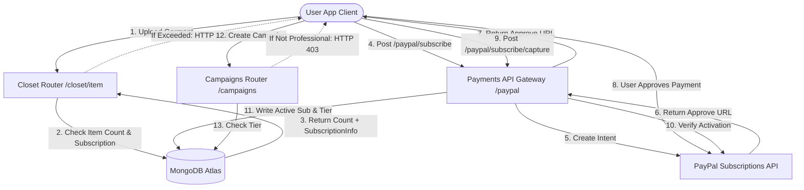

# محرك تحقيق الدخل والفواتير في DressApp

يقدم هذا المستند نظرة عامة معمارية شاملة، ودليل مستخدم، وتغطية تقنية متعمقة لتحقيق الدخل، وفوترة الاشتراكات، والقيود ذات المستويات الثلاثة في DressApp.

---

## 1. ملخص تنفيذي وعرض القيمة

### نظرة عامة عالية المستوى
تطبق DressApp نموذج تحقيق دخل ثلاثي المستويات مصمم ليناسب أنواع المستخدمين المختلفة:
1.  **الطبقة المجانية (Free Tier)**:
    *   **التكلفة**: 0 دولار أمريكي شهريًا (لا تتطلب بطاقة ائتمان).
    *   **الحدود**: ما يصل إلى 50 قطعة في الخزانة وما يصل إلى 10 عمليات ذكاء اصطناعي يوميًا.
    *   **الميزات**: تنظيم أساسي للخزانة، دعم المجتمع. محظور من البيع/التأجير في السوق (التبديل/التبرع فقط). الوصول إلى Trend Scout والحملات (Campaigns) معطل.
2.  **طبقة المدير (Manager Tier)**:
    *   **التكلفة**: 5 دولارات أمريكية شهريًا أو 50 دولارًا أمريكيًا سنويًا.
    *   **الحدود**: عدد غير محدود من قطع الخزانة وعدد غير محدود من طلبات الذكاء الاصطناعي اليومية.
    *   **الميزات**: خيارات السوق (البيع، التبديل، التأجير، التبرع)، Trend Scout، الجدولة والإشعارات الفورية، الدعم ذو الأولوية. إنشاء الحملات (Campaigns) معطل.
3.  **الطبقة الاحترافية (Professional Tier)**:
    *   **التكلفة**: 10 دولارات أمريكية شهريًا أو 100 دولار أمريكي سنويًا.
    *   **الحدود**: عدد غير محدود من قطع الخزانة وعدد غير محدود من طلبات الذكاء الاصطناعي اليومية.
    *   **الميزات**: جميع الميزات متضمنة، دعم مخصص، ودعم كامل لإنشاء حملات إعلانية (Ad Campaigns).

### التدفق المعماري



---

## 2. دليل المستخدم الشامل

### بنية الواجهة المرئية
تستضيف صفحة ملف تعريف المستخدم ([Profile.jsx](file:///C:/DressApp_AG/frontend/src/pages/Profile.jsx)) أداة إدارة الاشتراكات (Subscription Management widget) ضمن قسم **الاشتراكات والحدود (Subscription & Limits)**، حيث تعرض عدد العناصر (حد 0 إلى 50 للخطة المجانية)، وحالة مستوى الخطة النشطة، وتواريخ التجديد التالية.
تعرض صفحة التسعير ([Pricing.jsx](file:///C:/DressApp_AG/frontend/src/pages/Pricing.jsx)) بطاقات تقارن بين الخطط المجانية والمدير والاحترافية، بالإضافة إلى قائمة مراجعة تفصيلية لشبكة الميزات.

### شروحات الأوضاع وسير العمل

#### أ. ترقية عضويتك (سير العمل المدفوع)
1.  **بدء الترقية**: يختار المستخدم خطته المرغوبة (Manager أو Professional) وتكرار الفوترة (شهري أو سنوي) ثم ينقر على **ترقية الخطة (Upgrade Plan)**.
2.  **تسجيل الطلب**: يرسل العميل طلب `POST /paypal/subscribe`. يتصل الواجهة الخلفية (backend) بـ PayPal، ويقوم بإنشاء معرف اشتراك (subscription ID)، ويعيد `approve_url`.
3.  **معالجة الدفع**: يعيد متصفح العميل التوجيه إلى صفحة الدفع الخاصة بـ PayPal Sandbox (أو يتم التعامل معها عبر بوابة Mock Atzmai/PayPal). يقوم المستخدم بتسجيل الدخول ويوافق على اتفاقية الفوترة.
4.  **إعادة التوجيه والاستيلاء**: يعيد PayPal توجيه المتصفح مرة أخرى إلى `/pricing?sub_status=success&token=SUBSCRIPTION_ID`.
5.  **التفعيل**: يكتشف العميل معلمات البحث (search params)، ويرسل `POST /paypal/subscribe/capture/{subscription_id}`، ويقوم بتحديث جلسة المستخدم. يتم تحديث مستوى الخطة النشطة فورًا في واجهة المستخدم.

---

## 3. حزمة التقنيات والغوص العميق في القدرات

### تعريفات مخطط البيانات
يحتوي مخطط MongoDB في [schemas.py](file:///C:/DressApp_AG/backend/app/models/schemas.py) على حالة الفوترة الخاصة بالمستخدم والمستوى النشط:

```python
class SubscriptionInfo(BaseModel):
    is_active: bool = False
    plan_type: Literal["free", "monthly", "yearly"] = "free"
    tier: Literal["free", "manager", "professional"] = "free"
    paypal_subscription_id: str | None = None
    expires_at: str | None = None              # ISO timestamp
    cancelled_at: str | None = None            # ISO timestamp

class User(BaseDoc):
    # ... other profile documents ...
    subscription: SubscriptionInfo = Field(default_factory=SubscriptionInfo)
```

### توجيه API والإجراءات المقيدة

#### حدود عناصر الخزانة ([closet.py](file:///C:/DressApp_AG/backend/app/api/v1/closet.py))
أثناء إدراج العنصر، يتحقق النظام من الحدود للمستخدمين المجانيين:
```python
sub = user.get("subscription") or {}
is_active = sub.get("is_active", False)
plan_type = sub.get("plan_type", "free")
tier = sub.get("tier", "free")

user_tier = "free"
if is_active and plan_type != "free":
    user_tier = tier

if user_tier == "free":
    item_count = await db.closet_items.count_documents({"owner_id": user_id, "status": {"$ne": "deleted"}})
    if item_count >= 50:
        raise HTTPException(status_code=402, detail="Closet capacity limit (50 items) exceeded. Please upgrade.")
```

#### حدود عمليات الذكاء الاصطناعي اليومية ([credit_manager.py](file:///C:/DressApp_AG/backend/app/services/credit_manager.py))
بالنسبة لمستخدمي الطبقة المجانية، تزيد عمليات الذكاء الاصطناعي من عدد يومي يتم تتبعه في `user.ai_configuration.daily_request_count`. عند وصوله إلى 10، يتم حظر الطلبات برمز HTTP 402.

#### تقييد الوصول إلى السوق ([listings.py](file:///C:/DressApp_AG/backend/app/api/v1/listings.py))
إذا كان المستخدم في الطبقة المجانية، يتم رفض القوائم التي تم إنشاؤها بقصد `"for_sale"` أو `"rent"`:
```python
if user_tier == "free" and listing.intent in ["for_sale", "rent"]:
    raise HTTPException(status_code=403, detail="Free plan users can only Swap or Donate garments. Upgrade to list for sale or rent.")
```

#### تقييد الوصول إلى الحملات ([campaigns.py](file:///C:/DressApp_AG/backend/app/api/v1/campaigns.py))
تقوم نقاط نهاية إنشاء الحملات بتقييد الإجراءات ما لم يكن مستوى الاشتراك النشط هو Professional:
```python
if user_tier != "professional":
    raise HTTPException(status_code=403, detail="Ad Campaign creation is only available on the Professional plan.")
