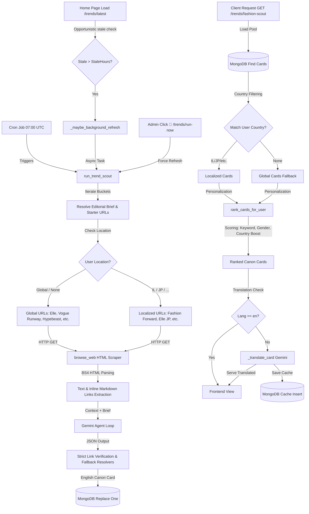

# Trends-Scout System Architecture & Documentation

## 1. Executive Summary & Value Proposition

### High-Level Overview
Trends-Scout (also called Fashion-Scout) is an autonomous, agentic pipeline in DressApp that searches, parses, and surfaces fashion industry news, street-style shifts, runway trends, and sustainability stories. Operating daily at 07:00 UTC (and on-demand through authenticated refresh routes), it retrieves content from targeted, authoritative online fashion sources, extracts and digests raw HTML, and utilizes Gemini large language models to construct structured editorial cards. These cards are localized, translated, and ranked dynamically according to user demographics.

### Architectural Flow


### User Value Proposition
*   **Frictionless Personalization:** Ranks cards dynamically using an explicit demographic scoring model, tailoring trends based on a user's country, gender, and profession.
*   **Deep Link Accuracy:** Strict link-validation algorithms prevent URL hallucination, ensuring every source link directly points to a valid article instead of a home page.
*   **Fully Localized Insights:** Adapts the underlying web crawl to target country-specific publications (like *Mako Fashion Forward* for Israel or *Elle JP* for Japan) while handling multilingual translation on demand.
*   **Optimal Performance:** Employs an opportunistic, throttled background refresh protocol and lazy translation caches to prevent sluggish load times on client feeds.

---

## 2. Comprehensive User Manual

### Visual Interface Topology
The Trends-Scout UI is presented across two primary surfaces inside DressApp: the homepage feed and the Stylist side panel.

#### 1. Home Page Daily Edit Carousel
```
+-----------------------------------------------------------------------------+
|  DAILY EDIT (YYYY-MM-DD)                                          [ 🔄 ]*    |
|                                                                             |
|  +----------------+  +----------------+  +----------------+  +-----------+  |
|  | RUNWAY         |  | STREET         |  | SUSTAINABILITY |  | NEWS FLASH|  |
|  | [Tag Label]    |  | [Tag Label]    |  | [Tag Label]    |  | [Tag Label|  |
|  | Headline       |  | Headline       |  | Headline       |  | Headline  |  |
|  | Body           |  | Body           |  | Body           |  | Body      |  |
|  |                |  |                |  |                |  |           |  |
|  | [Read Article] |  | [Read Article] |  | [Read Article] |  | [Open]    |  |
|  +----------------+  +----------------+  +----------------+  +-----------+  |
+-----------------------------------------------------------------------------+
* [🔄 ] Refresh Button (Visible to Administrators Only)
```

#### 2. Stylist Panel "News Flash" Feed
```
+------------------------------------------+
|  STYLIST PANEL: FASHION SCOUT            |
|  +------------------------------------+  |
|  | TAG (e.g. INFLUENCERS)             |  |
|  | **Headline Text**                  |  |
|  | Brief description summary body text|  |
|  | [Read source (e.g., Vogue Runway)] |  |
|  +------------------------------------+  |
|  +------------------------------------+  |
|  | TAG (e.g. SECOND-HAND)             |  |
|  | **Headline Text**                  |  |
|  | Brief description summary body text|  |
|  | [Read source (e.g., Hypebeast JP)] |  |
|  +------------------------------------+  |
+------------------------------------------+
```

### Operational Workflows & Modes

#### 1. Automatic Daily Crawl
*   **Trigger:** Triggered automatically every day at `07:00 UTC` via a background scheduler or system-wide cron.
*   **Behavior:** Sweeps through the standard bucket list, fetches starter URLs, and writes fresh canonical cards to MongoDB.

#### 2. Stale-Based Auto-Refresh
*   **Trigger:** Triggered implicitly on client access if `latest_trend_cards` discovers that the newest card is older than the configured threshold (default: `24 hours`).
*   **Behavior:** Fires an asynchronous background task (`asyncio.create_task`) to run the scout without blocking the user's immediate page response. Throttling locks prevent parallel executions for the same country.

#### 3. Administrative Force Refresh
*   **Trigger:** An administrator clicks the `🔄` button on the Home Page Daily Edit dashboard.
*   **Behavior:** Hits the `POST /trends/run-now?force=true` endpoint, forcing an immediate, synchronous regeneration of all bucket cards for the target country.

### Error Handling & Degradation Policies
*   **Anti-Scraping Challenge Detection:** If a crawler request hits an anti-bot challenge (e.g., Cloudflare) resulting in a `202 Accepted` or empty response body, the system appends a warning to the LLM agent history to try alternative configured domains.
*   **Verbatim URL Fallback:** If the LLM produces a hallucinated URL that is not present in the crawler's list of discovered links, the backend rejects it and falls back to the first valid deep link extracted from the source HTML.
*   **Silent Translation Failures:** If a translation call fails or timeouts, the endpoint catches the error and degrades gracefully by serving the original canonical English card, ensuring the user feed never crashes.

---

## 3. Technology Stack & Capability Deep-Dive

### Core Logic & Prompts
*   **AI Engine:** Powered by the `gemini-2.5-flash` model.
*   **Scraper Interface:** Built with `httpx` and `BeautifulSoup` to strip script, style, and header tags, converting anchors to readable inline markdown links: `[Text](URL)`. This allows the LLM to inspect both the page copy and the links simultaneously.
*   **Agent Instructions:** Governed by `SYSTEM_PROMPT`. It restricts the output contract to clean JSON containing the keys: `headline`, `body`, `tag`, `source_name`, `source_url`, `image_url`, and `video_url`.

### Data Pipelines & Databases
*   **Database:** MongoDB.
*   **Collection:** `trend_reports`.
*   **Compound Indexes:**
    *   `[("bucket", 1), ("date", 1), ("language", 1), ("country_code", 1)]` (Unique, Sparse) — Enforces unique cards per bucket, date, language, and country code.
    *   `[("origin_id", 1), ("language", 1), ("country_code", 1)]` (Unique, Sparse) — Caches translated variants based on the origin card ID, language, and target country.

### Personalization & Client Ranking Algorithm
When a client requests the Flat Feed, cards are re-ranked at runtime against user profile tokens using a demographic keyword matching scheme in `rank_cards_for_user`:

$$\text{Score} = \text{Keyword Overlap Weight} + \text{Bucket Affinity} + \text{Country Boost} + \text{Gender Penalty}$$

#### Scoring Breakdowns:
1.  **Keyword Overlap:** Analyzes overlap between user attributes (occupation, display name) and the card body/headline tokens ($+2.0 \times \text{count}$).
2.  **Bucket Affinity:** Awards additional weights based on matching professional keywords to specific category buckets (e.g., matching "student" or "vintage" to the `second_hand` bucket).
3.  **Country Boosts:**
    *   **Direct Match:** Awarded if the card was explicitly crawled for the user's country code ($+8.0$).
    *   **Mention Match:** Awarded if the user's country name is mentioned in the headline or body ($+3.0$).
4.  **Gender Penalty:** Deducts scoring ($-2.0$) if the card headline explicitly targets the opposite gender (e.g., Men's articles filtered for female users).
