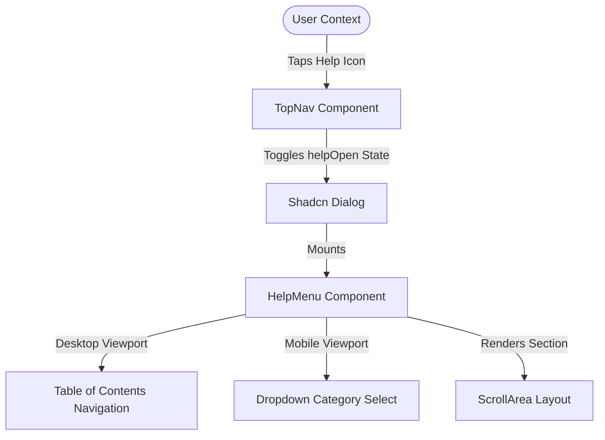

# DressApp Help System: Architectural Analysis & Technical Review

This document provides a comprehensive analysis of the recent Help development phase in the DressApp repository, outlining the design choices, code implementations, asset delivery strategy, and responsive viewport considerations.

---

## 1. Architectural Overview

The help menu system was redesigned to transition from an external PDF reader layout (which was hard to read and navigate on small screens) to a fully responsive, native React-based documentation module integrated into the core viewport.



---

## 2. Component Structure & Interface Design

### 2.1 The Documentation Engine: `HelpMenu.jsx`
- **File Path**: [HelpMenu.jsx](file:///c:/DressApp_AG/frontend/src/components/HelpMenu.jsx)
- **Design Pattern**: Single-page tabbed layout. The component splits documentation into ten primary conceptual sections (Overview, Prerequisites, Adding Clothes, AI Stylist, etc.).
- **Typography & Accessibility**:
  - Leverages standard Tailwind typography classes to ensure identical font pairings, sizes, and line-heights matching the main application shell.
  - Implements standard Radix UI `ScrollArea` to enable smooth inertial scroll containers on mobile touchscreens.
  - Formats text content dynamically via React arrays, mapping bullet points and numbered instructions into readable blocks.

### 2.2 Navigation Headers: `TopNav.jsx`
- **File Path**: [TopNav.jsx](file:///c:/DressApp_AG/frontend/src/components/TopNav.jsx)
- **Responsive Display Partition**:
  - **Desktop Header** (`hidden md:flex`): Serves as the primary wide nav bar, including brand marks, primary tabs (`/home`, `/closet`, `/stylist`, `/market`, `/experts`), user dropdown options, and a circular ghost button containing a `HelpCircle` icon.
  - **Mobile Header** (`flex md:hidden`): Renders a sticky `h-14` header bar with a smaller brand mark (`BrandLogo size="sm"`) and a matching `HelpCircle` icon on the right side.
- **Unified State Management**: Both desktop and mobile buttons share the same local state:
  ```javascript
  const [helpOpen, setHelpOpen] = useState(false);
  ```
  This eliminates duplicate overlays and ensures the Radix `<Dialog>` is triggered consistently.

---

## 3. Static Asset Strategy

### 3.1 PDF & MD Compilations
- **Compilation Engine**: [generate_easy_manual.py](file:///C:/Users/User/.gemini/antigravity/brain/6e19cffa-52e4-4ab7-a8ef-5c6edb207cb5/scratch/generate_easy_manual.py)
- **Target Directories**:
  - [User-manual_easy.md](file:///D:/ai/Emergent/Appendix/docs/User-manual_easy.md)
  - [User-manual_easy.pdf](file:///D:/ai/Emergent/Appendix/docs/User-manual_easy.pdf) (Appendix docs folder)
  - [User-manual_easy.pdf](file:///c:/DressApp_AG/User-manual_easy.pdf) (workspace root)
  - [User-manual_easy.pdf](file:///c:/DressApp_AG/frontend/public/User-manual_easy.pdf) (frontend build bundle)

### 3.2 SPA Assets vs. Caddy Reverse Proxy
- During initial testing, the PDF manual was served under `/static/User-manual_easy.pdf` from the FastAPI backend. However, the production `Caddyfile` reverse-proxy only mapped `/static/uploads/*` to the backend. Unmapped requests fell through to the Nginx frontend container which returned the SPA's `index.html` as a fallback, causing the iframe to render the Home screen recursively.
- **Resolution**: The `User-manual_easy.pdf` file is now written directly to `frontend/public/User-manual_easy.pdf`. Nginx serves it natively as a static asset alongside `favicon.ico` and `manifest.json`.

---

## 4. Troubleshooting & Limitations Coverages

Section 5 inside the Help Menu was updated to provide user self-diagnosis steps for two common bottlenecks:
1. **Closet Capacity Warning**: Detailed instructions for obtaining a free Gemini API key on Google AI Studio to bypass limits or upgrade tiers.
2. **Camera Permissions**: A clear troubleshooting guide to configure camera access in browser privacy permissions.

---

## 5. Build & Deployment Log
- Verified clean build and zero-warning compilation on both local bundlers and production VPS systems:
  - **Git Commit**: `bbb4403` (*feat: enable top nav sticky header on mobile with a clean help button*)
  - **Docker Compose Stack**: Successfully rebuilt frontend image (`dressapp-frontend:latest`) and restarted containers.
