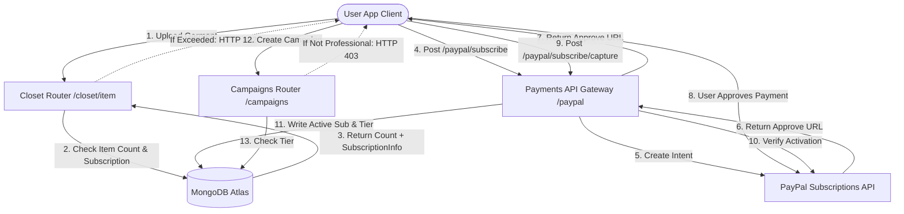

Hier ist die Übersetzung der DressApp-Dokumentation ins Deutsche:

# DressApp Monetarisierungs- & Abrechnungs-Engine

Dieses Dokument bietet eine umfassende architektonische Übersicht, ein Benutzerhandbuch und eine technische Detailanalyse der Monetarisierung, Abonnementabrechnung und der dreistufigen Begrenzungen in DressApp.

---

## 1. Management-Zusammenfassung & Wertversprechen

### Gesamtübersicht
DressApp implementiert ein dreistufiges Monetarisierungsmodell, das auf verschiedene Benutzer-Archetypen zugeschnitten ist:
1.  **Free-Tarif**:
    *   **Kosten**: $0 / Monat (keine Kreditkarte erforderlich).
    *   **Grenzwerte**: Bis zu 50 Kleidungsstücke im Kleiderschrank und bis zu 10 KI-Operationen pro Tag.
    *   **Funktionen**: Grundlegende Kleiderschrankorganisation, Community-Support. Eingeschränkt beim Verkauf/Vermietung auf dem Marktplatz (nur Tausch/Spende). Der Zugang zu Trend Scout und Kampagnen ist deaktiviert.
2.  **Manager-Tarif**:
    *   **Kosten**: $5 / Monat oder $50 / Jahr.
    *   **Grenzwerte**: Unbegrenzte Kleidungsstücke im Kleiderschrank und unbegrenzte tägliche KI-Anfragen.
    *   **Funktionen**: Marktplatz-Optionen (Verkaufen, Tauschen, Vermieten, Spenden), Trend Scout, Planer & Push-Benachrichtigungen, Priorisierter Support. Die Erstellung von Kampagnen ist deaktiviert.
3.  **Professional-Tarif**:
    *   **Kosten**: $10 / Monat oder $100 / Jahr.
    *   **Grenzwerte**: Unbegrenzte Kleidungsstücke im Kleiderschrank und unbegrenzte tägliche KI-Anfragen.
    *   **Funktionen**: Alle Funktionen inbegriffen, dedizierter Support und volle Unterstützung bei der Erstellung von Werbekampagnen.

### Architektur-Fluss



---

## 2. Umfassendes Benutzerhandbuch

### Visuelle Interface-Topologie
Die Benutzerprofilseite ([Profile.jsx](file:///C:/DressApp_AG/frontend/src/pages/Profile.jsx)) beherbergt das Abonnementverwaltungs-Widget im Abschnitt **Abonnement & Grenzwerte** und zeigt die Artikelanzahl (0 bis 50 Limit für den Free-Plan), den Status der aktiven Planstufe und die nächsten Verlängerungsdaten an.
Die Preisübersichtsseite ([Pricing.jsx](file:///C:/DressApp_AG/frontend/src/pages/Pricing.jsx)) zeigt Karten mit dem Vergleich der Free-, Manager- und Professional-Pläne sowie eine detaillierte Funktions-Checkliste in Tabellenform.

### Modus- und Workflow-Anleitungen

#### A. Upgrade Ihrer Mitgliedschaft (Bezahlter Workflow)
1.  **Upgrade initiieren**: Der/Die Nutzende wählt den gewünschten Plan (Manager oder Professional) und die Abrechnungshäufigkeit (Monatlich oder Jährlich) und klickt auf **Plan upgraden**.
2.  **Bestellregistrierung**: Der Client sendet eine `POST /paypal/subscribe`-Anfrage. Das Backend kontaktiert PayPal, generiert eine Abonnement-ID und gibt eine `approve_url` zurück.
3.  **Zahlungsabwicklung**: Der Client-Browser leitet zur PayPal Sandbox Checkout-Seite weiter (oder wird über das Mock Atzmai/PayPal-Gateway abgewickelt). Der/Die Nutzende meldet sich an und genehmigt die Abrechnungsvereinbarung.
4.  **Weiterleitung & Erfassung**: PayPal leitet den Browser zurück zu `/pricing?sub_status=success&token=SUBSCRIPTION_ID`.
5.  **Aktivierung**: Der Client erkennt die Suchparameter, sendet `POST /paypal/subscribe/capture/{subscription_id}` und aktualisiert die Benutzersitzung. Die aktive Planstufe wird sofort in der Benutzeroberfläche aktualisiert.

---

## 3. Technologiestack & Detailanalyse der Fähigkeiten

### Datenschema-Definitionen
Das MongoDB-Schema in [schemas.py](file:///C:/DressApp_AG/backend/app/models/schemas.py) speichert den Abrechnungsstatus und die aktive Stufe der Nutzenden:

```python
class SubscriptionInfo(BaseModel):
    is_active: bool = False
    plan_type: Literal["free", "monthly", "yearly"] = "free"
    tier: Literal["free", "manager", "professional"] = "free"
    paypal_subscription_id: str | None = None
    expires_at: str | None = None              # ISO timestamp
    cancelled_at: str | None = None            # ISO timestamp

class User(BaseDoc):
    # ... other profile documents ...
    subscription: SubscriptionInfo = Field(default_factory=SubscriptionInfo)
```

### API-Routing & Gesteuerte Aktionen

#### Limit für Kleiderschrankartikel ([closet.py](file:///C:/DressApp_AG/backend/app/api/v1/closet.py))
Beim Einfügen von Artikeln überprüft das System die Grenzwerte für Free-Nutzende:
```python
sub = user.get("subscription") or {}
is_active = sub.get("is_active", False)
plan_type = sub.get("plan_type", "free")
tier = sub.get("tier", "free")

user_tier = "free"
if is_active and plan_type != "free":
    user_tier = tier

if user_tier == "free":
    item_count = await db.closet_items.count_documents({"owner_id": user_id, "status": {"$ne": "deleted"}})
    if item_count >= 50:
        raise HTTPException(status_code=402, detail="Kapazitätsgrenze des Kleiderschranks (50 Artikel) überschritten. Bitte führen Sie ein Upgrade durch.")
```

#### Limit für tägliche KI-Operationen ([credit_manager.py](file:///C:/DressApp_AG/backend/app/services/credit_manager.py))
Für Nutzer*innen des Free-Tarifs erhöhen KI-Operationen eine tägliche Zählerzahl, die in `user.ai_configuration.daily_request_count` verfolgt wird. Wenn diese 10 erreicht, werden Anfragen mit HTTP 402 blockiert.

#### Marktplatz-Steuerung ([listings.py](file:///C:/DressApp_AG/backend/app/api/v1/listings.py))
Befindet sich ein/e Nutzende/r im Free-Tarif, werden Inserate, die mit der Absicht `"for_sale"` oder `"rent"` erstellt wurden, abgelehnt:
```python
if user_tier == "free" and listing.intent in ["for_sale", "rent"]:
    raise HTTPException(status_code=403, detail="Nutzer*innen des Free-Plans können Kleidungsstücke nur tauschen oder spenden. Führen Sie ein Upgrade durch, um Artikel zum Verkauf oder zur Miete anzubieten.")
```

#### Kampagnen-Steuerung ([campaigns.py](file:///C:/DressApp_AG/backend/app/api/v1/campaigns.py))
Endpunkte für die Kampagnenerstellung schränken Aktionen ein, es sei denn, die aktive Abonnementstufe ist 'Professional':
```python
if user_tier != "professional":
    raise HTTPException(status_code=403, detail="Die Erstellung von Werbekampagnen ist nur im Professional-Plan verfügbar.")
