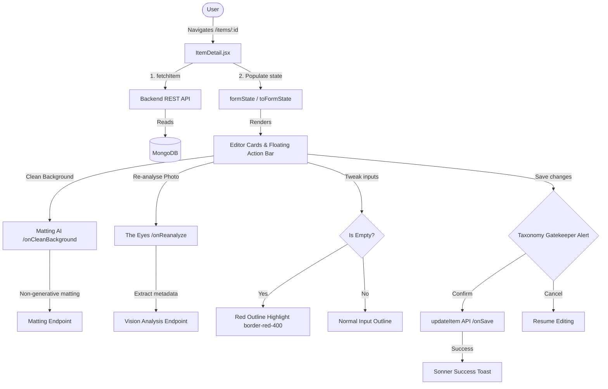

# Item Details Architecture & User Guide

This document provides a comprehensive technical overview and operational guide for the **Item Details** page (`ItemDetail.jsx`) within DressApp. It covers the user experience structure, API communication flows, AI processing utilities, validation schemas, and internationalization details.

---

## 1. Executive Summary & Value Proposition

### High-Level Overview
The **Item Details** panel is the central hub for managing individual garments within a user's digital wardrobe. It functions as a context-aware editor that bridges raw visual media (photos) with semantic metadata (category, fabric composition, color weights, brand, formality level, and notes). It enables users to refine automated AI-ingestion outputs, trigger background removal (matting), run vision model re-analyses, and configure marketplace listing options.

### Architectural Flow



### User Value Proposition
* **Precision Wardrobe Refining**: Simple, structured cards group attributes logically, preventing input fatigue.
* **Non-Generative AI Cutouts**: Clean background matting isolates the garment without adding hallucinated/invented details.
* **Auto-Categorization & Re-analysis**: Corrects noisy ingestion results with one click using "The Eyes" vision engine.
* **Optimistic Performance**: Background auto-saving and visual confirmations reduce wait times.
* **Universal Localization**: Seamless RTL direction mirroring and fully translated labels/hints powered by `i18next`.

---

## 2. Comprehensive User Manual

### Visual Interface Topology
The Item Details page utilizes an asymmetrical two-column layout tailored for desktop and mobile viewports:

```
+--------------------------------------------------------------------------+
|  <- (Back)                                         (Undo) (Save) (Up)    |
+------------------------------------+-------------------------------------+
| LEFT COLUMN (Visual & AI Actions)  | RIGHT COLUMN (Metadata Editor)      |
|                                    |                                     |
| +--------------------------------+ | +---------------------------------+ |
| |        GARMENT PHOTO           | | | IDENTITY CARD                   | |
| |  [Replace Photo] [Camera Slot] | | | - Title (Required)             | |
| +--------------------------------+ | | - Friendly Name                 | |
|                                    | | - Brand / Caption               | |
| +--------------------------------+ | +---------------------------------+ |
| | CLEAN BACKGROUND CARD          | |                                     |
| | - Matting AI Trigger Button    | | +---------------------------------+ |
| | - Progress Bar (Faithful Cut)  | | | TAXONOMY CARD                   | |
| +--------------------------------+ | | - Category / Sub-category        | |
|                                    | | - Item Type / Gender             | |
| +--------------------------------+ | | - Dress Code                     | |
| | RE-ANALYSE PHOTO CARD          | | | - Season Multi-Select           | |
| | - Vision Refill Trigger Button | | | - Tradition (with Dictation)    | |
| +--------------------------------+ | +---------------------------------+ |
|                                    |                                     |
| +--------------------------------+ | +---------------------------------+ |
| | DPP PROVENANCE PANEL           | | | COMPOSITION CARD                | |
| | - Digital Product Passport Data| | | - Size / Main Color / Pattern   | |
| +--------------------------------+ | | - Weighted Colors list          | |
|                                    | | - Weighted Fabrics list         | |
|                                    | +---------------------------------+ |
|                                    |                                     |
|                                    | +---------------------------------+ |
|                                    | | QUALITY & WEAR CARD             | |
|                                    | | - State / Condition / Tier      | |
|                                    | | - Repair Advice Notes           | |
|                                    | +---------------------------------+ |
|                                    |                                     |
|                                    | +---------------------------------+ |
|                                    | | PRICING & INTENT CARD           | |
|                                    | | - Price / Currency / Intent     | |
|                                    | +---------------------------------+ |
|                                    |                                     |
|                                    | +---------------------------------+ |
|                                    | | ORGANIZATION CARD               | |
|                                    | | - Formality / Tags / Notes      | |
|                                    | +---------------------------------+ |
+------------------------------------+-------------------------------------+
| [ List For Sale ]                                           [ Delete ]   |
+--------------------------------------------------------------------------+
```

### Mode & Workflow Walkthroughs

#### 1. Photo replacement and camera capture
* Users can replace the garment photo using the `memberPhotoInputRef` slot. 
* Clicking **Replace Photo** opens the native file selector. Clicking **Take Photo** accesses mobile devices' cameras directly via `capture="user"`.

#### 2. Clean Background
* Non-generative matting runs in the background. A progress bar updates in real time.
* If a matting session was run previously, the action button text changes to **Clean again** (fully localized) so users can retry the background separation.

#### 3. Re-analyse Photo & AI Eyes Assistant
* **Conversational AI Prompt Box**: Users can type or dictate custom requests to **The Eyes** regarding the photo and attributes (e.g., *"Remove the shoes"*, *"Complete the hole where the hand was"*, *"Remove the metal studs from the jacket's front"*, *"Refine fabric to 100% cashmere"*).
* **Nano Banana Inpainting & Editing**: Visual modification requests trigger **Nano Banana** (`gemini-2.5-flash-image`), displaying an instant preview card in chat with an **Apply as Garment Photo** action.
* **Clarification Engine**: If instructions are ambiguous, The Eyes asks conversational clarifying questions before processing.
* **1-Click Full Re-analyse**: Quickly reruns complete vision parsing to refill classification fields while preserving manual fields (size, price, notes).

#### 4. Taxonomy & Composition Editor
* Weighted Lists allow users to specify percentages for color palettes (e.g., Black 100%) and materials (e.g., Polyester 80%, Rayon 20%).
* Form inputs dynamically display a red border (`border-red-400 dark:border-red-900`) if they are left empty, providing clear feedback on missing attributes.

#### 5. Speech-To-Text Dictation
* Fields such as **Tradition** support voice dictation. Clicking the microphone icon activates the Web Speech API browser listener. The microphone turns red, records audio, translates it to text, and writes it directly to the input field.

---

## 3. Modals & Dialogs

### 1. Closet Item Picker Dialog (`addOpen`)
* **Purpose**: Allows users to associate other wardrobe garments with this item (e.g., matching suits, inner linings, or sets).
* **Structure**: A scrollable list of other closet items with checkboxes.
* **Layout**: Displays inside a glassmorphic container (`glassmorphic border-white/20`) configured to scale on mobile screens (`max-h-[90dvh]`).

### 2. Taxonomy Gatekeeper Warning Dialog (`gatekeeperOpen`)
* **Purpose**: Prevents unintended layout misclassifications. Triggers if the user changes the garment's root Category (e.g., Top to Bottom) or changes the item Type to something mismatching the parent category.
* **User Options**:
  * **Confirm**: Proceeds with the category change and adapts metadata fields.
  * **Cancel**: Aborts change and restores original category state.

### 3. Delete Confirmation Alert Dialog (`AlertDialog`)
* **Purpose**: Prevents accidental garment deletion.
* **Actions**:
  * **Cancel**: Dismisses dialog.
  * **Delete**: Removes the item using an optimistic UI update, instantly navigating the user back to the Closet while the delete request is processed in the background.

---

## 4. Technology Stack & Capability Deep-Dive

### Data & State Pipelines
* **Form Synchronization**: Handled via local React state (`form` object). Changes trigger `setField(key, value)`.
* **Auto-Save Mechanism**: Unsaved fields are monitored. Upon navigating away, changes are automatically committed to the backend to prevent data loss.
* **i18next Localization & RTL Integration**:
  * Text alignment, direction, and padding flip dynamically based on the global direction config (`i18n.dir()`).
  * Floating action elements mirror coordinates (e.g., using logical CSS values or standardizing floating offsets) to stay centered and clear of navigation tabs in both Hebrew/Arabic (RTL) and English (LTR) modes.
