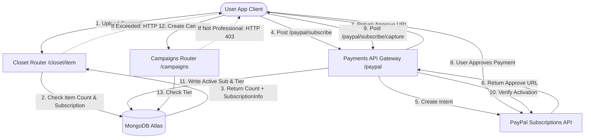

Aquí tienes la traducción de la documentación de DressApp al español, siguiendo todas las reglas especificadas:

# Motor de Monetización y Facturación de DressApp

Este documento ofrece una descripción arquitectónica exhaustiva, un manual de usuario y un análisis tecnológico profundo de la monetización, la facturación por suscripción y los límites de tres niveles en DressApp.

---

## 1. Resumen Ejecutivo y Propuesta de Valor

### Descripción General
DressApp implementa un modelo de monetización de tres niveles diseñado para adaptarse a diferentes arquetipos de usuario:
1.  **Nivel Gratuito**:
    *   **Costo**: $0 / mes (no se requiere tarjeta de crédito).
    *   **Límites**: Hasta 50 artículos en el armario y hasta 10 operaciones diarias de IA.
    *   **Características**: Organización básica del armario, soporte comunitario. Restricciones para vender/alquilar en el mercado (solo intercambio/donación). El acceso a Trend Scout y Campañas está deshabilitado.
2.  **Nivel Manager**:
    *   **Costo**: $5 / mes o $50 / año.
    *   **Límites**: Artículos ilimitados en el armario y solicitudes diarias ilimitadas de IA.
    *   **Características**: Opciones de mercado (Vender, Intercambiar, Alquilar, Donar), Trend Scout, Programador y notificaciones push, Soporte prioritario. La creación de Campañas está deshabilitada.
3.  **Nivel Profesional**:
    *   **Costo**: $10 / mes o $100 / año.
    *   **Límites**: Artículos ilimitados en el armario y solicitudes diarias ilimitadas de IA.
    *   **Características**: Todas las características incluidas, soporte dedicado y soporte completo para la creación de Campañas publicitarias.

### Flujo Arquitectónico



---

## 2. Manual de Usuario Exhaustivo

### Topología de la Interfaz Visual
La página de perfil de usuario ([Profile.jsx](file:///C:/DressApp_AG/frontend/src/pages/Profile.jsx)) alberga el widget de Gestión de Suscripciones en la sección **Suscripción y Límites**, mostrando el recuento de artículos (límite de 0 a 50 para el plan Gratuito), el estado del nivel del plan activo y las próximas fechas de renovación.
La página de precios ([Pricing.jsx](file:///C:/DressApp_AG/frontend/src/pages/Pricing.jsx)) muestra tarjetas que comparan los planes Gratuito, Manager y Profesional, así como una lista de verificación detallada de características.

### Recorridos por Modos y Flujos de Trabajo

#### A. Actualización de su Membresía (Flujo de Pago)
1.  **Inicio de la Actualización**: El usuario selecciona su plan deseado (Manager o Profesional) y la frecuencia de facturación (Mensual o Anual) y hace clic en **Actualizar Plan**.
2.  **Registro de Pedido**: El cliente emite una solicitud `POST /paypal/subscribe`. El backend se comunica con PayPal, genera un ID de suscripción y devuelve una `approve_url`.
3.  **Procesamiento de Pago**: El navegador del cliente redirige a la página de pago de PayPal Sandbox (o es manejado a través de una pasarela Mock Atzmai/PayPal). El usuario inicia sesión y aprueba el acuerdo de facturación.
4.  **Redirección y Captura**: PayPal redirige el navegador de vuelta a `/pricing?sub_status=success&token=SUBSCRIPTION_ID`.
5.  **Activación**: El cliente detecta los parámetros de búsqueda, emite `POST /paypal/subscribe/capture/{subscription_id}` y actualiza la sesión del usuario. El nivel del plan activo se actualiza inmediatamente en la interfaz de usuario.

---

## 3. Análisis Profundo de la Pila Tecnológica y Capacidades

### Definiciones del Esquema de Datos
El esquema de MongoDB en [schemas.py](file:///C:/DressApp_AG/backend/app/models/schemas.py) contiene el estado de facturación y el nivel activo del usuario:

```python
class SubscriptionInfo(BaseModel):
    is_active: bool = False
    plan_type: Literal["free", "monthly", "yearly"] = "free"
    tier: Literal["free", "manager", "professional"] = "free"
    paypal_subscription_id: str | None = None
    expires_at: str | None = None              # ISO timestamp
    cancelled_at: str | None = None            # ISO timestamp

class User(BaseDoc):
    # ... other profile documents ...
    subscription: SubscriptionInfo = Field(default_factory=SubscriptionInfo)
```

### Enrutamiento de la API y Acciones Restringidas

#### Límite de Artículos del Armario ([closet.py](file:///C:/DressApp_AG/backend/app/api/v1/closet.py))
Durante la inserción de artículos, el sistema verifica los límites para los usuarios del nivel Gratuito:
```python
sub = user.get("subscription") or {}
is_active = sub.get("is_active", False)
plan_type = sub.get("plan_type", "free")
tier = sub.get("tier", "free")

user_tier = "free"
if is_active and plan_type != "free":
    user_tier = tier

if user_tier == "free":
    item_count = await db.closet_items.count_documents({"owner_id": user_id, "status": {"$ne": "deleted"}})
    if item_count >= 50:
        raise HTTPException(status_code=402, detail="Closet capacity limit (50 items) exceeded. Please upgrade.")
```

#### Límite Diario de Operaciones de IA ([credit_manager.py](file:///C:/DressApp_AG/backend/app/services/credit_manager.py))
Para los usuarios del nivel Gratuito, las operaciones de IA incrementan un contador diario registrado en `user.ai_configuration.daily_request_count`. Cuando este alcanza 10, las solicitudes son bloqueadas con HTTP 402.

#### Restricción del Marketplace ([listings.py](file:///C:/DressApp_AG/backend/app/api/v1/listings.py))
Si un usuario está en el nivel Gratuito, las publicaciones creadas con intención `"for_sale"` o `"rent"` son rechazadas:
```python
if user_tier == "free" and listing.intent in ["for_sale", "rent"]:
    raise HTTPException(status_code=403, detail="Free plan users can only Swap or Donate garments. Upgrade to list for sale or rent.")
```

#### Restricción de Campañas ([campaigns.py](file:///C:/DressApp_AG/backend/app/api/v1/campaigns.py))
Los puntos finales de creación de Campañas restringen las acciones a menos que el nivel de suscripción activo sea Profesional:
```python
if user_tier != "professional":
    raise HTTPException(status_code=403, detail="Ad Campaign creation is only available on the Professional plan.")
