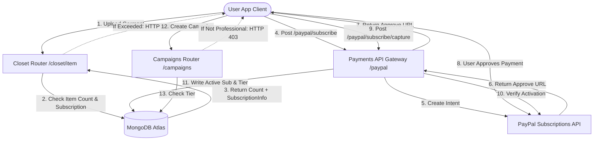

# Moteur de Monétisation et de Facturation DressApp

Ce document fournit une vue d'ensemble architecturale complète, un manuel d'utilisation et une exploration technologique approfondie de la monétisation, de la facturation par abonnement et des limites à trois niveaux dans DressApp.

---

## 1. Résumé Exécutif et Proposition de Valeur

### Vue d'Ensemble Générale
DressApp met en œuvre un modèle de monétisation à trois niveaux conçu pour s'adapter à différents archétypes d'utilisateurs :
1.  **Plan Gratuit** :
    *   **Coût** : 0 $ / mois (aucune carte de crédit requise).
    *   **Limites** : Jusqu'à 50 articles dans le dressing et jusqu'à 10 opérations d'IA quotidiennes.
    *   **Fonctionnalités** : Organisation basique du dressing, support communautaire. Restriction de vente/location sur le marché (échange/don uniquement). L'accès à Trend Scout et aux Campagnes est désactivé.
2.  **Plan Manager** :
    *   **Coût** : 5 $ / mois ou 50 $ / an.
    *   **Limites** : Articles de dressing illimités et requêtes d'IA quotidiennes illimitées.
    *   **Fonctionnalités** : Options de marché (Vendre, Échanger, Louer, Donner), Trend Scout, Planificateur et notifications push, Support prioritaire. La création de Campagnes est désactivée.
3.  **Plan Professionnel** :
    *   **Coût** : 10 $ / mois ou 100 $ / an.
    *   **Limites** : Articles de dressing illimités et requêtes d'IA quotidiennes illimitées.
    *   **Fonctionnalités** : Toutes les fonctionnalités incluses, support dédié et support complet pour la création de Campagnes publicitaires.

### Architectural Flow



---

## 2. Manuel d'Utilisation Complet

### Topologie de l'Interface Visuelle
La page de profil utilisateur ([Profile.jsx](file:///C:/DressApp_AG/frontend/src/pages/Profile.jsx)) héberge le widget de Gestion des Abonnements dans la section **Abonnement et Limites**, affichant le nombre d'articles (limite de 0 à 50 pour le plan Gratuit), le statut du niveau de plan actif et les prochaines dates de renouvellement.
La page des tarifs ([Pricing.jsx](file:///C:/DressApp_AG/frontend/src/pages/Pricing.jsx)) affiche des cartes comparant les plans Gratuit, Manager et Professionnel, ainsi qu'une liste détaillée des fonctionnalités sous forme de grille.

### Présentations des Modes et Flux de Travail

#### A. Mise à Niveau de votre Adhésion (Flux Payant)
1.  **Lancement de la Mise à Niveau** : L'utilisateur sélectionne le plan souhaité (Manager ou Professionnel) et la fréquence de facturation (Mensuelle ou Annuelle), puis clique sur **Mettre à niveau le plan**.
2.  **Enregistrement de la Commande** : Le client émet une requête `POST /paypal/subscribe`. Le backend contacte PayPal, génère un ID d'abonnement et renvoie une `approve_url`.
3.  **Traitement du Paiement** : Le navigateur client redirige vers la page de paiement PayPal Sandbox (ou est géré via la passerelle Mock Atzmai/PayPal). L'utilisateur se connecte et approuve l'accord de facturation.
4.  **Redirection et Capture** : PayPal redirige le navigateur vers `/pricing?sub_status=success&token=SUBSCRIPTION_ID`.
5.  **Activation** : Le client détecte les paramètres de recherche, émet `POST /paypal/subscribe/capture/{subscription_id}`, et actualise la session utilisateur. Le niveau de plan actif est mis à jour immédiatement dans l'interface utilisateur.

---

## 3. Approfondissement de la Pile Technologique et des Capacités

### Définitions du Schéma de Données
Le schéma MongoDB dans [schemas.py](file:///C:/DressApp_AG/backend/app/models/schemas.py) contient le statut de facturation et le niveau actif de l'utilisateur :

```python
class SubscriptionInfo(BaseModel):
    is_active: bool = False
    plan_type: Literal["free", "monthly", "yearly"] = "free"
    tier: Literal["free", "manager", "professional"] = "free"
    paypal_subscription_id: str | None = None
    expires_at: str | None = None              # ISO timestamp
    cancelled_at: str | None = None            # ISO timestamp

class User(BaseDoc):
    # ... other profile documents ...
    subscription: SubscriptionInfo = Field(default_factory=SubscriptionInfo)
```

### Routage API et Actions Protégées

#### Limite d'Articles de Dressing ([closet.py](file:///C:/DressApp_AG/backend/app/api/v1/closet.py))
Lors de l'insertion d'un article, le système vérifie les limites pour les utilisateurs Gratuits :
```python
sub = user.get("subscription") or {}
is_active = sub.get("is_active", False)
plan_type = sub.get("plan_type", "free")
tier = sub.get("tier", "free")

user_tier = "free"
if is_active and plan_type != "free":
    user_tier = tier

if user_tier == "free":
    item_count = await db.closet_items.count_documents({"owner_id": user_id, "status": {"$ne": "deleted"}})
    if item_count >= 50:
        raise HTTPException(status_code=402, detail="Closet capacity limit (50 items) exceeded. Please upgrade.")
```

#### Limite d'Opérations d'IA Quotidiennes ([credit_manager.py](file:///C:/DressApp_AG/backend/app/services/credit_manager.py))
Pour les utilisateurs du plan Gratuit, les opérations d'IA incrémentent un compteur quotidien suivi dans `user.ai_configuration.daily_request_count`. Lorsqu'il atteint 10, les requêtes sont bloquées avec un code HTTP 402.

#### Contrôle d'Accès au Marché ([listings.py](file:///C:/DressApp_AG/backend/app/api/v1/listings.py))
Si un utilisateur est sur le plan Gratuit, les annonces créées avec l'intention `"for_sale"` ou `"rent"` sont rejetées :
```python
if user_tier == "free" and listing.intent in ["for_sale", "rent"]:
    raise HTTPException(status_code=403, detail="Free plan users can only Swap or Donate garments. Upgrade to list for sale or rent.")
```

#### Contrôle d'Accès aux Campagnes ([campaigns.py](file:///C:/DressApp_AG/backend/app/api/v1/campaigns.py))
Les points de terminaison de création de campagnes restreignent les actions sauf si le niveau d'abonnement actif est Professionnel :
```python
if user_tier != "professional":
    raise HTTPException(status_code=403, detail="Ad Campaign creation is only available on the Professional plan.")
