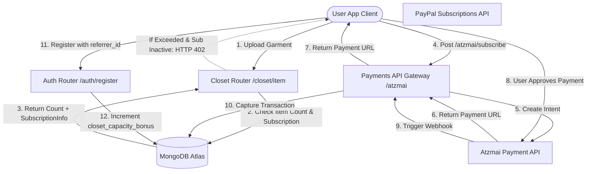

# Moteur de monétisation et de facturation de DressApp

Ce document fournit un aperçu architectural complet, un manuel de l'utilisateur et une analyse technique approfondie des mécanismes de monétisation, de facturation des abonnements et de boucle de croissance virale dans DressApp.

---

## 1. Résumé analytique et proposition de valeur

### Aperçu général
DressApp met en œuvre un modèle hybride d'abonnement SaaS et de système de crédits d'utilité prépayés :
1. **Niveaux d'abonnement (SaaS)** : Plans à tarif forfaitaire (Free, Manager, Professional) qui régissent la capacité de stockage de la garde-robe, les quotas quotidiens de stylisme IA et les fonctionnalités avancées (par exemple, la modération des campagnes publicitaires).
2. **Portefeuilles de crédits prépayés (Utilité)** : Crédits basés sur la consommation pour les opérations IA avancées (par exemple, les requêtes du Styliste Virtuel et la segmentation de photos). Ces crédits utilisent un système d'expiration pour différencier les crédits gratuits et payants.
3. **Boucle de croissance virale** : Un programme de parrainage permettant aux utilisateurs du niveau Free d'augmenter organiquement leur capacité de stockage de base en partageant des liens d'invitation.
4. **Paiements localisés (Passerelle Atzmai)** : Prise en charge native des paiements israéliens (Bit, cartes de crédit locales) en ILS/USD ainsi que des paiements PayPal mondiaux.

### Flux architectural



---

## 2. Niveaux d'abonnement et topologie des tarifs

### Tarifs des abonnements

| Plan | Price (Monthly) | Closet Capacity | AI Credits Allocation | Key Features |
| :--- | :--- | :--- | :--- | :--- |
| **Free Plan** | 0,00 $ / mois | Base de 50 éléments | 10 crédits quotidiens gratuits (expirent sous 30 jours) | Organisation de base, assistance communautaire, extensions de parrainage (+10 emplacements par inscription jusqu'à 1000 éléments) |
| **Manager (Pro)** | 4,99 $ / mois | Illimitée | Opérations quotidiennes illimitées | Essai gratuit de 14 jours, allocation initiale de 50 crédits, vente et location sur la place de marché, Trend Scout, notifications planifiées |
| **Professional** | 9,99 $ / mois | Illimitée | Opérations quotidiennes illimitées | Essai gratuit de 30 jours, allocation initiale de 300 crédits, toutes les fonctionnalités Manager, création de campagnes publicitaires dans le flux |

### Packages de crédits d'IA prépayés

Si les utilisateurs épuisent leurs crédits de stylisme, ils peuvent acheter des packages supplémentaires pour éviter toute interruption de service :

* **Package de 10 crédits** : 1,99 $ / 10,00 ILS
* **Package de 25 crédits** : 3,99 $ / 25,00 ILS
* **Package de 50 crédits** : 7,99 $ / 50,00 ILS
* **Package de 100 crédits** : 15,99 $ / 100,00 ILS
* **Montant de recharge personnalisé** : Montant en ILS spécifié par l'utilisateur (seuil minimum de 5,00 ILS pour la validation de la passerelle Atzmai).

### Expiration des crédits et priorité de consommation (Logique FIFO)
* **Crédits payants** : Achetés via des packages de recharge. Les crédits payants **n'expirent jamais**.
* **Crédits gratuits** : Attribués quotidiennement ou via des allocations d'essai. Les crédits gratuits **expirent 30 jours après leur création**.
* **Priorité de déduction** : Lorsqu'une requête IA est effectuée, le moteur vérifie et consomme automatiquement les crédits des **portefeuilles gratuits expirant le plus tôt en premier** avant de prélever sur les crédits payants.

---

## 3. Paiements localisés et facturation (Passerelle Atzmai)

Pour les comptes basés en Israël, DressApp s'intègre à la **passerelle de paiement Atzmai** pour traiter les transactions locales en ILS (Shekels) ou USD :
1. **Méthodes de paiement** : Prend en charge les liens de redirection de paiement mobile Bit et les cartes de crédit israéliennes courantes.
2. **Prélèvements automatiques d'abonnement** : Prend en charge les prélèvements automatiques mensuels/annuels pour les facturations récurrentes des abonnements Pro et Business.
3. **Vérification par Webhook** : Capture les rappels de paiement à `POST /api/v1/atzmai/webhook`, valide les enregistrements correspondants dans la collection `atzmai_topups` et change l'état de la transaction en `captured`.
4. **Comptabilité PDF automatisée** : Une fois la transaction capturée avec succès, le backend interroge l'API de facturation Atzmai pour générer et télécharger les reçus et factures officiels au format PDF. Ceux-ci sont envoyés sous forme de pièces jointes par e-mail directement à l'acheteur.

---

## 4. Pile technique et analyse approfondie des capacités

### Définitions de schémas de données (Data Schema)

Le schéma MongoDB dans [schemas.py](file:///C:/DressApp_AG/backend/app/models/schemas.py) suit les abonnements des utilisateurs et les portefeuilles de crédits :

```python
class CreditBucket(BaseModel):
    amount: int
    type: Literal["free", "paid"]
    created_at: str  # ISO timestamp
    expires_at: str | None = None  # None means infinite (paid credits)

class SubscriptionInfo(BaseModel):
    is_active: bool = False
    plan_type: Literal["free", "monthly", "yearly"] = "free"
    tier: Literal["free", "manager", "professional"] = "free"
    stripe_subscription_id: str | None = None
    paypal_subscription_id: str | None = None
    atzmai_subscription_id: str | None = None
    expires_at: str | None = None
    cancelled_at: str | None = None

class User(BaseDoc):
    subscription: SubscriptionInfo = Field(default_factory=SubscriptionInfo)
    credit_buckets: List[CreditBucket] = Field(default_factory=list)
    closet_capacity_bonus: int = 0
```

### Application des limites de garde-robe ([closet.py](file:///C:/DressApp_AG/backend/app/api/v1/closet.py))
Pendant le téléchargement d'un vêtement, le système protège les limites de la base de données :
```python
capacity_limit = 50 + user.get("closet_capacity_bonus", 0)
if current_count >= capacity_limit and not user.get("subscription", {}).get("is_active", False):
    raise HTTPException(
        status_code=402,
        detail={
            "code": "closet_capacity_exceeded",
            "message": f"You have reached your free closet capacity of {capacity_limit} items. Upgrade to Manager or Professional to add more items."
        }
    )
```

### Algorithme de déduction de crédit ([credit.py](file:///C:/DressApp_AG/backend/app/models/credit.py))
Les crédits sont dépensés en utilisant la file d'attente de priorité FIFO (premier entré, premier sorti) :
```python
def spend_credits(buckets: List[CreditBucket], required_amount: int) -> Tuple[bool, List[dict]]:
    # Sort active buckets: 
    # Priority 0: Free expiring soonest
    # Priority 1: Free other
    # Priority 2: Paid (never expires)
    active_buckets = []
    for idx, b in enumerate(buckets):
        if b.type == "free" and b.expires_at and now > b.expires_at:
            continue
        priority = (0, b.expires_at) if b.type == "free" and b.expires_at else (1, b.created_at) if b.type == "free" else (2, b.created_at)
        active_buckets.append((priority, idx, b))
    
    active_buckets.sort(key=lambda x: x[0])
    # ... deduct required_amount from sorted list ...
```
