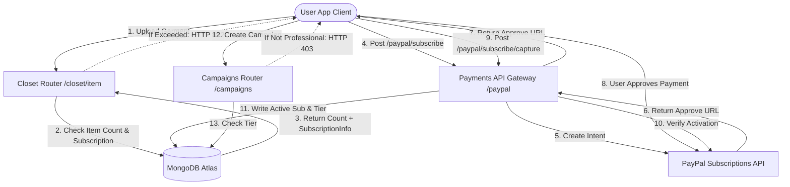

# מנוע מונטיזציה וחיוב של DressApp

מסמך זה מספק סקירה אדריכלית מקיפה, מדריך למשתמש, וצלילה טכנולוגית מעמיקה של מנוע המונטיזציה, חיוב המנויים, ומגבלות שלוש השכבות (three-tier limits) ב-DressApp.

---

## 1. תקציר מנהלים והצעת ערך

### סקירה כללית
DressApp מיישמת מודל מונטיזציה בן שלוש שכבות שנועד להתאים לארכיטיפים שונים של משתמשים:
1.  **שכבת חינם (Free Tier)**:
    *   **עלות**: $0 לחודש (אין צורך בכרטיס אשראי).
    *   **מגבלות**: עד 50 פריטי ארון בגדים ועד 10 פעולות AI יומיות.
    *   **תכונות**: ארגון ארון בגדים בסיסי, תמיכה קהילתית. מוגבל ממכירה/השכרה ב-marketplace (החלפה/תרומה בלבד). גישה ל-Trend Scout ולקמפיינים מושבתת.
2.  **שכבת מנהל (Manager Tier)**:
    *   **עלות**: $5 לחודש או $50 לשנה.
    *   **מגבלות**: פריטי ארון בגדים ללא הגבלה ובקשות AI יומיות ללא הגבלה.
    *   **תכונות**: אפשרויות Marketplace (מכירה, החלפה, השכרה, תרומה), Trend Scout, תזמון והתראות דחיפה, תמיכה בעדיפות. יצירת קמפיינים מושבתת.
3.  **שכבת מקצוען (Professional Tier)**:
    *   **עלות**: $10 לחודש או $100 לשנה.
    *   **מגבלות**: פריטי ארון בגדים ללא הגבלה ובקשות AI יומיות ללא הגבלה.
    *   **תכונות**: כל התכונות כלולות, תמיכה ייעודית, ותמיכה מלאה ביצירת קמפייני פרסום.

### זרימה ארכיטקטונית



---

## 2. מדריך למשתמש מקיף

### טופולוגיית ממשק חזותי
דף פרופיל המשתמש ([Profile.jsx](file:///C:/DressApp_AG/frontend/src/pages/Profile.jsx)) מארח את ווידג'ט ה-Subscription Management תחת סעיף **Subscription & Limits**, המציג את ספירת הפריטים (מגבלה של 0 עד 50 עבור תוכנית Free), סטטוס שכבת התוכנית הפעילה, ותאריכי חידוש עתידיים.
דף התמחור ([Pricing.jsx](file:///C:/DressApp_AG/frontend/src/pages/Pricing.jsx)) מציג כרטיסים המשווים את תוכניות ה-Free, Manager ו-Professional, כמו גם רשימת בדיקה מפורטת של תכונות.

### הליכי מצב ותהליכי עבודה

#### א. שדרוג חברותך (זרימת תשלום)
1.  **ייזום שדרוג**: המשתמש בוחר את התוכנית הרצויה לו (Manager או Professional) ותדירות חיוב (חודשית או שנתית) ולוחץ על **Upgrade Plan**.
2.  **רישום הזמנה**: ה-client מנפיק בקשת `POST /paypal/subscribe`. ה-backend יוצר קשר עם PayPal, מייצר ID מנוי, ומחזיר `approve_url`.
3.  **עיבוד תשלום**: דפדפן ה-client מפנה לדף התשלום של PayPal Sandbox (או מטופל דרך Mock Atzmai/PayPal gateway). המשתמש מתחבר ומאשר את הסכם החיוב.
4.  **הפניה מחדש ולכידה**: PayPal מפנה את הדפדפן בחזרה ל-`/pricing?sub_status=success&token=SUBSCRIPTION_ID`.
5.  **הפעלה**: ה-client מזהה את פרמטרי החיפוש, מנפיק `POST /paypal/subscribe/capture/{subscription_id}`, ומרענן את סשן המשתמש. שכבת התוכנית הפעילה מתעדכנת מיד ב-UI.

---

## 3. ערימת טכנולוגיה וצלילה מעמיקה ביכולות

### הגדרות סכימת נתונים
סכימת ה-MongoDB ב-[schemas.py](file:///C:/DressApp_AG/backend/app/models/schemas.py) מכילה את סטטוס החיוב של המשתמש ואת השכבה הפעילה:

```python
class SubscriptionInfo(BaseModel):
    is_active: bool = False
    plan_type: Literal["free", "monthly", "yearly"] = "free"
    tier: Literal["free", "manager", "professional"] = "free"
    paypal_subscription_id: str | None = None
    expires_at: str | None = None              # ISO timestamp
    cancelled_at: str | None = None            # ISO timestamp

class User(BaseDoc):
    # ... other profile documents ...
    subscription: SubscriptionInfo = Field(default_factory=SubscriptionInfo)
```

### ניתוב API ופעולות מגודרות

#### מגבלת פריטי ארון בגדים ([closet.py](file:///C:/DressApp_AG/backend/app/api/v1/closet.py))
במהלך הוספת פריט, המערכת מאמתת מגבלות עבור משתמשי Free:
```python
sub = user.get("subscription") or {}
is_active = sub.get("is_active", False)
plan_type = sub.get("plan_type", "free")
tier = sub.get("tier", "free")

user_tier = "free"
if is_active and plan_type != "free":
    user_tier = tier

if user_tier == "free":
    item_count = await db.closet_items.count_documents({"owner_id": user_id, "status": {"$ne": "deleted"}})
    if item_count >= 50:
        raise HTTPException(status_code=402, detail="Closet capacity limit (50 items) exceeded. Please upgrade.")
```

#### מגבלת פעולות AI יומיות ([credit_manager.py](file:///C:/DressApp_AG/backend/app/services/credit_manager.py))
עבור משתמשי שכבת Free, פעולות AI מגדילות ספירה יומית העוקבת אחר `user.ai_configuration.daily_request_count`. כאשר היא מגיעה ל-10, בקשות נחסמות עם HTTP 402.

#### גידור Marketplace ([listings.py](file:///C:/DressApp_AG/backend/app/api/v1/listings.py))
אם משתמש נמצא בשכבת Free, רישומים שנוצרו עם כוונה `"for_sale"` או `"rent"` נדחים:
```python
if user_tier == "free" and listing.intent in ["for_sale", "rent"]:
    raise HTTPException(status_code=403, detail="Free plan users can only Swap or Donate garments. Upgrade to list for sale or rent.")
```

#### גידור קמפיינים ([campaigns.py](file:///C:/DressApp_AG/backend/app/api/v1/campaigns.py))
נקודות קצה ליצירת קמפיינים מגבילות פעולות אלא אם שכבת המנוי הפעילה היא Professional:
```python
if user_tier != "professional":
    raise HTTPException(status_code=403, detail="Ad Campaign creation is only available on the Professional plan.")
