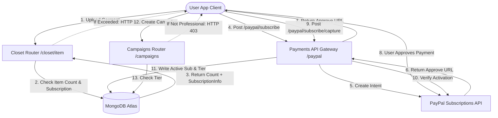

यहाँ DressApp markdown डॉक्यूमेंटेशन का हिंदी अनुवाद दिया गया है:

# ड्रेसऐप मुद्रीकरण और बिलिंग इंजन

यह दस्तावेज़ ड्रेसऐप में मुद्रीकरण, सदस्यता बिलिंग और तीन-स्तरीय सीमाओं का एक व्यापक वास्तुशिल्प अवलोकन, उपयोगकर्ता पुस्तिका और प्रौद्योगिकी पर गहन जानकारी प्रदान करता है।

---

## 1. कार्यकारी सारांश और मूल्य प्रस्ताव

### उच्च-स्तरीय अवलोकन
ड्रेसऐप विभिन्न उपयोगकर्ता पुराप्ररूपों (archetypes) के अनुकूल एक तीन-स्तरीय मुद्रीकरण मॉडल लागू करता है:
1.  **फ्री टियर**:
    *   **लागत**: $0 / महीना (क्रेडिट कार्ड की आवश्यकता नहीं)।
    *   **सीमाएँ**: 50 अलमारी आइटम तक और प्रतिदिन 10 AI संचालन तक।
    *   **विशेषताएँ**: मूल अलमारी संगठन, सामुदायिक सहायता। मार्केटप्लेस पर बेचने/किराए पर देने से प्रतिबंधित (केवल अदला-बदली/दान)। ट्रेंड स्काउट और कैंपेन तक पहुंच अक्षम है।
2.  **मैनेजर टियर**:
    *   **लागत**: $5 / महीना या $50 / वर्ष।
    *   **सीमाएँ**: असीमित अलमारी आइटम और असीमित दैनिक AI अनुरोध।
    *   **विशेषताएँ**: मार्केटप्लेस विकल्प (बेचना, अदला-बदली, किराए पर देना, दान करना), ट्रेंड स्काउट, शेड्यूलर और पुश नोटिफिकेशन, प्राथमिकता सहायता। कैंपेन बनाना अक्षम है।
3.  **प्रोफेशनल टियर**:
    *   **लागत**: $10 / महीना या $100 / वर्ष।
    *   **सीमाएँ**: असीमित अलमारी आइटम और असीमित दैनिक AI अनुरोध।
    *   **विशेषताएँ**: सभी सुविधाएँ शामिल, समर्पित सहायता, और पूर्ण विज्ञापन कैंपेन निर्माण सहायता।

### वास्तुशिल्प प्रवाह



---

## 2. व्यापक उपयोगकर्ता पुस्तिका

### विज़ुअल इंटरफ़ेस टोपोलॉजी
उपयोगकर्ता प्रोफ़ाइल पृष्ठ ([Profile.jsx](file:///C:/DressApp_AG/frontend/src/pages/Profile.jsx)) **सदस्यता और सीमाएँ** अनुभाग के अंतर्गत सदस्यता प्रबंधन विजेट की मेजबानी करता है, जिसमें आइटम गणना (फ्री प्लान के लिए 0 से 50 की सीमा), सक्रिय प्लान टियर स्थिति, और अगली नवीनीकरण तिथियाँ प्रदर्शित होती हैं।
मूल्य निर्धारण पृष्ठ ([Pricing.jsx](file:///C:/DressApp_AG/frontend/src/pages/Pricing.jsx)) फ्री, मैनेजर और प्रोफेशनल प्लान की तुलना करने वाले कार्ड, साथ ही एक विस्तृत सुविधा ग्रिड चेकलिस्ट प्रदर्शित करता है।

### मोड और कार्यप्रवाह विवरण

#### A. अपनी सदस्यता को अपग्रेड करना (भुगतान प्रवाह)
1.  **अपग्रेड शुरू करना**: उपयोगकर्ता अपनी वांछित योजना (मैनेजर या प्रोफेशनल) और बिलिंग आवृत्ति (मासिक या वार्षिक) का चयन करता है और **प्लान अपग्रेड करें** पर क्लिक करता है।
2.  **ऑर्डर पंजीकरण**: क्लाइंट एक `POST /paypal/subscribe` अनुरोध जारी करता है। बैकएंड PayPal से संपर्क करता है, एक सदस्यता ID उत्पन्न करता है, और एक `approve_url` लौटाता है।
3.  **भुगतान प्रसंस्करण**: क्लाइंट ब्राउज़र PayPal Sandbox चेकआउट पृष्ठ पर रीडायरेक्ट करता है (या Mock Atzmai/PayPal गेटवे के माध्यम से नियंत्रित होता है)। उपयोगकर्ता लॉग इन करता है और बिलिंग समझौते को स्वीकृति देता है।
4.  **रीडायरेक्शन और कैप्चर**: PayPal ब्राउज़र को वापस `/pricing?sub_status=success&token=SUBSCRIPTION_ID` पर रीडायरेक्ट करता है।
5.  **सक्रियण**: क्लाइंट खोज पैरामीटर का पता लगाता है, `POST /paypal/subscribe/capture/{subscription_id}` जारी करता है, और उपयोगकर्ता सत्र को रीफ्रेश करता है। सक्रिय प्लान टियर UI में तुरंत अपडेट हो जाता है।

---

## 3. प्रौद्योगिकी स्टैक और क्षमता पर गहन जानकारी

### डेटा स्कीमा परिभाषाएँ
[schemas.py](file:///C:/DressApp_AG/backend/app/models/schemas.py) में MongoDB स्कीमा उपयोगकर्ता की बिलिंग स्थिति और सक्रिय टियर को रखता है:

```python
class SubscriptionInfo(BaseModel):
    is_active: bool = False
    plan_type: Literal["free", "monthly", "yearly"] = "free"
    tier: Literal["free", "manager", "professional"] = "free"
    paypal_subscription_id: str | None = None
    expires_at: str | None = None              # ISO timestamp
    cancelled_at: str | None = None            # ISO timestamp

class User(BaseDoc):
    # ... other profile documents ...
    subscription: SubscriptionInfo = Field(default_factory=SubscriptionInfo)
```

### API रूटिंग और गेटेड क्रियाएँ

#### अलमारी आइटम सीमा ([closet.py](file:///C:/DressApp_AG/backend/app/api/v1/closet.py))
आइटम डालते समय, सिस्टम फ्री उपयोगकर्ताओं के लिए सीमाओं को सत्यापित करता है:
```python
sub = user.get("subscription") or {}
is_active = sub.get("is_active", False)
plan_type = sub.get("plan_type", "free")
tier = sub.get("tier", "free")

user_tier = "free"
if is_active and plan_type != "free":
    user_tier = tier

if user_tier == "free":
    item_count = await db.closet_items.count_documents({"owner_id": user_id, "status": {"$ne": "deleted"}})
    if item_count >= 50:
        raise HTTPException(status_code=402, detail="Closet capacity limit (50 items) exceeded. Please upgrade.")
```

#### दैनिक AI संचालन सीमा ([credit_manager.py](file:///C:/DressApp_AG/backend/app/services/credit_manager.py))
फ्री टियर उपयोगकर्ताओं के लिए, AI संचालन `user.ai_configuration.daily_request_count` में ट्रैक की गई दैनिक गणना को बढ़ाता है। जब यह 10 तक पहुंच जाता है, तो अनुरोधों को HTTP 402 के साथ ब्लॉक कर दिया जाता है।

#### मार्केटप्लेस गेटिंग ([listings.py](file:///C:/DressApp_AG/backend/app/api/v1/listings.py))
यदि कोई उपयोगकर्ता फ्री टियर पर है, तो `"for_sale"` या `"rent"` के इरादे से बनाई गई लिस्टिंग अस्वीकृत कर दी जाती हैं:
```python
if user_tier == "free" and listing.intent in ["for_sale", "rent"]:
    raise HTTPException(status_code=403, detail="Free plan users can only Swap or Donate garments. Upgrade to list for sale or rent.")
```

#### कैंपेन गेटिंग ([campaigns.py](file:///C:/DressApp_AG/backend/app/api/v1/campaigns.py))
कैंपेन निर्माण एंडपॉइंट्स क्रियाओं को प्रतिबंधित करते हैं जब तक कि सक्रिय सदस्यता टियर प्रोफेशनल न हो:
```python
if user_tier != "professional":
    raise HTTPException(status_code=403, detail="Ad Campaign creation is only available on the Professional plan.")
