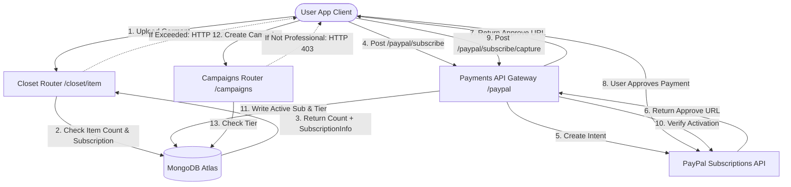

Ecco la traduzione della documentazione di DressApp in italiano, seguendo tutte le regole specificate:

# Motore di Monetizzazione e Fatturazione di DressApp

Questo documento fornisce una panoramica architettonica completa, un manuale utente e un'analisi approfondita della tecnologia alla base della monetizzazione, della fatturazione degli abbonamenti e dei limiti a tre livelli in DressApp.

---

## 1. Riepilogo Esecutivo e Proposta di Valore

### Panoramica di Alto Livello
DressApp implementa un modello di monetizzazione a tre livelli progettato per adattarsi a diversi archetipi di utente:
1.  **Livello Gratuito**:
    *   **Costo**: 0 $ / mese (nessuna carta di credito richiesta).
    *   **Limiti**: Fino a 50 capi nell'armadio e fino a 10 operazioni AI giornaliere.
    *   **Funzionalità**: Organizzazione base dell'armadio, supporto della community. Restrizioni sulla vendita/noleggio sul marketplace (solo scambio/donazione). L'accesso a Trend Scout e Campagne è disabilitato.
2.  **Livello Manager**:
    *   **Costo**: 5 $ / mese o 50 $ / anno.
    *   **Limiti**: Capi nell'armadio illimitati e richieste AI giornaliere illimitate.
    *   **Funzionalità**: Opzioni del marketplace (Vendi, Scambia, Noleggia, Dona), Trend Scout, Scheduler e notifiche push, Supporto prioritario. La creazione di Campagne è disabilitata.
3.  **Livello Professional**:
    *   **Costo**: 10 $ / mese o 100 $ / anno.
    *   **Limiti**: Capi nell'armadio illimitati e richieste AI giornaliere illimitate.
    *   **Funzionalità**: Tutte le funzionalità incluse, supporto dedicato e supporto completo per la creazione di Campagne Pubblicitarie.

### Flusso Architettonico



---

## 2. Manuale Utente Completo

### Topologia dell'Interfaccia Visiva
La pagina del profilo utente ([Profile.jsx](file:///C:/DressApp_AG/frontend/src/pages/Profile.jsx)) ospita il widget di Gestione Abbonamenti sotto la sezione **Abbonamento e Limiti**, mostrando il conteggio degli articoli (limite da 0 a 50 per il piano Gratuito), lo stato del livello del piano attivo e le date di rinnovo successive.
La pagina dei prezzi ([Pricing.jsx](file:///C:/DressApp_AG/frontend/src/pages/Pricing.jsx)) visualizza schede che confrontano i piani Gratuito, Manager e Professional, oltre a una checklist dettagliata delle funzionalità in griglia.

### Descrizione Dettagliata delle Modalità e dei Flussi di Lavoro

#### A. Aggiornamento dell'Abbonamento (Flusso a Pagamento)
1.  **Avvio dell'Aggiornamento**: L'utente seleziona il piano desiderato (Manager o Professional) e la frequenza di fatturazione (Mensile o Annuale) e clicca su **Aggiorna Piano**.
2.  **Registrazione dell'Ordine**: Il client invia una richiesta `POST /paypal/subscribe`. Il backend contatta PayPal, genera un ID di abbonamento e restituisce una `approve_url`.
3.  **Elaborazione del Pagamento**: Il browser del client reindirizza alla pagina di checkout di PayPal Sandbox (o viene gestito tramite gateway Mock Atzmai/PayPal). L'utente effettua l'accesso e approva l'accordo di fatturazione.
4.  **Reindirizzamento e Acquisizione**: PayPal reindirizza il browser a `/pricing?sub_status=success&token=SUBSCRIPTION_ID`.
5.  **Attivazione**: Il client rileva i parametri di ricerca, invia `POST /paypal/subscribe/capture/{subscription_id}` e aggiorna la sessione utente. Il livello del piano attivo si aggiorna immediatamente nell'interfaccia utente.

---

## 3. Approfondimento dello Stack Tecnologico e delle Capacità

### Definizioni dello Schema dei Dati
Lo schema MongoDB in [schemas.py](file:///C:/DressApp_AG/backend/app/models/schemas.py) contiene lo stato di fatturazione e il livello attivo dell'utente:

```python
class SubscriptionInfo(BaseModel):
    is_active: bool = False
    plan_type: Literal["free", "monthly", "yearly"] = "free"
    tier: Literal["free", "manager", "professional"] = "free"
    paypal_subscription_id: str | None = None
    expires_at: str | None = None              # ISO timestamp
    cancelled_at: str | None = None            # ISO timestamp

class User(BaseDoc):
    # ... other profile documents ...
    subscription: SubscriptionInfo = Field(default_factory=SubscriptionInfo)
```

### Routing API e Azioni Limitate

#### Limite Articoli dell'Armadio ([closet.py](file:///C:/DressApp_AG/backend/app/api/v1/closet.py))
Durante l'inserimento di un articolo, il sistema verifica i limiti per gli utenti del piano Gratuito:
```python
sub = user.get("subscription") or {}
is_active = sub.get("is_active", False)
plan_type = sub.get("plan_type", "free")
tier = sub.get("tier", "free")

user_tier = "free"
if is_active and plan_type != "free":
    user_tier = tier

if user_tier == "free":
    item_count = await db.closet_items.count_documents({"owner_id": user_id, "status": {"$ne": "deleted"}})
    if item_count >= 50:
        raise HTTPException(status_code=402, detail="Closet capacity limit (50 items) exceeded. Please upgrade.")
```

#### Limite Operazioni AI Giornaliere ([credit_manager.py](file:///C:/DressApp_AG/backend/app/services/credit_manager.py))
Per gli utenti del livello Gratuito, le operazioni AI incrementano un contatore giornaliero tracciato in `user.ai_configuration.daily_request_count`. Quando raggiunge 10, le richieste vengono bloccate con HTTP 402.

#### Restrizione Marketplace ([listings.py](file:///C:/DressApp_AG/backend/app/api/v1/listings.py))
Se un utente si trova nel livello Gratuito, gli annunci creati con intento `"for_sale"` (in vendita) o `"rent"` (a noleggio) vengono rifiutati:
```python
if user_tier == "free" and listing.intent in ["for_sale", "rent"]:
    raise HTTPException(status_code=403, detail="Free plan users can only Swap or Donate garments. Upgrade to list for sale or rent.")
```

#### Restrizione Campagne ([campaigns.py](file:///C:/DressApp_AG/backend/app/api/v1/campaigns.py))
Gli endpoint di creazione delle campagne limitano le azioni a meno che il livello di abbonamento attivo non sia Professional:
```python
if user_tier != "professional":
    raise HTTPException(status_code=403, detail="Ad Campaign creation is only available on the Professional plan.")
