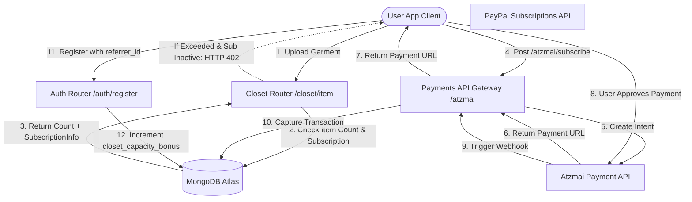

# DressAppのマネタイズ＆請求エンジン

このドキュメントでは、DressAppにおけるマネタイズ、サブスクリプション請求、およびバイラル成長ループの仕組みについて、包括的なアーキテクチャの概要、ユーザーマニュアル、および技術的な深掘りを提供します。

---

## 1. エグゼクティブサマリー＆価値提案

### ハイレベル概要
DressAppは、定額制のSaaSサブスクリプションとプリペイド式のユーティリティクレジットモデルを組み合わせたハイブリッドモデルを採用しています：
1. **サブスクリプションプラン（SaaS）**：クローゼットの収納容量、1日のAIスタイリング制限、および高度な機能（例：広告キャンペーンの管理など）を制御する定額プラン（Free、Manager、Professional）。
2. **プリペイド式クレジットバケット（ユーティリティ）**：高度なAI操作（例：バーチャルスタイリストへの問い合わせや写真のセグメンテーションなど）のための、消費量に基づいた詳細なクレジット。これらのクレジットは、無料プールと有料プールを区別するために有効期限管理システムを使用しています。
3. **バイラル成長ループ**：Freeプランのユーザーが、招待リンクを共有することでクローゼットの基本容量をオーガニックに拡張できる紹介プログラム。
4. **ローカライズされた決済（Atzmaiゲートウェイ）**：グローバルなPayPal決済に加え、イスラエルのローカル決済（Bit、ローカルクレジットカード）のILS/USD建てでのネイティブサポート。

### アーキテクチャフロー



---

## 2. サブスクリプションプランと料金体系

### 料金プラン

| Plan | Price (Monthly) | Closet Capacity | AI Credits Allocation | Key Features |
| :--- | :--- | :--- | :--- | :--- |
| **Free Plan** | 月額 $0.00 | 基本50アイテム | 毎日10無料クレジット（30日間有効） | 基本的な整理、コミュニティサポート、紹介による容量拡張（登録1件につき+10スロット、最大1000アイテムまで） |
| **Manager (Pro)** | 月額 $4.99 | 無制限 | 1日あたりの操作無制限 | 14日間の無料トライアル、初期割り当て50クレジット、マーケットプレイスでの販売＆レンタル、Trend Scout、スケジュール通知 |
| **Professional** | 月額 $9.99 | 無制限 | 1日あたりの操作無制限 | 30日間の無料トライアル、初期割り当て300クレジット、Managerプランのすべての機能、フィード内での広告キャンペーン作成サポート |

### プリペイドAIクレジットパック

ユーザーがスタイリングクレジットを使い果たした場合、サービスの停止を避けるために追加のパッケージを購入できます：

* **10クレジットパック**：$1.99 / 10.00 ILS
* **25クレジットパック**：$3.99 / 25.00 ILS
* **50クレジットパック**：$7.99 / 50.00 ILS
* **100クレジットパック**：$15.99 / 100.00 ILS
* **カスタムチャージ金額**：ユーザー指定のILS金額（Atzmaiゲートウェイの検証用に最低5.00 ILSのしきい値があります）。

### クレジットの有効期限と消費優先順位（FIFOロジック）
* **有料クレジット**：チャージパック経由で購入されたものです。有料クレジットには**有効期限はありません**。
* **無料クレジット**：毎日付与されるか、またはトライアルの割り当てを通じて付与されます。無料クレジットは**作成から30日後に失効します**。
* **消費優先順位**：AIリクエストが行われると、エンジンは有料クレジットから消費する前に、**有効期限が最も近い最も古い無料バケットから優先的にクレジットを確認・消費**します。

---

## 3. ローカライズされた決済＆請求（Atzmaiゲートウェイ）

イスラエルに拠点を置くアカウントの場合、DressAppは**Atzmai決済ゲートウェイ**と連携し、ローカルの取引をILS（シェケル）またはUSDで処理します：
1. **決済手段**：Bitモバイル決済リダイレクトリンクおよび通常のイスラエルクレジットカードをサポートしています。
2. **サブスクリプション口座振替**：ProおよびBusinessの継続的なサブスクリプション請求のための、月次/年次の口座振替設定をサポートしています。
3. **Webhook検証**：`POST /api/v1/atzmai/webhook` で決済コールバックをキャプチャし、`atzmai_topups` コレクション内の一致するレコードを検証して、取引ステータスを `captured` に変更します。
4. **自動PDF記帳**：決済のキャプチャに成功すると、バックエンドはAtzmai請求APIに問い合わせて、公式の領収書および請求書PDFを生成・ダウンロードします。これらはメール添付ファイルとして購入者に直接送信されます。

---

## 4. 技術スタックと機能の深掘り

### データスキーマ定義（Data Schema Definitions）

[schemas.py](file:///C:/DressApp_AG/backend/app/models/schemas.py)にあるMongoDBスキーマは、ユーザーのサブスクリプション情報とクレジットバケットを追跡します：

```python
class CreditBucket(BaseModel):
    amount: int
    type: Literal["free", "paid"]
    created_at: str  # ISO timestamp
    expires_at: str | None = None  # None means infinite (paid credits)

class SubscriptionInfo(BaseModel):
    is_active: bool = False
    plan_type: Literal["free", "monthly", "yearly"] = "free"
    tier: Literal["free", "manager", "professional"] = "free"
    stripe_subscription_id: str | None = None
    paypal_subscription_id: str | None = None
    atzmai_subscription_id: str | None = None
    expires_at: str | None = None
    cancelled_at: str | None = None

class User(BaseDoc):
    subscription: SubscriptionInfo = Field(default_factory=SubscriptionInfo)
    credit_buckets: List[CreditBucket] = Field(default_factory=list)
    closet_capacity_bonus: int = 0
```

### クローゼット容量制限の適用 ([closet.py](file:///C:/DressApp_AG/backend/app/api/v1/closet.py))
アイテムのアップロード中、システムはデータベース制限を監視します：
```python
capacity_limit = 50 + user.get("closet_capacity_bonus", 0)
if current_count >= capacity_limit and not user.get("subscription", {}).get("is_active", False):
    raise HTTPException(
        status_code=402,
        detail={
            "code": "closet_capacity_exceeded",
            "message": f"You have reached your free closet capacity of {capacity_limit} items. Upgrade to Manager or Professional to add more items."
        }
    )
```

### クレジット消費アルゴリズム ([credit.py](file:///C:/DressApp_AG/backend/app/models/credit.py))
クレジットは、FIFO（先入れ先出し）の優先度キューを使用して消費されます：
```python
def spend_credits(buckets: List[CreditBucket], required_amount: int) -> Tuple[bool, List[dict]]:
    # Sort active buckets: 
    # Priority 0: Free expiring soonest
    # Priority 1: Free other
    # Priority 2: Paid (never expires)
    active_buckets = []
    for idx, b in enumerate(buckets):
        if b.type == "free" and b.expires_at and now > b.expires_at:
            continue
        priority = (0, b.expires_at) if b.type == "free" and b.expires_at else (1, b.created_at) if b.type == "free" else (2, b.created_at)
        active_buckets.append((priority, idx, b))
    
    active_buckets.sort(key=lambda x: x[0])
    # ... deduct required_amount from sorted list ...
```
