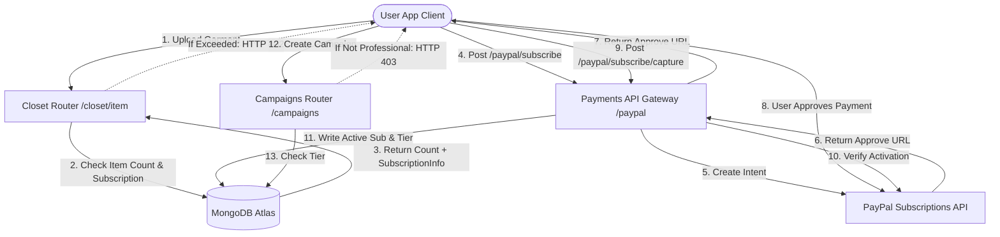

# DressApp 収益化 & 請求エンジン

このドキュメントでは、DressAppにおける収益化、サブスクリプション請求、および3段階の利用制限に関する包括的なアーキテクチャ概要、ユーザーマニュアル、および技術的な詳細を提供します。

---

## 1. 経営層向け要約 & 価値提案

### 概要
DressAppは、様々なユーザー像に合わせて設計された3段階の収益化モデルを導入しています。
1.  **Free Tier**:
    *   **費用**: 月額 $0（クレジットカード不要）。
    *   **制限**: クローゼットアイテムは最大50点、AI操作は1日あたり最大10回まで。
    *   **機能**: 基本的なクローゼット管理、コミュニティサポート。マーケットプレイスでの販売/レンタルは制限されます（交換/寄付のみ）。Trend ScoutおよびCampaignsへのアクセスは無効です。
2.  **Manager Tier**:
    *   **費用**: 月額 $5 または 年額 $50。
    *   **制限**: クローゼットアイテムは無制限、AIリクエストは1日あたり無制限。
    *   **機能**: マーケットプレイスオプション（販売、交換、レンタル、寄付）、Trend Scout、スケジューラー & プッシュ通知、優先サポート。キャンペーン作成は無効です。
3.  **Professional Tier**:
    *   **費用**: 月額 $10 または 年額 $100。
    *   **制限**: クローゼットアイテムは無制限、AIリクエストは1日あたり無制限。
    *   **機能**: すべての機能が含まれます。専用サポートと、広告キャンペーンのフル作成サポートが提供されます。

### アーキテクチャフロー



---

## 2. 総合ユーザーマニュアル

### ビジュアルインターフェーストポロジー
ユーザープロフィールページ（[Profile.jsx](file:///C:/DressApp_AG/frontend/src/pages/Profile.jsx)）には、「**Subscription & Limits**」セクションの下にサブスクリプション管理ウィジェットがあり、アイテム数（Freeプランでは0〜50点の制限）、アクティブなプランティアのステータス、および次回の更新日が表示されます。
価格ページ（[Pricing.jsx](file:///C:/DressApp_AG/frontend/src/pages/Pricing.jsx)）には、Free、Manager、Professionalプランを比較するカードと、詳細な機能グリッドチェックリストが表示されます。

### モードとワークフローのチュートリアル

#### A. メンバーシップのアップグレード（有料フロー）
1.  **アップグレードの開始**: ユーザーは希望するプラン（ManagerまたはProfessional）と請求頻度（月払いまたは年払い）を選択し、「**Upgrade Plan**」をクリックします。
2.  **注文登録**: クライアントは`POST /paypal/subscribe`リクエストを発行します。バックエンドはPayPalに連絡し、サブスクリプションIDを生成して`approve_url`を返します。
3.  **支払い処理**: クライアントブラウザはPayPal Sandboxのチェックアウトページにリダイレクトされます（またはMock Atzmai/PayPalゲートウェイ経由で処理されます）。ユーザーはログインし、請求契約を承認します。
4.  **リダイレクトとキャプチャ**: PayPalはブラウザを`/pricing?sub_status=success&token=SUBSCRIPTION_ID`にリダイレクトします。
5.  **アクティベーション**: クライアントは検索パラメータを検出し、`POST /paypal/subscribe/capture/{subscription_id}`を発行し、ユーザーセッションを更新します。アクティブなプランティアはUIで即座に更新されます。

---

## 3. 技術スタックと機能の詳細

### データスキーマの定義
[schemas.py](file:///C:/DressApp_AG/backend/app/models/schemas.py)内のMongoDBスキーマは、ユーザーの請求ステータスとアクティブなティアを保持します。

```python
class SubscriptionInfo(BaseModel):
    is_active: bool = False
    plan_type: Literal["free", "monthly", "yearly"] = "free"
    tier: Literal["free", "manager", "professional"] = "free"
    paypal_subscription_id: str | None = None
    expires_at: str | None = None              # ISO timestamp
    cancelled_at: str | None = None            # ISO timestamp

class User(BaseDoc):
    # ... other profile documents ...
    subscription: SubscriptionInfo = Field(default_factory=SubscriptionInfo)
```

### APIルーティングとゲート付きアクション

#### クローゼットアイテムの制限 ([closet.py](file:///C:/DressApp_AG/backend/app/api/v1/closet.py))
アイテム挿入時、システムはFreeユーザーに対する制限を検証します。
```python
sub = user.get("subscription") or {}
is_active = sub.get("is_active", False)
plan_type = sub.get("plan_type", "free")
tier = sub.get("tier", "free")

user_tier = "free"
if is_active and plan_type != "free":
    user_tier = tier

if user_tier == "free":
    item_count = await db.closet_items.count_documents({"owner_id": user_id, "status": {"$ne": "deleted"}})
    if item_count >= 50:
        raise HTTPException(status_code=402, detail="Closet capacity limit (50 items) exceeded. Please upgrade.")
```

#### 1日あたりのAI操作制限 ([credit_manager.py](file:///C:/DressApp_AG/backend/app/services/credit_manager.py))
Freeティアのユーザーの場合、AI操作は`user.ai_configuration.daily_request_count`で追跡される1日あたりのカウントを増やします。これが10に達すると、リクエストはHTTP 402でブロックされます。

#### マーケットプレイスのゲート設定 ([listings.py](file:///C:/DressApp_AG/backend/app/api/v1/listings.py))
ユーザーがFreeティアの場合、`"for_sale"`または`"rent"`の意図で作成された出品は拒否されます。
```python
if user_tier == "free" and listing.intent in ["for_sale", "rent"]:
    raise HTTPException(status_code=403, detail="Free plan users can only Swap or Donate garments. Upgrade to list for sale or rent.")
```

#### キャンペーンのゲート設定 ([campaigns.py](file:///C:/DressApp_AG/backend/app/api/v1/campaigns.py))
アクティブなサブスクリプションティアがProfessionalでない限り、キャンペーン作成エンドポイントはアクションを制限します。
```python
if user_tier != "professional":
    raise HTTPException(status_code=403, detail="Ad Campaign creation is only available on the Professional plan.")
