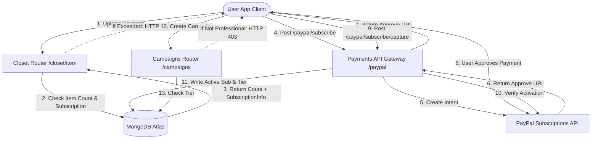

Hier is de vertaling van de DressApp-documentatie naar het Nederlands, met behoud van de opgegeven regels:

# DressApp Monetarisatie- & Factureringsengine

Dit document biedt een uitgebreid architecturaal overzicht, gebruikershandleiding en technologische diepgang van de monetarisatie, abonnementsfacturering en drielagenlimieten in DressApp.

---

## 1. Managementoverzicht & Waardepropositie

### Algemeen Overzicht
DressApp implementeert een drielagen-monetarisatiemodel, ontworpen om te passen bij verschillende gebruikerstypes:
1.  **Gratis Laag**:
    *   **Kosten**: $0 / maand (geen creditcard vereist).
    *   **Limieten**: Maximaal 50 kledingstukken en maximaal 10 dagelijkse AI-bewerkingen.
    *   **Functies**: Basis garderobe-organisatie, communityondersteuning. Beperkt van verkopen/verhuren op de marktplaats (alleen ruilen/doneren). Toegang tot Trend Scout en Campagnes is uitgeschakeld.
2.  **Manager Laag**:
    *   **Kosten**: $5 / maand of $50 / jaar.
    *   **Limieten**: Onbeperkt aantal kledingstukken en onbeperkt aantal dagelijkse AI-verzoeken.
    *   **Functies**: Marktplaatsopties (Verkopen, Ruilen, Verhuren, Doneren), Trend Scout, Scheduler & pushmeldingen, Prioritaire ondersteuning. Het aanmaken van campagnes is uitgeschakeld.
3.  **Professionele Laag**:
    *   **Kosten**: $10 / maand of $100 / jaar.
    *   **Limieten**: Onbeperkt aantal kledingstukken en onbeperkt aantal dagelijkse AI-verzoeken.
    *   **Functies**: Alle functies inbegrepen, toegewijde ondersteuning en volledige ondersteuning voor het aanmaken van advertentiecampagnes.

### Architecturale Stroom



---

## 2. Uitgebreide Gebruikershandleiding

### Visuele Interface Topologie
De gebruikersprofielpagina ([Profile.jsx](file:///C:/DressApp_AG/frontend/src/pages/Profile.jsx)) bevat de Abonnementenbeheer-widget onder de sectie **Abonnement & Limieten**, die het aantal items weergeeft (limiet van 0 tot 50 voor het Gratis plan), de status van de actieve planlaag en de volgende verlengingsdata.
De prijspagina ([Pricing.jsx](file:///C:/DressApp_AG/frontend/src/pages/Pricing.jsx)) toont kaarten die de Gratis, Manager en Professionele plannen vergelijken, evenals een gedetailleerde checklist met functies in een raster.

### Modus & Workflow Uitleg

#### A. Je Lidmaatschap Upgraden (Betaalde Stroom)
1.  **Upgrade Initiëren**: De gebruiker selecteert het gewenste plan (Manager of Professioneel) en de factureringsfrequentie (Maandelijks of Jaarlijks) en klikt op **Plan Upgraden**.
2.  **Bestellingsregistratie**: De client stuurt een `POST /paypal/subscribe` verzoek. De backend neemt contact op met PayPal, genereert een abonnements-ID en retourneert een `approve_url`.
3.  **Betalingsverwerking**: De clientbrowser wordt doorgestuurd naar de PayPal Sandbox afrekenpagina (of wordt afgehandeld via de Mock Atzmai/PayPal gateway). De gebruiker logt in en keurt de factureringsovereenkomst goed.
4.  **Omleiding & Vastlegging**: PayPal leidt de browser terug naar `/pricing?sub_status=success&token=SUBSCRIPTION_ID`.
5.  **Activering**: De client detecteert de zoekparameters, stuurt `POST /paypal/subscribe/capture/{subscription_id}`, en ververst de gebruikerssessie. De actieve planlaag wordt onmiddellijk bijgewerkt in de UI.

---

## 3. Technologische Stack & Diepgang van Mogelijkheden

### Gegevensschemadefinities
Het MongoDB-schema in [schemas.py](file:///C:/DressApp_AG/backend/app/models/schemas.py) bevat de factureringsstatus en actieve laag van de gebruiker:

```python
class SubscriptionInfo(BaseModel):
    is_active: bool = False
    plan_type: Literal["free", "monthly", "yearly"] = "free"
    tier: Literal["free", "manager", "professional"] = "free"
    paypal_subscription_id: str | None = None
    expires_at: str | None = None              # ISO timestamp
    cancelled_at: str | None = None            # ISO timestamp

class User(BaseDoc):
    # ... other profile documents ...
    subscription: SubscriptionInfo = Field(default_factory=SubscriptionInfo)
```

### API-Routering & Beveiligde Acties

#### Limiet voor Kledingkastitems ([closet.py](file:///C:/DressApp_AG/backend/app/api/v1/closet.py))
Tijdens het invoegen van items verifieert het systeem de limieten voor Gratis gebruikers:
```python
sub = user.get("subscription") or {}
is_active = sub.get("is_active", False)
plan_type = sub.get("plan_type", "free")
tier = sub.get("tier", "free")

user_tier = "free"
if is_active and plan_type != "free":
    user_tier = tier

if user_tier == "free":
    item_count = await db.closet_items.count_documents({"owner_id": user_id, "status": {"$ne": "deleted"}})
    if item_count >= 50:
        raise HTTPException(status_code=402, detail="Closet capacity limit (50 items) exceeded. Please upgrade.")
```

#### Limiet voor Dagelijkse AI-bewerkingen ([credit_manager.py](file:///C:/DressApp_AG/backend/app/services/credit_manager.py))
Voor gebruikers van de Gratis laag verhogen AI-bewerkingen een dagelijkse telling die wordt bijgehouden in `user.ai_configuration.daily_request_count`. Wanneer deze 10 bereikt, worden verzoeken geblokkeerd met HTTP 402.

#### Marktplaatsbeperking ([listings.py](file:///C:/DressApp_AG/backend/app/api/v1/listings.py))
Als een gebruiker zich in de Gratis laag bevindt, worden advertenties aangemaakt met het doel `"for_sale"` of `"rent"` geweigerd:
```python
if user_tier == "free" and listing.intent in ["for_sale", "rent"]:
    raise HTTPException(status_code=403, detail="Free plan users can only Swap or Donate garments. Upgrade to list for sale or rent.")
```

#### Campagnebeperking ([campaigns.py](file:///C:/DressApp_AG/backend/app/api/v1/campaigns.py))
Eindpunten voor het aanmaken van campagnes beperken acties, tenzij de actieve abonnementslaag Professioneel is:
```python
if user_tier != "professional":
    raise HTTPException(status_code=403, detail="Ad Campaign creation is only available on the Professional plan.")
