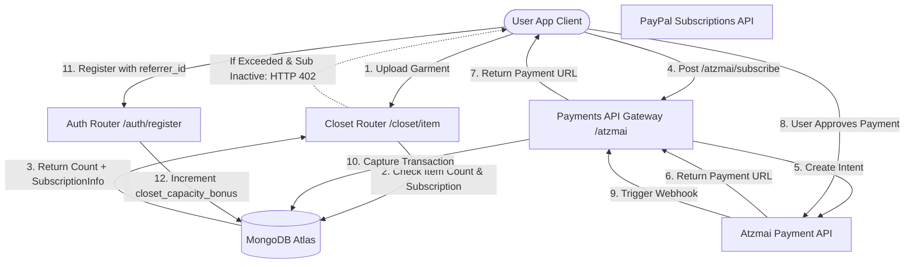

# DressApp Monetiserings- & Factureringsengine

Dit document biedt een uitgebreid architectonisch overzicht, een gebruikershandleiding en een diepgaande technologische analyse van de monetisering, abonnementsfacturering en virale groeicyclusmechanismen in DressApp.

---

## 1. Samenvatting & Waardecreatie

### Hoofdlijnenoverzicht
DressApp implementeert een hybride model van SaaS-Abonnementen en een prepaid gebruikskredietsysteem:
1. **Abonnementen (SaaS)**: Vaste tariefplannen (Free, Manager, Professional) die kledingkastcapaciteit, dagelijkse AI-stylingquota en geavanceerde functies (bijv. moderatie van advertentiecampagnes) bepalen.
2. **Prepaid Kredietpakketten (Dienstverlening)**: Gedetailleerde verbruiksgebaseerde credits voor geavanceerde AI-bewerkingen (bijv. vragen aan de Virtuele Stylist en fotosegmentatie). Deze credits maken gebruik van een verouderingssysteem om gratis en betaalde pools te onderscheiden.
3. **Virale Groeicyclus**: Een verwijzingsprogramma waarmee Free-gebruikers hun basiskledingkastcapaciteit organisch kunnen uitbreiden door uitnodigingslinks te delen.
4. **Gelokaliseerde betalingen (Atzmai Gateway)**: Ingebouwde ondersteuning voor Israëlische betalingen (Bit, lokale creditcards) in ILS/USD naast wereldwijde PayPal-betalingen.

### Architectonische Stroom



---

## 2. Abonnementen & Prijsstructuur

### Tariefplannen

| Plan | Price (Monthly) | Closet Capacity | AI Credits Allocation | Key Features |
| :--- | :--- | :--- | :--- | :--- |
| **Free Plan** | $0.00 / maand | Basis van 50 items | 10 gratis dagelijkse credits (vervallen na 30 dagen) | Basisorganisatie, communityondersteuning, verwijzingsuitbreidingen (+10 slots per registratie tot 1000 items) |
| **Manager (Pro)** | $4.99 / maand | Onbeperkt | Onbeperkt aantal dagelijkse bewerkingen | 14 dagen gratis proefperiode, initiële toewijzing van 50 credits, verkopen & verhuren op de marktplaats, Trend Scout, geplande meldingen |
| **Professional** | $9.99 / maand | Onbeperkt | Onbeperkt aantal dagelijkse bewerkingen | 30 dagen gratis proefperiode, initiële toewijzing van 300 credits, alle Manager-functies, ondersteuning voor het maken van advertentiecampagnes in de feed |

### Prepaid AI-kredietpakketten

Als gebruikers hun stylingcredits opgebruiken, kunnen ze extra pakketten aanschaffen om serviceonderbrekingen te voorkomen:

* **Pakket van 10 credits**: $1.99 / 10.00 ILS
* **Pakket van 25 credits**: $3.99 / 25.00 ILS
* **Pakket van 50 credits**: $7.99 / 50.00 ILS
* **Pakket van 100 credits**: $15.99 / 100.00 ILS
* **Aangepast opwaardeerbedrag**: Door de gebruiker opgegeven ILS-bedrag (minimale drempel van 5.00 ILS voor validatie van de Atzmai-gateway).

### Kredietverval & Verbruiksprioriteit (FIFO-logica)
* **Betaalde credits**: Gekocht via opwaardeerpakketten. Betaalde credits **vervallen nooit**.
* **Gratis credits**: Dagelijks verstrekt of via proefperiodetoewijzingen. Gratis credits **vervallen 30 dagen na aanmaak**.
* **Aftrekprioriteit**: Wanneer een AI-verzoek wordt gedaan, controleert en verbruikt de engine automatisch credits uit de **oudste vervallende gratis pakketten eerst**, voordat er betaalde credits worden aangesproken.

---

## 3. Gelokaliseerde betalingen & Facturering (Atzmai Gateway)

Voor accounts in Israël integreert DressApp met de **Atzmai-betalingsgateway** om lokale transacties in ILS (Shekels) of USD te verwerken:
1. **Betalingsmethoden**: Ondersteunt Bit mobiele betalingsomleidingslinks en reguliere Israëlische creditcards.
2. **Abonnement Automatische Incasso's**: Ondersteunt maandelijkse/jaarlijkse automatische incasso-instellingen voor terugkerende Pro- en Business-abonnementen.
3. **Webhook-verificatie**: Legt betalingscallbacks vast op `POST /api/v1/atzmai/webhook`, valideert overeenkomende records in de `atzmai_topups`-collectie en wijzigt de transactiestatus in `captured`.
4. **Geautomatiseerde PDF-boekhouding**: Na succesvolle vastlegging vraagt de backend de Atzmai-facturerings-API om officiële PDF-ontvangstbewijzen en facturen te genereren en te downloaden. Deze worden als e-mailbijlage rechtstreeks naar de koper verzonden.

---

## 4. Technische stack & diepgaande analyse van mogelijkheden

### Gegevensschemadefinities (Data Schema Definitions)

Het MongoDB-schema in [schemas.py](file:///C:/DressApp_AG/backend/app/models/schemas.py) houdt de abonnementsgegevens en kredietpakketten van gebruikers bij:

```python
class CreditBucket(BaseModel):
    amount: int
    type: Literal["free", "paid"]
    created_at: str  # ISO timestamp
    expires_at: str | None = None  # None means infinite (paid credits)

class SubscriptionInfo(BaseModel):
    is_active: bool = False
    plan_type: Literal["free", "monthly", "yearly"] = "free"
    tier: Literal["free", "manager", "professional"] = "free"
    stripe_subscription_id: str | None = None
    paypal_subscription_id: str | None = None
    atzmai_subscription_id: str | None = None
    expires_at: str | None = None
    cancelled_at: str | None = None

class User(BaseDoc):
    subscription: SubscriptionInfo = Field(default_factory=SubscriptionInfo)
    credit_buckets: List[CreditBucket] = Field(default_factory=list)
    closet_capacity_bonus: int = 0
```

### Handhaving van kledingkastlimiet ([closet.py](file:///C:/DressApp_AG/backend/app/api/v1/closet.py))
Tijdens het uploaden van items bewaakt het systeem de databaselimieten:
```python
capacity_limit = 50 + user.get("closet_capacity_bonus", 0)
if current_count >= capacity_limit and not user.get("subscription", {}).get("is_active", False):
    raise HTTPException(
        status_code=402,
        detail={
            "code": "closet_capacity_exceeded",
            "message": f"You have reached your free closet capacity of {capacity_limit} items. Upgrade to Manager or Professional to add more items."
        }
    )
```

### Kredietaftrekalgoritme ([credit.py](file:///C:/DressApp_AG/backend/app/models/credit.py))
Credits worden verbruikt op basis van een FIFO (first-in-first-out) prioriteitswachtrij:
```python
def spend_credits(buckets: List[CreditBucket], required_amount: int) -> Tuple[bool, List[dict]]:
    # Sort active buckets: 
    # Priority 0: Free expiring soonest
    # Priority 1: Free other
    # Priority 2: Paid (never expires)
    active_buckets = []
    for idx, b in enumerate(buckets):
        if b.type == "free" and b.expires_at and now > b.expires_at:
            continue
        priority = (0, b.expires_at) if b.type == "free" and b.expires_at else (1, b.created_at) if b.type == "free" else (2, b.created_at)
        active_buckets.append((priority, idx, b))
    
    active_buckets.sort(key=lambda x: x[0])
    # ... deduct required_amount from sorted list ...
```
