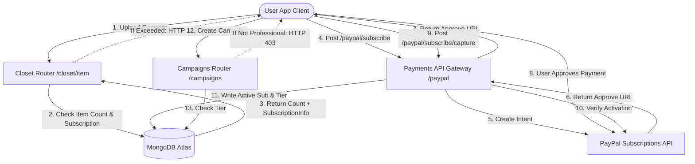

Aqui está a tradução da documentação do DressApp para o Português, seguindo todas as suas regras:

# Mecanismo de Monetização e Faturamento do DressApp

Este documento fornece uma visão geral arquitetônica abrangente, manual do usuário e análise aprofundada da tecnologia de monetização, faturamento de assinaturas e limites de três níveis no DressApp.

---

## 1. Resumo Executivo e Proposta de Valor

### Visão Geral de Alto Nível
O DressApp implementa um modelo de monetização de três níveis projetado para atender a diferentes arquétipos de usuários:
1.  **Nível Gratuito (Free Tier)**:
    *   **Custo**: $0 / mês (sem necessidade de cartão de crédito).
    *   **Limites**: Até 50 itens no guarda-roupa e até 10 operações diárias de IA.
    *   **Recursos**: Organização básica do guarda-roupa, suporte da comunidade. Restrito à venda/aluguel no marketplace (apenas troca/doação). O acesso ao Trend Scout e às Campanhas está desativado.
2.  **Nível Gerente (Manager Tier)**:
    *   **Custo**: $5 / mês ou $50 / ano.
    *   **Limites**: Itens ilimitados no guarda-roupa e solicitações ilimitadas de IA diárias.
    *   **Recursos**: Opções do Marketplace (Vender, Trocar, Alugar, Doar), Trend Scout, Agendador e notificações push, Suporte prioritário. A criação de Campanhas está desativada.
3.  **Nível Profissional (Professional Tier)**:
    *   **Custo**: $10 / mês ou $100 / ano.
    *   **Limites**: Itens ilimitados no guarda-roupa e solicitações ilimitadas de IA diárias.
    *   **Recursos**: Todos os recursos incluídos, suporte dedicado e suporte completo para criação de Campanhas Publicitárias.

### Fluxo Arquitetural



---

## 2. Manual Abrangente do Usuário

### Topologia da Interface Visual
A página de perfil do usuário ([Profile.jsx](file:///C:/DressApp_AG/frontend/src/pages/Profile.jsx)) hospeda o widget de Gerenciamento de Assinatura na seção **Assinatura e Limites**, exibindo contagens de itens (limite de 0 a 50 para o plano Gratuito), status do nível do plano ativo e próximas datas de renovação.
A página de preços ([Pricing.jsx](file:///C:/DressApp_AG/frontend/src/pages/Pricing.jsx)) exibe cartões comparando os planos Gratuito, Gerente e Profissional, bem como uma lista de verificação detalhada da grade de recursos.

### Passo a Passo de Modos e Fluxos de Trabalho

#### A. Atualizando sua Assinatura (Fluxo Pago)
1.  **Iniciando a Atualização**: O usuário seleciona o plano desejado (Gerente ou Profissional) e a frequência de cobrança (Mensal ou Anual) e clica em **Atualizar Plano**.
2.  **Registro do Pedido**: O cliente emite uma solicitação `POST /paypal/subscribe`. O backend entra em contato com o PayPal, gera um ID de assinatura e retorna uma `approve_url`.
3.  **Processamento do Pagamento**: O navegador do cliente redireciona para a página de checkout do PayPal Sandbox (ou é tratado via gateway Mock Atzmai/PayPal). O usuário faz login e aprova o contrato de faturamento.
4.  **Redirecionamento e Captura**: O PayPal redireciona o navegador de volta para `/pricing?sub_status=success&token=SUBSCRIPTION_ID`.
5.  **Ativação**: O cliente detecta os parâmetros de pesquisa, emite `POST /paypal/subscribe/capture/{subscription_id}` e atualiza a sessão do usuário. O nível do plano ativo é atualizado imediatamente na UI.

---

## 3. Análise Aprofundada da Pilha de Tecnologia e Capacidades

### Definições de Esquema de Dados
O esquema MongoDB em [schemas.py](file:///C:/DressApp_AG/backend/app/models/schemas.py) armazena o status de faturamento e o nível ativo do usuário:

```python
class SubscriptionInfo(BaseModel):
    is_active: bool = False
    plan_type: Literal["free", "monthly", "yearly"] = "free"
    tier: Literal["free", "manager", "professional"] = "free"
    paypal_subscription_id: str | None = None
    expires_at: str | None = None              # ISO timestamp
    cancelled_at: str | None = None            # ISO timestamp

class User(BaseDoc):
    # ... other profile documents ...
    subscription: SubscriptionInfo = Field(default_factory=SubscriptionInfo)
```

### Roteamento da API e Ações Restritas

#### Limite de Itens do Guarda-Roupa ([closet.py](file:///C:/DressApp_AG/backend/app/api/v1/closet.py))
Durante a inserção de itens, o sistema verifica os limites para usuários Grátis:
```python
sub = user.get("subscription") or {}
is_active = sub.get("is_active", False)
plan_type = sub.get("plan_type", "free")
tier = sub.get("tier", "free")

user_tier = "free"
if is_active and plan_type != "free":
    user_tier = tier

if user_tier == "free":
    item_count = await db.closet_items.count_documents({"owner_id": user_id, "status": {"$ne": "deleted"}})
    if item_count >= 50:
        raise HTTPException(status_code=402, detail="Closet capacity limit (50 items) exceeded. Please upgrade.")
```

#### Limite de Operações Diárias de IA ([credit_manager.py](file:///C:/DressApp_AG/backend/app/services/credit_manager.py))
Para usuários do nível Gratuito, as operações de IA incrementam uma contagem diária rastreada em `user.ai_configuration.daily_request_count`. Quando atinge 10, as solicitações são bloqueadas com HTTP 402.

#### Restrição do Marketplace ([listings.py](file:///C:/DressApp_AG/backend/app/api/v1/listings.py))
Se um usuário está no nível Gratuito, listagens criadas com a intenção `"for_sale"` ou `"rent"` são rejeitadas:
```python
if user_tier == "free" and listing.intent in ["for_sale", "rent"]:
    raise HTTPException(status_code=403, detail="Free plan users can only Swap or Donate garments. Upgrade to list for sale or rent.")
```

#### Restrição de Campanhas ([campaigns.py](file:///C:/DressApp_AG/backend/app/api/v1/campaigns.py))
Os endpoints de criação de Campanhas restringem ações, a menos que o nível de assinatura ativa seja Profissional:
```python
if user_tier != "professional":
    raise HTTPException(status_code=403, detail="Ad Campaign creation is only available on the Professional plan.")
