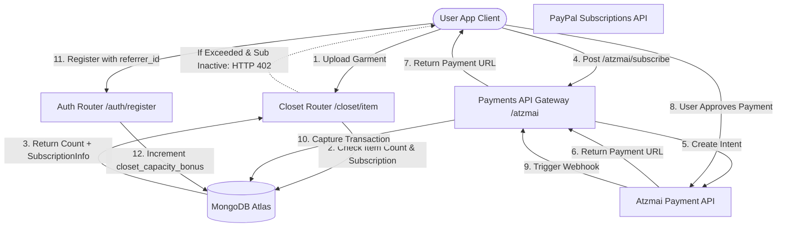

# Motor de monetização e cobrança do DressApp

Este documento fornece uma visão geral arquitetônica abrangente, manual do usuário e análise tecnológica detalhada da monetização, cobrança de assinaturas e mecânicas do loop de crescimento viral no DressApp.

---

## 1. Resumo executivo e proposta de valor

### Visão geral de alto nível
O DressApp implementa um modelo híbrido de assinatura SaaS e sistema de créditos de utilidade pré-pagos:
1. **Planos de assinatura (SaaS)**: Tarifas planas (Free, Manager, Professional) que controlam a capacidade de armazenamento do guarda-roupa, cotas diárias de estilização por IA e funções avançadas (por exemplo, moderação de campanhas publicitárias).
2. **Pacotes de créditos pré-pagos (Utilidade)**: Créditos granulares baseados no consumo para operações avançadas de IA (por exemplo, consultas ao Estilista Virtual e segmentação de fotos). Esses créditos utilizam um sistema de expiração para diferenciar os saldos gratuitos e pagos.
3. **Loop de crescimento viral**: Um programa de indicação que permite aos usuários do plano Free expandir sua capacidade básica de guarda-roupa de forma orgânica, compartilhando links de convite.
4. **Pagamentos localizados (Gateway Atzmai)**: Suporte nativo para pagamentos israelenses (Bit, cartões de crédito locais) em ILS/USD, além de pagamentos globais via PayPal.

### Fluxo de arquitetura



---

## 2. Planos de assinatura e topologia de preços

### Planos de preços

| Plan | Price (Monthly) | Closet Capacity | AI Credits Allocation | Key Features |
| :--- | :--- | :--- | :--- | :--- |
| **Free Plan** | $0.00 / mês | Limite básico de 50 itens | 10 créditos gratuitos diários (expiram em 30 dias) | Organização básica, suporte comunitário, expansões de indicação (+10 slots por cadastro até 1000 itens) |
| **Manager (Pro)** | $4.99 / mês | Ilimitado | Operações diárias ilimitadas | Avaliação gratuita de 14 dias, alocação inicial de 50 créditos, venda e aluguel no marketplace, Trend Scout, notificações programadas |
| **Professional** | $9.99 / mês | Ilimitado | Operações diárias ilimitadas | Avaliação gratuita de 30 dias, alocação inicial de 300 créditos, todos os recursos do Manager, suporte para criar campanhas publicitárias no feed |

### Pacotes de créditos de IA pré-pagos

Se os usuários esgotarem seus créditos de estilização, eles poderão comprar pacotes adicionais para evitar interrupções no serviço:

* **Pacote de 10 créditos**: $1.99 / 10.00 ILS
* **Pacote de 25 créditos**: $3.99 / 25.00 ILS
* **Pacote de 50 créditos**: $7.99 / 50.00 ILS
* **Pacote de 100 créditos**: $15.99 / 100.00 ILS
* **Valor de recarga personalizado**: Valor em ILS especificado pelo usuário (limite mínimo de 5.00 ILS para validação do gateway Atzmai).

### Expiração de créditos e prioridade de consumo (Lógica FIFO)
* **Créditos pagos**: Adquiridos através de pacotes de recarga. Os créditos pagos **nunca expiram**.
* **Créditos gratuitos**: Concedidos diariamente ou através de alocações de avaliação. Os créditos gratuitos **expiram 30 dias após a criação**.
* **Prioridade de dedução**: Quando uma solicitação de IA é feita, o mecanismo verifica e consome automaticamente os créditos dos **pacotes gratuitos mais antigos a expirar primeiro**, antes de retirar dos créditos pagos.

---

## 3. Pagamentos localizados e faturamento (Gateway Atzmai)

Para contas sediadas em Israel, o DressApp se integra ao **gateway de pagamentos Atzmai** para processar transações locais em ILS (Shekels) ou USD:
1. **Métodos de pagamento**: Suporta links de redirecionamento para pagamentos móveis via Bit e cartões de crédito israelenses comuns.
2. **Débitos diretos de assinatura**: Suporta configurações de débito direto mensal/anual para cobranças recorrentes dos planos Pro e Business.
3. **Verificação de Webhook**: Captura retornos de chamada (callbacks) de pagamento em `POST /api/v1/atzmai/webhook`, valida registros correspondentes na coleção `atzmai_topups` e altera o estado da transação para `captured`.
4. **Contabilidade em PDF automatizada**: Após a captura bem-sucedida, o backend consulta a API de faturamento do Atzmai para gerar e baixar PDFs oficiais de recibos e faturas. Eles são enviados como anexos de e-mail diretamente ao comprador.

---

## 4. Stack de tecnologia e análise profunda de recursos

### Definições de esquema de dados (Data Schema Definitions)

O esquema do MongoDB em [schemas.py](file:///C:/DressApp_AG/backend/app/models/schemas.py) rastreia as assinaturas dos usuários e os pacotes de créditos:

```python
class CreditBucket(BaseModel):
    amount: int
    type: Literal["free", "paid"]
    created_at: str  # ISO timestamp
    expires_at: str | None = None  # None means infinite (paid credits)

class SubscriptionInfo(BaseModel):
    is_active: bool = False
    plan_type: Literal["free", "monthly", "yearly"] = "free"
    tier: Literal["free", "manager", "professional"] = "free"
    stripe_subscription_id: str | None = None
    paypal_subscription_id: str | None = None
    atzmai_subscription_id: str | None = None
    expires_at: str | None = None
    cancelled_at: str | None = None

class User(BaseDoc):
    subscription: SubscriptionInfo = Field(default_factory=SubscriptionInfo)
    credit_buckets: List[CreditBucket] = Field(default_factory=list)
    closet_capacity_bonus: int = 0
```

### Execução de limites de guarda-roupa ([closet.py](file:///C:/DressApp_AG/backend/app/api/v1/closet.py))
Durante o envio de peças, o sistema protege os limites do banco de dados:
```python
capacity_limit = 50 + user.get("closet_capacity_bonus", 0)
if current_count >= capacity_limit and not user.get("subscription", {}).get("is_active", False):
    raise HTTPException(
        status_code=402,
        detail={
            "code": "closet_capacity_exceeded",
            "message": f"You have reached your free closet capacity of {capacity_limit} items. Upgrade to Manager or Professional to add more items."
        }
    )
```

### Algoritmo de dedução de créditos ([credit.py](file:///C:/DressApp_AG/backend/app/models/credit.py))
Os créditos são consumidos utilizando a fila de prioridades FIFO (first-in-first-out):
```python
def spend_credits(buckets: List[CreditBucket], required_amount: int) -> Tuple[bool, List[dict]]:
    # Sort active buckets: 
    # Priority 0: Free expiring soonest
    # Priority 1: Free other
    # Priority 2: Paid (never expires)
    active_buckets = []
    for idx, b in enumerate(buckets):
        if b.type == "free" and b.expires_at and now > b.expires_at:
            continue
        priority = (0, b.expires_at) if b.type == "free" and b.expires_at else (1, b.created_at) if b.type == "free" else (2, b.created_at)
        active_buckets.append((priority, idx, b))
    
    active_buckets.sort(key=lambda x: x[0])
    # ... deduct required_amount from sorted list ...
```
