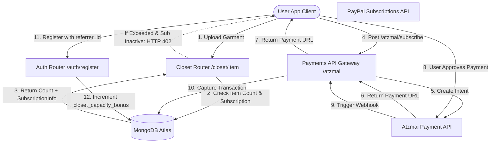

# Механизм монетизации и выставления счетов DressApp

Этот документ представляет собой всесторонний архитектурный обзор, руководство пользователя и глубокий технический анализ механизмов монетизации, биллинга подписок и вирусных циклов роста в DressApp.

---

## 1. Резюме и ценностное предложение

### Общее описание
DressApp использует гибридную модель SaaS-подписок и предоплаченных кредитов:
1. **Тарифные планы подписки (SaaS)**: Тарифы с фиксированной оплатой (Free, Manager, Professional), которые определяют емкость хранения гардероба, ежедневные лимиты на стилизацию ИИ и доступ к расширенным функциям (например, модерация рекламных кампаний).
2. **Предоплаченные пакеты кредитов (Потребление)**: Детализированные кредиты на основе фактического использования для расширенных операций ИИ (например, запросы к Виртуальному стилисту и сегментация фотографий). Эти кредиты используют систему старения для разделения бесплатных и платных пакетов.
3. **Вирусный цикл роста**: Реферальная программа, позволяющая пользователям бесплатного тарифа Free органически расширять базовую емкость своего гардероба, делясь ссылками-приглашениями.
4. **Локальные платежи (Шлюз Atzmai)**: Встроенная поддержка платежей в Израиле (Bit, местные кредитные карты) в ILS/USD наряду с международными платежами PayPal.

### Архитектурный поток



---

## 2. Тарифные планы подписки и структура цен

### Тарифы

| Plan | Price (Monthly) | Closet Capacity | AI Credits Allocation | Key Features |
| :--- | :--- | :--- | :--- | :--- |
| **Free Plan** | 0,00 $ / месяц | Базовый лимит: 50 вещей | 10 бесплатных ежедневных кредитов (срок действия 30 дней) | Базовая организация, поддержка сообщества, реферальное расширение (+10 слотов за каждую регистрацию, максимум до 1000 вещей) |
| **Manager (Pro)** | 4,99 $ / месяц | Безлимитно | Безлимитные ежедневные операции | 14-дневный бесплатный пробный период, начальный пакет из 50 кредитов, продажа и аренда на маркетплейсе, Trend Scout, запланированные уведомления |
| **Professional** | 9,99 $ / месяц | Безлимитно | Безлимитные ежедневные операции | 30-дневный бесплатный пробный период, начальный пакет из 300 кредитов, все функции тарифа Manager, поддержка создания рекламных кампаний в ленте |

### Предоплаченные пакеты кредитов ИИ

Если у пользователей заканчиваются кредиты на стилизацию, они могут приобрести дополнительные пакеты, чтобы избежать прерывания обслуживания:

* **Пакет из 10 кредитов**: 1,99 $ / 10,00 ILS
* **Пакет из 25 кредитов**: 3,99 $ / 25,00 ILS
* **Пакет из 50 кредитов**: 7,99 $ / 50,00 ILS
* **Пакет из 100 кредитов**: 15,99 $ / 100,00 ILS
* **Произвольная сумма пополнения**: Указанная пользователем сумма в ILS (минимальный порог 5,00 ILS для валидации шлюза Atzmai).

### Истечение срока действия кредитов и приоритет списания (Логика FIFO)
* **Платные кредиты**: Приобретаются через пакеты пополнения баланса. Платные кредиты **никогда не истекают**.
* **Бесплатные кредиты**: Начисляются ежедневно или выдаются в рамках пробных периодов. Бесплатные кредиты **истекают через 30 дней после создания**.
* **Приоритет списания**: При отправке запроса ИИ система автоматически проверяет и списывает кредиты из **наиболее старых бесплатных пакетов с истекающим сроком действия в первую очередь**, прежде чем переходить к списанию платных кредитов.

---

## 3. Локальные платежи и выставление счетов (Шлюз Atzmai)

Для учетных записей, зарегистрированных в Израиле, DressApp интегрируется с **платежным шлюзом Atzmai** для обработки местных транзакций в ILS (шекелях) или USD:
1. **Способы оплаты**: Поддержка ссылок перенаправления на оплату через мобильное приложение Bit и обычных израильских кредитных карт.
2. **Прямое списание средств**: Поддержка ежемесячного/ежегодного автоплатежа для регулярной оплаты подписок Pro и Business.
3. **Webhook-верификация**: Перехватывает колбэки платежей по адресу `POST /api/v1/atzmai/webhook`, сверяет записи в коллекции `atzmai_topups` и меняет статус транзакции на `captured`.
4. **Автоматический документооборот в PDF**: После успешного подтверждения транзакции бэкенд запрашивает биллинговый API Atzmai для генерации и скачивания официальных PDF-файлов квитанций и счетов-фактур. Они отправляются покупателю напрямую в виде вложений к электронному письму.

---

## 4. Технологический стек и детальный разбор кода

### Определение схем данных (Data Schema Definitions)

Схема MongoDB в [schemas.py](file:///C:/DressApp_AG/backend/app/models/schemas.py) отслеживает подписки пользователей и пакеты кредитов:

```python
class CreditBucket(BaseModel):
    amount: int
    type: Literal["free", "paid"]
    created_at: str  # ISO timestamp
    expires_at: str | None = None  # None means infinite (paid credits)

class SubscriptionInfo(BaseModel):
    is_active: bool = False
    plan_type: Literal["free", "monthly", "yearly"] = "free"
    tier: Literal["free", "manager", "professional"] = "free"
    stripe_subscription_id: str | None = None
    paypal_subscription_id: str | None = None
    atzmai_subscription_id: str | None = None
    expires_at: str | None = None
    cancelled_at: str | None = None

class User(BaseDoc):
    subscription: SubscriptionInfo = Field(default_factory=SubscriptionInfo)
    credit_buckets: List[CreditBucket] = Field(default_factory=list)
    closet_capacity_bonus: int = 0
```

### Контроль ограничений емкости гардероба ([closet.py](file:///C:/DressApp_AG/backend/app/api/v1/closet.py))
При загрузке вещей система контролирует соблюдение лимитов базы данных:
```python
capacity_limit = 50 + user.get("closet_capacity_bonus", 0)
if current_count >= capacity_limit and not user.get("subscription", {}).get("is_active", False):
    raise HTTPException(
        status_code=402,
        detail={
            "code": "closet_capacity_exceeded",
            "message": f"You have reached your free closet capacity of {capacity_limit} items. Upgrade to Manager or Professional to add more items."
        }
    )
```

### Алгоритм списания кредитов ([credit.py](file:///C:/DressApp_AG/backend/app/models/credit.py))
Кредиты списываются по принципу FIFO (первым пришел — первым ушел) с использованием приоритетной очереди:
```python
def spend_credits(buckets: List[CreditBucket], required_amount: int) -> Tuple[bool, List[dict]]:
    # Sort active buckets: 
    # Priority 0: Free expiring soonest
    # Priority 1: Free other
    # Priority 2: Paid (never expires)
    active_buckets = []
    for idx, b in enumerate(buckets):
        if b.type == "free" and b.expires_at and now > b.expires_at:
            continue
        priority = (0, b.expires_at) if b.type == "free" and b.expires_at else (1, b.created_at) if b.type == "free" else (2, b.created_at)
        active_buckets.append((priority, idx, b))
    
    active_buckets.sort(key=lambda x: x[0])
    # ... deduct required_amount from sorted list ...
```
