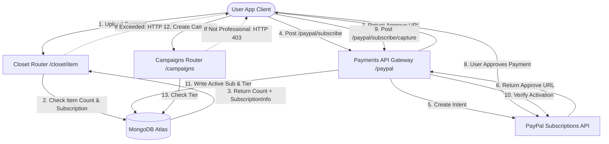

Вот перевод документации DressApp на русский язык:

# Движок монетизации и биллинга DressApp

Этот документ предоставляет подробный архитектурный обзор, руководство пользователя и углубленный технический анализ системы монетизации, биллинга подписок и трехуровневых лимитов в DressApp.

---

## 1. Краткое изложение и ценностное предложение

### Общий обзор
DressApp реализует трехуровневую модель монетизации, разработанную для разных архетипов пользователей:
1.  **Бесплатный уровень**:
    *   **Стоимость**: 0 $ / месяц (кредитная карта не требуется).
    *   **Лимиты**: До 50 предметов гардероба и до 10 ежедневных AI-операций.
    *   **Функции**: Базовая организация гардероба, поддержка сообщества. Ограниченная возможность продавать/сдавать в аренду на торговой площадке (только обмен/пожертвование). Доступ к Trend Scout и Кампаниям отключен.
2.  **Уровень «Менеджер»**:
    *   **Стоимость**: 5 $ / месяц или 50 $ / год.
    *   **Лимиты**: Неограниченное количество предметов гардероба и неограниченное количество ежедневных AI-запросов.
    *   **Функции**: Опции торговой площадки (Продажа, Обмен, Аренда, Пожертвование), Trend Scout, Планировщик и push-уведомления, Приоритетная поддержка. Создание кампаний отключено.
3.  **Уровень «Профессионал»**:
    *   **Стоимость**: 10 $ / месяц или 100 $ / год.
    *   **Лимиты**: Неограниченное количество предметов гардероба и неограниченное количество ежедневных AI-запросов.
    *   **Функции**: Все включенные функции, выделенная поддержка и полная поддержка создания рекламных кампаний.

### Схема архитектуры



---

## 2. Подробное руководство пользователя

### Топология визуального интерфейса
Страница профиля пользователя ([Profile.jsx](file:///C:/DressApp_AG/frontend/src/pages/Profile.jsx)) содержит виджет управления подпиской в разделе **«Подписка и лимиты»**, отображая количество предметов (лимит от 0 до 50 для бесплатного плана), статус активного уровня плана и даты следующего продления.
Страница с ценами ([Pricing.jsx](file:///C:/DressApp_AG/frontend/src/pages/Pricing.jsx)) отображает карточки, сравнивающие планы «Бесплатный», «Менеджер» и «Профессионал», а также подробный контрольный список функций в виде сетки.

### Обзор режимов и рабочих процессов

#### A. Обновление членства (Платный процесс)
1.  **Инициирование обновления**: Пользователь выбирает желаемый план («Менеджер» или «Профессионал») и частоту выставления счетов (Ежемесячно или Ежегодно) и нажимает **«Обновить план»**.
2.  **Регистрация заказа**: Клиент отправляет запрос `POST /paypal/subscribe`. Бэкенд связывается с PayPal, генерирует ID подписки и возвращает `approve_url`.
3.  **Обработка платежа**: Браузер клиента перенаправляется на страницу оформления заказа PayPal Sandbox (или обрабатывается через шлюз Mock Atzmai/PayPal). Пользователь входит в систему и подтверждает платежное соглашение.
4.  **Перенаправление и захват**: PayPal перенаправляет браузер обратно на `/pricing?sub_status=success&token=SUBSCRIPTION_ID`.
5.  **Активация**: Клиент обнаруживает параметры поиска, отправляет `POST /paypal/subscribe/capture/{subscription_id}` и обновляет пользовательскую сессию. Активный уровень плана немедленно обновляется в пользовательском интерфейсе.

---

## 3. Технологический стек и углубленный анализ возможностей

### Определения схем данных
Схема MongoDB в [schemas.py](file:///C:/DressApp_AG/backend/app/models/schemas.py) содержит информацию о статусе биллинга пользователя и активном уровне:

```python
class SubscriptionInfo(BaseModel):
    is_active: bool = False
    plan_type: Literal["free", "monthly", "yearly"] = "free"
    tier: Literal["free", "manager", "professional"] = "free"
    paypal_subscription_id: str | None = None
    expires_at: str | None = None              # ISO timestamp
    cancelled_at: str | None = None            # ISO timestamp

class User(BaseDoc):
    # ... other profile documents ...
    subscription: SubscriptionInfo = Field(default_factory=SubscriptionInfo)
```

### Маршрутизация API и ограниченные действия

#### Лимит предметов гардероба ([closet.py](file:///C:/DressApp_AG/backend/app/api/v1/closet.py))
При добавлении предмета система проверяет лимиты для бесплатных пользователей:
```python
sub = user.get("subscription") or {}
is_active = sub.get("is_active", False)
plan_type = sub.get("plan_type", "free")
tier = sub.get("tier", "free")

user_tier = "free"
if is_active and plan_type != "free":
    user_tier = tier

if user_tier == "free":
    item_count = await db.closet_items.count_documents({"owner_id": user_id, "status": {"$ne": "deleted"}})
    if item_count >= 50:
        raise HTTPException(status_code=402, detail="Closet capacity limit (50 items) exceeded. Please upgrade.")
```

#### Лимит ежедневных AI-операций ([credit_manager.py](file:///C:/DressApp_AG/backend/app/services/credit_manager.py))
Для пользователей бесплатного уровня AI-операции увеличивают ежедневный счетчик, отслеживаемый в `user.ai_configuration.daily_request_count`. Когда он достигает 10, запросы блокируются с HTTP 402.

#### Ограничения на торговой площадке ([listings.py](file:///C:/DressApp_AG/backend/app/api/v1/listings.py))
Если пользователь находится на бесплатном уровне, объявления, созданные с целью `"for_sale"` (для продажи) или `"rent"` (для аренды), отклоняются:
```python
if user_tier == "free" and listing.intent in ["for_sale", "rent"]:
    raise HTTPException(status_code=403, detail="Free plan users can only Swap or Donate garments. Upgrade to list for sale or rent.")
```

#### Ограничения для кампаний ([campaigns.py](file:///C:/DressApp_AG/backend/app/api/v1/campaigns.py))
Конечные точки для создания кампаний ограничивают действия, если активный уровень подписки не является «Профессиональным»:
```python
if user_tier != "professional":
    raise HTTPException(status_code=403, detail="Ad Campaign creation is only available on the Professional plan.")
