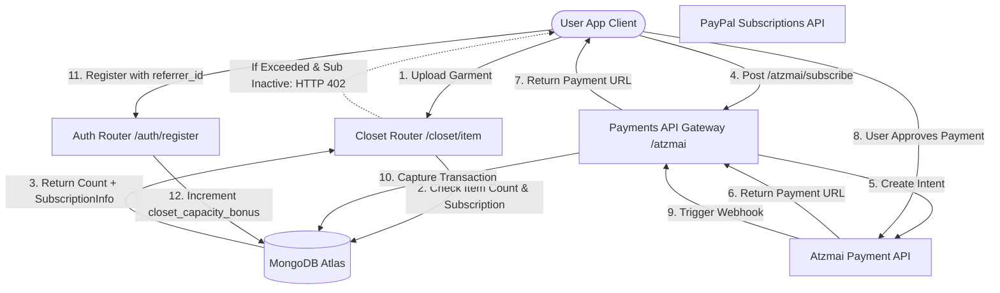

# DressApp 商业化与账单引擎

本文档对 DressApp 中的商业化变现、订阅账单 and 病毒式增长循环机制提供了全面的架构概述、用户手册和技术深度剖析。

---

## 1. 执行摘要与价值主张

### 高层概述
DressApp 实现了混合 SaaS 订阅和预付费实用信用度模型：
1. **订阅方案（SaaS）**：固定费率方案（Free、Manager、Professional）用以管理衣橱存储容量、每日 AI 穿搭额度以及高级功能（例如广告活动审核）。
2. **预付费信用度桶（实用度）**：针对高级 AI 操作（例如虚拟搭配师查询和照片分割）的细粒度消费型信用度。这些信用度使用到期管理系统来区分免费和付费池。
3. **病毒式增长循环**：一个推荐计划，允许 Free 方案用户通过分享邀请链接来有机扩展其基础衣橱容量。
4. **本地化支付（Atzmai 网关）**：原生支持以 ILS/USD 进行以色列本地支付（Bit、本地信用卡），同时支持全球 PayPal 支付。

### 架构流程



---

## 2. 订阅方案与定价拓扑

### 定价方案

| Plan | Price (Monthly) | Closet Capacity | AI Credits Allocation | Key Features |
| :--- | :--- | :--- | :--- | :--- |
| **Free Plan** | 每月 $0.00 | 基础 50 件物品 | 每日 10 免费信用度（30 天后过期） | 基础整理、社区支持、推荐扩展（每次注册 +10 插槽，最高 1000 件物品） |
| **Manager (Pro)** | 每月 $4.99 | 无上限 | 每日操作无上限 | 14 天免费试用、50 信用度初始分配、市场出售与出租、Trend Scout、定时通知 |
| **Professional** | 每月 $9.99 | 无上限 | 每日操作无上限 | 30 天免费试用、300 信用度初始分配、所有 Manager 功能、支持在信息流中创建广告活动 |

### 预付费 AI 信用度包

如果用户耗尽了其穿搭信用度，可以购买额外的充值包以避免服务中断：

* **10 信用度包**：$1.99 / 10.00 ILS
* **25 信用度包**：$3.99 / 25.00 ILS
* **50 信用度包**：$7.99 / 50.00 ILS
* **100 信用度包**：$15.99 / 100.00 ILS
* **自定义充值金额**：用户指定的 ILS 金额（Atzmai 网关验证的最低阈值为 5.00 ILS）。

### 信用度到期与消耗优先级（FIFO 逻辑）
* **付费信用度**：通过充值包购买。付费信用度**永不过期**。
* **免费信用度**：每日授予或通过试用分配获得。免费信用度**自创建起 30 天后过期**。
* **扣除优先级**：当发起 AI 请求时，引擎在动用付费信用度之前，会首先自动检查并消耗**最先过期的免费信用度桶中的信用度**。

---

## 3. 本地化支付与开票（Atzmai 网关）

对于总部位于以色列的账户，DressApp 与 **Atzmai 支付网关**集成，以处理 ILS（谢克尔）或 USD 的本地交易：
1. **支付方式**：支持 Bit 移动结账重定向链接和常规以色列信用卡。
2. **订阅直接借记**：支持为周期性 Pro 和 Business 订阅设置每月/年度直接借记（自动扣款）。
3. **Webhook 验证**：在 `POST /api/v1/atzmai/webhook` 捕获支付回调，验证 `atzmai_topups` 集合中匹配的记录，并将交易状态变更为 `captured`。
4. **自动化 PDF 记账**：成功捕获后，后端将查询 Atzmai 计费 API 以生成并下载官方收据和发票 PDF。这些将作为电子邮件附件直接发送给买家。

---

## 4. 技术栈与功能深度剖析

### 数据架构定义 (Data Schema Definitions)

在 [schemas.py](file:///C:/DressApp_AG/backend/app/models/schemas.py) 中的 MongoDB 架构跟踪用户订阅与信用度桶：

```python
class CreditBucket(BaseModel):
    amount: int
    type: Literal["free", "paid"]
    created_at: str  # ISO timestamp
    expires_at: str | None = None  # None means infinite (paid credits)

class SubscriptionInfo(BaseModel):
    is_active: bool = False
    plan_type: Literal["free", "monthly", "yearly"] = "free"
    tier: Literal["free", "manager", "professional"] = "free"
    stripe_subscription_id: str | None = None
    paypal_subscription_id: str | None = None
    atzmai_subscription_id: str | None = None
    expires_at: str | None = None
    cancelled_at: str | None = None

class User(BaseDoc):
    subscription: SubscriptionInfo = Field(default_factory=SubscriptionInfo)
    credit_buckets: List[CreditBucket] = Field(default_factory=list)
    closet_capacity_bonus: int = 0
```

### 衣橱容量限制强制执行 ([closet.py](file:///C:/DressApp_AG/backend/app/api/v1/closet.py))
在物品上传期间，系统会保护数据库限制：
```python
capacity_limit = 50 + user.get("closet_capacity_bonus", 0)
if current_count >= capacity_limit and not user.get("subscription", {}).get("is_active", False):
    raise HTTPException(
        status_code=402,
        detail={
            "code": "closet_capacity_exceeded",
            "message": f"You have reached your free closet capacity of {capacity_limit} items. Upgrade to Manager or Professional to add more items."
        }
    )
```

### 信用度扣除算法 ([credit.py](file:///C:/DressApp_AG/backend/app/models/credit.py))
信用度会使用 FIFO（先进先出）优先级队列进行消耗：
```python
def spend_credits(buckets: List[CreditBucket], required_amount: int) -> Tuple[bool, List[dict]]:
    # Sort active buckets: 
    # Priority 0: Free expiring soonest
    # Priority 1: Free other
    # Priority 2: Paid (never expires)
    active_buckets = []
    for idx, b in enumerate(buckets):
        if b.type == "free" and b.expires_at and now > b.expires_at:
            continue
        priority = (0, b.expires_at) if b.type == "free" and b.expires_at else (1, b.created_at) if b.type == "free" else (2, b.created_at)
        active_buckets.append((priority, idx, b))
    
    active_buckets.sort(key=lambda x: x[0])
    # ... deduct required_amount from sorted list ...
```
