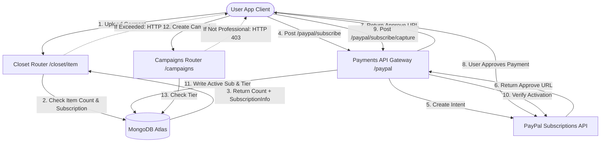

# DressApp 变现与计费引擎

本文档提供了 DressApp 变现、订阅计费和三层级限制的全面架构概述、用户手册和技术深度解析。

---

## 1. 执行摘要与价值主张

### 高级概述
DressApp 实现了三层级变现模型，旨在适应不同的用户原型：
1.  **免费层级 (Free Tier)**：
    *   **费用**：0 美元/月（无需信用卡）。
    *   **限制**：最多 50 件衣物和每天最多 10 次 AI 操作。
    *   **功能**：基本衣橱整理、社区支持。限制在市场上进行销售/租赁（仅限交换/捐赠）。禁用 Trend Scout 和 Campaigns 访问。
2.  **管理层级 (Manager Tier)**：
    *   **费用**：5 美元/月 或 50 美元/年。
    *   **限制**：无限量衣物和无限量每日 AI 请求。
    *   **功能**：市场选项（销售、交换、租赁、捐赠）、Trend Scout、日程安排器和推送通知、优先支持。禁用 Campaigns 创建。
3.  **专业层级 (Professional Tier)**：
    *   **费用**：10 美元/月 或 100 美元/年。
    *   **限制**：无限量衣物和无限量每日 AI 请求。
    *   **功能**：包含所有功能、专属支持以及完整的广告活动 (Ad Campaigns) 创建支持。

### 架构流程



---

## 2. 综合用户手册

### 可视化界面拓扑
用户个人资料页面 ([Profile.jsx](file:///C:/DressApp_AG/frontend/src/pages/Profile.jsx)) 在“**Subscription & Limits**”部分托管订阅管理小部件，显示物品数量（免费计划限制 0 到 50 件）、活动计划层级状态和下一次续订日期。
定价页面 ([Pricing.jsx](file:///C:/DressApp_AG/frontend/src/pages/Pricing.jsx)) 显示了比较免费、管理和专业计划的卡片，以及详细的功能网格清单。

### 模式与工作流演练

#### A. 升级您的会员资格（付费流程）
1.  **发起升级**：用户选择所需的计划（管理或专业）和计费频率（按月或按年），然后点击“**升级计划 (Upgrade Plan)**”。
2.  **订单注册**：客户端发出 `POST /paypal/subscribe` 请求。后端联系 PayPal，生成订阅 ID，并返回一个 `approve_url`。
3.  **支付处理**：客户端浏览器重定向到 PayPal Sandbox 结账页面（或通过 Mock Atzmai/PayPal 网关处理）。用户登录并批准计费协议。
4.  **重定向与捕获**：PayPal 将浏览器重定向回 `/pricing?sub_status=success&token=SUBSCRIPTION_ID`。
5.  **激活**：客户端检测搜索参数，发出 `POST /paypal/subscribe/capture/{subscription_id}`，并刷新用户会话。活动计划层级在 UI 中立即更新。

---

## 3. 技术栈与能力深度解析

### 数据 Schema 定义
[schemas.py](file:///C:/DressApp_AG/backend/app/models/schemas.py) 中的 MongoDB schema 存储了用户的计费状态和活动层级：

```python
class SubscriptionInfo(BaseModel):
    is_active: bool = False
    plan_type: Literal["free", "monthly", "yearly"] = "free"
    tier: Literal["free", "manager", "professional"] = "free"
    paypal_subscription_id: str | None = None
    expires_at: str | None = None              # ISO timestamp
    cancelled_at: str | None = None            # ISO timestamp

class User(BaseDoc):
    # ... other profile documents ...
    subscription: SubscriptionInfo = Field(default_factory=SubscriptionInfo)
```

### API 路由与受限操作

#### 衣物物品限制 ([closet.py](file:///C:/DressApp_AG/backend/app/api/v1/closet.py))
在物品插入期间，系统会验证免费用户的限制：
```python
sub = user.get("subscription") or {}
is_active = sub.get("is_active", False)
plan_type = sub.get("plan_type", "free")
tier = sub.get("tier", "free")

user_tier = "free"
if is_active and plan_type != "free":
    user_tier = tier

if user_tier == "free":
    item_count = await db.closet_items.count_documents({"owner_id": user_id, "status": {"$ne": "deleted"}})
    if item_count >= 50:
        raise HTTPException(status_code=402, detail="Closet capacity limit (50 items) exceeded. Please upgrade.")
```

#### 每日 AI 操作限制 ([credit_manager.py](file:///C:/DressApp_AG/backend/app/services/credit_manager.py))
对于免费层级用户，AI 操作会增加 `user.ai_configuration.daily_request_count` 中跟踪的每日计数。当达到 10 次时，请求将被 HTTP 402 阻止。

#### 市场发布限制 ([listings.py](file:///C:/DressApp_AG/backend/app/api/v1/listings.py))
如果用户处于免费层级，意图为 `"for_sale"` 或 `"rent"` 的发布将被拒绝：
```python
if user_tier == "free" and listing.intent in ["for_sale", "rent"]:
    raise HTTPException(status_code=403, detail="Free plan users can only Swap or Donate garments. Upgrade to list for sale or rent.")
```

#### 广告活动 (Campaigns) 创建限制 ([campaigns.py](file:///C:/DressApp_AG/backend/app/api/v1/campaigns.py))
广告活动创建端点限制操作，除非活动订阅层级为专业版 (Professional)：
```python
if user_tier != "professional":
    raise HTTPException(status_code=403, detail="Ad Campaign creation is only available on the Professional plan.")
