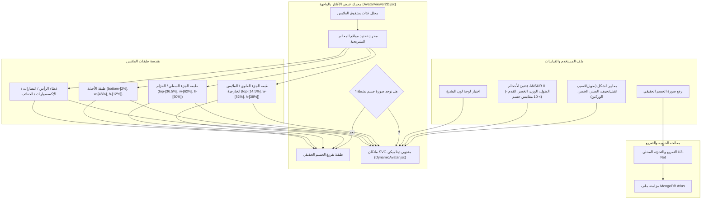

# DressApp — بنية نظام تحديد المواقع للأفاتار والقياس ثنائي الأبعاد (`Avatar.md`)

> **إصدار المستند:** 2.0  
> **النظام الفرعي المستهدف:** المانكان ثنائي الأبعاد في الواجهة الأمامية، تفريغ صور الجسم الحقيقية ومحرك تراكب الملابس  
> **الملفات الأساسية:** `AvatarViewer2D.jsx`, `DynamicAvatar.jsx`, `OutfitCanvas.jsx`, `Profile.jsx`  
> **الحالة:** تم الشحن واللمسات النهائية والمعايرة في الإنتاج  

---

## 1. الملخص التنفيذي وقيمة المشروع

### 1.1 نظرة عامة عالية المستوى
يوفر **نظام تحديد المواقع للأفاتار والقياس ثنائي الأبعاد في DressApp** بيئة قياس مرئية متكيفة في الوقت الفعلي. يتيح للمستخدمين معاينة قطع الملابس الرقمية المنسقة بسلاسة فوق إما **صورة مقطوعة لجسم حقيقي** أو **مانكان SVG متجهاً ديناميكياً بمنحنيات Bezier**.

لتحقيق دقة بصرية عالية عبر مختلف أنماط الملابس (قمصان ضاغطة، ياقات بولو، قمصان ذات ياقة مستديرة، جينز منخفض الخصر، شورتات كارجو، وفساتين رسمية)، يستخدم المحرك معايرة معالم أنثروبومترية، تحجيم النسب، وحاويات تراكب صور غير مشوهة.



### 1.2 القيمة المقدمة للمستخدم
* **دقة محاذاة المعالم التشريحية**: تُحاذي ياقات القمصان تماماً مع خط عنق الأفاتار (`top-[14.5%]`) وأحزمة السراويل/الشورتات مع خط خصر الأفاتار الطبيعي (`top-[36.5%]`)، مما يلغي حجب الوجه والفجوات غير المرغوبة.
* **مرونة الأفاتار المزدوج**: التبديل الفوري بين صورة جسم كامل مقطوعة شخصية ومانكان متجهي SVG ثنائي الأبعاد مبني وفقاً لقياسات أنثروبومترية دقيقة.
* **الحفاظ على النسبة والتناسب**: يطبق تحجيم عرض الصدر والورك ($scaleX$) مع الحفاظ على نسبة أبعاد صورة القطعة الأصلية (`object-fit: contain`)، مما يمنع التمدد أو الضغط غير المرغوب فيه.
* **تسلسل طبقات تفاعلي**: تراكب الملابس الخارجية فوق القمصان والفساتين مع السماح بالنقر المباشر على طبقات الملابس الفردية لفتح تفاصيل القطعة.

---

## 2. دليل المستخدم الشامل وهيكلية الواجهة

### 2.1 هيكلية الواجهة المرئية

```
┌──────────────────────────────────────────────────────────────────┐
│                     كانفاس قياس الأفاتار 2D                      │
├──────────────────────────────────────────────────────────────────┤
│                                                                  │
│                        [ أغطية الرأس (top: 1%) ]                 │
│                        [ النظارات   (top: 11%) ]                 │
│                        [ خط العنق  (top: 14.5%) ] ◄─ ياقة القميص │
│                     ┌──────────────────────────┐                 │
│                     │ Upper / Outerwear الملابس │                 │
│                     │       (height: 38%)      │                 │
│                     └──────────────────────────┘                 │
│                        [ خط الخصر  (top: 36.5%) ] ◄─ حزام الخصر  │
│                     ┌──────────────────────────┐                 │
│                     │     السراويل / الشورتات   │                 │
│                     │       (height: 50%)      │                 │
│                     │                          │                 │
│                     └──────────────────────────┘                 │
│                        [ القدمين  (bottom: 2%) ] ◄─── الأحذية     │
│                        [ الأحذية   (height: 12%) ]                │
│                                                                  │
├──────────────────────────────────────────────────────────────────┤
│  [ تبديل وضع الأفاتار ]  [ محدد لون البشرة ]  [ تعديل مقاييس الجسم ]│
└──────────────────────────────────────────────────────────────────┘
```

### 2.2 طرق وخطوات العمل

#### الوضع 1: طبقة تفريغ صورة الجسم الحقيقي
1. افتح **إعدادات الملف الشخصي** (`/me`).
2. قم برفع صورة جسم كامل. تنفذ الخلفية تجزئة الخلفية عبر `rembg` (U2-Net) لإزالة الضوضاء.
3. يقوم رابط الصورة المفرغة المعالجة (`body_photo_url`) بتحديث ملف المستخدم في MongoDB ويعرض داخل حاوية `AvatarViewer2D`.
4. للرجوع إلى مانكان المتجهات، انقر على **إزالة الصورة** في صفحة الملف الشخصي. تتحدث الواجهة فوراً بدون إعادة تحميل الصفحة.

#### الوضع 2: مانكان SVG متجهي ديناميكي
1. عند عدم وجود صورة جسم، يعرض `AvatarViewer2D` المكون `DynamicAvatar.jsx`.
2. يولد المانكان منحنيات Bezier التكعيبية المستمرة (أوامر $C$ و $S$) داخل viewBox مقاس ثابت `0 0 200 450`.
3. تعديل معايير الجسم (الطول، الوزن، الخصر، الصدر، الكتفين، الوركين) أو اختيار لون البشرة يغير صورة شكل المانكان ديناميكياً في الوقت الفعلي.

---

## 3. المكدس التكنولوجي والإمكانيات العميق

### 3.1 مقسم الشكل البيضاوي التشريحي ومولد مانكان Bezier

يحسب `DynamicAvatar.jsx` عروض التخطيط المستوي ثنائي الأبعاد من محيطات الجسم ثلاثية الأبعاد باستخدام **مقسم الشكل البيضاوي التشريحي** ($\text{DIVISOR} = 2.65$):

$$\begin{aligned}
w_{\text{shoulders}} &= (\text{shoulders} \times 1.1) \times (1.05 \text{ if male else } 0.95) \\
w_{\text{chest}} &= \left(\frac{\text{chest}}{2.65} \times 1.05\right) \times (1.02 \text{ if male else } 1.0) \\
w_{\text{waist}} &= \left(\frac{\text{waist}}{2.65} \times 1.0\right) \times (0.98 \text{ if male else } 0.90) \\
w_{\text{hip}} &= \left(\frac{\text{hip}}{2.65} \times 1.05\right) \times (0.93 \text{ if male else } 1.05)
\end{aligned}$$

يتم بناء مجسم الجسم عبر أوامر مسار SVG برسم نقاط تحكم Bezier التكعيبية:

```javascript
// Bezier contour snippet from DynamicAvatar.jsx
const bodyPath = [
  `M ${pNeckR}`,
  `C ${X0 + wNeck + (wShoulders - wNeck) * 0.6},${yChin + neckHeight * 0.7} ${X0 + wShoulders * 0.9},${yShoulders - 2} ${pShoulderR}`,
  `C ${X0 + wShoulders * 0.95},${yShoulders + (yChest - yShoulders) * 0.6} ${X0 + wChest + 2},${yChest - 5} ${pChestR}`,
  `C ${X0 + wChest - 1},${yChest + (yWaist - yChest) * 0.5} ${X0 + wWaist + (isMale ? 1 : -2)},${yWaist - 8} ${pWaistR}`,
  `C ${X0 + wWaist + (isMale ? 2 : 5)},${yWaist + (yHip - yWaist) * 0.4} ${X0 + wHip + 1},${yHip - 8} ${pHipR}`,
  ...
].join(' ');
```

### 3.2 تحديد مواقع المعالم المعايرة ونسب CSS للحاوية

لضمان محاذاة الملابس بدقة دون تداخل مع الوجه أو ترك فجوات في الجسم، ترتبط حاويات التراكب في `AvatarViewer2D.jsx` بنسب متموضعة دقيقة في CSS:

| فئة القطعة | فئة موضع CSS | z-Index | معلم المحاذاة |
| --- | --- | --- | --- |
| **أغطية الرأس** | `top-[1%] left-1/2 w-[34%] aspect-square` | `z-30` | أعلى الرأس |
| **النظارات** | `top-[11%] left-1/2 w-[18%] h-[4.5%]` | `z-28` | مستوى العينين |
| **الإكسسوارات / القلادة** | `top-[14.5%] left-1/2 w-[30%] aspect-square` | `z-25` | قاعدة العنق |
| **الجزء العلوي (Tops)** | `top-[14.5%] left-1/2 w-[82%] h-[38%]` | `z-20` | من الياقة إلى خط العنق |
| **الملابس الخارجية** | `top-[14.5%] left-1/2 w-[86%] h-[42%]` | `z-22` | طبقة المعطف على الكتف |
| **الفستان** | `top-[14.5%] left-1/2 w-[82%] h-[68%]` | `z-20` | الطول الكامل من الأعلى إلى الركبة |
| **الحزام** | `top-[36.5%] left-1/2 w-[62%] h-[5%]` | `z-21` | حلقة حزام الخصر |
| **الجزء السفلي (بنطال/شورت)** | `top-[36.5%] left-1/2 w-[62%] h-[50%]` | `z-10` | من حزام الخصر إلى خط الخصر |
| **الأحذية** | `bottom-[2%] left-1/2 w-[46%] h-[12%]` | `z-15` | من الكاحل إلى مستوى القدم |
| **حقيبة اليد** | `top-[40%] right-[-5%] w-[40%] h-[30%]` | `z-25` | مستوى نزول الذراع |

### 3.3 التحجيم النسبي لعرض الملابس

بالإضافة إلى التموضع الإزاحي، تتوسع الملابس ديناميكياً أفقياً ($scaleX$) بناءً على معايير الجسم المختارة من قبل المستخدم (امتلاء الصدر، ثقيل، نحيف، خصر عريض، وركان عريضان):

```javascript
// Derivation of garment container scale factors in AvatarViewer2D.jsx
const scales = useMemo(() => {
  const heightFactor = 1 + (params.tall * 0.08) - (params.short * 0.08);
  const widthFactor = 1 + (params.heavy * 0.12) - (params.thin * 0.12);
  const chestFactor = 1 + (params.busty * 0.1);
  const waistFactor = 1 + (params.waist_thick * 0.12) - (params.waist_thin * 0.08);
  const hipsFactor = 1 + (params.hips_wide * 0.12) - (params.hips_narrow * 0.08);

  return { height: heightFactor, width: widthFactor, chest: chestFactor, waist: waistFactor, hips: hipsFactor };
}, [params]);

// Passed to Framer Motion animate prop for Top and Bottom:
// Top: scaleX = scales.chest / scales.width
// Bottom: scaleX = scales.hips / scales.width
```

---

## 4. مصفوفة ملخص إصلاحات المواقع والنسب

| المشكلة المحددة | السبب | الإصلاح المطبق | النتيجة |
| --- | --- | --- | --- |
| **ياقة القميص تتداخل مع الوجه** | إزاحة مرتفعة جداً (`top-[8.3%]` أو `top-[12.8%]`) | تعيين إزاحة الحاوية العلوية إلى `top-[14.5%]` | استقرار ياقة القميص تماماً عند خط عنق الأفاتار (الخط الأصفر الأساسي). |
| **السراويل/الشورتات منخفضة أو تتداخل** | إزاحة منخفضة جداً (`top-[38.5%]`) | تعيين إزاحة الحاوية السفلية إلى `top-[36.5%]` | استقرار حزام السروال تماماً عند خط خصر الأفاتار الطبيعي. |
| **تشوه نسب أبعاد الملابس** | تمدد الحاوية دون قيود | تطبيق `object-fit: contain` مع تعديل `scaleX` النسبي | الحفاظ على نسبة أبعاد صورة الملابس الأصلية دون تشوه أفقي. |
| **تأخر في إزالة الصورة** | الحاجة إلى جلب حالة الصفحة من جديد | إنجاز مزامنة حالة المستخدم المحلية الفورية في `Profile.jsx` | معاينة إزالة الصورة فوراً دون أي تأخير في الواجهة. |

---
*تم تجميع المستند تلقائياً بواسطة Narrator لصالح DressApp.*
