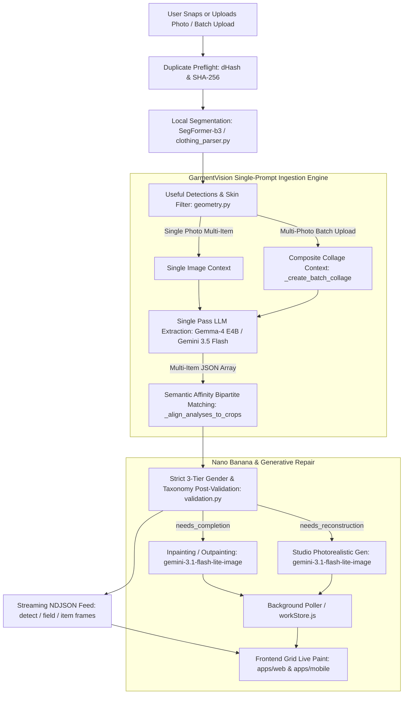
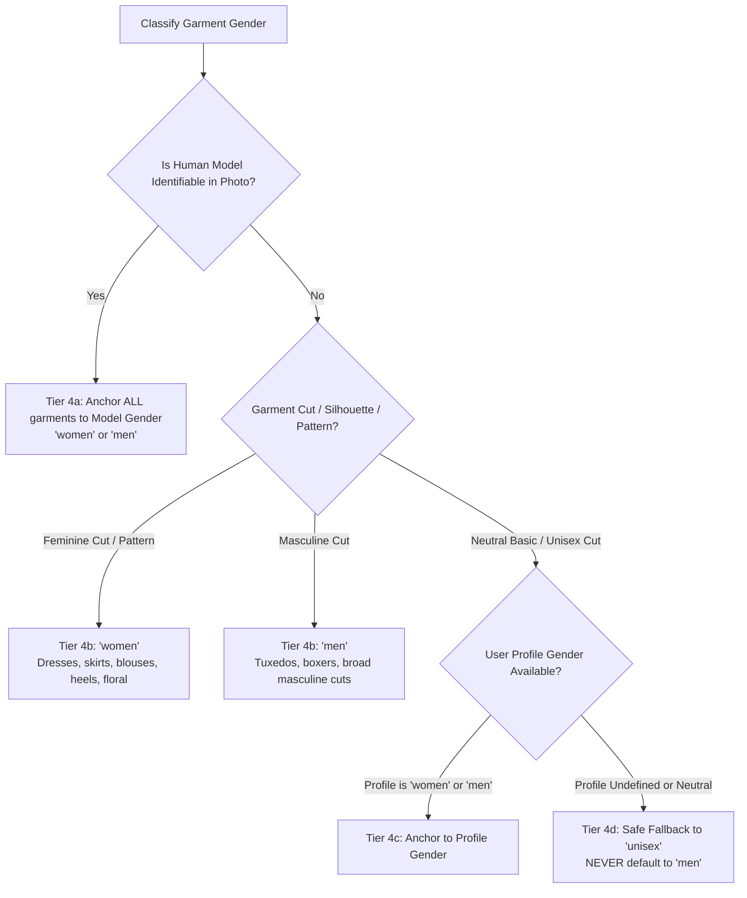

# GarmentVision — The DressApp Vision Pipeline & AI Eyes

> **Modules:** `backend/app/services/vision/service.py`, `backend/app/services/vision/llm.py`, `backend/app/services/vision/validation.py`, `backend/app/services/vision/image.py`, `backend/app/services/clothing_parser.py`, `backend/app/services/background_matting.py`, `backend/app/services/gemini_image_service.py`, `backend/app/services/reconstruction.py`  
> **Client Surfaces:** `apps/web/src/pages/AddItem.jsx`, `apps/web/src/pages/ItemDetail.jsx`, `apps/mobile/src/screens/closet/ClosetAddScreen.tsx`  
> **Status:** Production Shipped & Deployed on Hetzner VPS (`dressapp-eyes` + `dressapp-backend`)  

---

## 1. Executive Summary & Value Proposition

### High-Level Overview
**GarmentVision** is the optical intelligence core of DressApp. It transforms unconstrained user photography—ranging from full-body mirror selfies and multi-item outfit snaps to tabletop flat lays and digital receipts—into cleanly isolated, background-matted, catalog-grade wardrobe assets.

Anchored in a hybrid edge-cloud pipeline, GarmentVision harmonizes zero-marginal-cost CPU-local segmentation (**SegFormer-b3** + **rembg** U2-Net) with multimodal visual analysis powered primarily by the self-hosted **Gemma-4 E4B** container (`dressapp-eyes`) and secondarily by **Google Gemini 3.5 Flash**. Defective, amputated, or limb-occluded garments are diagnosed by an integrated Visual Quality Checker and restored through generative fabric outpainting and studio reshoots via **Nano Banana** (`gemini-3.1-flash-lite-image`).

### Architectural Flow



### The 6 Canonical GarmentVision Rules
The vision pipeline strictly adheres to six non-negotiable operational invariants:

1. **Multi-Item Single-Prompt Ingestion**: Multi-garment images processed by Gemma/Eyes ingest the image once and extract all items in a single pass.
2. **Batch-Upload Single-Prompt Ingestion**: Multi-photo uploads processed by Gemma/Eyes ingest the photos once as a composite context and extract all items in a single pass.
3. **Single System Prompt Sequence in AddItem**: The analysis sequence fires the system prompt exactly once in any AddItem workflow, preserving the `llama-server` KV-prefix cache across inferences.
4. **Strict 3-Tier Gender Hierarchy**:
   - **Tier 4a (Human Model Gender)**: If an identifiable human model is detected in the photo, anchor all detected garments to the model's gender (`"women"` or `"men"`).
   - **Tier 4b (Garment Criteria / Singlet Analysis)**: For flat lays, hangers, and ghost mannequins without a model, determine gender strictly from garment cut, silhouette, and pattern (`is_fem_cut` → `"women"`, `is_masc_cut` → `"men"`, `is_unisex_cut` or `g_val == "unisex"` → `"unisex"`, `"kids"`).
   - **Tier 4c (Uncertain / Neutral Basics)**: For neutral basics without gender cues (e.g. standard jeans, neutral sneakers, basic crew tees), anchor to the user's profile gender.
   - **Tier 4d (Unisex Fallback)**: If the user profile gender is undefined or neutral, fall back to `"unisex"`. **Never default to `"men"`**.
5. **Continuous i18next-Localization**: Technical JSON keys and enum values strictly remain English for Pydantic schema validation, while user-facing descriptive strings (`title`, `name`, `caption`, `tags`) are localized into the user's active locale across all 13 supported languages (`en`, `he`, `ar`, `es`, `fr`, `de`, `it`, `pt`, `ru`, `zh`, `ja`, `hi`, `nl`).
6. **Token Minimization via `/agency-image-prompt-engineer`**: System prompts are strictly budgeted (<260 words); predictable auxiliary fields (`clothing_condition`, `quality_tier`, `price_tier`, `fit_style`, `care_instructions`) are omitted from the LLM prompt and populated deterministically in Python post-processing, saving 150–250 output tokens per item; generative prompts utilize professional photographic terminology without boilerplate filler words.

### User Value Proposition
- **One-Shot Multi-Item Extraction**: Upload a complete head-to-toe selfie; GarmentVision isolates the jacket, top, trousers, shoes, and sunglasses in parallel in seconds.
- **Strict Transparency Invariant**: Enforces pure alpha-matted cutouts free of bounding box edges, background shadows, or residual drywall backdrops.
- **Autonomous Generative Repair**: Clothing amputated by the camera edge or occluded by bags and crossed arms is automatically inpainted and completed.
- **Zero-Cost Free Tier Execution**: Powered by local CPU inference on the VPS via `gemma-4-E4B-it-Q3_K_M.gguf`, delivering zero-marginal-cost processing for daily wardrobe logging.
- **Multilingual Native Experience**: Clothes are cataloged naturally in 13 languages, ensuring non-English users receive natural native names (e.g., חולצת טי, שמלת מקסי, סנדלים) rather than awkward automated translations.

---

## 2. Comprehensive User Manual

### Visual Interface Topology
```text
┌────────────────────────────────────────────────────────────────────────┐
│  [ Add Clothes — Instant Ingestion & Camera Hub ]                       │
│  ┌──────────────────────────────────────────────────────────────────┐  │
│  │  [Live Shutter / Multi-File Drag & Drop]                         │  │
│  │  "Snap or drop full-body selfies, flat lays, or batch photos"    │  │
│  └──────────────────────────────────────────────────────────────────┘  │
│                                                                        │
│  [ Instant NDJSON Detection Stream (Rule 1 & Rule 2 Single-Pass) ]     │
│  ┌─────────────────┐  ┌─────────────────┐  ┌─────────────────┐         │
│  │ Crop Slot [0]   │  │ Crop Slot [1]   │  │ Crop Slot [2]   │         │
│  │ [Tops / Jacket] │  │ [Bottoms]       │  │ [Footwear]      │         │
│  │ "Puffer Jacket" │  │ "Straight Jeans"│  │ "Strappy Sandal"│         │
│  │ Status: Parsing │  │ Status: Matting │  │ Status: Checked │         │
│  └─────────────────┘  └─────────────────┘  └─────────────────┘         │
│                                                                        │
│  [ Live Closet Grid — Real-Time Background Synchronization ]          │
│  ┌─────────────────┐  ┌─────────────────┐  ┌─────────────────┐         │
│  │ Navy Blue Coat  │  │ White Chinos    │  │ Leather Loafers │         │
│  │ Dress: Business │  │ Dress: Casual   │  │ Dress: Smart-Cas│         │
│  │ [Gender: Women] │  │ [Gender: Women] │  │ [Gender: Women] │         │
│  └─────────────────┘  └─────────────────┘  └─────────────────┘         │
└────────────────────────────────────────────────────────────────────────┘
```

### Mode & Workflow Walkthroughs

#### 1. Multi-Item Single-Photo Ingestion (Mirror Selfie / Outfit Snap)
1. Navigate to **Add Item** (`apps/web/src/pages/AddItem.jsx` or `apps/mobile/src/screens/closet/ClosetAddScreen.tsx`).
2. Snap or upload an outfit photo containing multiple garments.
3. The browser runs instant duplicate pre-flight verification (dHash + SHA-256 in <150ms).
4. `clothing_parser.py` executes local CPU SegFormer-b3 segmentation, isolating bounding boxes and initial masks.
5. In accordance with **Rule 1**, the entire image is processed once by Gemma/Eyes. All garment items are extracted in a single prompt execution.
6. The streaming connection emits an initial `detect` frame containing cropped thumbnails, followed by progressive `item` frames containing the parsed taxonomy.
7. Cards paint instantly onto the user's screen without blocking navigation.

#### 2. Multi-Photo Batch Upload (Closet Bulk Logging)
1. Drag and drop up to 10 photos simultaneously into the upload zone.
2. In accordance with **Rule 2**, `_create_batch_collage` constructs a normalized 768px composite contact sheet.
3. Gemma/Eyes ingests the composite collage once. It assigns each detected item to its respective `(photo_index, slot_index)` in a single JSON array pass.
4. Bipartite semantic matching (`_align_analyses_to_crops`) guarantees that detected items are assigned to their corresponding cutouts without category swapping.

#### 3. Automatic Visual Quality Checking & Generative Inpainting
1. During attribute extraction, Gemini / Eyes evaluates the image contour:
   - `complete`: The garment is fully visible and unclipped; saved as an alpha PNG.
   - `needs_completion`: Hems, sleeves, or collars are occluded or trimmed by camera edges. Nano Banana (`gemini-3.1-flash-lite-image`) inpaints the missing fabric in the background.
   - `needs_reconstruction`: Severe amputation (e.g. only shoe toes visible); Nano Banana regenerates a catalog-grade studio product shot.
2. Background tasks poll via `workStore.js` and seamlessly upgrade thumbnails in the closet grid once repair completes.

#### 4. Conversational Re-Analyse (The Eyes & Nano Banana)
Located inside the **Item Details** editor:
- **Interactive Prompt Box**: Type or speak instructions (*"remove the studs"*, *"complete the sleeve where the hand was"*).
- **Quick Prompt Chips**: 1-tap starter chips (🪄 *Remove shoes*, ✂️ *Complete hole*, 💎 *Remove studs*, 🔍 *Refine fabric*).
- **Interactive Application**: Preview the regenerated image in the chat thread and tap **Apply as garment photo** to persist to MongoDB.

---

## 3. Technology Stack & Capability Deep-Dive

### 3.1 Inference Engine & Model Architecture

| Layer | Technology | Execution Target | Role |
| :--- | :--- | :--- | :--- |
| **Segmentation** | `sayeed99/segformer_b3_clothes` | Local CPU (`backend`) | 18-class fashion segmentation, mask generation, skin filtering |
| **Background Matting** | `rembg` (U2-Net / u2netp) | Local CPU (`backend`) | Alpha matte isolation, boundary smoothing |
| **Primary Vision LLM** | Fine-Tuned Gemma-4 E4B GGUF | Local VPS (`dressapp-eyes:7860`) | Single-pass attribute extraction, zero-cost Free Tier execution |
| **Cloud Vision Fallback** | Gemini 3.5 Flash | Google Cloud (`google-genai` SDK) | Low-latency fallback for Pro users and quota overflow failover |
| **Generative Reshoot** | `gemini-3.1-flash-lite-image` | Google Cloud (Nano Banana) | Photographic inpainting, fabric outpainting, studio reconstruction |

### 3.2 Prompt Engineering & Token Budgeting (Rule 3 & Rule 6)

Under the `/agency-image-prompt-engineer` principles, the vision pipeline enforces aggressive token discipline:

```text
Prompt Budget Matrix:
- SYSTEM_PROMPT: 247 words (Strict hard cap < 260 words).
- Per-Garment Output Schema: ~110-140 tokens.
- Deterministic Post-Processing: 150-250 output tokens saved per item by calculating 
  care_instructions, quality_tier, price_tier, and fabric defaults in Python.
```

#### Canonical System Prompt (`backend/app/services/vision/llm.py`)
```text
Output raw JSON only ({...} or [{...}]). No markdown/intro.
• sub_category: Specific cut ('Shirt','Sweater','Jeans','Pants','Skirt','Sneakers','Sandals','Boots','Sunglasses','Bags'). Never generic 'Top'/'Bottom'.
• Bottoms: 'Jeans' is EXCLUSIVELY denim with 5-pocket rivets. Chinos/slacks/trousers -> sub_category:'Pants', item_type:'Chinos'|'Tailored Trousers', dress_code:'smart-casual'|'business'. Sweatpants/joggers/trainers/fleece -> sub_category:'Pants', item_type:'Sweatpants'|'Joggers', dress_code:'casual'|'athletic', material:'Cotton'|'Polyester' (never 'Tailored Trousers'/'Wool'/'Business').
• Footwear: 'Sneakers' (athletic/rubber-sole), 'Sandals' (open-toe/strappy/heeled summer), 'Heels','Boots','Loafers','Flats'. Open-toe/strappy -> sub_category:'Sandals' (never 'Sneakers').
• Accessories: 'Sunglasses', 'Bags','Belts','Headwear','Scarves & Wraps','Jewelry'. Attached hoods/collars/sleeves are part of the host garment, never separate headwear. Non-wearables (bottles, cups, phones) -> is_clothing:false. Genuine accessories -> is_clothing:true.
• item_type: Detailed cut ('Crew-Neck T-Shirt','Chinos','Tailored Trousers','Straight Jeans','Sweatpants','Open-Toe Sandals','Classic Sunglasses'). Must differ from sub_category.
• caption: <=15 words. One clause: [color] [fabric/texture if notable] [cut]. End with period. Never repeat season/gender/dress_code. No filler phrases.
• dress_code: 'casual'|'smart-casual'|'business'|'formal'|'athletic'|'loungewear'. Suits/blazers='business'; button-downs/blouses/slacks/cardigans='smart-casual'; gowns/tuxedos='formal'; sportswear='athletic'; sweatpants/joggers='casual'|'athletic'; jackets/hoodies='casual'|'athletic' (never loungewear); sleepwear='loungewear'. Never default to casual.
• model_gender: Identifiable human model -> 'women'|'men'. Flat lay/hanger/mannequin -> null.
• gender: Strict 3-Tier Hierarchy: (1) Human Model: anchor all garments to model gender ('women'|'men'). (2) Garment Criteria: flat lays/hangers determined strictly by cut ('women' for floral/blouses/skirts/dresses/sandals; 'men' for masculine cuts; 'unisex' for neutral basics). (3) Neutral basics fall back to profile gender, or 'unisex'. Never default to 'men'.
• colors: ALWAYS [{"name": str, "pct": int}] summing to 100 (never omit).
• fabric_materials: [{"name": str, "pct": int}] summing to 100. tags: [str] (3-6 tags).
• pattern: 'solid'|'printed'|'geometric'|'striped'|'plaid'|'floral'.
• text/logos: Read accurately ('American Eagle'=eagle/עיט, not deer/אייל).
• season: ['spring'|'summer'|'fall'|'winter'|'all']. Linen/short-sleeve/sandals=['summer']; wool/down=['fall','winter'].
• Quality & Repair: Only emit 'reconstruction_prompt' if image_quality_status != 'complete'. Set null if complete.
```

### 3.3 Strict 3-Tier Gender Determination (Rule 4)

Garment gender classification follows a four-step priority tree implemented in `backend/app/services/vision/validation.py`:



### 3.4 Bipartite Semantic Matching (`_align_analyses_to_crops`)

To prevent category swapping (e.g. Shoes receiving Belt tags or Pants receiving Jacket attributes), `service.py` computes an affinity matrix between SegFormer detection labels/bounding boxes and LLM-parsed JSON outputs:

$$C_{i,j} = S_{\text{category}}(c_i, o_j) + S_{\text{label}}(c_i, o_j) + S_{\text{hint}}(c_i, o_j)$$

where $c_i$ represents the computer-vision crop and $o_j$ represents the LLM-extracted JSON object. The optimal one-to-one assignment is resolved deterministically via the Hungarian matching algorithm, ensuring perfect alignment between visual cutouts and metadata.

### 3.5 Streaming Protocol & Ingress Optimization

- **NDJSON Stream Format**: Emits chunks separated by `\n` across the streaming response:
  - `{"type": "detect", "count": N, "items_meta": [...]}`
  - `{"type": "field", "index": i, "group": "...", "fields": {...}}`
  - `{"type": "item", "index": i, "analysis": {...}}`
  - `{"type": "done", "count": N}`
- **Proxy Flushing**: Caddy reverse proxy is configured with `flush_interval -1` to disable intermediate buffer delays, ensuring immediate visual frame updates on mobile and web clients.
