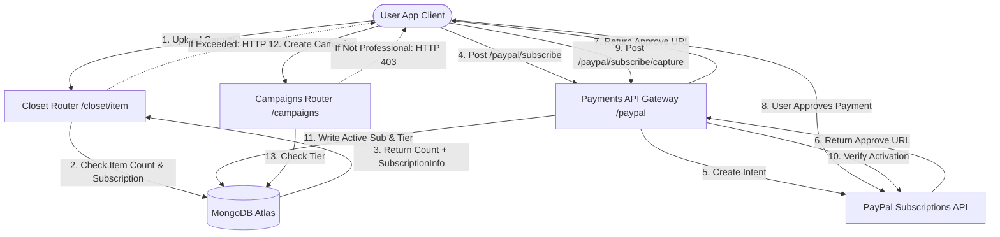

# DressApp Monetization & Billing Engine

This document provides a comprehensive architectural overview, user manual, and technology deep-dive of the monetization, subscription billing, and three-tier limits in DressApp.

---

## 1. Executive Summary & Value Proposition

### High-Level Overview
DressApp implements a three-tier monetization model designed to fit different user archetypes:
1.  **Free Tier**:
    *   **Cost**: $0 / month (no credit card required).
    *   **Limits**: Up to 50 closet items and up to 10 daily AI operations.
    *   **Features**: Basic closet organization, community support. Restricted from selling/renting on the marketplace (swap/donate only). Access to Trend Scout and Campaigns is disabled.
2.  **Manager Tier**:
    *   **Cost**: $5 / month or $50 / year.
    *   **Limits**: Unlimited closet items and unlimited daily AI requests.
    *   **Features**: Marketplace options (Sell, Swap, Rent, Donate), Trend Scout, Scheduler & push notifications, Priority support. Campaigns creation is disabled.
3.  **Professional Tier**:
    *   **Cost**: $10 / month or $100 / year.
    *   **Limits**: Unlimited closet items and unlimited daily AI requests.
    *   **Features**: All features included, dedicated support, and full Ad Campaigns creation support.

### Architectural Flow



---

## 2. Comprehensive User Manual

### Visual Interface Topology
The user profile page ([Profile.jsx](file:///C:/DressApp_AG/frontend/src/pages/Profile.jsx)) hosts the Subscription Management widget under the **Subscription & Limits** section, displaying item counts (0 to 50 limit for Free plan), active plan tier status, and next renewal dates.
The pricing page ([Pricing.jsx](file:///C:/DressApp_AG/frontend/src/pages/Pricing.jsx)) displays cards comparing the Free, Manager, and Professional plans, as well as a detailed features grid checklist.

### Mode & Workflow Walkthroughs

#### A. Upgrading your Membership (Paid Flow)
1.  **Initiating Upgrade**: The user selects their desired plan (Manager or Professional) and billing frequency (Monthly or Annual) and clicks **Upgrade Plan**.
2.  **Order Registration**: The client issues a `POST /paypal/subscribe` request. The backend contacts PayPal, generates a subscription ID, and returns an `approve_url`.
3.  **Payment Processing**: The client browser redirects to the PayPal Sandbox checkout page (or is handled via Mock Atzmai/PayPal gateway). The user logs in and approves the billing agreement.
4.  **Redirection & Capture**: PayPal redirects the browser back to `/pricing?sub_status=success&token=SUBSCRIPTION_ID`.
5.  **Activation**: The client detects the search params, issues `POST /paypal/subscribe/capture/{subscription_id}`, and refreshes the user session. The active plan tier updates immediately in the UI.

---

## 3. Technology Stack & Capability Deep-Dive

### Data Schema Definitions
The MongoDB schema in [schemas.py](file:///C:/DressApp_AG/backend/app/models/schemas.py) holds the user's billing status and active tier:

```python
class SubscriptionInfo(BaseModel):
    is_active: bool = False
    plan_type: Literal["free", "monthly", "yearly"] = "free"
    tier: Literal["free", "manager", "professional"] = "free"
    paypal_subscription_id: str | None = None
    expires_at: str | None = None              # ISO timestamp
    cancelled_at: str | None = None            # ISO timestamp

class User(BaseDoc):
    # ... other profile documents ...
    subscription: SubscriptionInfo = Field(default_factory=SubscriptionInfo)
```

### API Routing & Gated Actions

#### Closet Items Limit ([closet.py](file:///C:/DressApp_AG/backend/app/api/v1/closet.py))
During item insertion, the system verifies limits for Free users:
```python
sub = user.get("subscription") or {}
is_active = sub.get("is_active", False)
plan_type = sub.get("plan_type", "free")
tier = sub.get("tier", "free")

user_tier = "free"
if is_active and plan_type != "free":
    user_tier = tier

if user_tier == "free":
    item_count = await db.closet_items.count_documents({"owner_id": user_id, "status": {"$ne": "deleted"}})
    if item_count >= 50:
        raise HTTPException(status_code=402, detail="Closet capacity limit (50 items) exceeded. Please upgrade.")
```

#### Daily AI Operations Limit ([credit_manager.py](file:///C:/DressApp_AG/backend/app/services/credit_manager.py))
For Free tier users, AI operations increment a daily count tracked in `user.ai_configuration.daily_request_count`. When it reaches 10, requests are blocked with HTTP 402.

#### Marketplace Gating ([listings.py](file:///C:/DressApp_AG/backend/app/api/v1/listings.py))
If a user is on the Free tier, listings created with intent `"for_sale"` or `"rent"` are rejected:
```python
if user_tier == "free" and listing.intent in ["for_sale", "rent"]:
    raise HTTPException(status_code=403, detail="Free plan users can only Swap or Donate garments. Upgrade to list for sale or rent.")
```

#### Campaigns Gating ([campaigns.py](file:///C:/DressApp_AG/backend/app/api/v1/campaigns.py))
Campaign creation endpoints restrict actions unless the active subscription tier is Professional:
```python
if user_tier != "professional":
    raise HTTPException(status_code=403, detail="Ad Campaign creation is only available on the Professional plan.")
```
