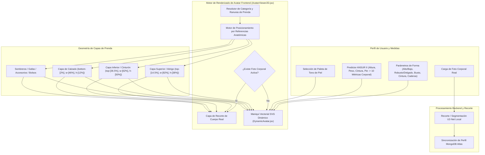

# DressApp — Arquitectura del Sistema de Posicionamiento y Prueba en Avatar 2D (`Avatar.md`)

> **Versión del Documento:** 2.0  
> **Subsistema Objetivo:** Maniquí 2D Frontend, Recortes de Foto Corporal Real y Motor de Superposición de Prendas  
> **Archivos Principales:** `AvatarViewer2D.jsx`, `DynamicAvatar.jsx`, `OutfitCanvas.jsx`, `Profile.jsx`  
> **Estado:** Implementado en Producción y Calibrado  

---

## 1. Resumen Ejecutivo y Propuesta de Valor

### 1.1 Descripción General de Alto Nivel
El **Sistema de Posicionamiento y Prueba en Avatar 2D de DressApp** proporciona un entorno de prueba visual adaptativo en tiempo real. Permite a los usuarios previsualizar prendas digitalizadas de su armario superpuestas sin problemas sobre una **fotografía de cuerpo entero segmentada** o sobre un **maniquí vectorial SVG 2D con curvas Bezier deformables**.

Para lograr una alta precisión visual en diversos estilos de prendas (camisetas de compresión, cuellos polo, cuellos redondos, vaqueros de tiro bajo, pantalones cortos cargo y vestidos formales), el motor utiliza calibración de puntos de referencia anatómicos, escalado proporcional de proporciones y contenedores de superposición sin distorsión.



### 1.2 Propuesta de Valor para el Usuario
* **Precisión de Alineación Anatómica**: Ajusta los cuellos de las camisas al ras de la línea del cuello del avatar (`top-[14.5%]`) y las pretinas de pantalones/cortos al ras de la cintura natural (`top-[36.5%]`), eliminando superposiciones faciales y huecos antiestéticos.
* **Flexibilidad de Doble Avatar**: Cambie al instante entre una foto real de cuerpo entero y un maniquí vectorial SVG 2D construido con medidas antropométricas exactas.
* **Preservación Proporcional del Aspecto**: Aplica escalado de ancho en pecho y caderas ($scaleX$) manteniendo la relación de aspecto original de la imagen (`object-fit: contain`), evitando estiramientos no deseados.
* **Jerarquía de Capas Interactiva**: Apile abrigos sobre camisetas y vestidos permitiendo clics directos en las prendas individuales para abrir sus detalles.

---

## 2. Manual de Usuario Completo y Topología de Interfaz

### 2.1 Topología Visual de la Interfaz

```
┌──────────────────────────────────────────────────────────────────┐
│                   Lienzo de Prueba en Avatar 2D                  │
├──────────────────────────────────────────────────────────────────┤
│                                                                  │
│                        [ Sombreros    (top: 1%) ]                │
│                        [ Gafas        (top: 11%) ]               │
│                        [ Línea Cuello (top: 14.5%) ] ◄─ Cuello    │
│                     ┌──────────────────────────┐                 │
│                     │  Prendas Superiores/Ropa │                 │
│                     │       (altura: 38%)      │                 │
│                     └──────────────────────────┘                 │
│                        [ Cintura     (top: 36.5%) ] ◄─ Pretina   │
│                     ┌──────────────────────────┐                 │
│                     │  Prendas Inferiores/Pant │                 │
│                     │       (altura: 50%)      │                 │
│                     │                          │                 │
│                     └──────────────────────────┘                 │
│                        [ Pies        (bottom: 2%) ] ◄─── Calzado │
│                        [ Calzado      (altura: 12%) ]            │
│                                                                  │
├──────────────────────────────────────────────────────────────────┤
│  [ Cambiar Modo ]  [ Selector Tono Piel ]  [ Editar Medidas ]    │
└──────────────────────────────────────────────────────────────────┘
```

### 2.2 Flujos de Trabajo y Modos

#### Modo 1: Capa de Recorte de Foto Corporal Real
1. Abra la **Configuración del Perfil** (`/me`).
2. Cargue una fotografía de cuerpo entero. El servidor ejecuta la segmentación del fondo mediante `rembg` (U2-Net).
3. La URL de la foto procesada (`body_photo_url`) actualiza el perfil del usuario en MongoDB y se muestra dentro del contenedor `AvatarViewer2D`.
4. Para volver al maniquí vectorial, haga clic en **Eliminar foto**. La interfaz se actualiza al instante sin recargar la página.

#### Modo 2: Maniquí Vectorial SVG Dinámico
1. Cuando no hay foto corporal activa, `AvatarViewer2D` muestra `DynamicAvatar.jsx`.
2. El maniquí genera curvas Bezier cúbicas continuas (comandos $C$ y $S$) dentro de un viewBox fijo de `0 0 200 450`.
3. El ajuste de parámetros físicos (Altura, Peso, Cintura, Pecho, Hombros, Caderas) o la selección del tono de piel modifica la silueta en tiempo real.

---

## 3. Arquitectura Tecnológica y Análisis Profundo

### 3.1 Divisor Anatómico de Elipse y Generador Bezier del Maniquí

`DynamicAvatar.jsx` calcula los anchos de proyección planar 2D a partir de circunferencias anatómicas 3D utilizando un **Divisor Anatómico de Elipse** ($\text{DIVISOR} = 2.65$):

$$\begin{aligned}
w_{\text{shoulders}} &= (\text{shoulders} \times 1.1) \times (1.05 \text{ if male else } 0.95) \\
w_{\text{chest}} &= \left(\frac{\text{chest}}{2.65} \times 1.05\right) \times (1.02 \text{ if male else } 1.0) \\
w_{\text{waist}} &= \left(\frac{\text{waist}}{2.65} \times 1.0\right) \times (0.98 \text{ if male else } 0.90) \\
w_{\text{hip}} &= \left(\frac{\text{hip}}{2.65} \times 1.05\right) \times (0.93 \text{ if male else } 1.05)
\end{aligned}$$

La silueta corporal se construye mediante comandos de ruta SVG mapeando puntos de control Bezier cúbicos:

```javascript
// Bezier contour snippet from DynamicAvatar.jsx
const bodyPath = [
  `M ${pNeckR}`,
  `C ${X0 + wNeck + (wShoulders - wNeck) * 0.6},${yChin + neckHeight * 0.7} ${X0 + wShoulders * 0.9},${yShoulders - 2} ${pShoulderR}`,
  `C ${X0 + wShoulders * 0.95},${yShoulders + (yChest - yShoulders) * 0.6} ${X0 + wChest + 2},${yChest - 5} ${pChestR}`,
  `C ${X0 + wChest - 1},${yChest + (yWaist - yChest) * 0.5} ${X0 + wWaist + (isMale ? 1 : -2)},${yWaist - 8} ${pWaistR}`,
  `C ${X0 + wWaist + (isMale ? 2 : 5)},${yWaist + (yHip - yWaist) * 0.4} ${X0 + wHip + 1},${yHip - 8} ${pHipR}`,
  ...
].join(' ');
```

### 3.2 Posicionamiento Calibrado por Referencias y Ratios CSS

Para garantizar que las prendas se ajusten sin solaparse con el rostro ni dejar huecos en el cuerpo, los contenedores en `AvatarViewer2D.jsx` están vinculados a ratios de posición CSS precisos:

| Categoría de Prenda | Clase de Posición CSS | z-Index | Punto de Referencia |
| --- | --- | --- | --- |
| **Sombreros / Gorros** | `top-[1%] left-1/2 w-[34%] aspect-square` | `z-30` | Coronilla de la cabeza |
| **Gafas** | `top-[11%] left-1/2 w-[18%] h-[4.5%]` | `z-28` | Plano de los ojos |
| **Accesorio / Collar** | `top-[14.5%] left-1/2 w-[30%] aspect-square` | `z-25` | Base del cuello |
| **Prenda Superior (Top)** | `top-[14.5%] left-1/2 w-[82%] h-[38%]` | `z-20` | Cuello al escote |
| **Abrigos / Chaquetas** | `top-[14.5%] left-1/2 w-[86%] h-[42%]` | `z-22` | Superposición sobre hombros |
| **Vestidos** | `top-[14.5%] left-1/2 w-[82%] h-[68%]` | `z-20` | Largo completo superior a rodilla |
| **Cinturón** | `top-[36.5%] left-1/2 w-[62%] h-[5%]` | `z-21` | Trabilla de la cintura |
| **Prenda Inferior (Pantalón)** | `top-[36.5%] left-1/2 w-[62%] h-[50%]` | `z-10` | Pretina a la cintura natural |
| **Calzado** | `bottom-[2%] left-1/2 w-[46%] h-[12%]` | `z-15` | Tobillo a plano del pie |
| **Bolso de Mano** | `top-[40%] right-[-5%] w-[40%] h-[30%]` | `z-25` | Caída del brazo |

### 3.3 Escalado Proporcional de Ancho de Prenda

Además del posicionamiento, las prendas se escalan horizontalmente ($scaleX$) según los parámetros corporales del usuario:

```javascript
// Derivation of garment container scale factors in AvatarViewer2D.jsx
const scales = useMemo(() => {
  const heightFactor = 1 + (params.tall * 0.08) - (params.short * 0.08);
  const widthFactor = 1 + (params.heavy * 0.12) - (params.thin * 0.12);
  const chestFactor = 1 + (params.busty * 0.1);
  const waistFactor = 1 + (params.waist_thick * 0.12) - (params.waist_thin * 0.08);
  const hipsFactor = 1 + (params.hips_wide * 0.12) - (params.hips_narrow * 0.08);

  return { height: heightFactor, width: widthFactor, chest: chestFactor, waist: waistFactor, hips: hipsFactor };
}, [params]);

// Passed to Framer Motion animate prop for Top and Bottom:
// Top: scaleX = scales.chest / scales.width
// Bottom: scaleX = scales.hips / scales.width
```

---

## 4. Matriz de Resumen de Ajustes de Posición y Proporción

| Problema Identificado | Causa | Solución Aplicada | Resultado |
| --- | --- | --- | --- |
| **Cuello de camiseta tapando el rostro** | Posición demasiado alta (`top-[8.3%]` o `top-[12.8%]`) | Ajustar posición superior a `top-[14.5%]` | El cuello queda perfectamente alineado en el cuello del avatar. |
| **Pantalones bajos o solapados** | Posición demasiado baja (`top-[38.5%]`) | Ajustar posición inferior a `top-[36.5%]` | La pretina queda alineada en la cintura natural del avatar. |
| **Relación de aspecto distorsionada** | Estiramiento sin restricciones | Aplicar `object-fit: contain` con ajuste `scaleX` | Mantiene la relación de aspecto sin distorsión horizontal. |
| **Retraso al eliminar foto** | Recarga de estado de la página | Sincronización local instantánea en `Profile.jsx` | La vista previa se actualiza al instante sin retraso. |

---
*Documento compilado automáticamente por Narrator para DressApp.*
