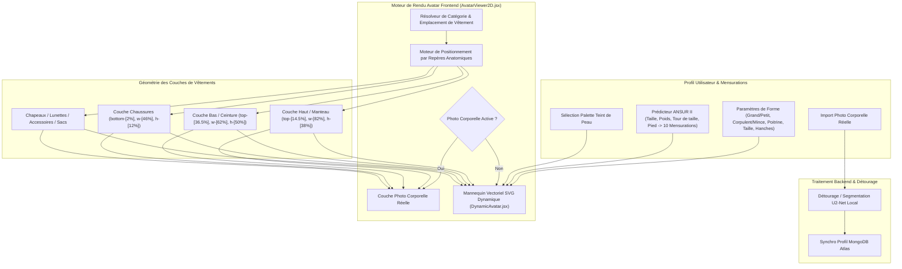

# DressApp — Architecture du Système de Positionnement et d'Essayage d'Avatar 2D (`Avatar.md`)

> **Version du Document :** 2.0  
> **Sous-système Cible :** Mannequin 2D Frontend, Détourage Photo Corporelle Réelle & Moteur de Superposition de Vêtements  
> **Fichiers Principaux :** `AvatarViewer2D.jsx`, `DynamicAvatar.jsx`, `OutfitCanvas.jsx`, `Profile.jsx`  
> **Statut :** Déployé en Production & Calibré  

---

## 1. Résumé Exécutif & Proposition de Valeur

### 1.1 Vue d'ensemble globale
Le **Système de Positionnement et d'Essayage d'Avatar 2D DressApp** offre un environnement d'essayage visuel adaptatif en temps réel. Il permet aux utilisateurs de prévisualiser les vêtements numérisés de leur dressing superposés de manière transparente sur une **photographie corporelle réelle segmentée** ou sur un **mannequin SVG vectoriel 2D dynamiquement déformé avec des courbes de Bézier**.

Pour garantir une grande précision visuelle sur différents styles de vêtements (t-shirts de compression, cols polo, cols ras du cou, jeans taille basse, shorts cargo et robes de soirée), le moteur utilise un calibrage par repères anatomiques, une mise à l'échelle proportionnelle et des conteneurs de superposition sans distorsion.



### 1.2 Proposition de Valeur Utilisateur
* **Précision d'Alignement Anatomique** : Aligne parfaitement les cols de chemises au niveau de la ligne du cou (`top-[14.5%]`) et la ceinture des pantalons/shorts à la taille naturelle (`top-[36.5%]`), éliminant les masquages du visage et les espaces inesthétiques.
* **Flexibilité du Double Avatar** : Basculez instantanément entre une photo en pied détourée et un mannequin SVG vectoriel 2D configuré selon vos mensurations anthropométriques exactes.
* **Préservation des Proportions d'Aspect** : Applique une mise à l'échelle en largeur pour la poitrine et les hanches ($scaleX$) tout en conservant le ratio d'aspect original de l'image du vêtement (`object-fit: contain`).
* **Hiérarchie d'Interactions Multicouches** : Superposez les manteaux sur les haut et les robes tout en permettant un clic direct sur chaque vêtement pour afficher ses détails.

---

## 2. Manuel Utilisateur Complet & Topologie de l'Interface

### 2.1 Topologie Visuelle de l'Interface

```
┌──────────────────────────────────────────────────────────────────┐
│                   Canvas d'Essayage Avatar 2D                    │
├──────────────────────────────────────────────────────────────────┤
│                                                                  │
│                        [ Chapeaux     (top: 1%) ]                │
│                        [ Lunettes     (top: 11%) ]               │
│                        [ Ligne du cou (top: 14.5%) ] ◄─ Col chem  │
│                     ┌──────────────────────────┐                 │
│                     │    Hauts / Manteaux      │                 │
│                     │       (hauteur: 38%)     │                 │
│                     └──────────────────────────┘                 │
│                        [ Ceinture     (top: 36.5%) ] ◄─ Ceinture   │
│                     ┌──────────────────────────┐                 │
│                     │    Basp / Pantalons      │                 │
│                     │       (hauteur: 50%)     │                 │
│                     │                          │                 │
│                     └──────────────────────────┘                 │
│                        [ Pieds       (bottom: 2%) ] ◄── Chaussur │
│                        [ Chaussures   (hauteur: 12%) ]           │
│                                                                  │
├──────────────────────────────────────────────────────────────────┤
│ [ Changer de Mode ] [ Sélecteur de Teint ] [ Modifier Mensurat. ]│
└──────────────────────────────────────────────────────────────────┘
```

### 2.2 Modes & Exécution des Flux de Travail

#### Mode 1 : Couche Détourage Photo Corporelle Réelle
1. Ouvrez les **Paramètres du Profil** (`/me`).
2. Importez une photo en pied. Le serveur effectue la segmentation de l'arrière-plan via `rembg` (U2-Net).
3. L'URL de la photo détourée (`body_photo_url`) met à jour le profil utilisateur MongoDB et s'affiche dans le conteneur `AvatarViewer2D`.
4. Pour revenir au mannequin vectoriel, cliquez sur **Supprimer la photo** sur la page de profil.

#### Mode 2 : Mannequin Vectoriel SVG Dynamique
1. En l'absence de photo corporelle, `AvatarViewer2D` affiche `DynamicAvatar.jsx`.
2. Le mannequin génère des courbes de Bézier cubiques (commandes $C$ et $S$) dans une viewBox fixe `0 0 200 450`.
3. L'ajustement des paramètres corporels (Taille, Poids, Taille, Poitrine, Épaules, Hanches) ou du teint de peau déforme la silhouette en temps réel.

---

## 3. Architecture Technique & Analyse Approfondie

### 3.1 Diviseur Elliptique Anatomique & Générateur de Mannequin Bézier

`DynamicAvatar.jsx` calcule les largeurs de projection 2D à partir des circonférences anatomiques 3D en utilisant un **Diviseur Elliptique Anatomique** ($\text{DIVISOR} = 2.65$) :

$$\begin{aligned}
w_{\text{shoulders}} &= (\text{shoulders} \times 1.1) \times (1.05 \text{ if male else } 0.95) \\
w_{\text{chest}} &= \left(\frac{\text{chest}}{2.65} \times 1.05\right) \times (1.02 \text{ if male else } 1.0) \\
w_{\text{waist}} &= \left(\frac{\text{waist}}{2.65} \times 1.0\right) \times (0.98 \text{ if male else } 0.90) \\
w_{\text{hip}} &= \left(\frac{\text{hip}}{2.65} \times 1.05\right) \times (0.93 \text{ if male else } 1.05)
\end{aligned}$$

La silhouette est construite via des commandes de tracé SVG associant les points de contrôle Bézier :

```javascript
// Bezier contour snippet from DynamicAvatar.jsx
const bodyPath = [
  `M ${pNeckR}`,
  `C ${X0 + wNeck + (wShoulders - wNeck) * 0.6},${yChin + neckHeight * 0.7} ${X0 + wShoulders * 0.9},${yShoulders - 2} ${pShoulderR}`,
  `C ${X0 + wShoulders * 0.95},${yShoulders + (yChest - yShoulders) * 0.6} ${X0 + wChest + 2},${yChest - 5} ${pChestR}`,
  `C ${X0 + wChest - 1},${yChest + (yWaist - yChest) * 0.5} ${X0 + wWaist + (isMale ? 1 : -2)},${yWaist - 8} ${pWaistR}`,
  `C ${X0 + wWaist + (isMale ? 2 : 5)},${yWaist + (yHip - yWaist) * 0.4} ${X0 + wHip + 1},${yHip - 8} ${pHipR}`,
  ...
].join(' ');
```

### 3.2 Positionnement par Repères Calibrés & Ratios CSS du Conteneur

Pour garantir que les vêtements s'ajustent parfaitement sans chevaucher les traits du visage ni créer de décalages, les conteneurs dans `AvatarViewer2D.jsx` sont liés à des ratios CSS précis :

| Catégorie de Vêtement | Classe de Position CSS | z-Index | Repère d'Alignement |
| --- | --- | --- | --- |
| **Chapeaux / Couvre-chefs** | `top-[1%] left-1/2 w-[34%] aspect-square` | `z-30` | Sommet de la tête |
| **Lunettes** | `top-[11%] left-1/2 w-[18%] h-[4.5%]` | `z-28` | Ligne des yeux |
| **Accessoire / Collier** | `top-[14.5%] left-1/2 w-[30%] aspect-square` | `z-25` | Base du cou |
| **Haut (Top)** | `top-[14.5%] left-1/2 w-[82%] h-[38%]` | `z-20` | Col au décolleté |
| **Vêtements d'extérieur** | `top-[14.5%] left-1/2 w-[86%] h-[42%]` | `z-22` | Manteau sur les épaules |
| **Robe** | `top-[14.5%] left-1/2 w-[82%] h-[68%]` | `z-20` | Du col jusqu'aux genoux |
| **Ceinture** | `top-[36.5%] left-1/2 w-[62%] h-[5%]` | `z-21` | Passant de ceinture à la taille |
| **Bas (Pantalons/Shorts)** | `top-[36.5%] left-1/2 w-[62%] h-[50%]` | `z-10` | Ceinture à la taille naturelle |
| **Chaussures** | `bottom-[2%] left-1/2 w-[46%] h-[12%]` | `z-15` | Cheville au sol |
| **Sac à main** | `top-[40%] right-[-5%] w-[40%] h-[30%]` | `z-25` | Tombé du bras |

### 3.3 Mise à l'Échelle Proportionnelle de Largeur

Les vêtements s'adaptent également horizontalement ($scaleX$) en fonction des mensurations saisies :

```javascript
// Derivation of garment container scale factors in AvatarViewer2D.jsx
const scales = useMemo(() => {
  const heightFactor = 1 + (params.tall * 0.08) - (params.short * 0.08);
  const widthFactor = 1 + (params.heavy * 0.12) - (params.thin * 0.12);
  const chestFactor = 1 + (params.busty * 0.1);
  const waistFactor = 1 + (params.waist_thick * 0.12) - (params.waist_thin * 0.08);
  const hipsFactor = 1 + (params.hips_wide * 0.12) - (params.hips_narrow * 0.08);

  return { height: heightFactor, width: widthFactor, chest: chestFactor, waist: waistFactor, hips: hipsFactor };
}, [params]);

// Passed to Framer Motion animate prop for Top and Bottom:
// Top: scaleX = scales.chest / scales.width
// Bottom: scaleX = scales.hips / scales.width
```

---

## 4. Matrice Récapitulative des Correctifs

| Problème Identifié | Cause | Correctif Appliqué | Résultat |
| --- | --- | --- | --- |
| **Col de chemise chevauchant le visage** | Position trop haute (`top-[8.3%]` ou `top-[12.8%]`) | Ajustement à `top-[14.5%]` | Le col s'aligne exactement au bas du cou. |
| **Pantalon trop bas ou chevauchant** | Position trop basse (`top-[38.5%]`) | Ajustement à `top-[36.5%]` | La ceinture du pantalon s'aligne sur la taille naturelle. |
| **Déformation du vêtement** | Étirement incontrôlé du conteneur | Application de `object-fit: contain` et `scaleX` | Conservation parfaite du ratio sans déformation. |
| **Lenteur lors de la suppression de photo** | Rechargement inutile de la page | Synchro de l'état local dans `Profile.jsx` | Suppression instantanée sans latence. |

---
*Document généré automatiquement par Narrator pour DressApp.*
