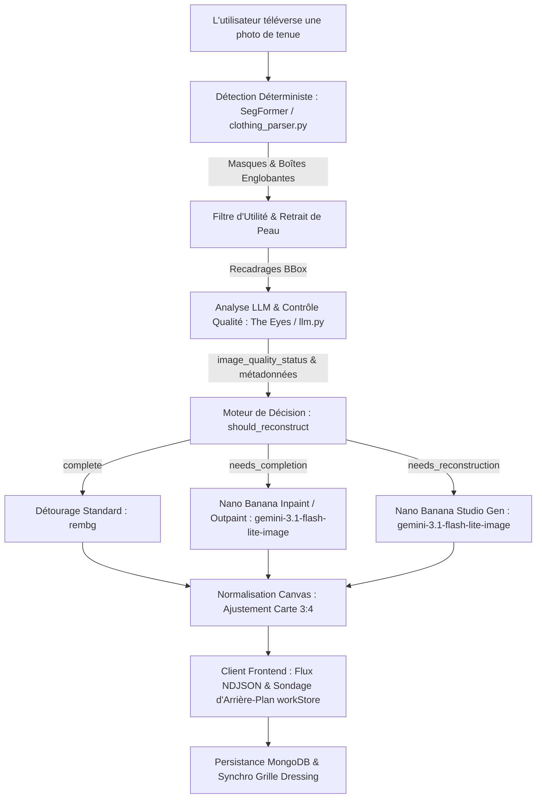

# GarmentVision — Le Pipeline d'Analyse Visuelle et de Reconstruction de DressApp

> **Module :** `backend/app/services/vision/` & `backend/app/services/reconstruction.py`  
> **Statut :** Production (en ligne sur VPS + auto-hébergement `dressapp-eyes`).  
> **Rôle fonctionnel :** Transforme toute photo utilisateur (selfie miroir, photo de tenue ou flat-lay) en articles de garde-robe impeccables, segmentés individuellement, étiquetés et reconstruits par IA.

---

## 1. Synthèse Générale & Proposition de Valeur

### Vue d'Ensemble
GarmentVision constitue le cœur d'intelligence optique de DressApp. Il s'agit d'un pipeline de vision de bout en bout en plusieurs étapes qui ingère des photos d'utilisateurs sans contraintes et génère des articles de garde-robe propres, isolés et photoréalistes. Ancré dans une architecture d'IA hybride, il associe une segmentation déterministe haute vitesse (SegFormer `b3_clothes`) et un détourage d'arrière-plan (`u2netp` / rembg) à un raisonnement multimodal approfondi (Gemini) et à une réparation d'image générative (Nano Banana / `gemini-3.1-flash-lite-image`).

Lorsque les vêtements sur les photos sont masqués par des cheveux, des sacs ou des bras, ou rognés par le cadre de la caméra, le **Contrôleur de Qualité IA** de GarmentVision diagnostique le défaut et déclenche automatiquement la **Complétion d'Image** (inpaint/outpaint des ourlets, manches et cols manquants) ou la **Reconstruction Studio Complète** (régénération des articles tronqués ou partiels en photos de catalogue e-commerce autonomes et immaculées).

### Flux Architectural



### Proposition de Valeur Utilisateur
- **Ingestion Multi-Articles Sans Friction :** Téléversez un seul selfie en pied et isolez automatiquement chaque veste, haut, jupe, pantalon, paire de chaussures et accessoire en quelques secondes.
- **Présentation Impeccable Qualité Studio :** Les vêtements masqués par des membres ou des sacs sont automatiquement complétés ; les articles coupés (chaussures rognées, manteaux partiels) sont entièrement reconstruits en flat-lays studio parfaits.
- **Contrôleur de Qualité Visuelle Intelligent :** The Eyes évalue automatiquement chaque recadrage pour détecter les coupures, occlusions et bords manquants, éliminant toute retouche manuelle.
- **Optimisation Asynchrone des Chemins Critiques :** Les reconstructions génératives s'exécutent en arrière-plan, garantissant une ingestion initiale rapide en moins de 5 secondes.

---

## 2. Guide d'Utilisation Complet

### Topologie de l'Interface Visuelle
```text
┌────────────────────────────────────────────────────────────────────────┐
│  [ Ajouter des vêtements — Caméra & Téléversement ]                    │
│  ┌──────────────────────────────────────────────────────────────────┐  │
│  │  [Caméra en direct / Zone de dépôt de fichiers]                  │  │
│  │  "Prenez ou déposez photos en pied, flat-lays ou reçus"          │  │
│  └──────────────────────────────────────────────────────────────────┘  │
│                                                                        │
│  [ Flux de traitement : Détection & Contrôle Qualité ]                 │
│  ┌─────────────────┐  ┌─────────────────┐  ┌─────────────────┐         │
│  │ Coupe Veste     │  │ Coupe Bas       │  │ Coupe Chaussures│         │
│  │ [Needs Inpaint] │  │ [Needs Outpaint]│  │ [Reconstruct]   │         │
│  │ "Veste Biker"   │  │ "Jupe en Tulle" │  │ "Mules à talons"│         │
│  └─────────────────┘  └─────────────────┘  └─────────────────┘         │
│                                                                        │
│  [ Grille Dressing : Actualisation Temps Réel via workStore ]          │
│  ┌─────────────────┐  ┌─────────────────┐  ┌─────────────────┐         │
│  │ Veste Complète  │  │ Jupe Restaurée  │  │ Chaussures Studio│        │
│  │ (Manches pleines│  │ (Ourlet complet)│  │ (Paire intégrale│         │
│  └─────────────────┘  └─────────────────┘  └─────────────────┘         │
└────────────────────────────────────────────────────────────────────────┘
```

### Modes & Parcours d'Utilisation
1. **Instantané Interactif & Ingestion par Lot :**
   - Appuyez sur **Ajouter un article** &rarr; prenez ou téléversez une photo contenant un ou plusieurs vêtements.
   - Le système effectue des contrôles préventifs anti-doublons en temps réel (SHA-256 via `crypto.subtle` et hachage perceptuel) pour détecter immédiatement les doublons.
2. **Évaluation de Qualité par IA :**
   - Au fur et à mesure que SegFormer segmente les pièces, le Contrôleur de Qualité Gemini inspecte chaque vêtement :
     - `complete` : Le vêtement est parfaitement visible, dégagé et centré. Conservé tel quel.
     - `needs_completion` : Le vêtement présente des parties masquées, des bords manquants, un col coupé ou un ourlet tranché. Placé en file d'attente pour inpainting/outpainting IA.
     - `needs_reconstruction` : L'article est sévèrement amputé (ex. seuls les bouts des chaussures sont visibles). Placé en file d'attente pour génération studio complète.
3. **Complétion Transparente en Arrière-Plan :**
   - En cliquant sur **Enregistrer**, les vêtements apparaissent instantanément dans la grille du dressing.
   - Les tâches de fond exécutent la complétion générative sans bloquer l'interface. Une fois terminée, `workStore` met à jour la carte en temps réel.

---

## 3. Architecture Technique & Capacités Approfondies

### Orchestration Centrale & IA/Logique
- **Moteur de Segmentation (`clothing_parser.py`) :** Utilise SegFormer affiné sur les jeux de données de mode ATR / LIP pour identifier jusqu'à 18 classes, avec soustraction de masque de peau et pontage morphologique des bretelles.
- **Prompting du Contrôleur de Qualité (`llm.py`) :** Schéma de sortie JSON structuré imposant `image_quality_status`, `image_quality_reason` et `reconstruction_prompt`.
- **Moteur de Décision (`reconstruction.py`) :** Évalue le statut LLM combiné à un garde-fou géométrique de contact avec les bords (`_EDGE_TOUCH_MARGIN = 40`) pour s'assurer que les articles coupés par le bord de la photo ne soient jamais traités à tort comme complets.
- **Moteur de Réparation Générative (`gemini_image_service.py`) :**
  - **Inpaint / Outpaint (`edit`) :** Transmet les octets recadrés et le prompt structuré à `gemini-3.1-flash-lite-image` pour préserver la texture du tissu, les motifs et la couleur tout en complétant la géométrie manquante.
  - **Génération Studio (`generate`) :** Interroge `gemini-3.1-flash-lite-image` avec des métadonnées descriptives exhaustives (type de vêtement, matière, couleur, accessoires métalliques, encolure) pour restituer une pièce de catalogue immaculée sur fond blanc cassé.

### Synchronisation Frontend (`workStore.js` & `itemImage.js`)
- **Résolution Centralisée d'Image (`itemImage.js`) :** `bestImageUrl()` donne la priorité absolue à `reconstructed_image_url`, garantissant que les images réparées par IA remplacent immédiatement les vignettes brutes temporaires.
- **Sondage Multi-Pages (`workStore.js`) :** Suivra globalement les tâches de reconstruction en arrière-plan à travers la navigation de l'application, injectant automatiquement les documents mis à jour dans `closetStore`.
