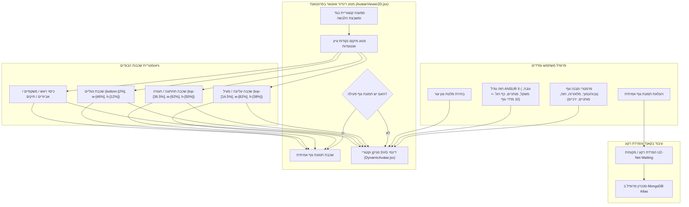

# DressApp — ארכיטקטורת מערכת מיקום ומדידה באווטאר 2D (`Avatar.md`)

> **גרסת מסמך:** 2.0  
> **תת-מערכת יעד:** מניקן דו-ממדי בפרונטאנד, חיתוכי תמונות גוף אמיתיות ומנוע הלבשת בגדים  
> **קבצי ליבה:** `AvatarViewer2D.jsx`, `DynamicAvatar.jsx`, `OutfitCanvas.jsx`, `Profile.jsx`  
> **סטטוס:** מוצר פרודקשן מופעל ומגויל  

---

## 1. תקציר מנהלים והצעת ערך

### 1.1 סקירה כללית ברמה גבוהה
**מערכת המיקום והמדידה באווטאר 2D של DressApp** מספקת סביבת מדידה ויזואלית אדפטיבית בזמן אמת. היא מאפשרת למשתמשים לצפות מראש בפריטי לבוש דיגיטליים המולבשים באופן חלק מעל **תמונת גוף אמיתית מופרדת** או מעל **מניקן וקטורי SVG דו-ממדי דינמי המבוסס על עקומות בזייר**.

כדי להשיג דיוק ויזואלי גבוה במגוון סגנונות לבוש (חולצות צמודות, צווארוני פולו, צווארונים עגולים, ג'ינס בגזרה נמוכה, מכנסי קרגו קצרים ושמלות ערב), המנוע משתמש בכיול נקודות ציון אנטומיות, יחסי גודל פרופורציונליים ומכולות הלבשה שאינן מעוותות את התמונה.



### 1.2 הצעת ערך למשתמש
* **דיוק בדיוק אנטומי**: מציב צווארוני חולצות במדויק בקו הצוואר של האווטאר (`top-[14.5%]`) וחגורות מכנסיים/מכנסיים קצרים בקו המותניים הטבעי (`top-[36.5%]`), מה שמונע הסתרה של הפנים ורווחים לא טבעיים.
* **גמישות אווטאר כפולה**: מעבר מיידי בין תמונת גוף מלאה מופרדת לבין מניקן וקטורי SVG דו-ממדי הבנוי לפי מידות אנתרופומטריות מדויקות.
* **שמירה על פרופורציות תמונה**: מפעיל הרחבה של רוחב החזה והירכיים ($scaleX$) תוך שמירה על יחס הגובה-רוחב המקורי של תמונת הבגד (`object-fit: contain`), מה שמונע מתיחה או כיווץ.
* **היררכיית שכבות אינטראקטיבית**: הלבשת מעילים מעל חולצות ושמלות תוך אפשרות לחיצה ישירה על שכבות בגדים בודדות לפתיחת פרטי הפריט.

---

## 2. מדריך למשתמש שטופולוגיית ממשק

### 2.1 טופולוגיית ממשק ויזואלי

```
┌──────────────────────────────────────────────────────────────────┐
│                     קנבס מדידה באווטאר 2D                        │
├──────────────────────────────────────────────────────────────────┤
│                                                                  │
│                        [ כיסוי ראש   (top: 1%) ]                 │
│                        [ משקפיים     (top: 11%) ]                │
│                        [ קו צוואר    (top: 14.5%) ] ◄─ צווארון   │
│                     ┌──────────────────────────┐                 │
│                     │      חלק עליון / מעילים  │                 │
│                     │       (גובה: 38%)        │                 │
│                     └──────────────────────────┘                 │
│                        [ קו מותניים  (top: 36.5%) ] ◄─ חגורה     │
│                     ┌──────────────────────────┐                 │
│                     │      חלק תחתון / מכנסיים │                 │
│                     │       (גובה: 50%)        │                 │
│                     │                          │                 │
│                     └──────────────────────────┘                 │
│                        [ כפות רגליים (bottom: 2%) ] ◄─── הנעלה   │
│                        [ נעליים      (גובה: 12%) ]               │
│                                                                  │
├──────────────────────────────────────────────────────────────────┤
│  [ החלפת מצב אווטאר ]  [ בורר גוון עור ]  [ עריכת מדדי גוף ]     │
└──────────────────────────────────────────────────────────────────┘
```

### 2.2 תהליכי עבודה ומצבי הפעלה

#### מצב 1: שכבת תמונת גוף אמיתית מופרדת
1. פתחו את **הגדרות הפרופיל** (`/me`).
2. העלו תמונת גוף מלאה. השרת מבצע הפרדת רקע באמצעות `rembg` (U2-Net).
3. כתובת התמונה המופרדת (`body_photo_url`) מעדכנת את פרופיל המשתמש ב-MongoDB ומוצגת בתוך מכולת `AvatarViewer2D`.
4. כדי לחזור למניקן הווקטורי, לחצו על **הסרת תמונה** בדף הפרופיל. הממשק מתעדכן מיד ללא טעינה מחדש של הדף.

#### מצב 2: מניקן וקטורי SVG דינמי
1. כשאין תמונת גוף פעילה, `AvatarViewer2D` מציג את המודול `DynamicAvatar.jsx`.
2. המניקן מייצר עקומות בזייר קוביות רציפות (פקודות $C$ ו-$S$) בתוך viewBox קבוע של `0 0 200 450`.
3. כוונון מדדי הגוף (גובה, משקל, מותניים, חזה, כתפיים, ירכיים) או בחירת גוון עור משנים את צללית המניקן בזמן אמת.

---

## 3. ארכיטקטורה טכנולוגית וניתוח מעמיק

### 3.1 מחלק אליפסה אנטומי ומחולל מניקן בזייר

`DynamicAvatar.jsx` מחשב רוחבי היטל 2D מתוך היקפי גוף 3D באמצעות **מחלק אליפסה אנטומי** ($\text{DIVISOR} = 2.65$):

$$\begin{aligned}
w_{\text{shoulders}} &= (\text{shoulders} \times 1.1) \times (1.05 \text{ if male else } 0.95) \\
w_{\text{chest}} &= \left(\frac{\text{chest}}{2.65} \times 1.05\right) \times (1.02 \text{ if male else } 1.0) \\
w_{\text{waist}} &= \left(\frac{\text{waist}}{2.65} \times 1.0\right) \times (0.98 \text{ if male else } 0.90) \\
w_{\text{hip}} &= \left(\frac{\text{hip}}{2.65} \times 1.05\right) \times (0.93 \text{ if male else } 1.05)
\end{aligned}$$

צללית הגוף נבנית באמצעות פקודות נתיב SVG הממפות נקודות בקרה של עקומות בזייר:

```javascript
// Bezier contour snippet from DynamicAvatar.jsx
const bodyPath = [
  `M ${pNeckR}`,
  `C ${X0 + wNeck + (wShoulders - wNeck) * 0.6},${yChin + neckHeight * 0.7} ${X0 + wShoulders * 0.9},${yShoulders - 2} ${pShoulderR}`,
  `C ${X0 + wShoulders * 0.95},${yShoulders + (yChest - yShoulders) * 0.6} ${X0 + wChest + 2},${yChest - 5} ${pChestR}`,
  `C ${X0 + wChest - 1},${yChest + (yWaist - yChest) * 0.5} ${X0 + wWaist + (isMale ? 1 : -2)},${yWaist - 8} ${pWaistR}`,
  `C ${X0 + wWaist + (isMale ? 2 : 5)},${yWaist + (yHip - yWaist) * 0.4} ${X0 + wHip + 1},${yHip - 8} ${pHipR}`,
  ...
].join(' ');
```

### 3.2 מיקום נקודות ציון מגוילות ויחסי CSS של מכולות

כדי להבטיח שבגדים יישבו בול ללא חפיפה על תכונות פנים או רווחים בגוף, מכולות ההלבשה ב-`AvatarViewer2D.jsx` קשורות ליחסי מיקום CSS מדויקים:

| קטגוריית בגד | קלאס מיקום CSS | z-Index | נקודת ציון ליישור |
| --- | --- | --- | --- |
| **כיסוי ראש** | `top-[1%] left-1/2 w-[34%] aspect-square` | `z-30` | קודקוד הראש |
| **משקפיים** | `top-[11%] left-1/2 w-[18%] h-[4.5%]` | `z-28` | מישור העיניים |
| **אביזר / שרשרת** | `top-[14.5%] left-1/2 w-[30%] aspect-square` | `z-25` | בסיס הצוואר |
| **חלק עליון (Top)** | `top-[14.5%] left-1/2 w-[82%] h-[38%]` | `z-20` | מעבר צווארון לקו הצוואר |
| **ביגוד עליון (מעילים)** | `top-[14.5%] left-1/2 w-[86%] h-[42%]` | `z-22` | שכבת מעיל מעל הכתפיים |
| **שמלה** | `top-[14.5%] left-1/2 w-[82%] h-[68%]` | `z-20` | אורך מלא מכתפיים עד ברכיים |
| **חגורה** | `top-[36.5%] left-1/2 w-[62%] h-[5%]` | `z-21` | לולאות חגורת מותניים |
| **חלק תחתון (מכנסיים)** | `top-[36.5%] left-1/2 w-[62%] h-[50%]` | `z-10` | מחגורה לקו המותניים |
| **נעליים / הנעלה** | `bottom-[2%] left-1/2 w-[46%] h-[12%]` | `z-15` | מקרסול עד מישור כף הרגל |
| **תיק יד** | `top-[40%] right-[-5%] w-[40%] h-[30%]` | `z-25` | נפילת זרוע |

### 3.3 הרחבת רוחב פרופורציונלית של בגדים

בנוסף למיקום, בגדים מתרחבים דינמית אופקית ($scaleX$) בהתאם לפרמטרי הגוף שנבחרו:

```javascript
// Derivation of garment container scale factors in AvatarViewer2D.jsx
const scales = useMemo(() => {
  const heightFactor = 1 + (params.tall * 0.08) - (params.short * 0.08);
  const widthFactor = 1 + (params.heavy * 0.12) - (params.thin * 0.12);
  const chestFactor = 1 + (params.busty * 0.1);
  const waistFactor = 1 + (params.waist_thick * 0.12) - (params.waist_thin * 0.08);
  const hipsFactor = 1 + (params.hips_wide * 0.12) - (params.hips_narrow * 0.08);

  return { height: heightFactor, width: widthFactor, chest: chestFactor, waist: waistFactor, hips: hipsFactor };
}, [params]);

// Passed to Framer Motion animate prop for Top and Bottom:
// Top: scaleX = scales.chest / scales.width
// Bottom: scaleX = scales.hips / scales.width
```

---

## 4. מטריצת סיכום תיקוני מיקום ופרופורציה

| הבעיה שזוהתה | סיבה | התיקון שהוחל | תוצאה |
| --- | --- | --- | --- |
| **צווארון חולצה מוסתר בתוך הפנים** | מיקום הסטה גבוה מדי (`top-[8.3%]` או `top-[12.8%]`) | הגדרת הסטת מכולה עליונה ל-`top-[14.5%]` | צווארון החולצה יושב בדיוק בקו הצוואר של האווטאר. |
| **מכנסיים נמוכים מדי או חופפים** | מיקום הסטה נמוך מדי (`top-[38.5%]`) | הגדרת הסטת מכולה תחתונה ל-`top-[36.5%]` | חגורת המכנסיים יושבת בדיוק בקו המותניים הטבעי. |
| **יחס תמונה מעוות** | מתיחת מכולה ללא הגבלה | העברת `object-fit: contain` עם התאמת `scaleX` | שמירה על יחס התמונה המקורי ללא עיוות אופקי. |
| **השהיה בהסרת תמונה** | נדרשה טעינה מחדש של מצב הדף | סנכרון מצב משתמש מקומי מיידי ב-`Profile.jsx` | תמונת המניקן מתעדכנת מיד ללא השהיית ממשק. |

---
*המסמך נערך אוטומטית על ידי Narrator עבור DressApp.*
