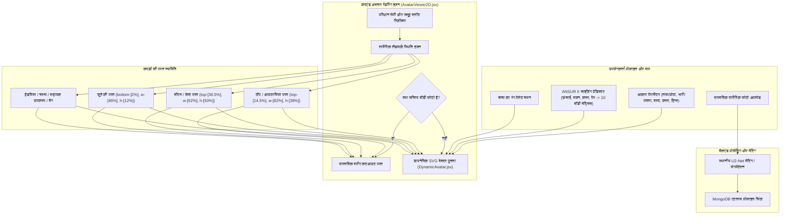

# DressApp — 2D अवतार और ट्राई-ऑन पोजिशनिंग सिस्टम आर्किटेक्चर (`Avatar.md`)

> **दस्तावेज़ संस्करण:** 2.0  
> **लक्षित सबसिस्टम:** फ्रंटएंड 2D पुतला, वास्तविक बॉडी फोटो कटआउट और गारमेंट ओवरले इंजन  
> **कोर फ़ाइलें:** `AvatarViewer2D.jsx`, `DynamicAvatar.jsx`, `OutfitCanvas.jsx`, `Profile.jsx`  
> **स्थिति:** प्रोडक्शन शिप किया गया और कैलिब्रेट किया गया  

---

## 1. कार्यकारी सारांश और मूल्य प्रस्ताव

### 1.1 उच्च-स्तरीय अवलोकन
**DressApp 2D अवतार और ट्राई-ऑन पोजिशनिंग सिस्टम** एक अनुकूली, वास्तविक समय दृश्य ट्राई-ऑन वातावरण प्रदान करता है। यह उपयोगकर्ताओं को एक **खंडित वास्तविक-शरीर तस्वीर** या एक **गतिशील रूप से मोर्फ्ड 2D बेज़ियर वेक्टर SVG पुतले** के ऊपर निर्बाध रूप से स्तरित डिजिटाइज़्ड अलमारी के कपड़ों का पूर्वावलोकन करने की अनुमति देता है।

विभिन्न परिधान शैलियों (कम्प्रेशन शर्ट, पोलो कॉलर, क्रूनेक, लो-राइज़ जींस, कार्गो शॉर्ट्स और औपचारिक कपड़े) में उच्च दृश्य सटीकता देने के लिए, इंजन शारीरिक ऐतिहासिक स्थल अंशांकन, आनुपातिक अनुपात स्केलिंग और गैर-विकृत छवि ओवरले कंटेनरों का उपयोग करता है।



### 1.2 उपयोगकर्ता मूल्य प्रस्ताव
* **शारीरिक संरेखण परिशुद्धता**: शर्ट के कॉलर को अवतार की नेकलाइन (`top-[14.5%]`) और शॉर्ट्स/पैंट वेस्टबैंड को अवतार की प्राकृतिक कमर रेखा (`top-[36.5%]`) के साथ फ्लश करता है, जिससे चेहरे का रुकावट और अजीब अंतराल समाप्त हो जाता है।
* **दोहरी-अवतार लचीलापन**: एक व्यक्तिगत खंडित पूर्ण-शरीर की तस्वीर और सटीक मानवशास्त्रीय मापों के लिए निर्मित एक गतिशील 2D वेक्टर SVG पुतले के बीच तुरंत स्विच करें।
* **आनुपातिक पहलू संरक्षण**: मूल परिधान छवि पहलू अनुपात (`object-fit: contain`) को बनाए रखते हुए छाती और कूल्हे की चौड़ाई स्केलिंग ($scaleX$) लागू करता है, जिससे अवांछित खींचने से बचा जा सकता है।
* **इंटरएक्टिव लेयर पदानुक्रम**: इनर टॉप्स और ड्रेसेस के ऊपर आउटरवियर को स्टैक करें, जबकि अलग-अलग गारमेंट लेयर्स पर सीधे टैप/क्लिक करके आइटम विवरण खोलने की अनुमति दें।

---

## 2. व्यापक उपयोगकर्ता मैनुअल और इंटरफ़ेस टोपोलॉजी

### 2.1 दृश्य इंटरफ़ेस टोपोलॉजी

```
┌──────────────────────────────────────────────────────────────────┐
│                      2D अवतार ट्राई-ऑन कैनवास                    │
├──────────────────────────────────────────────────────────────────┤
│                                                                  │
│                        [ हेडवियर (top: 1%) ]                     │
│                        [ चश्मा    (top: 11%) ]                    │
│                        [ नेकलाइन  (top: 14.5%) ] ◄─ शर्ट कॉलर     │
│                     ┌──────────────────────────┐                 │
│                     │       टॉप्स / आउटरवियर    │                 │
│                     │       (ऊंचाई: 38%)       │                 │
│                     └──────────────────────────┘                 │
│                        [ वेस्टलाइन (top: 36.5%) ] ◄─ कमर का पट्टा │
│                     ┌──────────────────────────┐                 │
│                     │     बॉटम्स / शॉर्ट्स     │                 │
│                     │       (ऊंचाई: 50%)       │                 │
│                     │                          │                 │
│                     └──────────────────────────┘                 │
│                        [ पैर      (bottom: 2%) ] ◄─── फुटवियर    │
│                        [ जूते      (ऊंचाई: 12%) ]                │
│                                                                  │
├──────────────────────────────────────────────────────────────────┤
│  [ स्विच अवतार मोड ]  [ त्वचा रंग चयनकर्ता ]  [ माप संपादित करें ]  │
└──────────────────────────────────────────────────────────────────┘
```

### 2.2 मोड और वर्कफ़्लो वॉकथ्रू

#### मोड 1: वास्तविक-शरीर फोटो कटआउट परत
1. **प्रोफ़ाइल सेटिंग्स** (`/me`) खोलें।
2. पूर्ण-शरीर की तस्वीर अपलोड करें। बैकएंड पृष्ठभूमि शोर को दूर करने के लिए `rembg` (U2-Net) के माध्यम से पृष्ठभूमि विभाजन निष्पादित करता है।
3. संसाधित कटआउट URL (`body_photo_url`) MongoDB में उपयोगकर्ता प्रोफ़ाइल को अपडेट करता है और `AvatarViewer2D` कंटेनर के अंदर रेंडर करता है।
4. वेक्टर पुतले पर वापस लौटने के लिए, प्रोफ़ाइल पृष्ठ पर **फोटो हटाएं** पर क्लिक करें। शून्य पेज पुनः लोड के साथ UI तुरंत अपडेट होता है।

#### मोड 2: डायनेमिक वेक्टर SVG पुतला
1. जब कोई बॉडी फोटो मौजूद नहीं होती है, तो `AvatarViewer2D` `DynamicAvatar.jsx` को रेंडर करता है।
2. पुतला एक निश्चित `0 0 200 450` SVG व्यूबॉक्स के भीतर निरंतर क्यूबिक बेज़ियर वक्र ($C$ और $S$ कमांड) उत्पन्न करता है।
3. शरीर के मापदंडों को समायोजित करना या त्वचा का रंग चुनना वास्तविक समय में पुतले के सिल्हूट को गतिशील रूप से बदल देता है।

---

## 3. प्रौद्योगिकी स्टैक और क्षमता गहराई से जानें

### 3.1 शारीरिक दीर्घवृत्त भाजक और बेज़ियर पुतला जनरेटर

`DynamicAvatar.jsx` एक **शारीरिक दीर्घवृत्त भाजक** ($\text{DIVISOR} = 2.65$) का उपयोग करके 3D शारीरिक परिधियों से 2D समतलीय प्रक्षेपण चौड़ाई की गणना करता है:

$$\begin{aligned}
w_{\text{shoulders}} &= (\text{shoulders} \times 1.1) \times (1.05 \text{ if male else } 0.95) \\
w_{\text{chest}} &= \left(\frac{\text{chest}}{2.65} \times 1.05\right) \times (1.02 \text{ if male else } 1.0) \\
w_{\text{waist}} &= \left(\frac{\text{waist}}{2.65} \times 1.0\right) \times (0.98 \text{ if male else } 0.90) \\
w_{\text{hip}} &= \left(\frac{\text{hip}}{2.65} \times 1.05\right) \times (0.93 \text{ if male else } 1.05)
\end{aligned}$$

शरीर के सिल्हूट का निर्माण क्यूबिक बेज़ियर नियंत्रण बिंदुओं का मानचित्रण करने वाले SVG पथ आदेशों के माध्यम से किया जाता है:

```javascript
// Bezier contour snippet from DynamicAvatar.jsx
const bodyPath = [
  `M ${pNeckR}`,
  `C ${X0 + wNeck + (wShoulders - wNeck) * 0.6},${yChin + neckHeight * 0.7} ${X0 + wShoulders * 0.9},${yShoulders - 2} ${pShoulderR}`,
  `C ${X0 + wShoulders * 0.95},${yShoulders + (yChest - yShoulders) * 0.6} ${X0 + wChest + 2},${yChest - 5} ${pChestR}`,
  `C ${X0 + wChest - 1},${yChest + (yWaist - yChest) * 0.5} ${X0 + wWaist + (isMale ? 1 : -2)},${yWaist - 8} ${pWaistR}`,
  `C ${X0 + wWaist + (isMale ? 2 : 5)},${yWaist + (yHip - yWaist) * 0.4} ${X0 + wHip + 1},${yHip - 8} ${pHipR}`,
  ...
].join(' ');
```

### 3.2 कैलिब्रेटेड लैंडमार्क पोजिशनिंग और कंटेनर CSS अनुपात

यह गारंटी देने के लिए कि कपड़े चेहरे की विशेषताओं को ओवरलैप किए बिना या शरीर के अंतराल को छोड़े बिना फ्लश बैठते हैं, `AvatarViewer2D.jsx` में ओवरले कंटेनर सटीक CSS स्थितिगत अनुपातों से बंधे होते हैं:

| परिधान श्रेणी | CSS स्थिति वर्ग | z-Index | संरेखण मील का पत्थर |
| --- | --- | --- | --- |
| **हेडवियर** | `top-[1%] left-1/2 w-[34%] aspect-square` | `z-30` | सिर का मुकुट |
| **चश्मा** | `top-[11%] left-1/2 w-[18%] h-[4.5%]` | `z-28` | आँखों का तल |
| **सहायक उपकरण / हार** | `top-[14.5%] left-1/2 w-[30%] aspect-square` | `z-25` | गर्दन का आधार |
| **टॉप** | `top-[14.5%] left-1/2 w-[82%] h-[38%]` | `z-20` | नेकलाइन के लिए कॉलर |
| **आउटरवियर** | `top-[14.5%] left-1/2 w-[86%] h-[42%]` | `z-22` | कंधे पर कोट लेयरिंग |
| **ड्रेस** | `top-[14.5%] left-1/2 w-[82%] h-[68%]` | `z-20` | घुटने तक पूरी लंबाई |
| **बेल्ट** | `top-[36.5%] left-1/2 w-[62%] h-[5%]` | `z-21` | वेस्टलाइन बेल्ट लूप |
| **बॉटम (पैंट/शॉर्ट्स)** | `top-[36.5%] left-1/2 w-[62%] h-[50%]` | `z-10` | वेस्टलाइन के लिए वेस्टबैंड |
| **जूते / फुटवियर** | `bottom-[2%] left-1/2 w-[46%] h-[12%]` | `z-15` | पैर के तल तक टखना |
| **हैंडबैग** | `top-[40%] right-[-5%] w-[40%] h-[30%]` | `z-25` | आर्म ड्रॉप प्लेन |

### 3.3 परिधान आनुपातिक चौड़ाई स्केलिंग

स्थितिगत प्लेसमेंट के अलावा, उपयोगकर्ता द्वारा चुने गए शरीर के मापदंडों के आधार पर परिधान गतिशील रूप से क्षैतिज रूप से ($scaleX$) स्केल करते हैं:

```javascript
// Derivation of garment container scale factors in AvatarViewer2D.jsx
const scales = useMemo(() => {
  const heightFactor = 1 + (params.tall * 0.08) - (params.short * 0.08);
  const widthFactor = 1 + (params.heavy * 0.12) - (params.thin * 0.12);
  const chestFactor = 1 + (params.busty * 0.1);
  const waistFactor = 1 + (params.waist_thick * 0.12) - (params.waist_thin * 0.08);
  const hipsFactor = 1 + (params.hips_wide * 0.12) - (params.hips_narrow * 0.08);

  return { height: heightFactor, width: widthFactor, chest: chestFactor, waist: waistFactor, hips: hipsFactor };
}, [params]);

// Passed to Framer Motion animate prop for Top and Bottom:
// Top: scaleX = scales.chest / scales.width
// Bottom: scaleX = scales.hips / scales.width
```

---

## 4. स्थिति और अनुपात सुधार का सारांश मैट्रिक्स

| पहचानी गई समस्या | कारण | लागू किया गया सुधार | परिणाम |
| --- | --- | --- | --- |
| **शर्ट का कॉलर चेहरे को ओवरलैप कर रहा है** | ऑफ़सेट बहुत अधिक स्थित है (`top-[8.3%]` या `top-[12.8%]`) | शीर्ष कंटेनर ऑफ़सेट को `top-[14.5%]` पर सेट करें | शर्ट का कॉलर अवतार की नेकलाइन पर फ्लश बैठता है। |
| **पैंट/शॉर्ट्स कम या ओवरलैपिंग हैं** | ऑफ़सेट बहुत कम स्थित है (`top-[38.5%]`) | नीचे के कंटेनर ऑफ़सेट को `top-[36.5%]` पर सेट करें | पैंट का वेस्टबैंड अवतार की प्राकृतिक कमर रेखा पर फ्लश बैठता है। |
| **विकृत परिधान पहलू अनुपात** | अप्रतिबंधित कंटेनर स्ट्रेचिंग | आनुपातिक `scaleX` समायोजन के साथ `object-fit: contain` लागू किया गया | क्षैतिज विरूपण के बिना मूल छवि पहलू अनुपात को बरकरार रखता है। |
| **फोटो हटाने में देरी** | पेज स्थिति की पुनः प्राप्ति आवश्यक है | `Profile.jsx` में तत्काल स्थानीय उपयोगकर्ता स्थिति सिंक लागू किया गया | फोटो हटाना बिना किसी UI अंतराल के तुरंत पूर्वावलोकन दिखाता है। |

---
*DressApp के लिए Narrator द्वारा स्वचालित रूप से संकलित दस्तावेज़।*
