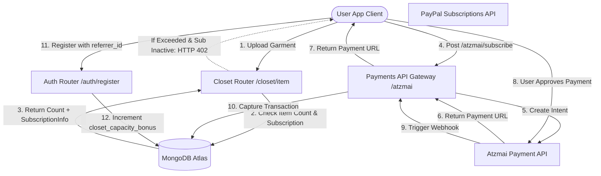

# DressApp मुद्रीकरण और बिलिंग इंजन

यह दस्तावेज़ DressApp में मुद्रीकरण, सब्सक्रिप्शन बिलिंग और वायरल विकास-लूप यांत्रिकी का एक व्यापक वास्तुशिल्प अवलोकन, उपयोगकर्ता मैनुअल और तकनीकी गहराई से विश्लेषण प्रदान करता है।

---

## 1. कार्यकारी सारांश और मूल्य प्रस्ताव

### उच्च-स्तरीय अवलोकन (High-Level Overview)
DressApp एक हाइब्रिड SaaS सब्सक्रिप्शन और प्रीपेड उपयोगिता क्रेडिट मॉडल को लागू करता है:
1. **सब्सक्रिप्शन टियर (SaaS)**: फ्लैट-रेट प्लान (Free, Manager, Professional) जो अलमारी भंडारण क्षमता, दैनिक AI स्टाइलिंग कोटा और उन्नत सुविधाओं (जैसे, विज्ञापन अभियान मॉडरेशन) को नियंत्रित करते हैं।
2. **प्रीपेड क्रेडिट बकेट (उपयोगिता)**: उन्नत AI संचालन (जैसे, वर्चुअल स्टाइलिस्ट प्रश्न और फोटो विभाजन) के लिए विस्तृत खपत-आधारित क्रेडिट। ये क्रेडिट मुफ़्त और सशुल्क पूल में अंतर करने के लिए एक एजिंग सिस्टम का उपयोग करते हैं।
3. **वायरल विकास लूप**: एक रेफ़रल कार्यक्रम जो Free टियर उपयोगकर्ताओं को आमंत्रण लिंक साझा करके व्यवस्थित रूप से अपनी आधारभूत अलमारी क्षमता का विस्तार करने की अनुमति देता है।
4. **स्थानीयकृत भुगतान (Atzmai गेटवे)**: वैश्विक PayPal भुगतानों के साथ ILS/USD में स्थानीय इजरायली भुगतानों (Bit, स्थानीय क्रेडिट कार्ड) के लिए देशी समर्थन।

### वास्तुशिल्प प्रवाह (Architectural Flow)



---

## 2. सब्सक्रिप्शन टियर और मूल्य निर्धारण टोपोलॉजी

### मूल्य निर्धारण योजनाएं

| Plan | Price (Monthly) | Closet Capacity | AI Credits Allocation | Key Features |
| :--- | :--- | :--- | :--- | :--- |
| **Free Plan** | $0.00 / माह | 50 आइटम बेसलाइन | 10 मुफ़्त दैनिक क्रेडिट (30 दिनों में समाप्त होने वाले) | बुनियादी संगठन, सामुदायिक सहायता, रेफ़रल विस्तार (+10 स्लॉट प्रति पंजीकरण, अधिकतम 1000 आइटम तक) |
| **Manager (Pro)** | $4.99 / माह | असीमित | असीमित दैनिक संचालन | 14-दिन का निःशुल्क ट्रायल, 50-क्रेडिट प्रारंभिक आवंटन, बाज़ार में बिक्री और किराए पर देना, Trend Scout, निर्धारित सूचनाएं |
| **Professional** | $9.99 / माह | असीमित | असीमित दैनिक संचालन | 30-दिन का निःशुल्क ट्रायल, 300-क्रेडिट प्रारंभिक आवंटन, सभी Manager सुविधाएँ, फ़ीड में विज्ञापन अभियान बनाने का समर्थन |

### प्रीपेड AI क्रेडिट पैक

यदि उपयोगकर्ताओं के स्टाइलिंग क्रेडिट समाप्त हो जाते हैं, तो वे सेवा व्यवधान से बचने के लिए अतिरिक्त पैकेज खरीद सकते हैं:

* **10 क्रेडिट पैक**: $1.99 / 10.00 ILS
* **25 क्रेडिट पैक**: $3.99 / 25.00 ILS
* **50 क्रेडिट पैक**: $7.99 / 50.00 ILS
* **100 क्रेडिट पैक**: $15.99 / 100.00 ILS
* **कस्टम टॉप-अप राशि**: उपयोगकर्ता द्वारा निर्दिष्ट ILS राशि (Atzmai गेटवे सत्यापन के लिए न्यूनतम 5.00 ILS सीमा)।

### क्रेडिट समाप्ति और खपत प्राथमिकता (FIFO लॉजिक)
* **सशुल्क क्रेडिट**: टॉप-अप पैक के माध्यम से खरीदे गए। सशुल्क क्रेडिट **कभी समाप्त नहीं होते**।
* **मुफ़्त क्रेडिट**: दैनिक या ट्रायल आवंटन के माध्यम से प्रदान किए जाते हैं। मुफ़्त क्रेडिट **निर्माण के 30 दिन बाद समाप्त हो जाते हैं**।
* **क्रेडिट कटौती प्राथमिकता**: जब एक AI अनुरोध किया जाता है, तो इंजन सशुल्क क्रेडिट से लेने से पहले **सबसे पुराने समाप्त होने वाले मुफ़्त बकेट से क्रेडिट** की स्वचालित रूप से जांच करता है और उनका उपभोग करता है।

---

## 3. स्थानीयकृत भुगतान और चालान (Atzmai गेटवे)

इजरायल में स्थित खातों के लिए, DressApp स्थानीय लेनदेन को ILS (शेकेल) या USD में संसाधित करने के लिए **Atzmai भुगतान गेटवे** के साथ एकीकृत होता है:
1. **भुगतान विधियां**: Bit मोबाइल चेकआउट रीडायरेक्ट लिंक और नियमित इजरायली क्रेडिट कार्ड का समर्थन करता है।
2. **सब्सक्रिप्शन डायरेक्ट डेबिट**: आवर्ती Pro और Business सब्सक्रिप्शन के लिए मासिक/वार्षिक प्रत्यक्ष डेबिट सेटअप का समर्थन करता है।
3. **वेबहुक सत्यापन**: `POST /api/v1/atzmai/webhook` पर भुगतान कॉलबैक को कैप्चर करता है, `atzmai_topups` संग्रह में मिलान रिकॉर्ड को मान्य करता है, और लेनदेन की स्थिति को `captured` में बदलता है।
4. **स्वचालित PDF बहीखाता**: सफल कैप्चर पर, बैकएंड आधिकारिक चालान और रसीद PDF उत्पन्न करने और डाउनलोड करने के लिए Atzmai बिलिंग API से पूछताछ करता है। ये सीधे खरीदार को ईमेल अनुलग्नक के रूप में भेजे जाते हैं।

---

## 4. तकनीकी स्टैक और क्षमता गहन-विश्लेषण

### डेटा स्कीमा परिभाषाएं (Data Schema Definitions)

[schemas.py](file:///C:/DressApp_AG/backend/app/models/schemas.py) में MongoDB स्कीमा उपयोगकर्ता सदस्यता और क्रेडिट बकेट को ट्रैक करता है:

```python
class CreditBucket(BaseModel):
    amount: int
    type: Literal["free", "paid"]
    created_at: str  # ISO timestamp
    expires_at: str | None = None  # None means infinite (paid credits)

class SubscriptionInfo(BaseModel):
    is_active: bool = False
    plan_type: Literal["free", "monthly", "yearly"] = "free"
    tier: Literal["free", "manager", "professional"] = "free"
    stripe_subscription_id: str | None = None
    paypal_subscription_id: str | None = None
    atzmai_subscription_id: str | None = None
    expires_at: str | None = None
    cancelled_at: str | None = None

class User(BaseDoc):
    subscription: SubscriptionInfo = Field(default_factory=SubscriptionInfo)
    credit_buckets: List[CreditBucket] = Field(default_factory=list)
    closet_capacity_bonus: int = 0
```

### अलमारी सीमा प्रवर्तन ([closet.py](file:///C:/DressApp_AG/backend/app/api/v1/closet.py))
आइटम अपलोड के दौरान, सिस्टम डेटाबेस सीमाओं की सुरक्षा करता है:
```python
capacity_limit = 50 + user.get("closet_capacity_bonus", 0)
if current_count >= capacity_limit and not user.get("subscription", {}).get("is_active", False):
    raise HTTPException(
        status_code=402,
        detail={
            "code": "closet_capacity_exceeded",
            "message": f"You have reached your free closet capacity of {capacity_limit} items. Upgrade to Manager or Professional to add more items."
        }
    )
```

### क्रेडिट कटौती एल्गोरिदम ([credit.py](file:///C:/DressApp_AG/backend/app/models/credit.py))
क्रेडिट FIFO (प्रथम-इन-प्रथम-आउट) प्राथमिकता कतार का उपयोग करके खर्च किए जाते हैं:
```python
def spend_credits(buckets: List[CreditBucket], required_amount: int) -> Tuple[bool, List[dict]]:
    # Sort active buckets: 
    # Priority 0: Free expiring soonest
    # Priority 1: Free other
    # Priority 2: Paid (never expires)
    active_buckets = []
    for idx, b in enumerate(buckets):
        if b.type == "free" and b.expires_at and now > b.expires_at:
            continue
        priority = (0, b.expires_at) if b.type == "free" and b.expires_at else (1, b.created_at) if b.type == "free" else (2, b.created_at)
        active_buckets.append((priority, idx, b))
    
    active_buckets.sort(key=lambda x: x[0])
    # ... deduct required_amount from sorted list ...
```
