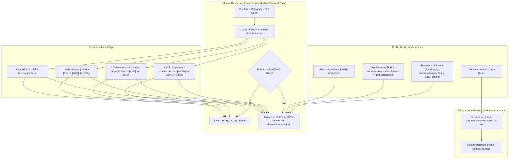

# DressApp — Architettura del Sistema di Posizionamento e Prova Avatar 2D (`Avatar.md`)

> **Versione del Documento:** 2.0  
> **Sottosistema Obiettivo:** Manichino 2D Frontend, Ritagli Foto Corporee Reali & Motore di Sovrapposizione Capi  
> **File Principali:** `AvatarViewer2D.jsx`, `DynamicAvatar.jsx`, `OutfitCanvas.jsx`, `Profile.jsx`  
> **Stato:** Rilasciato in Produzione & Calibrato  

---

## 1. Sintesi Esecutiva e Proposta di Valore

### 1.1 Panoramica Generale
Il **Sistema di Posizionamento e Prova Avatar 2D di DressApp** fornisce un ambiente di prova visiva adattivo in tempo reale. Consente agli utenti di visualizzare in anteprima i capi digitalizzati del guardaroba sovrapposti senza interruzioni su una **fotografia corporea reale segmentata** o su un **manichino vettoriale SVG 2D con curve di Bézier**.

Per garantire un'elevata accuratezza visiva su diversi stili di abbigliamento (magliette a compressione, colletti polo, girocollo, jeans a vita bassa, bermuda cargo e abiti da sera), il motore utilizza la calibrazione dei punti di riferimento anatomici, il ridimensionamento proporzionale delle proporzioni e contenitori di sovrapposizione delle immagini senza distorsione.



### 1.2 Proposta di Valore per l'Utente
* **Precisione di Allineamento Anatomico**: Allinea perfettamente i colletti delle camicie alla scollatura dell'avatar (`top-[14.5%]`) e le cinture di pantaloni/pantaloncini alla vita naturale dell'avatar (`top-[36.5%]`), eliminando occlusioni del viso o spazi antiestetici.
* **Flessibilità del Doppio Avatar**: Passa all'istante da una foto a figura intera ritagliata a un manichino vettoriale SVG 2D dinamico costruito su misurazioni antropometriche esatte.
* **Conservazione Proporzionale dell'Aspetto**: Applica il ridimensionamento della larghezza di torace e fianchi ($scaleX$) mantenendo il rapporto di forma originale dell'immagine del capo (`object-fit: contain`).
* **Gerarchia di Livelli Interattivi**: Sovrapponi capispalla a maglie e abiti consentendo al contempo clic diretti sui singoli capi per aprirne i dettagli.

---

## 2. Manuale Utente Completo e Topologia dell'Interfaccia

### 2.1 Topologia Visiva dell'Interfaccia

```
┌──────────────────────────────────────────────────────────────────┐
│                     Tela Prova Avatar 2D                         │
├──────────────────────────────────────────────────────────────────┤
│                                                                  │
│                        [ Cappelli     (top: 1%) ]                │
│                        [ Occhiali     (top: 11%) ]               │
│                        [ Scollatura   (top: 14.5%) ] ◄─ Colletto  │
│                     ┌──────────────────────────┐                 │
│                     │    Maglie / Capispalla   │                 │
│                     │       (altezza: 38%)     │                 │
│                     └──────────────────────────┘                 │
│                        [ Vita         (top: 36.5%) ] ◄─ Cintura  │
│                     ┌──────────────────────────┐                 │
│                     │    Pantaloni / Bermuda   │                 │
│                     │       (altezza: 50%)     │                 │
│                     │                          │                 │
│                     └──────────────────────────┘                 │
│                        [ Piedi       (bottom: 2%) ] ◄─── Scarpe  │
│                        [ Scarpe       (altezza: 12%) ]           │
│                                                                  │
├──────────────────────────────────────────────────────────────────┤
│  [ Cambia Avatar ]   [ Selettore Pelle ]   [ Modifica Misure ]   │
└──────────────────────────────────────────────────────────────────┘
```

### 2.2 Modalità e Flussi di Lavoro

#### Modalità 1: Livello Ritaglio Foto Corporea Reale
1. Apri le **Impostazioni del Profilo** (`/me`).
2. Carica una fotografia a figura intera. Il backend esegue la segmentazione dello sfondo tramite `rembg` (U2-Net).
3. L'URL della foto elaborata (`body_photo_url`) aggiorna il profilo utente in MongoDB e si visualizza nel contenitore `AvatarViewer2D`.
4. Per tornare al manichino vettoriale, fai clic su **Rimuovi foto** nella pagina del profilo.

#### Modalità 2: Manichino Vettoriale SVG Dinamico
1. Quando non è presente alcuna foto del corpo, `AvatarViewer2D` mostra `DynamicAvatar.jsx`.
2. Il manichino genera curve di Bézier cubiche (comandi $C$ e $S$) all'interno di un viewBox fisso di `0 0 200 450`.
3. La regolazione dei parametri corporei (Altezza, Peso, Vita, Petto, Spalle, Fianchi) o la selezione della tonalità della pelle modifica la silhouette in tempo reale.

---

## 3. Architettura Tecnologica e Approfondimento Funzionale

### 3.1 Divisore Ellittico Anatomico e Generatore Manichino Bézier

`DynamicAvatar.jsx` calcola le larghezze di proiezione 2D dalle circonferenze anatomiche 3D utilizzando un **Divisore Ellittico Anatomico** ($\text{DIVISOR} = 2.65$):

$$\begin{aligned}
w_{\text{shoulders}} &= (\text{shoulders} \times 1.1) \times (1.05 \text{ if male else } 0.95) \\
w_{\text{chest}} &= \left(\frac{\text{chest}}{2.65} \times 1.05\right) \times (1.02 \text{ if male else } 1.0) \\
w_{\text{waist}} &= \left(\frac{\text{waist}}{2.65} \times 1.0\right) \times (0.98 \text{ if male else } 0.90) \\
w_{\text{hip}} &= \left(\frac{\text{hip}}{2.65} \times 1.05\right) \times (0.93 \text{ if male else } 1.05)
\end{aligned}$$

La silhouette corporea è costruita tramite comandi di percorso SVG mappando punti di controllo Bézier cubici:

```javascript
// Bezier contour snippet from DynamicAvatar.jsx
const bodyPath = [
  `M ${pNeckR}`,
  `C ${X0 + wNeck + (wShoulders - wNeck) * 0.6},${yChin + neckHeight * 0.7} ${X0 + wShoulders * 0.9},${yShoulders - 2} ${pShoulderR}`,
  `C ${X0 + wShoulders * 0.95},${yShoulders + (yChest - yShoulders) * 0.6} ${X0 + wChest + 2},${yChest - 5} ${pChestR}`,
  `C ${X0 + wChest - 1},${yChest + (yWaist - yChest) * 0.5} ${X0 + wWaist + (isMale ? 1 : -2)},${yWaist - 8} ${pWaistR}`,
  `C ${X0 + wWaist + (isMale ? 2 : 5)},${yWaist + (yHip - yWaist) * 0.4} ${X0 + wHip + 1},${yHip - 8} ${pHipR}`,
  ...
].join(' ');
```

### 3.2 Posizionamento Calibrato e Rapporti CSS del Contenitore

Per garantire che i capi aderiscano perfettamente senza sovrapporsi ai tratti del viso o lasciare spazi vuoti sul corpo, i contenitori in `AvatarViewer2D.jsx` sono legati a precisi rapporti di posizione CSS:

| Categoria Capo | Classe Posizione CSS | z-Index | Punto Anatomico di Riferimento |
| --- | --- | --- | --- |
| **Cappelli** | `top-[1%] left-1/2 w-[34%] aspect-square` | `z-30` | Sommmità della testa |
| **Occhiali** | `top-[11%] left-1/2 w-[18%] h-[4.5%]` | `z-28` | Linea degli occhi |
| **Accessori / Collana** | `top-[14.5%] left-1/2 w-[30%] aspect-square` | `z-25` | Base del collo |
| **Maglia (Top)** | `top-[14.5%] left-1/2 w-[82%] h-[38%]` | `z-20` | Dal colletto alla scollatura |
| **Capispalla** | `top-[14.5%] left-1/2 w-[86%] h-[42%]` | `z-22` | Sovrapposizione giacca sulle spalle |
| **Abiti** | `top-[14.5%] left-1/2 w-[82%] h-[68%]` | `z-20` | Lunghezza intera dalle spalle al ginocchio |
| **Cintura** | `top-[36.5%] left-1/2 w-[62%] h-[5%]` | `z-21` | Passante della cintura in vita |
| **Pantaloni / Bermuda** | `top-[36.5%] left-1/2 w-[62%] h-[50%]` | `z-10` | Dalla cintura alla vita naturale |
| **Scarpe** | `bottom-[2%] left-1/2 w-[46%] h-[12%]` | `z-15` | Dalla caviglia al piano del piede |
| **Borsa a mano** | `top-[40%] right-[-5%] w-[40%] h-[30%]` | `z-25` | Caduta del braccio |

### 3.3 Scalabilità Proporzionale della Larghezza

Oltre al posizionamento, i capi si ridimensionano dinamicamente in orizzontale ($scaleX$) in base ai parametri corporei selezionati:

```javascript
// Derivation of garment container scale factors in AvatarViewer2D.jsx
const scales = useMemo(() => {
  const heightFactor = 1 + (params.tall * 0.08) - (params.short * 0.08);
  const widthFactor = 1 + (params.heavy * 0.12) - (params.thin * 0.12);
  const chestFactor = 1 + (params.busty * 0.1);
  const waistFactor = 1 + (params.waist_thick * 0.12) - (params.waist_thin * 0.08);
  const hipsFactor = 1 + (params.hips_wide * 0.12) - (params.hips_narrow * 0.08);

  return { height: heightFactor, width: widthFactor, chest: chestFactor, waist: waistFactor, hips: hipsFactor };
}, [params]);

// Passed to Framer Motion animate prop for Top and Bottom:
// Top: scaleX = scales.chest / scales.width
// Bottom: scaleX = scales.hips / scales.width
```

---

## 4. Matrice Riassuntiva delle Correzioni

| Problema Identificato | Causa | Correzione Applicata | Risultato |
| --- | --- | --- | --- |
| **Colletto della camicia che copre il viso** | Offset posizionato troppo in alto (`top-[8.3%]` o `top-[12.8%]`) | Impostato offset del contenitore superiore a `top-[14.5%]` | Il colletto si allinea perfettamente alla scollatura dell'avatar. |
| **Pantaloni troppo bassi o sovrapposti** | Offset posizionato troppo in basso (`top-[38.5%]`) | Impostato offset del contenitore inferiore a `top-[36.5%]` | La cintura si allinea perfettamente alla vita naturale dell'avatar. |
| **Rapporto di forma delle immagini distorto** | Allungamento del contenitore non vincolato | Applicato `object-fit: contain` con regolazione `scaleX` | Mantiene le proporzioni originali senza distorsioni orizzontali. |
| **Ritardo nella rimozione della foto** | Richiesta di ricaricamento dello stato della pagina | Implementata sincronizzazione istantanea dello stato utente in `Profile.jsx` | La rimozione della foto si aggiorna all'istante senza ritardi dell'interfaccia. |

---
*Documento compilato automaticamente da Narrator per DressApp.*
