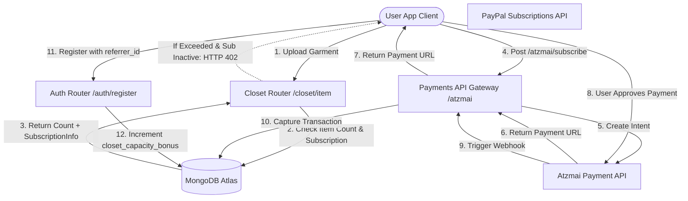

# Motore di monetizzazione e fatturazione di DressApp

Questo documento fornisce una panoramica architetturale completa, un manuale utente e un approfondimento tecnologico dei meccanismi di monetizzazione, fatturazione degli abbonamenti e cicli di crescita virale in DressApp.

---

## 1. Sintesi esecutiva e proposta di valore

### Panoramica di alto livello
DressApp implementa un modello ibrido di abbonamento SaaS e sistema di crediti di servizio prepagati:
1. **Piani di abbonamento (SaaS)**: Piani a tariffa fissa (Free, Manager, Professional) che regolano la capacità dell'armadio, le quote giornaliere di styling IA e le funzionalità avanzate (ad es. moderazione delle campagne pubblicitarie).
2. **Pacchetti di crediti prepagati (Servizio)**: Crediti granulari basati sul consumo per operazioni avanzate di IA (ad es. query del Virtual Stylist e segmentazione delle foto). Questi crediti utilizzano un sistema di scadenza per differenziare i crediti gratuiti da quelli a pagamento.
3. **Ciclo di crescita virale**: Un programma di referral che consente agli utenti del piano Free di espandere organicamente la capacità di base dell'armadio condividendo link di invito.
4. **Pagamenti localizzati (Gateway Atzmai)**: Supporto nativo per pagamenti israeliani (Bit, carte di credito locali) in ILS/USD oltre ai pagamenti PayPal globali.

### Flusso architetturale



---

## 2. Piani di abbonamento e struttura dei prezzi

### Piani tariffari

| Plan | Price (Monthly) | Closet Capacity | AI Credits Allocation | Key Features |
| :--- | :--- | :--- | :--- | :--- |
| **Free Plan** | $0.00 / mese | 50 articoli base | 10 crediti giornalieri gratuiti (scadono in 30 giorni) | Organizzazione di base, supporto community, espansioni referral (+10 slot per registrazione fino a 1000 articoli) |
| **Manager (Pro)** | $4.99 / mese | Illimitato | Operazioni giornaliere illimitate | Prova gratuita di 14 giorni, allocazione iniziale di 50 crediti, vendita e noleggio nel marketplace, Trend Scout, notifiche pianificate |
| **Professional** | $9.99 / mese | Illimitato | Operazioni giornaliere illimitate | Prova gratuita di 30 giorni, allocazione iniziale di 300 crediti, tutte le funzionalità Manager, supporto per la creazione di campagne pubblicitarie nel feed |

### Pacchetti di crediti IA prepagati

Se gli utenti esauriscono i crediti di styling, possono acquistare pacchetti aggiuntivi per evitare interruzioni del servizio:

* **Pacchetto da 10 crediti**: $1.99 / 10.00 ILS
* **Pacchetto da 25 crediti**: $3.99 / 25.00 ILS
* **Pacchetto da 50 crediti**: $7.99 / 50.00 ILS
* **Pacchetto da 100 crediti**: $15.99 / 100.00 ILS
* **Importo di ricarica personalizzato**: Importo in ILS specificato dall'utente (soglia minima di 5.00 ILS per la convalida del gateway Atzmai).

### Scadenza dei crediti e priorità di consumo (Logica FIFO)
* **Crediti a pagamento**: Acquistati tramite pacchetti di ricarica. I crediti a pagamento **non scadono mai**.
* **Crediti gratuiti**: Assegnati giornalmente o tramite prove. I crediti gratuiti **scadono 30 giorni dopo la creazione**.
* **Priorità di detrazione**: Quando viene effettuata una richiesta IA, il motore verifica e consuma automaticamente i crediti dai **pacchetti gratuiti più vecchi in scadenza** prima di attingere ai crediti a pagamento.

---

## 3. Pagamenti localizzati e fatturazione (Gateway Atzmai)

Per gli account con sede in Israele, DressApp si integra con il **gateway di pagamento Atzmai** per elaborare le transazioni locali in ILS (Shekel) o USD:
1. **Metodi di pagamento**: Supporta i link di reindirizzamento per i pagamenti mobili Bit e le normali carte di credito israeliane.
2. **Addebiti diretti per abbonamento**: Supporta configurazioni di addebito diretto mensile/annuale per la fatturazione ricorrente degli abbonamenti Pro e Business.
3. **Verifica Webhook**: Cattura i callback di pagamento su `POST /api/v1/atzmai/webhook`, convalida i record corrispondenti nella raccolta `atzmai_topups` e modifica lo stato della transazione in `captured`.
4. **Contabilità PDF automatizzata**: Una volta acquisito con successo, il backend interroga l'API di fatturazione Atzmai per generare e scaricare i PDF ufficiali di ricevute e fatture. Questi vengono inviati come allegati e-mail direttamente all'acquirente.

---

## 4. Stack tecnologico e approfondimento delle funzionalità

### Definizioni dello schema dei dati (Data Schema Definitions)

Lo schema MongoDB in [schemas.py](file:///C:/DressApp_AG/backend/app/models/schemas.py) tiene traccia degli abbonamenti degli utenti e dei pacchetti di crediti:

```python
class CreditBucket(BaseModel):
    amount: int
    type: Literal["free", "paid"]
    created_at: str  # ISO timestamp
    expires_at: str | None = None  # None means infinite (paid credits)

class SubscriptionInfo(BaseModel):
    is_active: bool = False
    plan_type: Literal["free", "monthly", "yearly"] = "free"
    tier: Literal["free", "manager", "professional"] = "free"
    stripe_subscription_id: str | None = None
    paypal_subscription_id: str | None = None
    atzmai_subscription_id: str | None = None
    expires_at: str | None = None
    cancelled_at: str | None = None

class User(BaseDoc):
    subscription: SubscriptionInfo = Field(default_factory=SubscriptionInfo)
    credit_buckets: List[CreditBucket] = Field(default_factory=list)
    closet_capacity_bonus: int = 0
```

### Applicazione del limite dell'armadio ([closet.py](file:///C:/DressApp_AG/backend/app/api/v1/closet.py))
Durante il caricamento dell'articolo, il sistema protegge i limiti del database:
```python
capacity_limit = 50 + user.get("closet_capacity_bonus", 0)
if current_count >= capacity_limit and not user.get("subscription", {}).get("is_active", False):
    raise HTTPException(
        status_code=402,
        detail={
            "code": "closet_capacity_exceeded",
            "message": f"You have reached your free closet capacity of {capacity_limit} items. Upgrade to Manager or Professional to add more items."
        }
    )
```

### Algoritmo di detrazione del credito ([credit.py](file:///C:/DressApp_AG/backend/app/models/credit.py))
I crediti vengono spesi utilizzando la coda di priorità FIFO (first-in-first-out):
```python
def spend_credits(buckets: List[CreditBucket], required_amount: int) -> Tuple[bool, List[dict]]:
    # Sort active buckets: 
    # Priority 0: Free expiring soonest
    # Priority 1: Free other
    # Priority 2: Paid (never expires)
    active_buckets = []
    for idx, b in enumerate(buckets):
        if b.type == "free" and b.expires_at and now > b.expires_at:
            continue
        priority = (0, b.expires_at) if b.type == "free" and b.expires_at else (1, b.created_at) if b.type == "free" else (2, b.created_at)
        active_buckets.append((priority, idx, b))
    
    active_buckets.sort(key=lambda x: x[0])
    # ... deduct required_amount from sorted list ...
```
