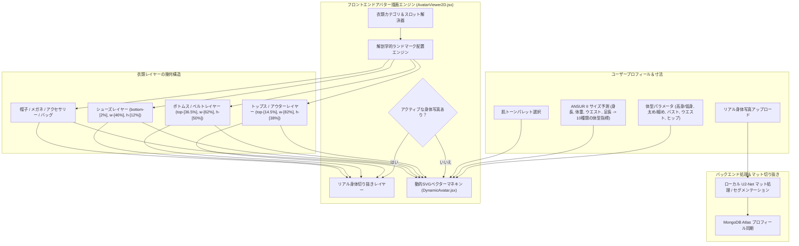

# DressApp — 2Dアバター＆試着ポジショニングシステム アーキテクチャ (`Avatar.md`)

> **ドキュメントバージョン:** 2.0  
> **対象サブシステム:** フロントエンド2Dマネキン、リアル身体写真切り抜き＆衣類オーバーレイエンジン  
> **主要ファイル:** `AvatarViewer2D.jsx`, `DynamicAvatar.jsx`, `OutfitCanvas.jsx`, `Profile.jsx`  
> **ステータス:** 本番環境導入・調整済み  

---

## 1. エグゼクティブサマリー＆価値提案

### 1.1 ハイレベル概要
**DressApp 2Dアバター＆試着ポジショニングシステム**は、リアルタイムで適応する視覚的試着環境を提供します。デジタル化されたクローゼットの衣類を、**背景切り抜き済みの実際の身体写真**または**動的に変形する2DベジェベクターSVGマネキン**の上にシームレスに重ねてプレビューできます。

多彩な衣類スタイル（コンプレッションシャツ、ポロシャツの襟、クルーネック、ローライズジーンズ、カーゴショーツ、フォーマルドレス）において高い視覚的精度を実現するため、本エンジンは解剖学的ランドマーク調整、比例比率スケーリング、非歪曲画像オーバーレイコンテナを利用しています。



### 1.2 ユーザー提供価値
* **解剖学的配置の精度**: シャツの襟をアバターの首元 (`top-[14.5%]`) に、ショーツやパンツのウエストバンドを自然なウエストライン (`top-[36.5%]`) に正確に合わせて配置し、顔の遮蔽や不自然な隙間を排除します。
* **デュアルアバターの柔軟性**: 切り抜き済みの写真と、正確な人体計測値に基づいて生成される動的2DベクターSVGマネキンを瞬時に切り替え可能。
* **アスペクト比の比例保持**: 衣類画像の本来のアスペクト比を維持しつつ (`object-fit: contain`)、胸囲やヒップ幅のスケーリング ($scaleX$) を適用して不自然な伸縮を防ぎます。
* **インタラクティブなレイヤー階層**: トップスやドレスの上にアウターを重ねつつ、個々の衣類レイヤーを直接タップ/クリックしてアイテムの詳細を開くことができます。

---

## 2. 総合ユーザーマニュアル＆UI構造

### 2.1 UIトポロジー構成

```
┌──────────────────────────────────────────────────────────────────┐
│                      2Dアバター試着キャンバス                    │
├──────────────────────────────────────────────────────────────────┤
│                                                                  │
│                        [ 帽子         (top: 1%) ]                │
│                        [ メガネ       (top: 11%) ]               │
│                        [ 首元ライン   (top: 14.5%) ] ◄─ シャツ襟 │
│                     ┌──────────────────────────┐                 │
│                     │     トップス / アウター   │                 │
│                     │       (高さ: 38%)        │                 │
│                     └──────────────────────────┘                 │
│                        [ ウエストライン (top: 36.5%) ] ◄─ ベルト │
│                     ┌──────────────────────────┐                 │
│                     │    ボトムス / ショーツ   │                 │
│                     │       (高さ: 50%)        │                 │
│                     │                          │                 │
│                     └──────────────────────────┘                 │
│                        [ 足元        (bottom: 2%) ] ◄─── 靴      │
│                        [ シューズ     (高さ: 12%) ]              │
│                                                                  │
├──────────────────────────────────────────────────────────────────┤
│  [ アバター切り替え ]  [ 肌色ピッカー ]  [ 身体サイズ編集 ]      │
└──────────────────────────────────────────────────────────────────┘
```

### 2.2 モード＆ワークフローガイド

#### モード 1: リアル身体写真切り抜きレイヤー
1. **プロフィール設定** (`/me`) を開きます。
2. 全身写真をアップロードします。バックエンドが `rembg` (U2-Net) を使用して背景除去を実行します。
3. 処理された切り抜きURL (`body_photo_url`) が MongoDB 内のユーザープロフィールを更新し、`AvatarViewer2D` コンテナ内に描画されます。
4. ベクターマネキンに戻すには、プロフィールページの **写真を削除** をクリックします。ページを再読み込みすることなくUIが即座に更新されます。

#### モード 2: 動的ベクターSVGマネキン
1. 身体写真が存在しない場合、`AvatarViewer2D` は `DynamicAvatar.jsx` を描画します。
2. マネキンは固定された `0 0 200 450` SVG viewBox 内で連続的な三次ベジェ曲線 ($C$ および $S$ コマンド) を生成します。
3. 身体パラメータ（身長、体重、ウエスト、バスト、肩幅、ヒップ）の調整や肌トーンの選択により、マネキンのシルエットがリアルタイムに変形します。

---

## 3. 技術スタック＆機能詳細

### 3.1 解剖学的楕円除算器＆ベジェマネキンジェネレーター

`DynamicAvatar.jsx` は、**解剖学的楕円除算器** ($\text{DIVISOR} = 2.65$) を使用して、3Dの身体外周から2D平面投影幅を計算します：

$$\begin{aligned}
w_{\text{shoulders}} &= (\text{shoulders} \times 1.1) \times (1.05 \text{ if male else } 0.95) \\
w_{\text{chest}} &= \left(\frac{\text{chest}}{2.65} \times 1.05\right) \times (1.02 \text{ if male else } 1.0) \\
w_{\text{waist}} &= \left(\frac{\text{waist}}{2.65} \times 1.0\right) \times (0.98 \text{ if male else } 0.90) \\
w_{\text{hip}} &= \left(\frac{\text{hip}}{2.65} \times 1.05\right) \times (0.93 \text{ if male else } 1.05)
\end{aligned}$$

身体のシルエットは、三次ベジェ制御ポイントをマッピングするSVGパスコマンド経由で構築されます：

```javascript
// Bezier contour snippet from DynamicAvatar.jsx
const bodyPath = [
  `M ${pNeckR}`,
  `C ${X0 + wNeck + (wShoulders - wNeck) * 0.6},${yChin + neckHeight * 0.7} ${X0 + wShoulders * 0.9},${yShoulders - 2} ${pShoulderR}`,
  `C ${X0 + wShoulders * 0.95},${yShoulders + (yChest - yShoulders) * 0.6} ${X0 + wChest + 2},${yChest - 5} ${pChestR}`,
  `C ${X0 + wChest - 1},${yChest + (yWaist - yChest) * 0.5} ${X0 + wWaist + (isMale ? 1 : -2)},${yWaist - 8} ${pWaistR}`,
  `C ${X0 + wWaist + (isMale ? 2 : 5)},${yWaist + (yHip - yWaist) * 0.4} ${X0 + wHip + 1},${yHip - 8} ${pHipR}`,
  ...
].join(' ');
```

### 3.2 調整済みランドマーク配置＆コンテナCSS比率

顔のパーツとの重複や体に隙間を作らずに衣類をフィットさせるため、`AvatarViewer2D.jsx` 内のオーバーレイコンテナは正確なCSS位置比率にバインドされています：

| 衣類カテゴリ | CSS位置クラス | z-Index | 配置のランドマーク |
| --- | --- | --- | --- |
| **帽子** | `top-[1%] left-1/2 w-[34%] aspect-square` | `z-30` | 頭頂部 |
| **メガネ** | `top-[11%] left-1/2 w-[18%] h-[4.5%]` | `z-28` | 目のライン |
| **アクセサリー / ネックレス** | `top-[14.5%] left-1/2 w-[30%] aspect-square` | `z-25` | 首の付け根 |
| **トップス** | `top-[14.5%] left-1/2 w-[82%] h-[38%]` | `z-20` | 襟から首元ライン |
| **アウター** | `top-[14.5%] left-1/2 w-[86%] h-[42%]` | `z-22` | 肩の上のコートレイヤー |
| **ドレス** | `top-[14.5%] left-1/2 w-[82%] h-[68%]` | `z-20` | 首元から膝上までのフルレングス |
| **ベルト** | `top-[36.5%] left-1/2 w-[62%] h-[5%]` | `z-21` | ウエストベルト通し |
| **ボトムス (パンツ/ショーツ)** | `top-[36.5%] left-1/2 w-[62%] h-[50%]` | `z-10` | ウエストバンドから自然な waist |
| **シューズ / 靴** | `bottom-[2%] left-1/2 w-[46%] h-[12%]` | `z-15` | 足首から足元ライン |
| **ハンドバッグ** | `top-[40%] right-[-5%] w-[40%] h-[30%]` | `z-25` | 腕の下がりライン |

### 3.3 衣類の比例幅スケーリング

位置設定に加えて、ユーザーが設定した体型パラメータに応じて衣類が水平方向 ($scaleX$) に動的に拡大縮小します：

```javascript
// Derivation of garment container scale factors in AvatarViewer2D.jsx
const scales = useMemo(() => {
  const heightFactor = 1 + (params.tall * 0.08) - (params.short * 0.08);
  const widthFactor = 1 + (params.heavy * 0.12) - (params.thin * 0.12);
  const chestFactor = 1 + (params.busty * 0.1);
  const waistFactor = 1 + (params.waist_thick * 0.12) - (params.waist_thin * 0.08);
  const hipsFactor = 1 + (params.hips_wide * 0.12) - (params.hips_narrow * 0.08);

  return { height: heightFactor, width: widthFactor, chest: chestFactor, waist: waistFactor, hips: hipsFactor };
}, [params]);

// Passed to Framer Motion animate prop for Top and Bottom:
// Top: scaleX = scales.chest / scales.width
// Bottom: scaleX = scales.hips / scales.width
```

---

## 4. 位置・比例修正サマリーマトリクス

| 特定された問題 | 原因 | 適用された修正 | 結果 |
| --- | --- | --- | --- |
| **シャツの襟が顔に重なる** | オフセット位置が高すぎる (`top-[8.3%]` または `top-[12.8%]`) | トップコンテナのオフセットを `top-[14.5%]` に設定 | シャツの襟がアバターの首元ラインに正確に配置されます。 |
| **パンツ/ショーツが低すぎるか重複する** | オフセット位置が低すぎる (`top-[38.5%]`) | ボトムコンテナのオフセットを `top-[36.5%]` に設定 | パンツのウエストバンドがアバターの自然なウエストラインに配置されます。 |
| **衣類画像のアスペクト比の歪み** | コンテナの無制限な伸縮 | 比例的な `scaleX` 調整を伴う `object-fit: contain` を適用 | 横方向の歪みなしで衣類画像の本来のアスペクト比を保持します。 |
| **写真削除のラグ** | ページ状態の再取得が必要であった | `Profile.jsx` 内で即時のローカルユーザー状態同期を実装 | UIの遅延なしに写真削除が即座に反映されます。 |

---
*DressAppのためにNarratorによって自動編纂されたドキュメント。*
