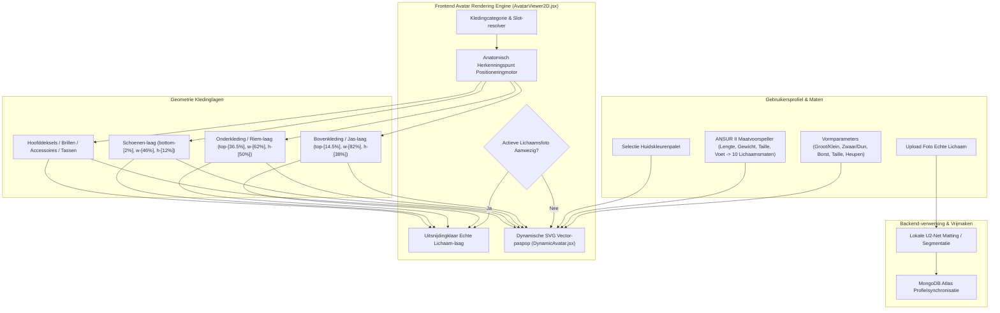

# DressApp — 2D Avatar & Pas-Positioneringssysteem Architectuur (`Avatar.md`)

> **Documentversie:** 2.0  
> **Doelsysteem:** Frontend 2D Paspop, Echte Lichaamsfotouitsnijdingen & Kleding-overlay Engine  
> **Kernbestanden:** `AvatarViewer2D.jsx`, `DynamicAvatar.jsx`, `OutfitCanvas.jsx`, `Profile.jsx`  
> **Status:** In Productie Genomen & Gekalibreerd  

---

## 1. Managementsamenvatting & Waardepropositie

### 1.1 Hoofdlijnen Overzicht
Het **DressApp 2D Avatar & Pas-Positioneringssysteem** biedt een adaptieve, real-time visuele pasomgeving. Het stelt gebruikers in staat om gedigitaliseerde garderobekleding naadloos te bekijken over een **gesegmenteerde foto van het echte lichaam** of een **dynamisch vervormde 2D Bezier-vector SVG-paspop**.

Om een hoge visuele nauwkeurigheid te leveren voor uiteenlopende kledingstijlen (compressieshirts, polocollars, crewnecks, lage spijkerbroeken, cargoshorts en formele jurken), maakt de engine gebruik van anatomische herkenningspuntkalibratie, proportionele schaling en niet-vervormende afbeelding-overlaycontainers.



### 1.2 Gebruikerswaardepropositie
* **Precisie in Anatomische Uitlijning**: Lijn kraagjes van shirts exact uit met de halslijn van de avatar (`top-[14.5%]`) en de tailleband van broeken/shorts met de natuurlijke taillelijn (`top-[36.5%]`), waardoor gezichtsbedekking en storende hiaten worden geëlimineerd.
* **Flexibiliteit in Dubbele Avatar**: Schakel direct tussen een persoonlijke vrijgemaakte foto van het gehele lichaam en een dynamische 2D-vector SVG-paspop die gebouwd is op basis van exacte antropometrische maten.
* **Behoud van Proportionele Beeldverhouding**: Past borst- en heupbreedteschaling toe ($scaleX$) met behoud van de originele beeldverhouding van het kledingstuk (`object-fit: contain`).
* **Interactieve Lagenhiërarchie**: Stapel jassen over tops en jurken terwijl u op individuele kledinglagen kunt klikken om artikeldetails te openen.

---

## 2. Uitgebreide Gebruikershandleiding & Interface-topologie

### 2.1 Visuele Interface-topologie

```
┌──────────────────────────────────────────────────────────────────┐
│                      2D Avatar Pas-canvas                        │
├──────────────────────────────────────────────────────────────────┤
│                                                                  │
│                        [ Hoofddeksel  (top: 1%) ]                │
│                        [ Bril         (top: 11%) ]               │
│                        [ Halslijn     (top: 14.5%) ] ◄─ Kraag    │
│                     ┌──────────────────────────┐                 │
│                     │    Tops / Bovenkleding   │                 │
│                     │       (hoogte: 38%)      │                 │
│                     └──────────────────────────┘                 │
│                        [ Taillelijn   (top: 36.5%) ] ◄─ Riem     │
│                     ┌──────────────────────────┐                 │
│                     │   Broeken / Shorts       │                 │
│                     │       (hoogte: 50%)      │                 │
│                     │                          │                 │
│                     └──────────────────────────┘                 │
│                        [ Voeten      (bottom: 2%) ] ◄─── Schoenen│
│                        [ Schoenen     (hoogte: 12%) ]            │
│                                                                  │
├──────────────────────────────────────────────────────────────────┤
│  [ Modus Wisselen ]   [ Huidskleur Kiezen ]   [ Maten Bewerken ] │
└──────────────────────────────────────────────────────────────────┘
```

### 2.2 Modus- & Stappenplannen

#### Modus 1: Laag met Uitsnijding van Echte Lichaamsfoto
1. Open **Profielinstellingen** (`/me`).
2. Upload een foto van het gehele lichaam. De backend voert achtergrondsegmentatie uit via `rembg` (U2-Net).
3. De verwerkte uitsnijdings-URL (`body_photo_url`) werkt het gebruikersprofiel bij in MongoDB en wordt gerenderd in de `AvatarViewer2D`-container.
4. Om terug te keren naar de vectorpaspop, klikt u op **Foto verwijderen** op de profielpagina. De interface wordt direct bijgewerkt zonder de pagina te herladen.

#### Modus 2: Dynamische Vector-SVG-paspop
1. Wanneer er geen lichaamsfoto aanwezig is, rendert `AvatarViewer2D` het bestand `DynamicAvatar.jsx`.
2. De paspop genereert continue kubische Bezier-curves ($C$- en $S$-commando's) binnen een vaste viewBox van `0 0 200 450`.
3. Het aanpassen van lichaamsparameters (Lengte, Gewicht, Taille, Borst, Schouders, Heupen) of het selecteren van een huidskleur verandert de silhouet in real-time.

---

## 3. Technologiestack & Diepgaande Mogelijkheden

### 3.1 Anatomische Ellips-divisor & Bezier-paspopgenerator

`DynamicAvatar.jsx` berekent 2D-vlakke projectiebreedtes uit 3D-anatomische omtrekken met behulp van een **Anatomische Ellips-divisor** ($\text{DIVISOR} = 2.65$):

$$\begin{aligned}
w_{\text{shoulders}} &= (\text{shoulders} \times 1.1) \times (1.05 \text{ if male else } 0.95) \\
w_{\text{chest}} &= \left(\frac{\text{chest}}{2.65} \times 1.05\right) \times (1.02 \text{ if male else } 1.0) \\
w_{\text{waist}} &= \left(\frac{\text{waist}}{2.65} \times 1.0\right) \times (0.98 \text{ if male else } 0.90) \\
w_{\text{hip}} &= \left(\frac{\text{hip}}{2.65} \times 1.05\right) \times (0.93 \text{ if male else } 1.05)
\end{aligned}$$

Het lichaamssilhouet wordt opgebouwd via SVG-padcommando's die kubische Bezier-controlepunten in kaart brengen:

```javascript
// Bezier contour snippet from DynamicAvatar.jsx
const bodyPath = [
  `M ${pNeckR}`,
  `C ${X0 + wNeck + (wShoulders - wNeck) * 0.6},${yChin + neckHeight * 0.7} ${X0 + wShoulders * 0.9},${yShoulders - 2} ${pShoulderR}`,
  `C ${X0 + wShoulders * 0.95},${yShoulders + (yChest - yShoulders) * 0.6} ${X0 + wChest + 2},${yChest - 5} ${pChestR}`,
  `C ${X0 + wChest - 1},${yChest + (yWaist - yChest) * 0.5} ${X0 + wWaist + (isMale ? 1 : -2)},${yWaist - 8} ${pWaistR}`,
  `C ${X0 + wWaist + (isMale ? 2 : 5)},${yWaist + (yHip - yWaist) * 0.4} ${X0 + wHip + 1},${yHip - 8} ${pHipR}`,
  ...
].join(' ');
```

### 3.2 Gekalibreerde Herkenningspuntpositionering & Container CSS-verhoudingen

Om te garanderen dat kledingstukken precies aansluiten zonder gelaatstrekken te overlappen of openingen te laten, zijn overlaycontainers in `AvatarViewer2D.jsx` gebonden aan exacte CSS-positieverhoudingen:

| Kledingcategorie | CSS-positieklasse | z-Index | Uitlijningspunt |
| --- | --- | --- | --- |
| **Hoofddeksel** | `top-[1%] left-1/2 w-[34%] aspect-square` | `z-30` | Kruin van het hoofd |
| **Bril** | `top-[11%] left-1/2 w-[18%] h-[4.5%]` | `z-28` | Ogen-vlak |
| **Accessoire / Ketting** | `top-[14.5%] left-1/2 w-[30%] aspect-square` | `z-25` | Basis van de nek |
| **Bovenkleding (Top)** | `top-[14.5%] left-1/2 w-[82%] h-[38%]` | `z-20` | Kraag tot halslijn |
| **Jas / Mantel** | `top-[14.5%] left-1/2 w-[86%] h-[42%]` | `z-22` | Jas-schouderlaag |
| **Jurk** | `top-[14.5%] left-1/2 w-[82%] h-[68%]` | `z-20` | Volledige lengte van top tot knie |
| **Riem** | `top-[36.5%] left-1/2 w-[62%] h-[5%]` | `z-21` | Riemlus tailleband |
| **Onderkleding (Broek/Shorts)** | `top-[36.5%] left-1/2 w-[62%] h-[50%]` | `z-10` | Tailleband tot natuurlijke taille |
| **Schoenen / Schoeisel** | `bottom-[2%] left-1/2 w-[46%] h-[12%]` | `z-15` | Enkel tot voetvlak |
| **Handtas** | `top-[40%] right-[-5%] w-[40%] h-[30%]` | `z-25` | Arm-valvlak |

### 3.3 Proportionele Breedteschaling van Kleding

Naast positionele plaatsing schalen kledingstukken dynamisch horizontaal ($scaleX$) op basis van gekozen lichaamsparameters:

```javascript
// Derivation of garment container scale factors in AvatarViewer2D.jsx
const scales = useMemo(() => {
  const heightFactor = 1 + (params.tall * 0.08) - (params.short * 0.08);
  const widthFactor = 1 + (params.heavy * 0.12) - (params.thin * 0.12);
  const chestFactor = 1 + (params.busty * 0.1);
  const waistFactor = 1 + (params.waist_thick * 0.12) - (params.waist_thin * 0.08);
  const hipsFactor = 1 + (params.hips_wide * 0.12) - (params.hips_narrow * 0.08);

  return { height: heightFactor, width: widthFactor, chest: chestFactor, waist: waistFactor, hips: hipsFactor };
}, [params]);

// Passed to Framer Motion animate prop for Top and Bottom:
// Top: scaleX = scales.chest / scales.width
// Bottom: scaleX = scales.hips / scales.width
```

---

## 4. Samenvattende Matrix van Positie- en Proportiecorrecties

| Geïdentificeerd Probleem | Oorzaak | Toegepaste Correctie | Resultaat |
| --- | --- | --- | --- |
| **Overhemdkraag overlapt gezicht** | Offset te hoog gepositioneerd (`top-[8.3%]` of `top-[12.8%]`) | Bovenste container-offset ingesteld op `top-[14.5%]` | Kraag sluit precies aan bij de halslijn van de avatar. |
| **Broek/shorts te laag of overlappend** | Offset te laag gepositioneerd (`top-[38.5%]`) | Onderste container-offset ingesteld op `top-[36.5%]` | Tailleband sluit precies aan bij de natuurlijke taillelijn van de avatar. |
| **Vervormde beeldverhouding van kleding** | Onbeperkte container-uitrekking | `object-fit: contain` toegepast met proportionele `scaleX`-aanpassing | Behoudt de originele beeldverhouding zonder horizontale vervorming. |
| **Vertraging bij verwijderen foto** | Pagina-status opnieuw ophalen was vereist | Directe lokale gebruikersstatus-synchronisatie in `Profile.jsx` geïmplementeerd | Verwijdering van foto wordt direct zonder vertraging weergegeven. |

---
*Document automatisch samengesteld door Narrator voor DressApp.*
