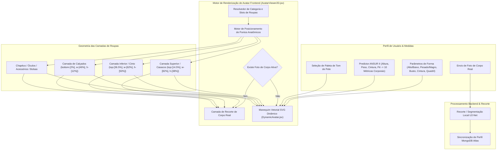

# DressApp — Arquitetura do Sistema de Posicionamento e Provador em Avatar 2D (`Avatar.md`)

> **Versão do Documento:** 2.0  
> **Subsistema Alvo:** Manequim 2D Frontend, Recortes de Foto de Corpo Real & Motor de Sobreposição de Roupas  
> **Arquivos Principais:** `AvatarViewer2D.jsx`, `DynamicAvatar.jsx`, `OutfitCanvas.jsx`, `Profile.jsx`  
> **Status:** Lançado em Produção & Calibrado  

---

## 1. Resumo Executivo & Proposta de Valor

### 1.1 Visão Geral de Alto Nível
O **Sistema de Posicionamento e Provador em Avatar 2D do DressApp** oferece um ambiente de provador visual adaptativo em tempo real. Ele permite aos usuários visualizar roupas digitalizadas do guarda-roupa sobrepostas perfeitamente em uma **fotografia de corpo real segmentada** ou em um **manequim vetorial SVG 2D com curvas Bezier dinâmicas**.

Para entregar alta precisão visual em diversos estilos de roupas (camisetas de compressão, golas polo, golas careca, jeans de cintura baixa, bermudas cargo e vestidos formais), o motor utiliza calibração de pontos de referência anatômicos, dimensionamento proporcional de proporções e contêineres de sobreposição de imagem sem distorção.



### 1.2 Proposta de Valor para o Usuário
* **Precisão de Alinhamento Anatômico**: Ajusta as golas das camisas exatamente no decote do avatar (`top-[14.5%]`) e os cós de calças/bermudas no cós natural da cintura (`top-[36.5%]`), eliminando oclusões no rosto e lacunas indesejadas.
* **Flexibilidade de Avatar Duplo**: Alterne instantaneamente entre uma foto de corpo inteiro recortada e um manequim vetorial SVG 2D dinâmico construído com medidas antropométricas exatas.
* **Preservação Proporcional do Aspecto**: Aplica escalonamento de largura para peito e quadril ($scaleX$) mantendo a proporção original da imagem da peça (`object-fit: contain`), evitando distorções.
* **Hierarquia de Camadas Interativa**: Empilhe casacos sobre camisetas e vestidos, permitindo toques/cliques diretos em camadas individuais para abrir detalhes do item.

---

## 2. Manual do Usuário Completo & Topologia da Interface

### 2.1 Topologia Visual da Interface

```
┌──────────────────────────────────────────────────────────────────┐
│                    Tela de Provador do Avatar 2D                 │
├──────────────────────────────────────────────────────────────────┤
│                                                                  │
│                        [ Chapéus      (top: 1%) ]                │
│                        [ Óculos       (top: 11%) ]               │
│                        [ Decote       (top: 14.5%) ] ◄─ Gola     │
│                     ┌──────────────────────────┐                 │
│                     │    Partes de Cima/Casacos│                 │
│                     │       (altura: 38%)      │                 │
│                     └──────────────────────────┘                 │
│                        [ Linha Cintura (top: 36.5%) ] ◄─ Cós     │
│                     ┌──────────────────────────┐                 │
│                     │   Partes de Baixo/Calças │                 │
│                     │       (altura: 50%)      │                 │
│                     │                          │                 │
│                     └──────────────────────────┘                 │
│                        [ Pés         (bottom: 2%) ] ◄─── Calçados│
│                        [ Calçados     (altura: 12%) ]            │
│                                                                  │
├──────────────────────────────────────────────────────────────────┤
│ [ Alternar Modo ]  [ Seletor de Tom de Pele ]  [ Editar Medidas ]│
└──────────────────────────────────────────────────────────────────┘
```

### 2.2 Modos & Fluxos de Trabalho

#### Modo 1: Camada de Recorte de Foto de Corpo Real
1. Abra as **Configurações de Perfil** (`/me`).
2. Envie uma fotografia de corpo inteiro. O servidor executa a segmentação de fundo via `rembg` (U2-Net).
3. A URL da foto processada (`body_photo_url`) atualiza o perfil no MongoDB e renderiza no contêiner `AvatarViewer2D`.
4. Para voltar ao manequim vetorial, clique em **Remover foto** na página de perfil. A interface é atualizada instantaneamente sem recarregar a página.

#### Modo 2: Manequim Vetorial SVG Dinâmico
1. Quando nenhuma foto de corpo estiver ativa, o `AvatarViewer2D` renderiza o `DynamicAvatar.jsx`.
2. O manequim gera curvas Bezier cúbicas contínuas (comandos $C$ e $S$) dentro de uma viewBox fixa de `0 0 200 450`.
3. O ajuste dos parâmetros corporais (Altura, Peso, Cintura, Peito, Ombros, Quadril) ou a seleção do tom de pele altera a silhueta em tempo real.

---

## 3. Arquitetura Tecnológica & Análise Detalhada

### 3.1 Divisor Elíptico Anatômico & Gerador Bezier de Manequim

O `DynamicAvatar.jsx` calcula as larguras de projeção planar 2D a partir das circunferências anatômicas 3D usando um **Divisor Elíptico Anatômico** ($\text{DIVISOR} = 2.65$):

$$\begin{aligned}
w_{\text{shoulders}} &= (\text{shoulders} \times 1.1) \times (1.05 \text{ if male else } 0.95) \\
w_{\text{chest}} &= \left(\frac{\text{chest}}{2.65} \times 1.05\right) \times (1.02 \text{ if male else } 1.0) \\
w_{\text{waist}} &= \left(\frac{\text{waist}}{2.65} \times 1.0\right) \times (0.98 \text{ if male else } 0.90) \\
w_{\text{hip}} &= \left(\frac{\text{hip}}{2.65} \times 1.05\right) \times (0.93 \text{ if male else } 1.05)
\end{aligned}$$

A silhueta corporal é construída através de comandos de caminho SVG mapeando pontos de controle Bezier cúbicos:

```javascript
// Bezier contour snippet from DynamicAvatar.jsx
const bodyPath = [
  `M ${pNeckR}`,
  `C ${X0 + wNeck + (wShoulders - wNeck) * 0.6},${yChin + neckHeight * 0.7} ${X0 + wShoulders * 0.9},${yShoulders - 2} ${pShoulderR}`,
  `C ${X0 + wShoulders * 0.95},${yShoulders + (yChest - yShoulders) * 0.6} ${X0 + wChest + 2},${yChest - 5} ${pChestR}`,
  `C ${X0 + wChest - 1},${yChest + (yWaist - yChest) * 0.5} ${X0 + wWaist + (isMale ? 1 : -2)},${yWaist - 8} ${pWaistR}`,
  `C ${X0 + wWaist + (isMale ? 2 : 5)},${yWaist + (yHip - yWaist) * 0.4} ${X0 + wHip + 1},${yHip - 8} ${pHipR}`,
  ...
].join(' ');
```

### 3.2 Posicionamento Calibrado por Pontos de Referência & Razões CSS

Para garantir que as roupas se ajustem perfeitamente sem sobrepor traços faciais ou deixar lacunas no corpo, os contêineres em `AvatarViewer2D.jsx` estão vinculados a razões de posição CSS precisas:

| Categoria da Peça | Classe de Posição CSS | z-Index | Ponto de Referência |
| --- | --- | --- | --- |
| **Chapéus** | `top-[1%] left-1/2 w-[34%] aspect-square` | `z-30` | Topo da cabeça |
| **Óculos** | `top-[11%] left-1/2 w-[18%] h-[4.5%]` | `z-28` | Plano dos olhos |
| **Acessórios / Colares** | `top-[14.5%] left-1/2 w-[30%] aspect-square` | `z-25` | Base do pescoço |
| **Partes de Cima (Top)** | `top-[14.5%] left-1/2 w-[82%] h-[38%]` | `z-20` | Da gola ao decote |
| **Casacos / Jaquetas** | `top-[14.5%] left-1/2 w-[86%] h-[42%]` | `z-22` | Sobreposição de casaco nos ombros |
| **Vestidos** | `top-[14.5%] left-1/2 w-[82%] h-[68%]` | `z-20` | Comprimento total do decote ao joelho |
| **Cintos** | `top-[36.5%] left-1/2 w-[62%] h-[5%]` | `z-21` | Passador de cinto na cintura |
| **Partes de Baixo (Calças)** | `top-[36.5%] left-1/2 w-[62%] h-[50%]` | `z-10` | Do cós à linha natural da cintura |
| **Calçados** | `bottom-[2%] left-1/2 w-[46%] h-[12%]` | `z-15` | Do tornozelo ao plano do pé |
| **Bolsas de Mão** | `top-[40%] right-[-5%] w-[40%] h-[30%]` | `z-25` | Caimento do braço |

### 3.3 Escalonamento Proporcional da Largura

Além do posicionamento, as peças escalam horizontalmente ($scaleX$) com base nos parâmetros corporais selecionados:

```javascript
// Derivation of garment container scale factors in AvatarViewer2D.jsx
const scales = useMemo(() => {
  const heightFactor = 1 + (params.tall * 0.08) - (params.short * 0.08);
  const widthFactor = 1 + (params.heavy * 0.12) - (params.thin * 0.12);
  const chestFactor = 1 + (params.busty * 0.1);
  const waistFactor = 1 + (params.waist_thick * 0.12) - (params.waist_thin * 0.08);
  const hipsFactor = 1 + (params.hips_wide * 0.12) - (params.hips_narrow * 0.08);

  return { height: heightFactor, width: widthFactor, chest: chestFactor, waist: waistFactor, hips: hipsFactor };
}, [params]);

// Passed to Framer Motion animate prop for Top and Bottom:
// Top: scaleX = scales.chest / scales.width
// Bottom: scaleX = scales.hips / scales.width
```

---

## 4. Matriz de Resumo de Correções de Posição e Proporção

| Problema Identificado | Causa | Correção Aplicada | Resultado |
| --- | --- | --- | --- |
| **Gola da camisa cobrindo o rosto** | Deslocamento muito alto (`top-[8.3%]` ou `top-[12.8%]`) | Ajustado o deslocamento do contêiner superior para `top-[14.5%]` | A gola fica perfeitamente alinhada no decote do avatar. |
| **Calças/bermudas baixas ou sobrepostas** | Deslocamento muito baixo (`top-[38.5%]`) | Ajustado o deslocamento do contêiner inferior para `top-[36.5%]` | O cós da calça fica alinhado na cintura natural do avatar. |
| **Proporção da imagem distorcida** | Esticamento do contêiner sem restrições | Aplicado `object-fit: contain` com ajuste proporcional `scaleX` | Mantém a proporção original da imagem sem distorção horizontal. |
| **Atraso na remoção da foto** | Recarregamento do estado da página necessário | Implementada sincronização instantânea do estado local em `Profile.jsx` | A remoção da foto é refletida instantaneamente sem atraso. |

---
*Documento compilado automaticamente pelo Narrator para o DressApp.*
