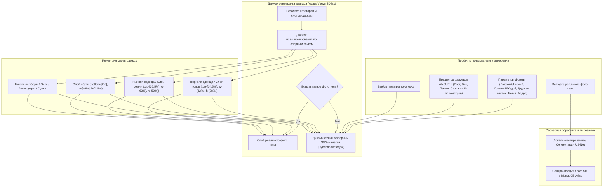

# DressApp — Архитектура системы позиционирования 2D-аватара и примерки (`Avatar.md`)

> **Версия документа:** 2.0  
> **Целевая подсистема:** Frontend 2D-манекен, вырезание реального фото тела и движок наложения одежды  
> **Основные файлы:** `AvatarViewer2D.jsx`, `DynamicAvatar.jsx`, `OutfitCanvas.jsx`, `Profile.jsx`  
> **Статус:** Внедрено в продакшн и откалибровано  

---

## 1. Резюме и ценностное предложение

### 1.1 Высокоуровневый обзор
**Система позиционирования 2D-аватара и примерки DressApp** предоставляет адаптивную визуальную среду примерки в реальном времени. Она позволяет пользователям просматривать оцифрованные вещи из гардероба, наложенные поверх **сегментированной фотографии реального тела** или **динамически трансформируемого 2D векторного SVG-манекена на кривых Бизье**.

Для обеспечения высокой визуальной точности для различных стилей одежды (компрессионные футболки, воротники поло, круглые вырезы, джинсы с низкой посадкой, шорты карго и вечерние платья) движок использует калибровку анатомических опорных точек, пропорциональное масштабирование и контейнеры наложения без искажений.



### 1.2 Ценностное предложение для пользователя
* **Точность анатомического выравнивания**: Совмещает воротники shirts вровень с линией шеи аватара (`top-[14.5%]`), а пояса брюк/шорт — вровень с естественной линией талии (`top-[36.5%]`), исключая перекрытие лица и зазоры.
* **Гибкость двух аватаров**: Мгновенное переключение между личной вырезанной фотографией в полный рост и динамическим 2D векторным SVG-манекеном, построенным по точным антропометрическим измерениям.
* **Сохранение пропорций**: Применяет масштабирование ширины груди и бедер ($scaleX$) при сохранении исходного соотношения сторон изображения вещи (`object-fit: contain`), предотвращая растяжение.
* **Интерактивная иерархия слоев**: Накладывайте верхнюю одежду поверх топов и платьев, сохраняя возможность нажатия на отдельные слои одежды для открытия сведений о вещи.

---

## 2. Полное руководство пользователя и топология интерфейса

### 2.1 Визуальная топология интерфейса

```
┌──────────────────────────────────────────────────────────────────┐
│                   Холст примерки 2D-аватара                      │
├──────────────────────────────────────────────────────────────────┤
│                                                                  │
│                        [ Головные уборы (top: 1%) ]              │
│                        [ Очки           (top: 11%) ]             │
│                        [ Линия шеи      (top: 14.5%) ] ◄─ Ворот  │
│                     ┌──────────────────────────┐                 │
│                     │     Топы / Верхняя одежда│                 │
│                     │       (высота: 38%)      │                 │
│                     └──────────────────────────┘                 │
│                        [ Линия талии    (top: 36.5%) ] ◄─ Пояс   │
│                     ┌──────────────────────────┐                 │
│                     │   Низ / Брюки / Шорты    │                 │
│                     │       (высота: 50%)      │                 │
│                     │                          │                 │
│                     └──────────────────────────┘                 │
│                        [ Стопы          (bottom: 2%) ] ◄── Обувь │
│                        [ Обувь          (высота: 12%) ]          │
│                                                                  │
├──────────────────────────────────────────────────────────────────┤
│ [ Переключить аватар ] [ Выбор тона кожи ] [ Изменить параметры ]│
└──────────────────────────────────────────────────────────────────┘
```

### 2.2 Режимы и сценарии работы

#### Режим 1: Слой реального фото тела
1. Откройте **Настройки профиля** (`/me`).
2. Загрузите фотографию в полный рост. Сервер выполнит сегментацию фона с помощью `rembg` (U2-Net).
3. Обработанный URL (`body_photo_url`) обновит профиль пользователя в MongoDB и отобразится в контейнере `AvatarViewer2D`.
4. Для возврата к векторному манекену нажмите **Удалить фото** на странице профиля. Интерфейс обновится мгновенно без перезагрузки страницы.

#### Режим 2: Динамический векторный SVG-манекен
1. При отсутствии фото тела `AvatarViewer2D` отображает `DynamicAvatar.jsx`.
2. Манекен генерирует непрерывные кубические кривые Бизье (команды $C$ и $S$) внутри фиксированного viewBox `0 0 200 450`.
3. Регулировка параметров тела (Рост, Вес, Талия, Грудь, Плечи, Бедра) или выбор тона кожи меняет силуэт в реальном времени.

---

## 3. Технологический стек и глубинная архитектура

### 3.1 Анатомический эллиптический делитель и генератор манекена Бизье

`DynamicAvatar.jsx` рассчитывает 2D-ширину проекции из 3D-обхватов тела с помощью **анатомического эллиптического делителя** ($\text{DIVISOR} = 2.65$):

$$\begin{aligned}
w_{\text{shoulders}} &= (\text{shoulders} \times 1.1) \times (1.05 \text{ if male else } 0.95) \\
w_{\text{chest}} &= \left(\frac{\text{chest}}{2.65} \times 1.05\right) \times (1.02 \text{ if male else } 1.0) \\
w_{\text{waist}} &= \left(\frac{\text{waist}}{2.65} \times 1.0\right) \times (0.98 \text{ if male else } 0.90) \\
w_{\text{hip}} &= \left(\frac{\text{hip}}{2.65} \times 1.05\right) \times (0.93 \text{ if male else } 1.05)
\end{aligned}$$

Силуэт тела конструируется с помощью команд SVG-пути, отображающих опорные точки кубических кривых Бизье:

```javascript
// Bezier contour snippet from DynamicAvatar.jsx
const bodyPath = [
  `M ${pNeckR}`,
  `C ${X0 + wNeck + (wShoulders - wNeck) * 0.6},${yChin + neckHeight * 0.7} ${X0 + wShoulders * 0.9},${yShoulders - 2} ${pShoulderR}`,
  `C ${X0 + wShoulders * 0.95},${yShoulders + (yChest - yShoulders) * 0.6} ${X0 + wChest + 2},${yChest - 5} ${pChestR}`,
  `C ${X0 + wChest - 1},${yChest + (yWaist - yChest) * 0.5} ${X0 + wWaist + (isMale ? 1 : -2)},${yWaist - 8} ${pWaistR}`,
  `C ${X0 + wWaist + (isMale ? 2 : 5)},${yWaist + (yHip - yWaist) * 0.4} ${X0 + wHip + 1},${yHip - 8} ${pHipR}`,
  ...
].join(' ');
```

### 3.2 Точки привязки и CSS-соотношения контейнеров

Чтобы гарантировать, что одежда сидит точно по фигуре, не перекрывая черты лица и не оставляя зазоров, контейнеры в `AvatarViewer2D.jsx` привязаны к точным CSS-координатам:

| Категория одежды | CSS-класс позиционирования | z-Index | Опорная точка выравнивания |
| --- | --- | --- | --- |
| **Головные уборы** | `top-[1%] left-1/2 w-[34%] aspect-square` | `z-30` | Макушка головы |
| **Очки** | `top-[11%] left-1/2 w-[18%] h-[4.5%]` | `z-28` | Линия глаз |
| **Аксессуары / Ожерелья** | `top-[14.5%] left-1/2 w-[30%] aspect-square` | `z-25` | Основание шеи |
| **Топы** | `top-[14.5%] left-1/2 w-[82%] h-[38%]` | `z-20` | От воротника до выреза |
| **Верхняя одежда** | `top-[14.5%] left-1/2 w-[86%] h-[42%]` | `z-22` | Пальто поверх плеч |
| **Платья** | `top-[14.5%] left-1/2 w-[82%] h-[68%]` | `z-20` | Полная длина от шеи до колена |
| **Ремень** | `top-[36.5%] left-1/2 w-[62%] h-[5%]` | `z-21` | Шлевки ремня на талии |
| **Низ (Брюки/Шорты)** | `top-[36.5%] left-1/2 w-[62%] h-[50%]` | `z-10` | От пояса до естественной талии |
| **Обувь** | `bottom-[2%] left-1/2 w-[46%] h-[12%]` | `z-15` | От лодыжки до линии стопы |
| **Сумка** | `top-[40%] right-[-5%] w-[40%] h-[30%]` | `z-25` | Уровень опущенной руки |

### 3.3 Пропорциональное масштабирование ширины одежды

Помимо размещения, одежда динамически масштабируется по горизонтали ($scaleX$) в зависимости от параметров тела:

```javascript
// Derivation of garment container scale factors in AvatarViewer2D.jsx
const scales = useMemo(() => {
  const heightFactor = 1 + (params.tall * 0.08) - (params.short * 0.08);
  const widthFactor = 1 + (params.heavy * 0.12) - (params.thin * 0.12);
  const chestFactor = 1 + (params.busty * 0.1);
  const waistFactor = 1 + (params.waist_thick * 0.12) - (params.waist_thin * 0.08);
  const hipsFactor = 1 + (params.hips_wide * 0.12) - (params.hips_narrow * 0.08);

  return { height: heightFactor, width: widthFactor, chest: chestFactor, waist: waistFactor, hips: hipsFactor };
}, [params]);

// Passed to Framer Motion animate prop for Top and Bottom:
// Top: scaleX = scales.chest / scales.width
// Bottom: scaleX = scales.hips / scales.width
```

---

## 4. Сводная матрица исправлений позиционирования и пропорций

| Выявленная проблема | Причина | Примененное исправление | Результат |
| --- | --- | --- | --- |
| **Воротник закрывает лицо** | Смещение расположено слишком высоко (`top-[8.3%]` или `top-[12.8%]`) | Установлено смещение верхнего контейнера на `top-[14.5%]` | Воротник точно совмещается с линией шеи аватара. |
| **Брюки/шорты слишком низко или перекрывают верх** | Смещение расположено слишком низко (`top-[38.5%]`) | Установлено смещение нижнего контейнера на `top-[36.5%]` | Пояс брюк точно совмещается с естественной талией аватара. |
| **Искажение пропорций изображений** | Неограниченное растяжение контейнера | Применен `object-fit: contain` с пропорциональной регулировкой `scaleX` | Сохраняет исходные пропорции без горизонтальных искажений. |
| **Задержка при удалении фото** | Требовался повторный запрос состояния | Реализована мгновенная синхронизация локального состояния в `Profile.jsx` | Превью без фото обновляется мгновенно без задержки. |

---
*Документ автоматически скомпилирован Narrator для DressApp.*
