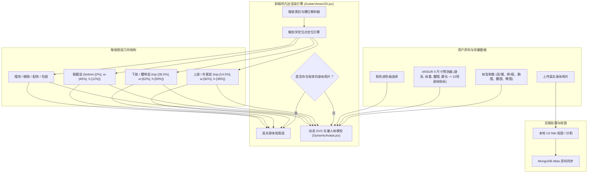

# DressApp — 2D 阿凡达与试衣定位系统架构 (`Avatar.md`)

> **文档版本：** 2.0  
> **目标子系统：** 前端 2D 人体模型、真实身体照片抠图与服装叠加引擎  
> **核心文件：** `AvatarViewer2D.jsx`, `DynamicAvatar.jsx`, `OutfitCanvas.jsx`, `Profile.jsx`  
> **状态：** 已上线生产环境并完成校准  

---

## 1. 执行摘要与价值主张

### 1.1 高层概述
**DressApp 2D 阿凡达与试衣定位系统** 提供了一个自适应的实时视觉试衣环境。它允许用户将数字化衣橱服装无缝叠加在 **分割好的真实身体照片** 或 **动态变形的 2D 贝塞尔矢量 SVG 人体模型** 之上进行预览。

为了在各种服装款式（紧身衣、保罗领、圆领衫、低腰牛仔裤、工装短裤和正式礼服）上呈现出高度逼真的视觉效果，该引擎采用了人体解剖学定位点校准、比例缩放及无变形图像叠加容器。



### 1.2 用户价值主张
* **解剖学对齐精度**：将衬衫领口精确贴合在阿凡达的颈线位置 (`top-[14.5%]`)，短裤/长裤腰带精确贴合在自然腰线位置 (`top-[36.5%]`)，杜绝遮挡面部或产生不自然的空隙。
* **双阿凡达灵活性**：可在个性化全身抠图照片与根据精确人体测量数据构建的动态 2D 矢量 SVG 人体模型之间无缝切换。
* **比例宽高比保持**：在应用胸围和臀围宽度缩放 ($scaleX$) 的同时，保持服装原始图像的宽高比例 (`object-fit: contain`)，防止图像产生拉伸或变形。
* **交互式图层层级**：将外套叠穿在内搭和连衣裙之上，同时支持直接点击单个服装图层以打开物品详情。

---

## 2. 综合用户手册与界面拓扑

### 2.1 视觉界面拓扑结构

```
┌──────────────────────────────────────────────────────────────────┐
│                      2D 阿凡达试衣画布                           │
├──────────────────────────────────────────────────────────────────┤
│                                                                  │
│                        [ 帽饰     (top: 1%) ]                    │
│                        [ 眼镜     (top: 11%) ]                   │
│                        [ 颈线     (top: 14.5%) ] ◄─ 衬衫领口     │
│                     ┌──────────────────────────┐                 │
│                     │       上装 / 外套        │                 │
│                     │       (高度: 38%)        │                 │
│                     └──────────────────────────┘                 │
│                        [ 腰线     (top: 36.5%) ] ◄─ 裤腰腰带     │
│                     ┌──────────────────────────┐                 │
│                     │       下装 / 短裤        │                 │
│                     │       (高度: 50%)        │                 │
│                     │                          │                 │
│                     └──────────────────────────┘                 │
│                        [ 脚部     (bottom: 2%) ] ◄─── 鞋履       │
│                        [ 鞋履     (高度: 12%) ]                  │
│                                                                  │
├──────────────────────────────────────────────────────────────────┤
│  [ 切换阿凡达模式 ]  [ 肤色选择器 ]  [ 编辑身体数据 ]            │
└──────────────────────────────────────────────────────────────────┘
```

### 2.2 模式与工作流程说明

#### 模式 1：真实身体照片抠图层
1. 打开 **个人资料设置** (`/me`)。
2. 上传一张全身照片。后端通过 `rembg` (U2-Net) 执行背景分割。
3. 处理后的抠图 URL (`body_photo_url`) 会更新 MongoDB 中的用户资料，并在 `AvatarViewer2D` 容器内渲染。
4. 如需切回矢量人体模型，请在个人资料页面点击 **删除照片**。界面会即时更新，无需刷新页面。

#### 模式 2：动态矢量 SVG 人体模型
1. 当没有身体照片时，`AvatarViewer2D` 会渲染 `DynamicAvatar.jsx`。
2. 人体模型在固定的 `0 0 200 450` SVG viewBox 内生成连续的三次贝塞尔曲线 ($C$ 和 $S$ 指令)。
3. 调整身体参数（身高、体重、腰围、胸围、肩宽、臀围）或选择肤色会实时改变人体模型的轮廓。

---

## 3. 技术栈与深度架构

### 3.1 解剖学椭圆除数与贝塞尔人体模型生成器

`DynamicAvatar.jsx` 使用 **解剖学椭圆除数** ($\text{DIVISOR} = 2.65$) 从 3D 解剖周长计算 2D 平面投影宽度：

$$\begin{aligned}
w_{\text{shoulders}} &= (\text{shoulders} \times 1.1) \times (1.05 \text{ if male else } 0.95) \\
w_{\text{chest}} &= \left(\frac{\text{chest}}{2.65} \times 1.05\right) \times (1.02 \text{ if male else } 1.0) \\
w_{\text{waist}} &= \left(\frac{\text{waist}}{2.65} \times 1.0\right) \times (0.98 \text{ if male else } 0.90) \\
w_{\text{hip}} &= \left(\frac{\text{hip}}{2.65} \times 1.05\right) \times (0.93 \text{ if male else } 1.05)
\end{aligned}$$

身体轮廓通过映射三次贝塞尔控制点的 SVG 路径指令构建：

```javascript
// Bezier contour snippet from DynamicAvatar.jsx
const bodyPath = [
  `M ${pNeckR}`,
  `C ${X0 + wNeck + (wShoulders - wNeck) * 0.6},${yChin + neckHeight * 0.7} ${X0 + wShoulders * 0.9},${yShoulders - 2} ${pShoulderR}`,
  `C ${X0 + wShoulders * 0.95},${yShoulders + (yChest - yShoulders) * 0.6} ${X0 + wChest + 2},${yChest - 5} ${pChestR}`,
  `C ${X0 + wChest - 1},${yChest + (yWaist - yChest) * 0.5} ${X0 + wWaist + (isMale ? 1 : -2)},${yWaist - 8} ${pWaistR}`,
  `C ${X0 + wWaist + (isMale ? 2 : 5)},${yWaist + (yHip - yWaist) * 0.4} ${X0 + wHip + 1},${yHip - 8} ${pHipR}`,
  ...
].join(' ');
```

### 3.2 校准定位点与容器 CSS 比例

为确保服装贴合且不与面部特征重叠或留下身体空隙，`AvatarViewer2D.jsx` 中的叠加容器绑定了精确的 CSS 位置比例：

| 服装类别 | CSS 位置类 | z-Index | 对齐定位点 |
| --- | --- | --- | --- |
| **帽饰** | `top-[1%] left-1/2 w-[34%] aspect-square` | `z-30` | 头顶 |
| **眼镜** | `top-[11%] left-1/2 w-[18%] h-[4.5%]` | `z-28` | 双眼平面 |
| **配饰 / 项链** | `top-[14.5%] left-1/2 w-[30%] aspect-square` | `z-25` | 颈部底部 |
| **上装 (Top)** | `top-[14.5%] left-1/2 w-[82%] h-[38%]` | `z-20` | 领口至颈线 |
| **外套** | `top-[14.5%] left-1/2 w-[86%] h-[42%]` | `z-22` | 肩部外套叠穿 |
| **连衣裙** | `top-[14.5%] left-1/2 w-[82%] h-[68%]` | `z-20` | 顶部至膝盖的全长 |
| **腰带** | `top-[36.5%] left-1/2 w-[62%] h-[5%]` | `z-21` | 腰线裤带扣 |
| **下装 (裤子/短裤)** | `top-[36.5%] left-1/2 w-[62%] h-[50%]` | `z-10` | 裤腰至自然腰线 |
| **鞋履** | `bottom-[2%] left-1/2 w-[46%] h-[12%]` | `z-15` | 脚踝至脚底平面 |
| **手提包** | `top-[40%] right-[-5%] w-[40%] h-[30%]` | `z-25` | 手臂自然下垂平面 |

### 3.3 服装比例宽度缩放

除了位置摆放外，服装还会根据用户选择的身体参数在水平方向 ($scaleX$) 进行动态缩放：

```javascript
// Derivation of garment container scale factors in AvatarViewer2D.jsx
const scales = useMemo(() => {
  const heightFactor = 1 + (params.tall * 0.08) - (params.short * 0.08);
  const widthFactor = 1 + (params.heavy * 0.12) - (params.thin * 0.12);
  const chestFactor = 1 + (params.busty * 0.1);
  const waistFactor = 1 + (params.waist_thick * 0.12) - (params.waist_thin * 0.08);
  const hipsFactor = 1 + (params.hips_wide * 0.12) - (params.hips_narrow * 0.08);

  return { height: heightFactor, width: widthFactor, chest: chestFactor, waist: waistFactor, hips: hipsFactor };
}, [params]);

// Passed to Framer Motion animate prop for Top and Bottom:
// Top: scaleX = scales.chest / scales.width
// Bottom: scaleX = scales.hips / scales.width
```

---

## 4. 位置与比例修复汇总矩阵

| 识别出的问题 | 根本原因 | 应用的修复方案 | 最终效果 |
| --- | --- | --- | --- |
| **衬衫领口遮挡面部** | 偏移量位置设置过高 (`top-[8.3%]` 或 `top-[12.8%]`) | 将顶部容器偏移量设置为 `top-[14.5%]` | 衬衫领口精确贴合在阿凡达的颈线位置。 |
| **裤子/短裤偏低或与下摆重叠** | 偏移量位置设置过低 (`top-[38.5%]`) | 将底部容器偏移量设置为 `top-[36.5%]` | 裤腰精确贴合在阿凡达的自然腰线位置。 |
| **服装宽高比变形** | 容器无约束拉伸 | 应用 `object-fit: contain` 并进行比例 `scaleX` 调整 | 保持原始服装图像的宽高比，无水平变形。 |
| **删除照片延迟** | 需要重新获取页面状态 | 在 `Profile.jsx` 中实现即时本地用户状态同步 | 删除照片预览即时显示，无 UI 卡顿。 |

---
*本文档由 Narrator 为 DressApp 自动编译。*
